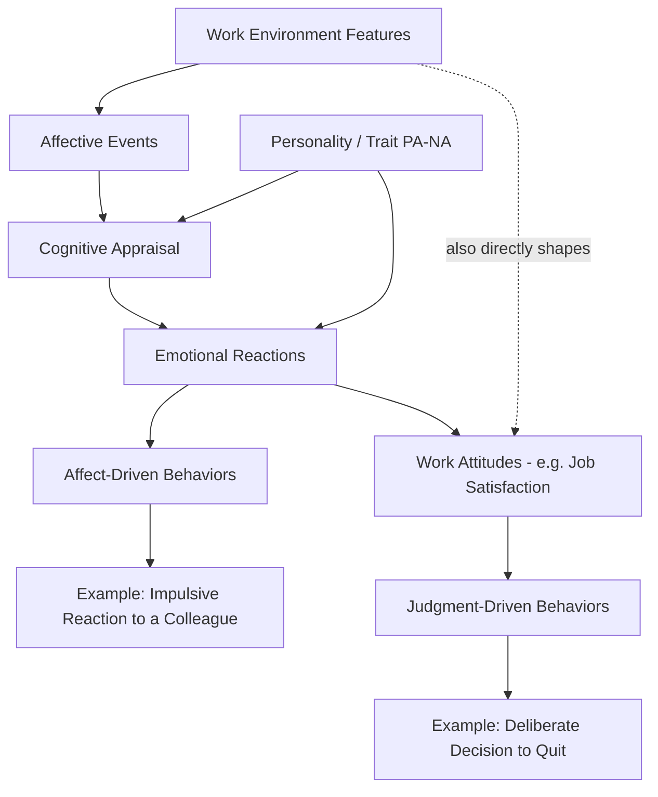

## Affective Events Theory

### Definition and Conceptual Overview

Affective Events Theory (AET) is a theoretical framework developed by Howard Weiss and Russell Cropanzano (1996) that explains how discrete workplace events generate emotional reactions in employees, which in turn influence work attitudes and behaviors. AET was formulated to address a gap in the organizational literature: prior research had focused heavily on cognitively-based, stable work attitudes (like job satisfaction) while largely neglecting the role of momentary, affect-driven experience in shaping workplace behavior.

The theory's central claim is that work environments do not directly cause behavior; rather, they produce **affective events**, which are the proximal cause of emotional reactions, which then diverge into two distinct behavioral pathways.

### Theoretical Origins and Motivation

**Key Points**:

- AET emerged partly as a critique of the dominant "job satisfaction as sole predictor" paradigm, which Weiss and Cropanzano argued overlooked the moment-to-moment emotional texture of work life
- The theory draws on **appraisal theories of emotion** (e.g., Lazarus), which hold that emotional reactions are shaped by an individual's cognitive evaluation of an event's relevance and significance to their goals, not simply by the event itself
- It was among the first major organizational frameworks to explicitly separate **emotions** (brief, event-caused, intense) from **attitudes** like job satisfaction (more stable, cumulative, evaluative judgments)

### Core Model Components and Sequence

#### 1. Work Environment Features

Stable characteristics of the job and organization — job characteristics, autonomy, organizational constraints, leadership style, and physical working conditions. These do not directly produce behavior but shape the *frequency and nature* of affective events that occur.

#### 2. Affective Events

Discrete, specific incidents or occurrences at work that trigger an emotional response. Examples include receiving critical feedback, a conflict with a coworker, an unexpected compliment, technology failure during a deadline, or an act of organizational injustice.

**Key Points**:

- Events can be positive (e.g., recognition, achievement) or negative (e.g., interpersonal conflict, hassles)
- Even ostensibly minor "daily hassles" and "daily uplifts" can accumulate into meaningful affective consequences over time [Inference: while the theory itself proposes this accumulation, precise thresholds or weighting of hassles vs. uplifts remain an empirical, study-specific question]

#### 3. Cognitive Appraisal

Consistent with appraisal theories of emotion, the same objective event can produce different emotional reactions in different individuals, depending on how each person interprets its relevance and significance to their personal goals and well-being.

#### 4. Personality and Trait Affectivity (Dispositions)

Individual differences — particularly trait positive affectivity (PA) and negative affectivity (NA) — moderate how events are appraised and how intensely emotional reactions are experienced.

#### 5. Emotional Reactions

The resulting discrete emotional states (joy, anger, frustration, pride) produced by the appraisal of the affective event.

#### 6. Two Divergent Behavioral/Attitudinal Pathways

- **Affect-driven behaviors**: immediate, often impulsive behavioral responses directly caused by the emotional reaction (e.g., snapping at a colleague right after a frustrating interaction, spontaneously helping a coworker after receiving good news)
- **Work attitudes → Judgment-driven behaviors**: emotional reactions accumulate over time and inform relatively stable cognitive-evaluative judgments about the job (e.g., job satisfaction), which then predict more deliberate, reasoned behaviors (e.g., deciding to search for another job, formally filing a grievance)

### Mermaid Diagram: Full AET Process Model

### The Affect-Driven vs. Judgment-Driven Distinction

This dual-pathway structure is arguably AET's most cited theoretical contribution, offering a mechanism for why employees sometimes behave in ways that seem inconsistent with their stated job satisfaction.

| Dimension | Affect-Driven Behavior | Judgment-Driven Behavior |
| --- | --- | --- |
| Trigger | Immediate emotional reaction | Accumulated attitude/evaluation |
| Timing | Occurs close in time to the event | Occurs after evaluative processing |
| Deliberateness | Impulsive, low-reflection | Deliberate, reasoned |
| Example | Raising one's voice after a frustrating call | Formally resigning after months of dissatisfaction |
| Predicted by | State affect, momentary mood | Stable attitudes (e.g., job satisfaction, commitment) |

**Key Points**:

- This distinction helps explain, for example, why an employee might have high overall job satisfaction yet still display an isolated outburst of frustration after a single bad event, or conversely, why a generally even-tempered employee might still resign after a slow accumulation of negative affective experiences

### Empirical Support and Applications

**Key Points**:

- AET has been used to explain the antecedents of counterproductive work behavior (CWB), where discrete provocations (perceived injustice, incivility) predict affect-driven retaliatory behaviors
- The framework underpins much of the **emotional labor** literature, since it provides the mechanism by which repeated affective events (e.g., handling difficult customers) accumulate into cumulative strain or reduced job satisfaction
- Experience Sampling Method (ESM) research designs, which capture affect multiple times per day across the workweek, are commonly used to empirically test AET's event-to-emotion-to-behavior sequence, since traditional single-timepoint surveys cannot capture the theory's temporal, event-driven structure
- AET has informed research on workplace incivility, abusive supervision, and organizational justice, all of which conceptualize mistreatment as discrete "events" with both immediate affective and longer-term attitudinal consequences

### Example

Consider an employee who receives an unexpectedly harsh performance review comment from their manager (the **affective event**), embedded within a broader work environment characterized by high role ambiguity (a **work environment feature** that made such miscommunication more likely).

- The employee's **cognitive appraisal** interprets the comment as unfair given their recent effort, and their trait negative affectivity amplifies the intensity of the resulting **emotional reaction** (frustration, hurt)
- In the **affect-driven pathway**, the employee might immediately respond curtly in the meeting or vent to a coworker right afterward
- Over the following weeks, if similar affective events recur, the accumulated emotional residue contributes to a decline in overall **job satisfaction** (the attitudinal pathway)
- This declining satisfaction then predicts a **judgment-driven behavior**: the employee begins updating their résumé and applying to other positions — a deliberate, reasoned response distinct from the initial impulsive reaction

### Distinguishing AET from Related Frameworks

- **Circumplex Model of Affect**: describes the *structure* of affective states (valence x arousal) but does not specify a causal process linking events to behavior; AET incorporates affective states as one component within a larger causal chain
- **Job Characteristics Model**: focuses on how job design features (autonomy, task significance) produce motivation and satisfaction through psychological states, but does not center discrete, momentary events as the proximal trigger
- **Conservation of Resources (COR) Theory**: focuses on resource gain/loss cycles as drivers of stress and strain, overlapping with AET's negative-event pathway but framed around resource dynamics rather than emotional appraisal per se

### Critiques and Contemporary Developments

**Key Points**:

- Critics note that AET is more a broad organizing meta-framework than a tightly specified, falsifiable theory — it proposes a general sequence but leaves many specific mechanisms (e.g., precise appraisal processes, exact accumulation functions from emotion to attitude) underspecified [Inference: this is a commonly voiced critique in review literature, though scholars differ on how significant a limitation this represents]
- Testing the full model requires intensive longitudinal or experience-sampling designs, which are more resource-intensive than traditional cross-sectional surveys, and as a result many published studies test only partial segments of the model (e.g., event → emotion, without extending to the judgment-driven behavioral endpoint)
- Subsequent research has increasingly integrated AET with **emotion regulation** frameworks, examining how employees' active regulation strategies (such as reappraisal) intervene between the appraisal and emotional reaction stages, extending beyond AET's original formulation
- Some scholars have proposed integrating discrete emotion theories (e.g., distinguishing anger from anxiety, which AET's original formulation treats somewhat generically) to generate more precise predictions about which specific behaviors follow which specific emotions [Speculation]

### Practical Applications for Practitioners

**Key Points**:

- Organizations seeking to reduce counterproductive work behavior should attend to reducing negative affective "trigger events" (e.g., perceived unfairness, incivility) rather than solely targeting broad attitudinal interventions
- Manager training in delivering feedback constructively can reduce the frequency and intensity of negative affective events, given that appraisal of fairness strongly shapes the resulting emotional reaction
- Pulse surveys or brief daily check-ins can help organizations detect accumulating negative affective patterns before they crystallize into declining job attitudes and eventual turnover
- Recognizing the affect-driven/judgment-driven distinction can help managers respond appropriately: addressing an isolated affect-driven outburst differently than a pattern reflecting deeper, judgment-driven dissatisfaction

### Related Topics

- Emotions and Moods at Work (Circumplex Model, Emotional Labor)
- Job Satisfaction: Antecedents and Measurement
- Organizational Justice Theory
- Emotional Regulation and Reappraisal Strategies
- Counterproductive Work Behavior (CWB)
- Experience Sampling Method (ESM) in Organizational Research
- Conservation of Resources (COR) Theory
- Workplace Incivility and Abusive Supervision