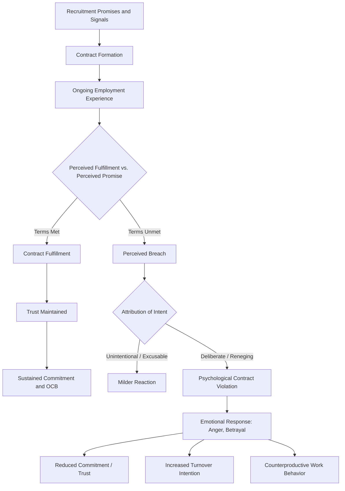

## Psychological Contracts

### Definition and Conceptual Overview

A psychological contract refers to an individual employee's subjective beliefs about the reciprocal obligations that exist between themselves and their organization. Unlike formal employment contracts, psychological contracts are implicit, perceptual, and unwritten — they exist in the mind of the employee (and, separately, in the perceptions of organizational agents) and are shaped by promises, both explicit and implied, made during recruitment, onboarding, and ongoing employment.

The most widely cited definition, from Denise Rousseau (1989, 1995), frames the psychological contract as an individual's beliefs regarding the terms and conditions of a reciprocal exchange agreement between that person and another party.

**Key Points**:

- Because the contract is perceptual, two parties to the same employment relationship (employee and employer/manager) can hold genuinely different understandings of what has been promised, without either party necessarily acting in bad faith
- The construct is distinguished from formal legal contracts by its subjectivity and its basis in perceived promises rather than codified terms

### Origins and Theoretical Roots

**Key Points**:

- The term originates from earlier organizational behavior scholarship (Argyris, 1960; Schein, 1965) but was substantially developed and popularized by Denise Rousseau beginning in the late 1980s
- Theoretically grounded in **Social Exchange Theory**, which posits that workplace relationships are governed by norms of reciprocity — when one party provides valued resources, the other feels obligated to reciprocate
- Also draws on **equity theory**, since perceived breach often triggers comparisons between what was promised, what was received, and what was actually delivered on the employee's side of the exchange

### Types of Psychological Contracts

Rousseau's framework distinguishes contracts along a continuum, most commonly categorized into two archetypes:

#### Transactional Contracts

Narrow, short-term, and primarily economic in focus. Characterized by well-specified, often monetizable terms (e.g., pay for hours worked) with limited mutual investment beyond the immediate exchange.

- **Key Points**:
  - Common in temporary, seasonal, or gig-economy employment relationships
  - Lower emotional investment; easier to terminate without relational damage
  - Narrow scope of obligations on both sides

#### Relational Contracts

Broad, long-term, and socioemotional in addition to economic. Characterized by open-ended, less clearly specified terms involving loyalty, mutual support, and identification.

- **Key Points**:
  - Common in career-oriented, long-tenure employment relationships
  - Involves emotional attachment and identification with the organization (linking conceptually to affective organizational commitment)
  - Breach of a relational contract tends to provoke stronger emotional and behavioral reactions than breach of a transactional one, given the broader scope of trust involved

**[Unverified]** Some scholars additionally propose a "balanced" contract type combining elements of both transactional specificity and relational, growth-oriented mutual investment (common in some contemporary knowledge-work arrangements), though this category is less universally adopted across the literature than the transactional-relational distinction.

### Contract Formation Process

**Key Points**:

- Formation begins prior to formal employment, during recruitment (recruiter promises, employer branding, realistic job previews)
- Continues through **organizational socialization** (onboarding messages, supervisor communications, observed treatment of peers)
- Employees actively interpret cues from the environment — not just explicit statements but implicit signals (e.g., how the organization treats other employees during layoffs) contribute to perceived promises

### Mermaid Diagram: Psychological Contract Lifecycle

### Psychological Contract Breach vs. Violation

A key theoretical distinction within the literature separates the *cognitive* recognition that a promise was unmet from the *emotional* reaction to that recognition.

#### Breach

A cognitive perception or judgment that the organization has failed to fulfill one or more obligations of the psychological contract, relative to the contributions the employee has made.

#### Violation

The emotional and affective experience that can accompany breach — feelings of anger, betrayal, and injustice — which occurs when the breach is attributed to the organization's intentional reneging or negligence rather than to circumstances beyond its control.

**Key Points**:

- Breach can occur without triggering full violation if the employee attributes the unmet obligation to unavoidable external circumstances (e.g., an unforeseen market downturn genuinely forcing a benefits reduction) rather than to bad faith
- The **attribution process** is therefore central: the same objective failure to deliver a promised outcome can produce very different emotional and behavioral responses depending on perceived intentionality and fairness of the process
- Perceived breach is more common than one might expect; longitudinal studies frequently find a majority of employees report experiencing at least one instance of perceived breach at some point in their tenure [Inference: exact prevalence figures vary substantially by study, sample, and time period, so this should be read as a general pattern rather than a precise statistic]

### Consequences of Breach and Violation

**Key Points**:

- **Reduced organizational commitment**: particularly affective commitment, since breach undermines the relational trust underlying that attachment
- **Decreased job satisfaction**: breach is one of the most robust and consistently replicated predictors of satisfaction decline in the literature
- **Increased turnover intention and actual turnover**: employees who perceive violation are more likely to disengage from the relationship
- **Reduced organizational citizenship behavior (OCB)**: employees may reciprocate perceived unfairness by withdrawing discretionary effort, consistent with social exchange and reciprocity norms
- **Increased counterproductive work behavior (CWB)**: in more severe cases, perceived violation can provoke retaliatory behaviors
- **Psychological withdrawal**: reduced engagement and psychological presence at work, even absent overt behavioral change

### Example

A software developer accepts a job after a recruiter emphasizes "significant opportunities for rapid promotion and skill development" (forming a **relational, growth-oriented psychological contract**). After eighteen months, no promotion path has materialized, and requests for training budget are repeatedly denied.

- The developer's **cognitive appraisal** registers this as a **breach**: the promised growth opportunities were not delivered
- If the developer attributes this to intentional under-investment by the company (rather than, say, a documented company-wide hiring freeze applied evenly to all departments), the breach escalates into a **violation**, accompanied by feelings of betrayal
- This violation predicts declining affective commitment, reduced discretionary effort on non-critical tasks, and ultimately a **judgment-driven behavior**: the developer begins interviewing externally

Note the direct linkage here to **Affective Events Theory**: the moment of realizing the promised promotion will not occur functions as a discrete affective event, with attribution processes shaping the resulting emotional trajectory.

### Measurement Approaches

**Key Points**:

- Most commonly measured via self-report surveys asking employees to rate the extent to which the organization has fulfilled a list of specific obligations (e.g., job security, fair pay, training opportunities, career development)
- Some instruments separately measure the **content** of the contract (what obligations exist) from the **evaluation** of fulfillment (the extent to which those obligations were met)
- Longitudinal and diary-based designs are increasingly used to capture contract dynamics over time, given that psychological contracts are not static and can be renegotiated

### Distinguishing Psychological Contracts from Related Constructs

- **Organizational Justice**: justice perceptions (distributive, procedural, interactional) often function as antecedents to breach perceptions and shape attribution processes, but psychological contract theory specifically centers the *promise-based* exchange rather than fairness perceptions generally
- **Perceived Organizational Support (POS)**: POS reflects a general belief that the organization values the employee's contributions and cares about their well-being, whereas psychological contracts focus specifically on perceived reciprocal *promises* and their fulfillment
- **Organizational Commitment**: commitment is a downstream *consequence* of contract fulfillment or breach, not the contract itself

### Critiques and Contemporary Developments

**Key Points**:

- Critics note the construct's heavy reliance on retrospective self-report creates potential for recall bias and rationalization, particularly when employees are asked to recall "promises" made months or years earlier
- The breach-violation distinction, while theoretically elegant, can be difficult to operationalize cleanly in survey research, since the two are often highly correlated in practice
- Contemporary research has extended psychological contract theory to examine **idiosyncratic deals ("i-deals")** — individually negotiated employment terms that deviate from standard organizational policy — as a mechanism through which modern, flexible-work employees actively shape their own contracts rather than passively receiving them
- The rise of gig and platform-based work has prompted scholars to examine how psychological contracts form and function absent traditional, stable organizational membership, an area of ongoing theoretical development [Speculation]

### Practical Applications for Practitioners

**Key Points**:

- Recruiters and hiring managers should avoid overpromising during recruitment, since unmet recruitment-stage promises are a common and preventable source of early breach perceptions
- **Realistic job previews (RJPs)**, which provide candidates with accurate, balanced information about both positive and challenging aspects of a role, can reduce the likelihood of contract misalignment
- Regular, transparent communication during organizational change (restructuring, benefit changes) can reduce the likelihood that unavoidable breaches escalate into perceived violations, since transparency affects attribution of intent
- Managers should treat the psychological contract as an ongoing, renegotiable relationship rather than a fixed agreement set only at hiring

### Related Topics

- Affective Events Theory (breach as a discrete affective event)
- Organizational Justice Theory (distributive, procedural, interactional justice)
- Perceived Organizational Support Theory
- Organizational Commitment (Meyer & Allen Three-Component Model)
- Idiosyncratic Deals (i-deals) in Employment Relationships
- Realistic Job Previews and Recruitment Communication
- Social Exchange Theory in Organizational Contexts
- Counterproductive Work Behavior (CWB)