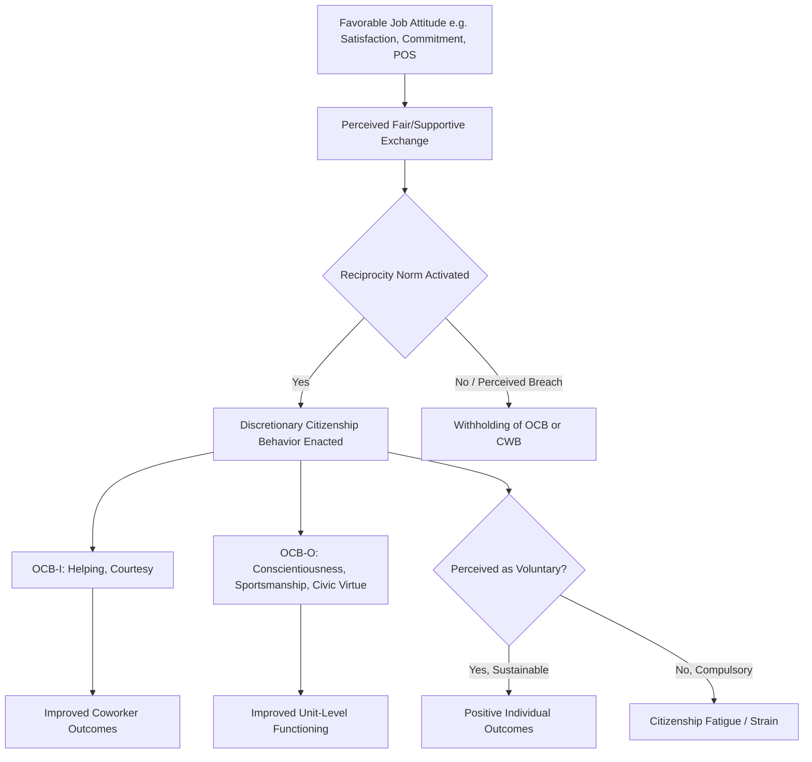

## Organizational Citizenship Behavior

### Definition and Conceptual Boundaries

Organizational Citizenship Behavior (OCB) refers to individual, discretionary behavior that is not directly or explicitly recognized by the formal reward system and that, in the aggregate, promotes the effective functioning of the organization. Three defining criteria separate OCB from other workplace behaviors:

- **Discretionary**: The behavior is not an enforceable requirement of the job description; it is a matter of personal choice, and its omission is not generally understood as punishable.
- **Not directly compensated**: OCB is not tied to the formal reward structure; it falls outside the employment contract's explicit terms.
- **Aggregate organizational benefit**: Individual acts may seem small, but collectively they improve organizational efficiency and social functioning.

OCB is distinguished from related constructs:

- **In-role (task) performance**: Behaviors formally required and evaluated as part of job duties.
- **Counterproductive Work Behavior (CWB)**: The conceptual opposite — intentional behavior that harms the organization or its members.
- **Organizational Spontaneity**: A broader construct that includes OCB-like behaviors but does not require them to be unrewarded.
- **Contextual Performance**: A largely overlapping construct from the performance-appraisal literature, emphasizing behaviors that support the broader organizational, social, and psychological environment.

[Inference] The boundary between "discretionary" and "expected" behavior has become blurred in modern workplaces, since many organizations now implicitly expect and even informally reward what was originally theorized as extra-role behavior — a critique raised repeatedly in the OCB literature.

### Historical Development

- **Chester Barnard (1938)** introduced the concept of "willingness to cooperate" in his theory of organizations, an early precursor to OCB.
- **Katz and Kahn (1966, 1978)** distinguished between dependable role performance and "innovative and spontaneous behaviors" that go beyond role requirements, laying the theoretical groundwork.
- **Dennis Organ and colleagues (early 1980s)** coined the term "Organizational Citizenship Behavior" formally, building on Katz and Kahn's framework and linking it empirically to job satisfaction.
- **Organ (1988)** published the seminal work formalizing the five-dimension taxonomy, which became the dominant model for the next two decades.
- **Podsakoff, MacKenzie, Paine, and Bachrach (2000)** conducted an influential meta-analytic review consolidating nearly 30 different conceptualizations of OCB into a smaller set of common themes.

### The Five-Dimension Taxonomy (Organ, 1988)

**Key Points**

1. **Altruism**: Discretionary behaviors that have the effect of helping a specific other person with an organizationally relevant task or problem (e.g., helping a new coworker learn a software system).
2. **Conscientiousness**: Discretionary behaviors that go well beyond minimum role requirements in areas such as attendance, punctuality, and conserving resources.
3. **Sportsmanship**: A willingness to tolerate less-than-ideal circumstances without complaining; refraining from petty grievances.
4. **Courtesy**: Discretionary behaviors aimed at preventing work-related problems for others, such as giving advance notice before an action that affects a coworker.
5. **Civic Virtue**: Behavior indicating responsible participation in the organization's political and governance life (e.g., attending non-mandatory meetings, staying informed on organizational issues).

### Alternative Dimensional Structures

**OCB-I vs. OCB-O (Williams & Anderson, 1991)**

The most widely used simplified structure divides citizenship behavior by its target:

- **OCB-I (Individual-directed)**: Behaviors that immediately benefit specific individuals and, through that, contribute indirectly to the organization (approximately maps onto altruism and courtesy).
- **OCB-O (Organization-directed)**: Behaviors that benefit the organization generally (approximately maps onto conscientiousness, sportsmanship, and civic virtue).

**Coleman and Borman (2000) Three-Factor Model**

- Interpersonal citizenship performance
- Organizational citizenship performance
- Job/task citizenship performance

**Podsakoff et al. (2000) Seven Common Themes**

Helping behavior, sportsmanship, organizational loyalty, organizational compliance, individual initiative, civic virtue, self-development.

### Nomological Network: Antecedents

**Attitudinal and Dispositional Predictors**

- **Job satisfaction**: One of the most consistent and historically first-identified predictors; satisfied employees are more likely to reciprocate through discretionary effort.
- **Organizational commitment** (particularly affective commitment): Employees emotionally attached to the organization perform more OCB-O.
- **Perceived organizational support (POS)**: Employees who believe the organization values their contributions and cares about their well-being reciprocate with citizenship behavior, consistent with social exchange theory.
- **Organizational justice** (distributive, procedural, interactional): Perceptions of fairness — particularly procedural and interactional justice — predict OCB, often more strongly than outcome fairness alone.
- **Psychological contract fulfillment**: Perceived fulfillment (versus breach) of the implicit employer-employee exchange agreement relates positively to OCB.
- **Personality**: Conscientiousness and Agreeableness (Big Five) show the most consistent, though modest, correlations with OCB.
- **Leader-Member Exchange (LMX)**: High-quality leader-subordinate relationships are associated with higher OCB, particularly OCB-I.

**Theoretical Mechanisms**

- **Social Exchange Theory (Blau, 1964)**: OCB is explained as reciprocation for favorable treatment received from the organization or supervisor, operating on a norm of reciprocity rather than an explicit economic contract.
- **Affective Events Theory**: Positive affective states generated by workplace events increase the likelihood of spontaneous helping and citizenship behavior.

### Nomological Network: Consequences

**Individual-Level Outcomes**

- Positive association with performance ratings — raters tend to factor OCB into overall judgments of an employee's value, even when instructed to rate only task performance ([Unverified] the exact magnitude of this "halo" effect varies by study and rating context).
- Positive association with reward allocation decisions (promotions, raises) in many organizational contexts.
- Potential negative individual consequences: **role overload**, **work-family conflict**, and **citizenship fatigue** when OCB becomes expected rather than genuinely discretionary [Inference — supported by newer "dark side of OCB" literature but less extensively meta-analyzed than the positive consequences].

**Organizational (Unit-Level) Outcomes**

Podsakoff et al.'s meta-analytic and unit-level work links aggregate OCB to:

- Improved managerial and peer productivity
- Freeing up resources for more productive purposes (less supervisory time spent on monitoring)
- Enhanced coordination across work units and across time
- Improved organizational ability to attract and retain talented employees
- Increased stability of organizational performance
- Enhanced organizational adaptability to environmental changes

### The "Dark Side" of OCB

Contemporary research has identified less favorable dynamics:

- **Compulsory citizenship behavior (CCB)**: When OCB is perceived as an implicit job requirement rather than a genuine choice, driven by pressure from supervisors or norms, it correlates with strain, burnout, and turnover intention rather than the typical positive outcomes.
- **Impression management motives**: Some individuals perform OCB not out of altruism or commitment, but to enhance their image and be viewed favorably ("good soldier syndrome"), which can produce more superficial or opportunistic patterns of citizenship behavior.
- **Citizenship fatigue**: Emotional exhaustion resulting from an accumulated, unsustainable pattern of OCB performance.
- **Gender and role expectations**: Some studies suggest OCB-I (helping) may be more expected of and more penalized-when-absent for women, raising equity concerns about how citizenship behavior is evaluated.

### Measurement

- **Organ's original scale (Smith, Organ, & Near, 1983)**: Early two-dimension measure (altruism, generalized compliance).
- **Podsakoff, MacKenzie, Moorman, & Fetter (1990) scale**: 24-item measure operationalizing the five-dimension taxonomy; widely used in subsequent research.
- **Williams and Anderson (1991) scale**: 14-item measure distinguishing OCB-I and OCB-O; commonly used due to its parsimony.
- **Rating source**: OCB is most commonly measured via supervisor ratings or peer ratings rather than self-report, since self-reports are subject to social desirability bias and self-serving attribution; some studies use self-report for antecedent research despite this limitation.

### Relationship to Cross-Cultural and Contextual Factors

- [Inference] The five-dimension taxonomy was developed primarily in individualist, Western (largely U.S.) organizational contexts; some cross-cultural researchers argue that behaviors treated as "extra-role" in the U.S. (e.g., helping coworkers) may be perceived as in-role or culturally obligatory in more collectivist contexts, altering the discretionary nature that defines the construct.
- Organizational culture and climate (e.g., climate for service, ethical climate) moderate both the frequency and the interpretation of citizenship behavior within a given workplace.

### Illustrative Example

A mid-level analyst at a firm regularly:

- Stays fifteen minutes past shift end to help a struggling new hire finish a report (**Altruism** / OCB-I)
- Does not complain when assigned an undesirable project (**Sportsmanship**)
- Reads internal newsletters and attends optional town halls to stay informed about company strategy (**Civic Virtue** / OCB-O)
- Gives a colleague advance notice before requesting a shared resource (**Courtesy**)
- Maintains near-perfect attendance and rarely takes unnecessary breaks (**Conscientiousness**)

This pattern illustrates behavior that a formal performance appraisal system may not explicitly reward, yet which supervisors are likely to notice and factor into overall evaluations — demonstrating the empirical overlap between OCB and performance-rating outcomes described above.

### Conceptual Model (svg_diagram)

<svg xmlns="http://www.w3.org/2000/svg" viewBox="0 0 900 480" font-family="Arial, sans-serif">
<text x="450" y="28" text-anchor="middle" font-size="18" font-weight="bold">OCB Nomological Network (svg_diagram)</text>

<rect x="20" y="70" width="230" height="230" rx="8" fill="none" stroke="#333" stroke-width="1.5" />
<text x="135" y="92" text-anchor="middle" font-size="14" font-weight="bold">Antecedents</text>
<text x="35" y="115" font-size="12">Job Satisfaction</text>
<text x="35" y="138" font-size="12">Affective Commitment</text>
<text x="35" y="161" font-size="12">Perceived Org. Support</text>
<text x="35" y="184" font-size="12">Organizational Justice</text>
<text x="35" y="207" font-size="12">Psych. Contract Fulfillment</text>
<text x="35" y="230" font-size="12">Conscientiousness (Big 5)</text>
<text x="35" y="253" font-size="12">Agreeableness (Big 5)</text>
<text x="35" y="276" font-size="12">LMX Quality</text>

<rect x="330" y="140" width="240" height="90" rx="8" fill="none" stroke="#333" stroke-width="1.5" />
<text x="450" y="165" text-anchor="middle" font-size="14" font-weight="bold">Mechanism</text>
<text x="450" y="188" text-anchor="middle" font-size="12">Social Exchange /</text>
<text x="450" y="206" text-anchor="middle" font-size="12">Norm of Reciprocity</text>

<rect x="650" y="70" width="230" height="230" rx="8" fill="none" stroke="#333" stroke-width="1.5" />
<text x="765" y="92" text-anchor="middle" font-size="14" font-weight="bold">OCB Dimensions</text>
<text x="665" y="120" font-size="12">Altruism (OCB-I)</text>
<text x="665" y="143" font-size="12">Courtesy (OCB-I)</text>
<text x="665" y="166" font-size="12">Conscientiousness (OCB-O)</text>
<text x="665" y="189" font-size="12">Sportsmanship (OCB-O)</text>
<text x="665" y="212" font-size="12">Civic Virtue (OCB-O)</text>

<rect x="330" y="330" width="240" height="120" rx="8" fill="none" stroke="#333" stroke-width="1.5" />
<text x="450" y="352" text-anchor="middle" font-size="14" font-weight="bold">Outcomes</text>
<text x="345" y="375" font-size="12">+ Performance Ratings</text>
<text x="345" y="396" font-size="12">+ Unit Productivity</text>
<text x="345" y="417" font-size="12">− Role Overload / Fatigue</text>
<text x="345" y="438" font-size="12">(dark side, if compulsory)</text>

<line x1="250" y1="185" x2="325" y2="185" stroke="#333" stroke-width="1.5" marker-end="url(#arrow)" />
<line x1="570" y1="185" x2="645" y2="185" stroke="#333" stroke-width="1.5" marker-end="url(#arrow)" />
<line x1="765" y1="300" x2="500" y2="330" stroke="#333" stroke-width="1.5" marker-end="url(#arrow)" />
</svg>

### Process Flow: From Attitude to Citizenship Act

### Related Topics

- Counterproductive Work Behavior (CWB)
- Organizational Justice (Distributive, Procedural, Interactional)
- Perceived Organizational Support and Social Exchange Theory
- Psychological Contracts
- Leader-Member Exchange (LMX) Theory
- Job Satisfaction and Affective Commitment
- Contextual Performance and Adaptive Performance
- Employee Engagement and Burnout