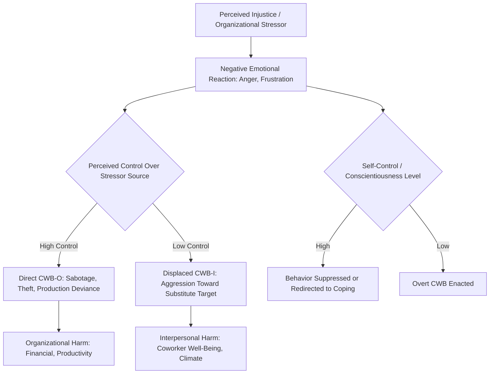

## Counterproductive Work Behavior

### Definition and Conceptual Boundaries

Counterproductive Work Behavior (CWB) refers to intentional employee behavior that is contrary to the legitimate interests of an organization, harming or intending to harm the organization, its employees, its clients, or its stakeholders. Three defining features distinguish CWB from related constructs:

- **Intentionality**: The behavior is volitional, not accidental; a worker who makes an honest error is not exhibiting CWB, whereas one who deliberately sabotages a process is.
- **Harmfulness**: The behavior has actual or potential negative consequences for the organization or its members — financial, physical, psychological, or reputational.
- **Legitimacy violation**: The behavior violates significant organizational norms, rules, or the reasonable expectations of organizational functioning.

CWB is conceptually the mirror opposite of Organizational Citizenship Behavior (OCB), though empirically the two are only moderately negatively correlated and are best treated as related but distinct constructs rather than two poles of a single continuum [Inference — supported by Sackett and colleagues' work showing CWB and OCB load on separate factors with different predictor patterns rather than a strict bipolar dimension].

### Historical Development

- **Early organizational deviance research (1960s–1970s)**: Focused narrowly on discrete acts such as theft and absenteeism, largely from an industrial/organizational and criminological perspective.
- **Robinson and Bennett (1995)**: Introduced the influential "workplace deviance" typology, organizing deviant behaviors along two axes — minor/serious and interpersonal/organizational — producing four quadrants (property deviance, production deviance, political deviance, personal aggression).
- **Fox and Spector (late 1990s–2000s)**: Advanced the "Stressor-Emotion Model of CWB," framing counterproductive behavior as an emotion-driven response to perceived workplace stressors and injustice, and developed the widely used CWB-Checklist (CWB-C).
- **Sackett and colleagues (2000s)**: Proposed a broader hierarchical taxonomy of CWB encompassing multiple specific behavioral categories under a general factor, integrating deviance research with personnel selection and counterproductive-behavior prediction literatures.

### Typologies and Dimensional Structures

**Robinson and Bennett (1995) Deviance Typology**

A two-by-two matrix:

|  | **Interpersonal Target** | **Organizational Target** |
| --- | --- | --- |
| **Minor** | Political Deviance (e.g., gossiping, blaming coworkers) | Production Deviance (e.g., leaving early, intentionally working slowly) |
| **Serious** | Personal Aggression (e.g., harassment, verbal abuse) | Property Deviance (e.g., theft, sabotage) |

**Spector and Fox (2005) Five-Category Model**

1. **Abuse against others**: Behaviors that harm coworkers, such as threats, insults, or ignoring someone.
2. **Production deviance**: Purposeful failure to perform job tasks effectively (e.g., intentionally working slowly).
3. **Sabotage**: Damaging or destroying organizational property or work processes.
4. **Theft**: Stealing organizational property, resources, or funds.
5. **Withdrawal**: Behaviors that reduce time spent working, such as excessive absenteeism, lateness, or cyberloafing.

**Target-Based Distinction: CWB-O vs. CWB-I**

Mirroring the OCB-I/OCB-O structure:

- **CWB-O (Organization-directed)**: Behaviors targeting the organization itself (theft, sabotage, production deviance).
- **CWB-I (Individual-directed)**: Behaviors targeting specific individuals such as coworkers or supervisors (incivility, aggression, harassment).

### Theoretical Frameworks

**Stressor-Emotion Model of CWB (Spector & Fox)**

**Key Points**

- Perceived organizational stressors (e.g., role conflict, interpersonal conflict, organizational constraints, injustice) generate negative emotional states (anger, anxiety, frustration).
- Negative emotion, rather than the stressor itself, is the proximal driver of CWB.
- Individual differences (trait negative affectivity, locus of control, trait anger) moderate the emotion-to-behavior link.
- Perceived control moderates whether the response is CWB (acting out) versus withdrawal or passive coping.

**General Strain Theory (adapted from criminology)**

Strain resulting from blocked goals, loss of valued stimuli, or presentation of noxious stimuli increases negative affect, which in turn increases the likelihood of deviant coping responses, including CWB.

**Frustration-Aggression Hypothesis**

An older but influential framework proposing that blocked goal attainment produces frustration, which generates an aggressive drive that may be expressed directly (against the source) or displaced (against an innocent target, such as a coworker).

**Social Exchange / Injustice Framework**

CWB is understood as a retaliatory response to perceived organizational injustice — particularly interactional and procedural injustice — functioning as an attempt to restore equity when direct or legitimate redress is unavailable.

**Ego Depletion / Self-Regulatory Failure**

[Inference] Some contemporary research frames CWB, especially impulsive forms, as a failure of self-regulation under conditions of depleted self-control resources (e.g., after a demanding workday), though this framework has faced broader replication concerns within the self-regulation literature generally.

### Antecedents

**Dispositional Predictors**

- **Low Conscientiousness** (Big Five): One of the most consistent and strongest personality predictors of CWB across meta-analyses.
- **Low Agreeableness**: Particularly predictive of interpersonally-directed CWB (CWB-I).
- **Trait Negative Affectivity**: Chronic tendency to experience negative emotions increases susceptibility to stressor-driven CWB.
- **The Dark Triad** (narcissism, Machiavellianism, psychopathy): Increasingly studied predictor set, associated with elevated CWB, particularly manipulative and exploitative forms.
- **Low core self-evaluations**: Associated with higher likelihood of engaging in counterproductive responses to workplace stress.

**Situational and Organizational Predictors**

- **Organizational injustice** (distributive, procedural, interactional): One of the most robust situational predictors, particularly interactional injustice for CWB-I.
- **Abusive supervision**: Hostile, demeaning supervisory behavior strongly predicts subordinate CWB, often mediated by perceived injustice and negative affect.
- **Role stressors**: Role ambiguity, role conflict, and role overload.
- **Organizational constraints**: Situational obstacles (e.g., inadequate resources, poor equipment, unclear procedures) that interfere with job performance.
- **Interpersonal conflict at work**: A well-established proximal stressor.
- **Psychological contract breach**: Perceived violation of the implicit employer-employee agreement.
- **Job insecurity**: Anticipated or actual threat to employment continuity.

### Consequences

**Organizational-Level Costs**

- Direct financial losses from theft, fraud, and sabotage — a major driver of academic and applied interest in CWB given documented economic impact across industries [Unverified — specific dollar figures vary widely by country, industry, and measurement methodology, and should be sourced from current industry reports rather than treated as fixed].
- Reduced productivity from production deviance and withdrawal behaviors.
- Increased turnover among both perpetrators and victims (bystander/witness effects).
- Reputational and legal risk, particularly for CWB involving harassment or discrimination.

**Individual-Level Consequences**

- For victims: increased stress, reduced job satisfaction, burnout, and secondary withdrawal behaviors.
- For perpetrators: potential termination, legal consequences, and — in some studies — short-term stress relief that can reinforce the behavior pattern (a "venting" function), complicating pure deterrence-based intervention approaches.

### Measurement

- **CWB-Checklist (CWB-C; Spector et al., 2006)**: A 33-45 item self-report measure covering the five CWB categories (abuse, production deviance, sabotage, theft, withdrawal); available in full and short forms.
- **Workplace Deviance Scale (Bennett & Robinson, 2000)**: 19-item measure operationalizing organizational and interpersonal deviance based on the Robinson and Bennett (1995) typology.
- **Measurement source considerations**: Self-report is common but subject to underreporting due to social desirability, particularly for serious behaviors like theft; supervisor, peer, and archival/organizational records (e.g., disciplinary actions, security logs) are used as complementary or alternative sources, each with distinct limitations (supervisors may not observe covert behavior; peers may underreport out of loyalty).

### Moderators of the Stressor-CWB Relationship

- **Perceived control**: Higher perceived control over the stressor is associated with more direct CWB-O; lower control is associated with displaced CWB-I or withdrawal.
- **Trait anger and negative affectivity**: Amplify the emotional response to stressors, strengthening the stressor-CWB link.
- **Organizational climate for CWB**: Perceived tolerance or normalization of minor CWB (e.g., informal norms condoning personal use of company resources) increases the base rate of such behavior.
- **Self-control / trait conscientiousness**: Buffers the translation of negative emotion into overt behavioral acts.

### Illustrative Example

An employee experiences a perceived unfair denial of a promotion (**interactional/procedural injustice**), generating **anger** (the proximal emotional mechanism per the Stressor-Emotion Model). Because the employee has low perceived control over the promotion decision itself, the resulting behavior is **displaced** rather than directed at the decision-maker:

- Begins arriving late and leaving early (**withdrawal**)
- Deliberately slows output on a shared project (**production deviance**, CWB-O)
- Makes sarcastic, undermining comments toward a coworker perceived to have been favored (**abuse against others**, CWB-I)

This sequence illustrates the stressor → emotion → behavior pathway central to the dominant contemporary model of CWB, and demonstrates how low perceived control can redirect counterproductive behavior toward a substitute target rather than the actual source of strain.

### Conceptual Model: Stressor-Emotion Pathway (svg_diagram)

<svg xmlns="http://www.w3.org/2000/svg" viewBox="0 0 900 420" font-family="Arial, sans-serif">
<text x="450" y="28" text-anchor="middle" font-size="18" font-weight="bold">Stressor-Emotion Model of CWB (svg_diagram)</text>
<rect x="20" y="70" width="190" height="140" rx="8" fill="none" stroke="#333" stroke-width="1.5" />
<text x="115" y="92" text-anchor="middle" font-size="13" font-weight="bold">Stressors</text>
<text x="35" y="115" font-size="11">Injustice</text>
<text x="35" y="135" font-size="11">Role Conflict</text>
<text x="35" y="155" font-size="11">Org. Constraints</text>
<text x="35" y="175" font-size="11">Abusive Supervision</text>
<text x="35" y="195" font-size="11">Interpersonal Conflict</text>
<rect x="255" y="90" width="170" height="100" rx="8" fill="none" stroke="#333" stroke-width="1.5" />
<text x="340" y="112" text-anchor="middle" font-size="13" font-weight="bold">Negative Emotion</text>
<text x="270" y="135" font-size="11">Anger</text>
<text x="270" y="155" font-size="11">Anxiety</text>
<text x="270" y="175" font-size="11">Frustration</text>
<rect x="470" y="60" width="180" height="70" rx="8" fill="none" stroke="#333" stroke-width="1.5" stroke-dasharray="4,3" />
<text x="560" y="82" text-anchor="middle" font-size="12" font-weight="bold">Moderators</text>
<text x="480" y="103" font-size="10">Trait Negative Affect</text>
<text x="480" y="120" font-size="10">Perceived Control</text>
<rect x="470" y="220" width="180" height="70" rx="8" fill="none" stroke="#333" stroke-width="1.5" stroke-dasharray="4,3" />
<text x="560" y="242" text-anchor="middle" font-size="12" font-weight="bold">Buffer</text>
<text x="480" y="263" font-size="10">Self-Control /</text>
<text x="480" y="278" font-size="10">Conscientiousness</text>
<rect x="700" y="90" width="170" height="140" rx="8" fill="none" stroke="#333" stroke-width="1.5" />
<text x="785" y="112" text-anchor="middle" font-size="13" font-weight="bold">CWB Response</text>
<text x="715" y="135" font-size="11">Abuse (CWB-I)</text>
<text x="715" y="155" font-size="11">Sabotage (CWB-O)</text>
<text x="715" y="175" font-size="11">Theft (CWB-O)</text>
<text x="715" y="195" font-size="11">Withdrawal</text>
<line x1="210" y1="140" x2="250" y2="140" stroke="#333" stroke-width="1.5" marker-end="url(#arrow2)" />
<line x1="425" y1="140" x2="695" y2="150" stroke="#333" stroke-width="1.5" marker-end="url(#arrow2)" />
<line x1="555" y1="130" x2="500" y2="140" stroke="#666" stroke-width="1" marker-end="url(#arrow2)" />
<line x1="555" y1="220" x2="500" y2="180" stroke="#666" stroke-width="1" marker-end="url(#arrow2)" />
</svg>

### Process Flow: Injustice to CWB Outcome

### Related Topics

- Organizational Citizenship Behavior (OCB)
- Organizational Justice (Distributive, Procedural, Interactional)
- Abusive Supervision
- Workplace Incivility and Bullying
- Emotional Labor and Affective Events Theory
- Dark Triad Personality Traits in the Workplace
- Job Stress and Occupational Strain Models
- Psychological Contract Breach