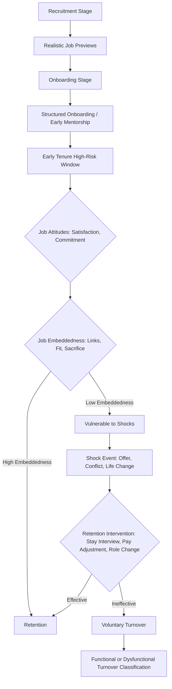

## Employee Turnover and Retention

### Definition and Conceptual Boundaries

Employee turnover refers to the rate at which employees leave an organization and are replaced, typically expressed as a percentage of the workforce over a defined period. Retention is the conceptual and practical inverse — the set of organizational conditions, policies, and practices aimed at keeping valued employees. Turnover is typically decomposed along two crossed dimensions:

- **Voluntary vs. Involuntary**: Voluntary turnover is initiated by the employee (resignation); involuntary turnover is initiated by the organization (termination, layoff).
- **Functional vs. Dysfunctional**: Functional turnover involves the departure of lower-performing or easily replaceable employees, which may benefit the organization; dysfunctional turnover involves the loss of high-performing or hard-to-replace employees, representing a net organizational cost.

The most theoretically and practically significant category is **voluntary, dysfunctional turnover** — the loss of valued employees who choose to leave — since this is the category most amenable to organizational intervention and prediction.

Additional distinctions:

- **Avoidable vs. Unavoidable turnover**: Whether the organization could plausibly have prevented the departure (e.g., via better pay, management) versus reasons outside organizational control (e.g., relocation, family circumstances).
- **Regrettable turnover**: A practitioner-oriented term roughly synonymous with dysfunctional voluntary turnover, commonly used in HR analytics.

### Historical Development

- **March and Simon (1958)**: Introduced one of the earliest formal models, framing turnover as a function of perceived ease of movement (labor market alternatives) and perceived desirability of movement (job satisfaction), establishing the foundational logic that later models would elaborate.
- **Mobley (1977)**: Proposed the influential intermediate linkages model, decomposing the withdrawal process into a sequence of cognitive steps (dissatisfaction → thoughts of quitting → evaluation of the utility of search → intention to search → job search → evaluation of alternatives → comparison to present job → intention to quit → actual quit).
- **Price (1977) and subsequent Price-Mueller models**: Developed a causal model integrating structural (e.g., pay, promotional opportunity) and process (e.g., job satisfaction, organizational commitment) variables.
- **Steers and Mowday (1981)**: Extended turnover models to incorporate non-work influences, such as family responsibilities.
- **Lee and Mitchell (1994)**: Proposed the **Unfolding Model of Voluntary Turnover**, a major theoretical departure that introduced the concept of the "shock" — a distinguishable event that prompts thoughts of leaving — and argued that not all turnover follows a deliberate, dissatisfaction-driven cognitive process.
- **Mitchell, Holtom, Lee, Sablynski, and Erez (2001)**: Introduced **Job Embeddedness Theory**, shifting focus from why people leave to why people stay, examining the web of forces that bind employees to their jobs and communities.

### Major Theoretical Models

**Mobley's Intermediate Linkages Model**

**Key Points**

A sequential decision process: dissatisfaction triggers thoughts of quitting, which lead to an evaluation of the expected utility of searching for alternatives, which (if favorable) leads to actual search behavior, comparison of alternatives to the current job, and finally a behavioral intention to quit that precedes actual turnover.

[Inference] While influential and pedagogically useful for illustrating the cognitive withdrawal process, subsequent research (notably Lee and Mitchell) found that many real-world quitting decisions do not follow this fully sequential, deliberative path.

**Unfolding Model of Voluntary Turnover (Lee & Mitchell, 1994)**

Identifies multiple distinct "decision paths" by which employees arrive at turnover, organized around the presence or absence of a **shock** (a jarring event, such as an unsolicited job offer, a negative interaction with a supervisor, organizational restructuring, or a significant life event) and whether the employee has a pre-existing script for how to respond:

- **Path 1**: A shock triggers a matching pre-existing script (e.g., "if X happens, I quit"), leading to rapid departure with little deliberation.
- **Path 2**: A shock occurs without a matching script, prompting the employee to reassess their image/fit with the organization, potentially leading to departure without necessarily searching for alternatives first.
- **Path 3**: A shock prompts a search for and comparison of alternatives before deciding.
- **Path 4a**: Gradual, low-satisfaction-driven withdrawal without a discrete shock (closest to the traditional Mobley-style process).
- **Path 4b**: Gradual disengagement due to accumulated dissatisfaction that eventually crosses a threshold, again without a single triggering shock.

**Job Embeddedness Theory (Mitchell et al., 2001)**

Proposes that retention is explained not only by job attitudes but by the extent to which a person is "embedded" in their job and community, structured along two contexts (organization and community) and three dimensions:

1. **Links**: The number of formal and informal connections between the person and other people, teams, or activities (e.g., tenure, coworker relationships, community ties).
2. **Fit**: The perceived compatibility or comfort with the organization and surrounding community (e.g., alignment with organizational culture, fit with local lifestyle).
3. **Sacrifice**: The perceived cost of what would be given up by leaving (e.g., benefits, seniority, community standing).

[Inference] Job embeddedness is theorized and generally supported as predicting retention incrementally beyond traditional attitudinal predictors like job satisfaction and organizational commitment, though the relative strength of this incremental contribution varies across studies and samples.

**Conservation of Resources (COR) applied to turnover**

Turnover intentions increase when employees perceive threat to, or actual loss of, valued resources (time, energy, status, social support) without adequate replenishment, framing turnover as a resource-protective response.

### Antecedents of Voluntary Turnover

**Attitudinal Predictors**

- **Job satisfaction**: A long-established, moderately strong predictor across meta-analyses, though weaker in predicting actual turnover than turnover intentions.
- **Organizational commitment** (especially affective commitment): Consistently one of the stronger attitudinal predictors of retention.
- **Turnover intentions**: The most proximal and strongest single predictor of actual voluntary turnover in the withdrawal process; intentions mediate much of the relationship between distal attitudes and actual quitting.
- **Perceived organizational support and organizational justice**: Lower perceptions predict higher turnover intentions, generally operating through reduced commitment and satisfaction.

**Structural and Job-Related Predictors**

- **Pay and pay satisfaction**: Related to turnover, though typically a weaker predictor than commitly assumed relative to attitudinal and embeddedness variables; pay's effect is often moderated by perceived pay equity rather than absolute level.
- **Role stressors**: Role ambiguity, conflict, and overload.
- **Supervisor and coworker relationship quality**: Including LMX quality and team cohesion.
- **Promotional opportunity and career development**: Perceived lack of advancement opportunity is a robust predictor.
- **Work-life balance and scheduling flexibility**.
- **Job embeddedness (organizational and community)**: As above.

**Labor Market and Individual Difference Factors**

- **Perceived alternative employment opportunities**: Consistent with March and Simon's original "ease of movement" concept; local unemployment rate and perceived marketability moderate the satisfaction-turnover relationship.
- **Tenure**: Generally a curvilinear relationship with turnover risk — often elevated in the earliest period of employment (poor fit revealed post-hire) and again at certain career-stage transitions.
- **Person-organization and person-job fit**: Poor fit on either dimension predicts higher turnover intentions and actual turnover.
- **Realistic job previews (RJP)**: Providing accurate, balanced information about the job during recruitment is associated with reduced early turnover, theorized to operate by improving initial fit judgments and reducing unmet expectations.

### Consequences of Turnover

**Direct and Indirect Costs**

- **Separation costs**: Administrative processing, exit interviews, potential severance.
- **Replacement costs**: Recruitment, advertising, screening, and selection expenses.
- **Training costs**: Onboarding and time to full productivity for the replacement.
- **Lost productivity / vacancy costs**: Reduced output during the vacancy period and the new hire's ramp-up period.
- **Indirect/intangible costs**: Loss of organizational knowledge, disruption to team dynamics and morale, potential negative effects on customer relationships, and increased workload/strain on remaining employees (which can itself increase further turnover — a documented "turnover contagion" effect).

**Potential Positive Consequences (Functional Turnover)**

- Infusion of new perspectives and skills.
- Opportunity to correct poor person-job fit.
- Cost savings when departing employees are replaced by lower-cost or higher-performing hires.
- Internal promotion opportunities created for remaining staff.

**Unit and Organizational-Level Effects**

- **Turnover rate as a climate signal**: High collective turnover is associated with reduced organizational performance, customer satisfaction (particularly in service contexts), and safety outcomes in some industries.
- **Social capital depletion**: Loss of embedded relational and institutional knowledge disproportionate to the number of individuals who leave.

### Measurement

- **Turnover rate**: Typically calculated as (Number of separations during period ÷ Average number of employees during period) × 100, often reported separately for voluntary and involuntary turnover.
- **Turnover intention scales**: Commonly measured via brief self-report items (e.g., "I often think about quitting my job," "I intend to search for a new job in the next year") rather than direct behavioral measurement, since actual turnover requires longitudinal tracking.
- **Job embeddedness measures**: Mitchell et al.'s original composite measure and subsequent global embeddedness scales (e.g., Crossley et al., 2007) capturing the construct with fewer items.
- **Exit interviews and stay interviews**: Qualitative organizational tools; exit interviews capture reasons after the decision is made (subject to retrospective bias and social desirability), while stay interviews proactively probe retention factors among current employees.

### Retention Strategies

**Key Points**

- **Competitive and equitable compensation**: Addressing pay satisfaction and perceived external/internal equity, though evidence suggests pay alone is an incomplete retention lever.
- **Career development and advancement pathways**: Addressing the promotional-opportunity antecedent.
- **Improving supervisor quality and LMX**: Since "people leave managers, not companies" is a common practitioner heuristic with partial empirical grounding in the strength of supervisor-related predictors.
- **Enhancing job embeddedness**: Deliberately increasing organizational links (mentorship programs, team-building), fit (culture alignment during selection and onboarding), and sacrifice (vesting benefits, meaningful role customization).
- **Realistic job previews during recruitment**: Reducing early-tenure turnover from unmet expectations.
- **Flexible work arrangements**: Addressing work-life balance antecedents.
- **Robust onboarding programs**: Since early-tenure turnover risk is disproportionately high, structured onboarding is a common, evidence-associated intervention point.
- **Stay interviews and pulse surveys**: Proactive identification of retention risk before intentions escalate to search behavior.

### Illustrative Example

A software engineer with two years of tenure receives an unsolicited recruiter message with a significantly higher salary offer (a **shock**, per the Unfolding Model). The engineer does not have a pre-existing script for this scenario, so instead of immediately quitting, they reassess their fit with the current organization (**Path 2/3** territory): they consider their **embeddedness** — close ties with their team (**links**), strong alignment with the company's engineering culture (**fit**), and unvested stock options (**sacrifice**) — against the new offer's higher pay and lack of established local **links**. The high sacrifice and link values act as retention forces even though the shock initiated active consideration, illustrating how embeddedness can outweigh a purely attitudinal or economic (alternative-opportunity) calculation.

### Conceptual Model: Unfolding Model Decision Paths (svg_diagram)

<svg viewBox="0 0 900 380" xmlns="http://www.w3.org/2000/svg" font-family="Arial, sans-serif">
<text x="450" y="26" text-anchor="middle" font-size="18" font-weight="bold">Unfolding Model of Turnover (svg_diagram)</text>
<rect x="20" y="60" width="160" height="60" rx="8" fill="none" stroke="#333" stroke-width="1.5"/>
<text x="100" y="95" text-anchor="middle" font-size="13" font-weight="bold">Shock Occurs?</text>
<rect x="230" y="20" width="180" height="60" rx="8" fill="none" stroke="#333" stroke-width="1.5"/>
<text x="320" y="45" text-anchor="middle" font-size="12" font-weight="bold">Path 1</text>
<text x="320" y="63" text-anchor="middle" font-size="10">Shock matches script</text>
<text x="320" y="76" text-anchor="middle" font-size="10">→ Rapid quit</text>
<rect x="230" y="100" width="180" height="60" rx="8" fill="none" stroke="#333" stroke-width="1.5"/>
<text x="320" y="120" text-anchor="middle" font-size="12" font-weight="bold">Path 2</text>
<text x="320" y="138" text-anchor="middle" font-size="10">No script; reassess</text>
<text x="320" y="151" text-anchor="middle" font-size="10">image/fit → quit or stay</text>
<rect x="230" y="180" width="180" height="60" rx="8" fill="none" stroke="#333" stroke-width="1.5"/>
<text x="320" y="200" text-anchor="middle" font-size="12" font-weight="bold">Path 3</text>
<text x="320" y="218" text-anchor="middle" font-size="10">Search & compare</text>
<text x="320" y="231" text-anchor="middle" font-size="10">alternatives</text>
<rect x="20" y="260" width="160" height="60" rx="8" fill="none" stroke="#333" stroke-width="1.5"/>
<text x="100" y="285" text-anchor="middle" font-size="13" font-weight="bold">No Shock</text>
<text x="100" y="300" text-anchor="middle" font-size="10">(gradual process)</text>
<rect x="230" y="240" width="180" height="60" rx="8" fill="none" stroke="#333" stroke-width="1.5"/>
<text x="320" y="260" text-anchor="middle" font-size="12" font-weight="bold">Path 4a</text>
<text x="320" y="278" text-anchor="middle" font-size="10">Low satisfaction,</text>
<text x="320" y="291" text-anchor="middle" font-size="10">deliberate withdrawal</text>
<rect x="230" y="310" width="180" height="60" rx="8" fill="none" stroke="#333" stroke-width="1.5"/>
<text x="320" y="330" text-anchor="middle" font-size="12" font-weight="bold">Path 4b</text>
<text x="320" y="348" text-anchor="middle" font-size="10">Accumulated dissatisfaction</text>
<text x="320" y="361" text-anchor="middle" font-size="10">crosses threshold</text>
<rect x="480" y="140" width="200" height="90" rx="8" fill="none" stroke="#333" stroke-width="1.5"/>
<text x="580" y="165" text-anchor="middle" font-size="13" font-weight="bold">Embeddedness Check</text>
<text x="495" y="188" font-size="11">Links / Fit / Sacrifice</text>
<text x="495" y="205" font-size="11">(Org. + Community)</text>
<rect x="740" y="140" width="140" height="90" rx="8" fill="none" stroke="#333" stroke-width="1.5"/>
<text x="810" y="170" text-anchor="middle" font-size="13" font-weight="bold">Stay</text>
<text x="810" y="200" text-anchor="middle" font-size="13" font-weight="bold">or</text>
<text x="810" y="220" text-anchor="middle" font-size="13" font-weight="bold">Quit</text>
<defs>
<marker id="arrow3" markerWidth="10" markerHeight="10" refX="8" refY="3" orient="auto" markerUnits="strokeWidth">
<path d="M0,0 L0,6 L9,3 z" fill="#333"/>
</marker>
</defs>
<line x1="180" y1="90" x2="225" y2="50" stroke="#333" stroke-width="1.2" marker-end="url(#arrow3)"/>
<line x1="180" y1="90" x2="225" y2="130" stroke="#333" stroke-width="1.2" marker-end="url(#arrow3)"/>
<line x1="180" y1="90" x2="225" y2="210" stroke="#333" stroke-width="1.2" marker-end="url(#arrow3)"/>
<line x1="180" y1="290" x2="225" y2="270" stroke="#333" stroke-width="1.2" marker-end="url(#arrow3)"/>
<line x1="180" y1="290" x2="225" y2="340" stroke="#333" stroke-width="1.2" marker-end="url(#arrow3)"/>
<line x1="410" y1="150" x2="475" y2="170" stroke="#333" stroke-width="1.2" marker-end="url(#arrow3)"/>
<line x1="680" y1="185" x2="735" y2="185" stroke="#333" stroke-width="1.2" marker-end="url(#arrow3)"/>
</svg>

### Process Flow: Retention Intervention Points

### Related Topics

- Job Satisfaction and Organizational Commitment
- Job Embeddedness Theory
- Realistic Job Previews and Recruitment
- Person-Organization and Person-Job Fit
- Leader-Member Exchange (LMX) Theory
- Onboarding and Socialization Processes
- Organizational Justice
- Work-Life Balance and Flexible Work Arrangements