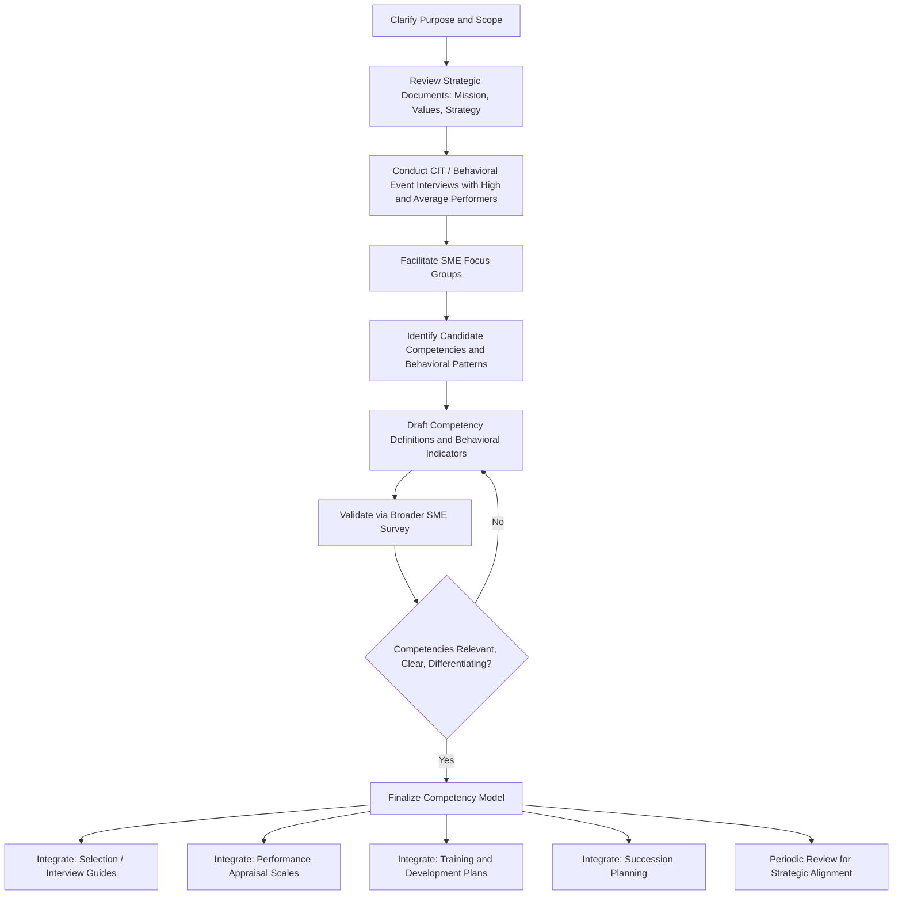

## Competency Modeling

### Definition and Conceptual Boundaries

Competency modeling is the process of identifying and organizing the clusters of knowledge, skills, abilities, and other characteristics (KSAOs) — collectively termed **competencies** — that distinguish effective from ineffective performance in a job, job family, or organization. A **competency model** is the resulting structured framework, typically organized into a set of named competencies, each defined by a description and a set of observable behavioral indicators.

**Competency vs. Traditional Job Analysis**

- **Traditional job analysis**: Emphasizes tasks, duties, and job-specific requirements, typically tied to a single, narrowly defined position.
- **Competency modeling**: Emphasizes broader, often cross-cutting behavioral clusters (e.g., "Strategic Thinking," "Collaboration") applicable across multiple roles, job families, or the entire organization, frequently linking individual capability directly to organizational strategy and values.

[Inference] The distinction is more one of emphasis and philosophical origin than a hard methodological boundary; competency modeling is often described in the literature as a variant or extension of worker-oriented job analysis rather than an entirely separate technical discipline, and the two fields share overlapping data collection methods (interviews, Critical Incident Technique, surveys).

### Historical Development

- **David McClelland (1973), "Testing for Competence Rather Than for Intelligence"**: Widely credited as the founding document of the competency movement; argued that traditional intelligence and aptitude tests were poor predictors of job and life success, and proposed identifying the specific behavioral characteristics ("competencies") that differentiate superior performers.
- **Richard Boyatzis (1982), "The Competent Manager"**: Extended McClelland's work specifically to managerial roles, using Critical Incident Technique-based studies to empirically derive a competency model distinguishing superior from average managers.
- **1980s-1990s corporate adoption**: Competency modeling was widely adopted by large organizations and consulting firms as an integrating framework connecting selection, development, performance management, and succession planning under a single behavioral language.
- **Late 1990s-2000s**: Growing academic scrutiny of the construct's definitional looseness and measurement rigor relative to traditional psychometric approaches, alongside continued and expanding practitioner use.

### The McClelland-Boyatzis Tradition vs. the Job-Analytic Tradition

**Key Points**

Scholars (notably Sandra Shippmann and colleagues in an influential 2000 review) have distinguished two historically distinct traditions that converged under the "competency" label:

1. **The McClelland-Boyatzis (or "competency") tradition**: Originated in industrial/organizational psychology and management consulting, oriented toward identifying characteristics of superior performers, often using less standardized, more holistic methods, and frequently linking competencies explicitly to business strategy and organizational values.
2. **The job-analytic tradition**: Rooted in traditional, more methodologically rigorous job analysis practice (as covered under standard job analysis methods), oriented toward comprehensive, systematic documentation of job requirements with stronger emphasis on measurement reliability and legal defensibility.

[Inference] This distinction remains influential in academic critique of competency modeling, with critics arguing that many corporate competency models sacrifice psychometric rigor for strategic alignment and organizational buy-in, though defenders argue the practical, communicative, and integrative value of competency models justifies this trade-off for many organizational purposes.

### Types of Competency Models

- **Core (Organizational) Competencies**: Behaviors expected of all employees, typically derived from and communicating organizational values, mission, and strategy (e.g., "Integrity," "Customer Focus").
- **Functional/Job-Family Competencies**: Behaviors specific to a broad occupational category or function (e.g., competencies specific to all sales roles, or all engineering roles).
- **Role-Specific/Technical Competencies**: Behaviors and technical knowledge specific to a particular job or narrow role (e.g., specific technical competencies for a data scientist role).
- **Leadership Competencies**: A distinct and heavily developed sub-category focused on managerial and executive-level behaviors (e.g., strategic vision, decision-making, developing others), often organized into tiered models reflecting increasing leadership levels (e.g., individual contributor → manager → senior leader → executive).

Most comprehensive organizational competency frameworks combine multiple tiers — a set of core competencies applicable to everyone, layered with function-specific and role-specific competencies.

### Structure of a Competency Model

A well-constructed competency typically includes:

1. **Competency title**: A short, memorable label (e.g., "Strategic Thinking").
2. **Definition**: A concise description of what the competency means in the organizational context.
3. **Behavioral indicators**: Specific, observable behaviors that demonstrate the competency, often organized by proficiency level.
4. **Proficiency levels**: Graduated descriptions (e.g., basic, intermediate, advanced, expert) describing how the competency manifests differently at different seniority levels or performance tiers.

### Development Methodology

**Data Collection Methods**

Competency models are typically developed using a combination of:

- **Critical Incident Technique (CIT)**: Collecting specific examples of effective and ineffective behavior from high and average/low performers, historically the core method in the McClelland-Boyatzis tradition, used to empirically derive behaviors that differentiate performance levels.
- **Behavioral Event Interviews (BEI)**: A structured interview variant of CIT specifically associated with the competency modeling tradition, in which respondents describe in detail specific past situations, their actions, and outcomes.
- **Focus groups and subject matter expert (SME) panels**: Facilitated sessions with incumbents, supervisors, and senior leaders to identify, refine, and validate proposed competencies.
- **Surveys/questionnaires**: Rating proposed competencies on importance, relevance, or differentiating power across a broader respondent sample.
- **Strategic and organizational document review**: Analysis of mission statements, values statements, and strategic plans to ensure alignment between the competency model and organizational direction — a step distinctive to the competency tradition relative to traditional job analysis.
- **Benchmarking against existing/generic competency libraries**: Many consulting firms and vendors maintain pre-built, validated competency libraries (generic dictionaries of competencies and behavioral indicators) that organizations adapt rather than building entirely from scratch.

**Key Points: Typical Development Process**

1. Clarify purpose and scope (which roles, which organizational level, which HR applications).
2. Collect data via CIT/BEI, focus groups, and/or document review to identify candidate competencies.
3. Draft competency definitions and behavioral indicators.
4. Validate the draft model with SME panels and/or broader survey data (checking relevance, clarity, and differentiating power).
5. Finalize and integrate the model into HR systems (selection, appraisal, development).
6. Periodically review and update to maintain alignment with evolving organizational strategy.

### Applications Across HR Functions

- **Selection**: Structuring behavioral/competency-based interview questions and rating scales around the model; used to design or organize assessment centers.
- **Performance Management**: Providing the behavioral criteria against which performance is appraised, often via competency-based rating scales analogous to Behaviorally Anchored Rating Scales.
- **Training and Development**: Identifying development needs by comparing current proficiency against target competency levels (a competency gap analysis); structuring curricula around specific competencies.
- **Succession Planning**: Identifying and developing candidates against leadership competency models to build a pipeline for future roles.
- **Compensation**: Some organizations link competency proficiency, particularly for leadership/technical competencies, to broadband compensation structures (competency-based pay), though this application is less universal than the others.
- **Organizational Communication**: Competency models frequently serve as a shared behavioral language connecting individual performance expectations to broader organizational values and strategy — an integrative function distinctive to this method relative to traditional job analysis outputs.

### Critiques and Limitations

**Key Points**

- **Definitional ambiguity**: The term "competency" has been used inconsistently across the literature and across organizations — sometimes referring to observable behaviors, sometimes to underlying traits/abilities, and sometimes to a mix of both, which complicates cross-study comparison and measurement.
- **Weaker psychometric rigor (in some applications)**: Compared to traditional job analysis and psychometric selection instruments, competency models — particularly those developed primarily through less-structured focus groups rather than rigorous CIT/BEI and statistical validation — may show weaker documented reliability and validity evidence [Inference — this varies substantially by how rigorously a given model was developed; well-constructed competency models using CIT/BEI and systematic validation can meet job-analytic standards].
- **Genericity and redundancy**: Critics note that many corporate competency models converge on a similar, generic set of labels (e.g., "communication," "teamwork," "leadership") regardless of organizational or job context, potentially limiting their differentiating and predictive value.
- **Overlap and redundancy between competencies**: Poorly constructed models may include competencies that are conceptually redundant or difficult for raters to distinguish behaviorally, reducing measurement precision.
- **Legal defensibility concerns**: Because some competency models are developed with less rigorous documentation than traditional job analysis, their use in high-stakes selection decisions may carry greater legal risk if not adequately validated and job-related [Unverified — the extent of legal risk depends heavily on specific validation evidence, jurisdiction, and how the model was applied, and should not be treated as a fixed generalization].

### Competency Modeling vs. Traditional Job Analysis: Comparison

| Dimension | Traditional Job Analysis | Competency Modeling |
| --- | --- | --- |
| Primary Focus | Tasks, duties, job-specific requirements | Broad behavioral clusters, often cross-role |
| Origin | I-O psychology, personnel selection research | McClelland/Boyatzis tradition, management consulting |
| Typical Output | Job description, job specification | Named competencies with behavioral indicators |
| Strategic Linkage | Indirect | Often explicit (tied to mission/values/strategy) |
| Common Methods | Interviews, observation, structured questionnaires | CIT/BEI, focus groups, SME panels |
| Psychometric Rigor | Generally systematic and standardized | Variable; depends on development rigor |
| Primary HR Application | Selection validation, compensation, training | Integrated HR framework across multiple functions |

### Illustrative Example

An organization developing a leadership competency model for mid-level managers:

1. Conducts **Behavioral Event Interviews** with a sample of high-performing and average-performing managers, asking each to describe specific situations involving team conflict, strategic decisions, and change management.
2. Analyzes interview transcripts to identify behavioral patterns that differentiate the two groups — for example, high performers consistently describe proactively soliciting dissenting views before making decisions, while average performers describe deciding unilaterally.
3. Drafts a competency titled **"Inclusive Decision-Making"** with behavioral indicators such as "Actively seeks input from team members with differing perspectives before finalizing decisions" and "Explains the rationale behind decisions to build buy-in."
4. Validates the draft competency and indicators with a broader SME panel of senior leaders, confirming relevance and alignment with the organization's stated value of "collaborative leadership."
5. Integrates the finalized competency into the manager-level performance appraisal rating scale and into structured behavioral interview questions for manager-level hiring.

This example illustrates the characteristic competency-modeling sequence: empirically differentiating performance via CIT/BEI, then explicitly linking the resulting competency to organizational values, then embedding it across multiple HR systems (appraisal and selection).

### Conceptual Model: Competency Model Architecture (svg_diagram)

<svg xmlns="http://www.w3.org/2000/svg" viewBox="0 0 900 400" font-family="Arial, sans-serif">
<text x="450" y="26" text-anchor="middle" font-size="18" font-weight="bold">Competency Model Architecture (svg_diagram)</text>
<rect x="330" y="50" width="240" height="55" rx="8" fill="none" stroke="#333" stroke-width="1.5" />
<text x="450" y="82" text-anchor="middle" font-size="13" font-weight="bold">Core Competencies</text>
<text x="450" y="97" text-anchor="middle" font-size="10">(All Employees)</text>
<rect x="150" y="150" width="240" height="55" rx="8" fill="none" stroke="#333" stroke-width="1.5" />
<text x="270" y="182" text-anchor="middle" font-size="13" font-weight="bold">Functional Competencies</text>
<text x="270" y="197" text-anchor="middle" font-size="10">(Job Family Specific)</text>
<rect x="510" y="150" width="240" height="55" rx="8" fill="none" stroke="#333" stroke-width="1.5" />
<text x="630" y="182" text-anchor="middle" font-size="13" font-weight="bold">Leadership Competencies</text>
<text x="630" y="197" text-anchor="middle" font-size="10">(Tiered by Level)</text>
<rect x="60" y="250" width="200" height="55" rx="8" fill="none" stroke="#333" stroke-width="1.5" />
<text x="160" y="282" text-anchor="middle" font-size="12" font-weight="bold">Role-Specific</text>
<text x="160" y="297" text-anchor="middle" font-size="10">Technical Competencies</text>
<rect x="330" y="330" width="240" height="50" rx="8" fill="none" stroke="#333" stroke-width="1.5" />
<text x="450" y="360" text-anchor="middle" font-size="12" font-weight="bold">Behavioral Indicators</text>
<line x1="400" y1="105" x2="300" y2="145" stroke="#333" stroke-width="1.5" marker-end="url(#arrow4)" />
<line x1="500" y1="105" x2="600" y2="145" stroke="#333" stroke-width="1.5" marker-end="url(#arrow4)" />
<line x1="220" y1="205" x2="180" y2="245" stroke="#333" stroke-width="1.5" marker-end="url(#arrow4)" />
<line x1="270" y1="205" x2="400" y2="325" stroke="#333" stroke-width="1" marker-end="url(#arrow4)" />
<line x1="630" y1="205" x2="480" y2="325" stroke="#333" stroke-width="1" marker-end="url(#arrow4)" />
<line x1="160" y1="305" x2="380" y2="335" stroke="#333" stroke-width="1" marker-end="url(#arrow4)" />
</svg>

### Process Flow: Competency Model Development

### Related Topics

- Job Analysis Methods and Techniques
- Behaviorally Anchored Rating Scales (BARS)
- Structured/Behavioral Interviewing
- Assessment Centers
- Succession Planning
- Training Needs Analysis
- KSAO Frameworks
- Selection System Validation (Content, Criterion, Construct Validity)