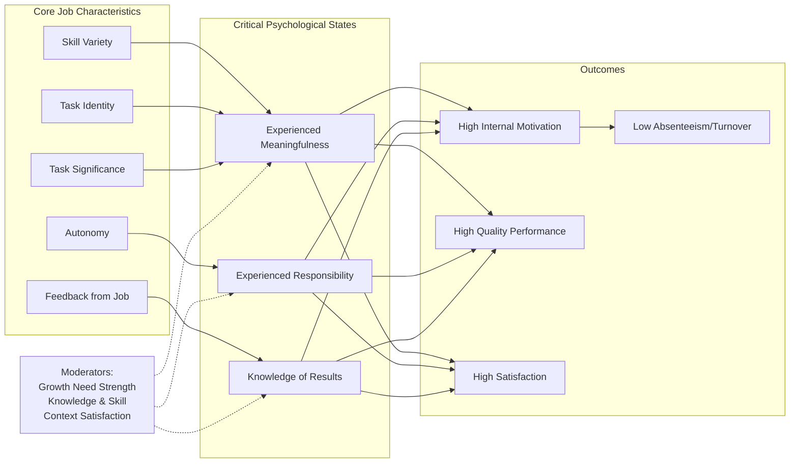

## Job Enrichment and Job Characteristics Theory

### Overview

Job Characteristics Theory (JCT), developed by Hackman and Oldham (1975, 1976, 1980), explains how the objective properties of a job influence employee motivation, satisfaction, and performance through psychological states. Job enrichment is the applied intervention derived from this theory: redesigning jobs to increase their motivating potential by building in more of the core characteristics the theory identifies.

The theory sits within the broader tradition of work design, following earlier contributions from Herzberg's Two-Factor Theory (which distinguished motivators from hygiene factors) and Turner and Lawrence's work on task attributes. JCT formalized these ideas into a testable, measurable model.

### Historical Context

**Key Points**

- Herzberg (1968) argued that "job enrichment" (vertical loading of responsibility) increases motivation, while "job enlargement" (horizontal loading of more tasks at the same level) does not.
- Turner and Lawrence (1965) identified task attributes (variety, autonomy, required interaction, optional interaction, knowledge/skill required, responsibility) correlated with worker satisfaction and attendance.
- Hackman and Oldham synthesized and extended this work into the Job Characteristics Model (JCM), adding a formal psychological mechanism and a measurement instrument (the Job Diagnostic Survey).

### The Five Core Job Characteristics

JCT identifies five core dimensions that determine a job's motivating potential:

1. **Skill Variety** — the degree to which a job requires a range of different activities, involving the use of different skills and talents.
2. **Task Identity** — the degree to which a job requires completion of a whole, identifiable piece of work from beginning to end with a visible outcome.
3. **Task Significance** — the degree to which the job has a substantial impact on the lives or work of other people, whether inside or outside the organization.
4. **Autonomy** — the degree to which the job provides substantial freedom, independence, and discretion in scheduling work and determining procedures.
5. **Feedback from the Job** — the degree to which carrying out the work activities gives the individual direct and clear information about the effectiveness of performance.

### Critical Psychological States

The five core characteristics map onto three critical psychological states, which in turn drive outcomes:

| Core Characteristic(s) | Psychological State |
| --- | --- |
| Skill Variety, Task Identity, Task Significance | Experienced Meaningfulness of the Work |
| Autonomy | Experienced Responsibility for Outcomes |
| Feedback from the Job | Knowledge of the Actual Results |

**Key Points**

- The first three characteristics jointly (additively, in the original model) produce experienced meaningfulness — no single one is strictly necessary if the others are strong, though all three contribute.
- Autonomy is the sole driver of experienced responsibility.
- Feedback (specifically feedback *from the job itself*, not from supervisors) is the sole driver of knowledge of results.
- All three psychological states must be present to some degree for the outcomes below to materialize; a job strong on characteristics but weak on one psychological state will underperform its theoretical potential.

### Outcomes

When the three psychological states are present, the model predicts:

- High internal work motivation
- High-quality work performance
- High satisfaction with the work
- Low absenteeism and turnover

### The Motivating Potential Score (MPS)

The model is often summarized using a composite formula:

$$MPS = \left(\frac{SV + TI + TS}{3}\right) \times AU \times FB$$

Where $SV$ = Skill Variety, $TI$ = Task Identity, $TS$ = Task Significance, $AU$ = Autonomy, $FB$ = Feedback.

**Key Points**

- The multiplicative structure means Autonomy and Feedback act as near-necessary conditions: if either is at or near zero, the MPS collapses toward zero regardless of how high the other characteristics are.
- The additive averaging of the meaningfulness triad means a job can compensate for weakness in one of those three (e.g., low task significance) with strength in the other two.
- MPS is typically measured via the **Job Diagnostic Survey (JDS)**, a validated self-report instrument with Likert-scored items for each dimension.
- [Unverified] Exact JDS item counts and scoring weights vary slightly across published versions of the instrument; practitioners should consult the specific JDS version being administered rather than assuming a single canonical form.

### Moderators

Hackman and Oldham proposed that the strength of the relationships in the model is moderated by individual differences:

1. **Growth Need Strength (GNS)** — employees with high desire for personal growth, learning, and accomplishment respond more strongly (both psychologically and behaviorally) to enriched jobs than those with low GNS.
2. **Knowledge and Skill** — employees must possess adequate knowledge and skill to perform the enriched job competently; without this, enrichment can produce frustration rather than motivation.
3. **Context Satisfaction** — satisfaction with contextual factors (pay, job security, co-workers, supervision — Herzberg's "hygiene" factors) moderates whether employees can meaningfully engage with the motivational potential of the job itself.

**Example**

An employee with low growth need strength given a highly autonomous, high-variety role may experience the added responsibility as stressful rather than motivating, whereas a high-GNS employee in the same role reports increased engagement and performance.

### Job Enrichment: Implementation Principles

Hackman and Oldham proposed five implementing concepts that translate the core characteristics into concrete redesign actions:

1. **Combining Tasks** — merge fragmented, specialized tasks into larger work modules → increases Skill Variety and Task Identity.
2. **Forming Natural Work Units** — group tasks into a logically coherent whole (by client, geography, product line) rather than arbitrary division → increases Task Identity and Task Significance.
3. **Establishing Client Relationships** — put workers in direct contact with the end users/clients of their output → increases Skill Variety, Autonomy, and Feedback.
4. **Vertical Loading** — push down responsibilities and decision authority previously held by supervisors (scheduling, quality control, troubleshooting) to the worker → increases Autonomy.
5. **Opening Feedback Channels** — provide direct, timely feedback from the work itself rather than solely through management → increases Feedback.

### Diagram: Job Characteristics Model Structure

### Job Enrichment vs. Related Concepts

| Concept | Definition | Direction of Change |
| --- | --- | --- |
| Job Enlargement | Adding more tasks at the same skill/responsibility level | Horizontal |
| Job Enrichment | Adding greater responsibility, autonomy, and control | Vertical |
| Job Rotation | Moving employees between different jobs periodically | Lateral |
| Job Simplification | Reducing task variety and complexity (Scientific Management legacy) | Opposite of enrichment |

### Example: Applying the Model

**Example**

A customer service representative role limited to answering scripted calls (low SV, low TI, low AU, delayed FB) is redesigned so that the representative:

- Handles a case from intake to resolution (increases Task Identity)
- Is authorized to approve refunds up to a set limit without supervisor sign-off (increases Autonomy)
- Follows up directly with the customer to confirm resolution (increases Feedback and Task Significance)
- Rotates across billing, technical, and account-management query types (increases Skill Variety)

[Inference] Based on the model's predictions, this redesign would be expected to raise the role's MPS and, contingent on employees' growth need strength and adequate training, improve engagement and reduce turnover; actual outcomes require empirical measurement (e.g., pre/post JDS scores) rather than assumption.

### Criticisms and Limitations

- **Causality concerns**: Much supporting evidence is correlational (cross-sectional survey data), making it difficult to establish that job characteristics *cause* psychological states rather than being confounded with them or reverse-caused by satisfied workers perceiving their jobs more favorably.
- **Multiplicative formula validity**: [Unverified] Empirical tests of the MPS multiplicative formula have produced mixed support; several studies find additive combinations of the characteristics predict outcomes about as well as the multiplicative formula, questioning the necessity of the exact algebraic structure.
- **Moderator effects inconsistency**: Growth Need Strength as a moderator has received inconsistent empirical support across studies; effects are sometimes weaker or absent compared to the original theoretical prediction.
- **Individual differences beyond GNS**: The model has been criticized for underweighting broader individual differences (e.g., negative affectivity, which can bias self-report perceptions of job characteristics).
- **Overlap with job crafting**: Modern work design research (e.g., Wrzesniewski & Dutton's job crafting) emphasizes that employees actively reshape task, relational, and cognitive boundaries of their jobs rather than being passive recipients of managerially designed enrichment — a perspective JCT does not fully incorporate.
- **Cultural generalizability**: [Inference] Because the model was developed and validated primarily in North American organizational contexts, its assumption that autonomy and responsibility are universally motivating may not generalize equally to cultures with different power-distance or collectivism norms, though this requires context-specific validation rather than blanket assumption.

### Diagnostic Tool: Work Design Questionnaire (WDQ)

Morgeson and Humphrey (2006) developed the **Work Design Questionnaire** as an expanded successor instrument, covering not just JCT's motivational characteristics but also:

- Social characteristics (social support, interdependence, interaction outside the organization)
- Work context characteristics (ergonomics, physical demands, work conditions, equipment use)

**Key Points**

- The WDQ broadens the scope beyond JCT's purely motivational focus to a more comprehensive taxonomy of work design, reflecting the field's evolution since the original 1970s model.

### Practical Application Steps

1. Diagnose current job characteristics using JDS or WDQ scores.
2. Calculate baseline MPS to identify the weakest link (often Autonomy or Feedback, given their multiplicative weight).
3. Select the implementing concept(s) that most directly target the weak characteristic(s).
4. Assess employee Growth Need Strength before large-scale rollout, since low-GNS employees may need more structured support during transition.
5. Redesign the job using targeted implementing concepts (combine tasks, form natural units, establish client contact, vertically load, open feedback channels).
6. Re-measure MPS and outcome variables (satisfaction, performance, absenteeism) post-implementation.
7. Iterate based on results; [Inference] because moderator effects and outcome magnitudes vary across contexts, a pilot-and-measure approach is generally preferable to organization-wide rollout without validation.

### Related Topics / Next Steps

- **Job Crafting** (Wrzesniewski & Dutton) — employee-initiated redesign of task, relational, and cognitive job boundaries
- **Work Design Questionnaire (WDQ)** — Morgeson and Humphrey's expanded work design taxonomy
- **Herzberg's Two-Factor Theory** — motivators vs. hygiene factors as theoretical precursor
- **Self-Determination Theory** — autonomy, competence, and relatedness as intrinsic motivation drivers, theoretically complementary to JCT
- **Sociotechnical Systems Theory** — team-level and technological context for job design
- **Job Diagnostic Survey (JDS)** — measurement instrument construction and scoring
- **Autonomous Work Groups / Self-Managed Teams** — group-level application of enrichment principles
- **Person-Job Fit** — interaction between individual differences (GNS, skill) and job design outcomes