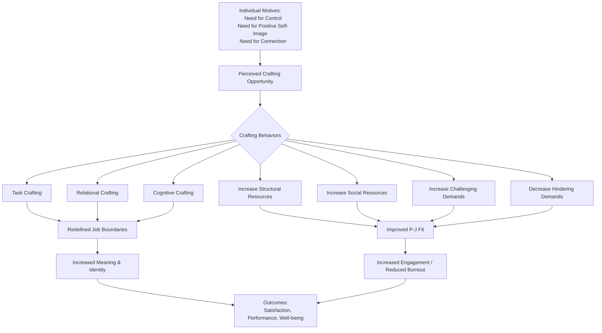

## Job Crafting

### Overview

Job crafting is the process by which employees proactively redefine and reshape the boundaries of their jobs — physically, cognitively, and relationally — to align work with their own motives, strengths, and preferences. Unlike job enrichment or job redesign, which are top-down managerial interventions, job crafting is a bottom-up, employee-initiated process. The concept was formalized by Wrzesniewski and Dutton (2001) and later extended by Tims, Bakker, and Derks (2012) through the lens of the Job Demands-Resources (JD-R) model.

### Theoretical Origins

**Key Points**

- Wrzesniewski and Dutton (2001) introduced job crafting as a response to the limitations of classical work design theory (e.g., Job Characteristics Theory), which treats employees as passive recipients of a fixed job design.
- Their foundational insight came partly from field studies of hospital cleaners, who redefined their roles to include emotional support and patient interaction — tasks outside their formal job description — thereby increasing perceived meaning in low-status work.
- Job crafting assumes employees have latitude ("crafting opportunity") in how they interpret and enact even formally rigid job descriptions.

### The Three Original Forms of Job Crafting (Wrzesniewski & Dutton, 2001)

1. **Task Crafting** — altering the number, scope, or type of job tasks (e.g., taking on additional responsibilities, adjusting how a task is performed).
2. **Relational Crafting** — changing the quality or amount of interaction with others at work (e.g., building new relationships, deepening existing ones, withdrawing from unhelpful interactions).
3. **Cognitive Crafting** — changing how one perceives or frames the meaning of the job (e.g., reframing a job as a "calling" rather than a set of duties).

**Example**

A hospital cleaner who begins engaging patients in conversation and coordinating informally with nurses on patient needs is engaging in both relational crafting (new interactions) and cognitive crafting (reframing the role from "cleaning" to "contributing to patient care").

### The JD-R-Based Model (Tims, Bakker & Derks, 2012)

A second major stream reframes job crafting in terms of the **Job Demands-Resources (JD-R) model**, defining it as self-initiated changes employees make to balance their job demands and job resources with their personal abilities and needs.

Four crafting behaviors are identified:

1. **Increasing Structural Job Resources** — seeking autonomy, skill variety, opportunities for development.
2. **Increasing Social Job Resources** — seeking feedback, coaching, or social support from colleagues/supervisors.
3. **Increasing Challenging Job Demands** — proactively taking on new projects or more challenging tasks.
4. **Decreasing Hindering Job Demands** — reducing emotionally, mentally, or physically taxing aspects of the job that are not resource-generating.

**Key Points**

- This model is operationalized via the **Job Crafting Scale (JCS)**, a validated self-report questionnaire with subscales corresponding to each of the four behaviors.
- Unlike the Wrzesniewski and Dutton typology (motivated by meaning-making), the JD-R model is explicitly motivated by the goal of optimizing person-job fit and managing well-being (engagement, burnout prevention).

### Comparing the Two Frameworks

| Dimension | Wrzesniewski & Dutton (2001) | Tims, Bakker & Derks (2012) |
| --- | --- | --- |
| Theoretical base | Meaning-making, identity | Job Demands-Resources model |
| Core dimensions | Task, Relational, Cognitive | Structural resources, Social resources, Challenging demands, Hindering demands |
| Primary driver | Sense of purpose/identity | Balancing demands and resources |
| Measurement | Largely qualitative/case-based originally | Job Crafting Scale (quantitative) |
| Outcome focus | Meaning, identity, job satisfaction | Work engagement, burnout, performance |

### Motives for Job Crafting

Wrzesniewski and Dutton proposed three underlying motives that drive crafting behavior:

1. **Need for control** over aspects of one's work, to reduce ambiguity or increase predictability.
2. **Need for positive self-image**, using work to project or affirm a desired identity to oneself and others.
3. **Need for human connection**, to fulfill relational and belongingness needs through work.

### Diagram: Job Crafting Process Model

### Antecedents of Job Crafting

- **Autonomy and job discretion** — jobs with more decision latitude afford more crafting opportunity.
- **Low task interdependence** — jobs less tightly coupled to others' workflows are easier to craft without disrupting coworkers.
- **Proactive personality** — dispositional tendency to take initiative is a consistent individual-difference predictor.
- **Regulatory focus** — promotion-focused individuals (oriented toward gains/growth) tend to engage more in approach-oriented crafting (seeking resources/challenges); prevention-focused individuals lean toward avoidance-oriented crafting (reducing hindering demands).
- **Perceived organizational support** — employees who feel supported are more likely to craft, since crafting can otherwise be perceived as deviant or risky.

### Outcomes of Job Crafting

**Key Points**

- Consistently associated with higher work engagement, job satisfaction, and meaningfulness across multiple meta-analyses.
- Approach-oriented crafting (seeking resources, seeking challenges) is more strongly and consistently linked to positive outcomes than avoidance-oriented crafting (reducing hindering demands).
- [Unverified] The relationship between reducing hindering job demands and performance outcomes is mixed in the literature; some studies report null or even negative associations with performance, while others find it protective against burnout — the net effect appears to depend on context and how "hindering" is defined.
- Job crafting has been linked to reduced burnout, particularly through the resource-increasing and demand-reducing pathways of the JD-R model.

### Job Crafting vs. Job Enrichment vs. Job Design

| Concept | Initiator | Scope | Formal Change to Job Description |
| --- | --- | --- | --- |
| Job Enrichment | Management/organization | Vertical (responsibility, autonomy) | Yes, formally redesigned |
| Job Design (general) | Management/organization | Structural (tasks, workflow) | Yes |
| Job Crafting | Employee | Task, relational, cognitive boundaries | Often informal, not officially documented |

### Organizational Interventions to Promote Job Crafting

Structured programs have been developed to help employees craft jobs more intentionally, most notably the **Job Crafting Exercise** developed at the University of Michigan (Berg, Dutton, & Wrzesniewski).

Typical intervention steps:

1. Employees map their current tasks, relationships, and perceptions of their job onto a visual worksheet.
2. Employees identify their core motives, strengths, and passions.
3. Employees redesign their "before" job map into an "after" map, identifying specific task, relational, and cognitive changes.
4. Employees create an action plan with concrete, incremental crafting steps.
5. Follow-up sessions assess implementation and adjust the plan.

**Example**

An HR analyst who enjoys data visualization but whose formal role is limited to compliance reporting might task-craft by volunteering to build dashboards for other departments (task crafting), relational-craft by building closer ties with the analytics team (relational crafting), and cognitive-craft by reframing their identity from "compliance reporter" to "data storyteller within HR" (cognitive crafting).

### Criticisms and Limitations

- **Potential for misalignment with organizational goals**: Unchecked crafting can lead employees to drift away from core job requirements, creating coordination problems, especially in highly interdependent roles.
- **Equity concerns**: Employees with more autonomy or higher status (e.g., managers, knowledge workers) generally have more crafting opportunity than those in tightly controlled, low-autonomy roles (e.g., assembly-line work, some service jobs), raising concerns about differential access to the benefits of crafting.
- **Measurement fragmentation**: The coexistence of the Wrzesniewski/Dutton typology and the Tims/Bakker/Derks JD-R-based scale has led to inconsistent operationalization across studies, complicating meta-analytic synthesis.
- **Causal direction**: [Inference] Much of the supporting evidence is cross-sectional or short-term longitudinal; because engaged, satisfied employees may also be more likely to *report* crafting behavior, some observed associations could partly reflect reverse causation rather than crafting causing engagement.
- **Overlap with counterproductive behavior**: Distinguishing legitimate crafting from role abandonment or task avoidance (particularly under "decreasing hindering demands") can be conceptually and empirically difficult.

### Measurement Instruments

| Instrument | Author(s) | Basis |
| --- | --- | --- |
| Job Crafting Scale (JCS) | Tims, Bakker & Derks (2012) | JD-R model, 4 subscales |
| Job Crafting Questionnaire (JCQ) | Slemp & Vella-Brodrick (2013) | Wrzesniewski & Dutton's 3-dimension typology |
| Job Crafting Exercise | Berg, Dutton & Wrzesniewski | Qualitative, worksheet-based intervention tool |

### Related Topics / Next Steps

- **Job Characteristics Theory (JCT)** — top-down theoretical counterpart to bottom-up crafting
- **Job Demands-Resources (JD-R) Model** — theoretical foundation for the Tims/Bakker/Derks crafting framework
- **Person-Job Fit** — the alignment outcome that crafting is theorized to improve
- **Work Engagement (Utrecht Work Engagement Scale)** — primary outcome variable in JD-R-based crafting research
- **Proactive Personality and Proactive Behavior** — dispositional antecedents of crafting
- **Psychological Empowerment** — related construct concerning perceived control and meaning at work
- **Burnout (Maslach Burnout Inventory)** — outcome variable relevant to demand-reducing crafting
- **Idiosyncratic Deals (I-Deals)** — related but distinct concept of individually negotiated employment terms