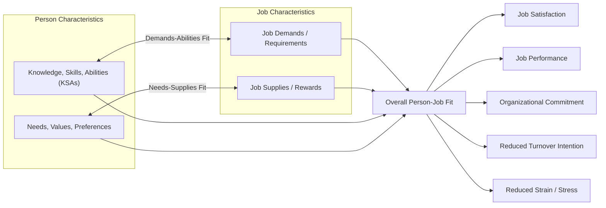

## Person-Job Fit

### Overview

Person-Job Fit (P-J Fit) refers to the compatibility between an individual's characteristics (knowledge, skills, abilities, needs, values) and the characteristics of a specific job (requirements, demands, and the resources/rewards it offers). It is one of the most extensively studied constructs in Person-Environment (P-E) Fit theory and serves as a foundational concept underlying selection, job design, and career development practice in organizational psychology.

### Theoretical Placement within Person-Environment Fit

P-J Fit is a subtype of the broader **Person-Environment (P-E) Fit** framework, which also includes:

| Fit Type | Definition |
| --- | --- |
| Person-Job (P-J) Fit | Compatibility between individual and specific job requirements/rewards |
| Person-Organization (P-O) Fit | Compatibility between individual values/personality and organizational culture/values |
| Person-Group (P-G) Fit | Compatibility between individual and immediate work group/team |
| Person-Supervisor (P-S) Fit | Compatibility between individual and supervisor's style/values |
| Person-Vocation (P-V) Fit | Compatibility between individual interests/personality and a broader occupational field |

**Key Points**

- P-J Fit is generally considered the most proximal fit type to job performance, since it concerns the direct match to task requirements, whereas P-O Fit is more proximal to attitudinal outcomes like organizational commitment.
- These fit types are not mutually exclusive; an individual's overall adjustment to work is typically modeled as a function of multiple fit types operating simultaneously.

### Two Conceptualizations: Demands-Abilities and Needs-Supplies Fit

Edwards (1991) formalized P-J Fit into two complementary sub-conceptualizations:

1. **Demands-Abilities (D-A) Fit** — the match between the demands/requirements of a job (skills, effort, time) and an individual's abilities to meet those demands.
2. **Needs-Supplies (N-S) Fit** — the match between an individual's needs, desires, or preferences (for pay, autonomy, recognition) and the supplies/resources the job provides to satisfy them.

**Example**

A software engineer whose job requires proficiency in a specific programming language represents D-A fit if the engineer possesses that skill. If the same engineer values autonomy and the job offers substantial independent decision-making authority, this represents N-S fit. A job can score high on one dimension and low on the other — e.g., an employee capable of doing the job (high D-A fit) but chronically under-rewarded relative to their needs (low N-S fit).

### Complementary vs. Supplementary Fit

- **Complementary Fit** — fit occurs because the person's characteristics "fill a gap" or provide something the environment lacks (this is the basis of D-A and N-S fit above).
- **Supplementary Fit** — fit occurs because the person's characteristics are similar to the characteristics already present in the environment (more relevant to P-O and P-G fit than P-J fit specifically, but often discussed alongside it).

### Measurement Approaches

| Approach | Method | Note |
| --- | --- | --- |
| Direct/Subjective Fit | Employee directly rates perceived fit ("I feel this job is a good match for my skills") | Most common in applied research; captures perceived fit |
| Indirect/Objective (Difference Score) | Separately measure person attributes and job attributes, then compute a discrepancy score (e.g., via polynomial regression) | Methodologically preferred for D-A/N-S fit but computationally complex |
| Polynomial Regression with Response Surface Analysis | Models person and job measures as separate predictors plus their higher-order terms, avoiding statistical problems of simple difference scores | Considered best practice since Edwards (1993, 1994) critique of difference scores |

**Key Points**

- [Unverified] Simple algebraic or absolute difference scores (subtracting job requirement ratings from person ability ratings) were common in early fit research but have been criticized for conflating the effects of the two component variables and for unreliability; polynomial regression is now generally regarded as methodologically superior, though the level of adoption varies across studies.
- Subjective (perceived) fit measures tend to show stronger correlations with attitudinal outcomes (satisfaction, commitment) than objective/computed fit measures, partly because perceived fit is itself closer to the psychological mechanism driving attitudes.

### Diagram: Person-Job Fit Structure

### Outcomes Associated with P-J Fit

- **Job satisfaction** — one of the most consistently and strongly supported outcomes across meta-analyses.
- **Job performance** — D-A fit in particular predicts task performance, since it directly reflects capability-requirement match.
- **Organizational commitment** — moderate positive association, though generally weaker than P-O fit's relationship with commitment.
- **Turnover intentions** — poor P-J fit (especially N-S misfit) is associated with higher intentions to leave.
- **Strain and well-being** — misfit, particularly demands exceeding abilities, is associated with increased stress and strain (conceptually overlapping with the Demand-Control model and JD-R model).

### Antecedents and Determinants

- **Realistic Job Previews (RJPs)** during recruitment, which help applicants self-select based on accurate fit perceptions before hire.
- **Structured selection processes** using validated assessments (cognitive ability tests, structured interviews, work samples) to improve objective D-A fit at the point of hire.
- **Job analysis quality** — accurate, current job analysis data is a prerequisite for meaningfully assessing D-A fit, since it defines what the job actually demands.
- **Post-hire job crafting** — employees may actively increase their own P-J fit over time through task, relational, and cognitive crafting (see Job Crafting) rather than fit being fixed solely at selection.
- **Training and development** — can improve D-A fit post-hire by closing ability gaps.

### Practical Applications in HR/OP Practice

1. **Selection**: P-J fit assessment underlies most structured selection methods — job analysis defines requirements, and assessments (tests, interviews, work samples) estimate applicant-side KSAs for comparison.
2. **Onboarding**: Realistic previews and early socialization efforts aim to calibrate and improve perceived fit before attitudes solidify.
3. **Performance Management**: Persistent performance gaps may reflect D-A misfit rather than motivational deficits, informing whether the intervention should be training (closing ability gaps) versus redesign (adjusting demands).
4. **Retention Strategy**: N-S misfit (e.g., autonomy-seeking employees in highly controlled roles) is a common, addressable driver of voluntary turnover, often addressable via job crafting or internal mobility rather than replacement.
5. **Career Counseling/Vocational Guidance**: Person-Vocation fit assessments (e.g., Holland's RIASEC model) are often used as an upstream complement to P-J fit at the occupational-choice level.

### Person-Job Fit vs. Person-Organization Fit: Comparative Table

| Dimension | Person-Job Fit | Person-Organization Fit |
| --- | --- | --- |
| Level of analysis | Specific job/role | Organization-wide |
| Primary content | Skills, abilities, task demands | Values, culture, norms |
| Strongest outcome | Job performance, task satisfaction | Organizational commitment, turnover |
| Stability | Can change if job changes (role transitions) | Relatively stable unless organization changes |
| Typical measurement point | Selection, job redesign | Recruitment, socialization |

### Criticisms and Limitations

- **Static assumption**: Traditional models can implicitly treat person and job characteristics as fixed at a point in time, understating the dynamic, mutually adjusting nature of fit (addressed by job crafting research, which reframes fit as something employees actively construct).
- **Methodological debate**: Ongoing disagreement in the literature about whether difference-score, polynomial regression, or direct subjective measures best capture "true" fit; results and effect sizes can differ meaningfully depending on the method chosen.
- **Overlap and redundancy with other fit types**: [Inference] Because P-J, P-O, and P-G fit are often measured with similarly worded subjective items, some studies may show inflated correlations among fit types due to common method variance rather than genuinely distinct constructs, though this varies by study design and measurement rigor.
- **Cultural and role-type boundary conditions**: [Inference] The relative importance of D-A fit versus N-S fit likely varies by job type and cultural context (e.g., N-S fit may matter more in individualistic cultures emphasizing personal need fulfillment), though this requires context-specific empirical validation rather than assumption.

### Related Topics / Next Steps

- **Person-Organization (P-O) Fit** — values/culture-based counterpart at the organizational level
- **Job Analysis** — the methodological foundation for defining job demands used in D-A fit assessment
- **Realistic Job Previews (RJPs)** — recruitment technique for improving pre-hire fit perception
- **Job Crafting** — employee-driven mechanism for actively improving fit post-hire
- **Selection and Assessment Methods** — structured interviews, cognitive ability tests, work samples as tools for evaluating D-A fit
- **Holland's RIASEC / Person-Vocation Fit** — occupational-level fit theory
- **Attraction-Selection-Attrition (ASA) Model** (Schneider) — theory explaining how organizations become homogeneous over time through fit-based selection and attrition
- **Job Demands-Resources (JD-R) Model** — related framework connecting demands/resources imbalance to strain and engagement