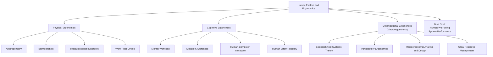

## Human Factors and Ergonomics Fundamentals

### Overview

Human Factors and Ergonomics (HFE) is the scientific discipline concerned with understanding the interactions among humans and other elements of a system, and the application of theory, principles, data, and methods to design in order to optimize human well-being and overall system performance. Within Organizational Psychology, HFE bridges physical, cognitive, and organizational work design, forming a core input to job analysis and work system design alongside motivational approaches like Job Characteristics Theory.

The field is formally represented by bodies such as the International Ergonomics Association (IEA) and the Human Factors and Ergonomics Society (HFES).

### Definition and Scope (IEA Framework)

The International Ergonomics Association defines ergonomics/human factors as the discipline concerned with the understanding of interactions among humans and other elements of a system, applying theory, principles, data, and methods to design in order to optimize human well-being and overall system performance.

The IEA identifies three broad domains of specialization:

1. **Physical Ergonomics** — concerned with human anatomical, anthropometric, physiological, and biomechanical characteristics as they relate to physical activity (e.g., working postures, materials handling, repetitive movements, workplace layout, musculoskeletal disorders).
2. **Cognitive Ergonomics** — concerned with mental processes (perception, memory, reasoning, motor response) as they affect interactions among humans and system elements (e.g., mental workload, decision-making, human-computer interaction, human reliability, skilled performance, training).
3. **Organizational Ergonomics** (also called Macroergonomics) — concerned with the optimization of sociotechnical systems, including organizational structures, policies, and processes (e.g., communication, crew resource management, work design, teamwork, participatory design, community ergonomics).

**Key Points**

- Organizational Psychology overlaps most heavily with the organizational ergonomics (macroergonomics) domain, since this domain directly addresses work design, teamwork structures, and organizational-level system optimization.
- The three domains are not strictly separable in practice; a single workstation redesign project often requires input from all three (e.g., redesigning a control room involves physical layout, cognitive interface design, and organizational shift/communication structures).

### Physical Ergonomics: Core Concepts

- **Anthropometry** — the measurement of human body dimensions (static and dynamic) used to design workstations, equipment, and tools that accommodate a target percentile range of the user population (commonly 5th to 95th percentile).
- **Biomechanics** — the study of forces acting on and generated within the body during physical work, used to assess injury risk from lifting, pushing, pulling, and repetitive motion.
- **Musculoskeletal Disorders (MSDs)** — injuries or disorders of muscles, nerves, tendons, joints, and spinal discs, commonly associated with repetitive strain, awkward posture, excessive force, and prolonged static positioning.
- **Work-Rest Cycles** — the scheduling of recovery periods to mitigate fatigue accumulation in physically demanding tasks.

**Example**

A checkout counter redesigned using anthropometric data to fit a wider range of employee heights, combined with anti-fatigue matting and a rotation schedule limiting continuous standing time, illustrates the integration of anthropometric, biomechanical, and work-rest principles.

### Cognitive Ergonomics: Core Concepts

- **Mental Workload** — the proportion of an operator's limited cognitive capacity that is demanded by a task; excessive workload degrades performance and increases error, while insufficient workload can produce underload, boredom, and vigilance decrements.
- **Situation Awareness (SA)** — Endsley's (1995) three-level model: (1) perception of elements in the environment, (2) comprehension of their meaning, (3) projection of future status. Loss of SA is a common contributor to human error in complex, dynamic systems (aviation, healthcare, process control).
- **Human-Computer Interaction (HCI) / Human-System Interface (HSI) Design** — designing interfaces (displays, controls, alarms) to match human perceptual and cognitive capabilities, minimizing misinterpretation and response time.
- **Human Error and Human Reliability** — the study and classification of error types (e.g., Reason's Swiss Cheese Model distinguishing active failures from latent conditions; slips, lapses, mistakes, and violations).

### Organizational Ergonomics (Macroergonomics): Core Concepts

- **Sociotechnical Systems (STS) Theory** — originating from the Tavistock Institute (Trist & Bamforth, 1951), STS theory holds that organizational performance depends on the joint optimization of the social system (people, relationships, skills) and the technical system (tools, processes, technology), rather than optimizing either in isolation.
- **Participatory Ergonomics** — involving end-users directly in the design or redesign of their own work systems, based on evidence that user involvement improves both design quality and acceptance/adoption.
- **Macroergonomic Analysis and Design (MEAD)** — a structured methodology (Hendrick & Kleiner) for analyzing and designing work systems at the organizational level, considering technological subsystems, personnel subsystems, and their environment jointly.
- **Crew Resource Management (CRM)** — originally developed in aviation, a set of training procedures for improving communication, leadership, and decision-making in team-based high-risk environments; now adapted to healthcare, maritime, and other high-reliability industries.

### Diagram: Domains of Human Factors and Ergonomics

### Human Factors Design Process (General Model)

1. **Task Analysis** — decompose the work into constituent tasks, sub-tasks, and required human actions/decisions (overlaps directly with Job Analysis methodology).
2. **User/Population Characterization** — define the anthropometric, cognitive, and demographic range of the intended user population.
3. **Requirements Definition** — establish design requirements and constraints based on task and user analysis.
4. **Design/Prototype Development** — create the physical layout, interface, or organizational process design.
5. **Usability/Human Factors Testing** — evaluate the design against human performance criteria (error rates, time-on-task, workload ratings, comfort ratings, injury risk indices).
6. **Iteration and Validation** — refine the design based on testing results; repeat until performance and safety criteria are met.

### Key Legislative and Standards Context

- **OSHA (Occupational Safety and Health Administration, U.S.)** — enforces general workplace safety standards; while OSHA does not have a single comprehensive ergonomics standard in the U.S., it addresses ergonomic hazards under the General Duty Clause and industry-specific guidelines.
- **ISO 6385** — "Ergonomics principles in the design of work systems," an international standard providing the fundamental framework for applying ergonomics to work system design.
- **ISO 9241** — series of standards on ergonomics of human-system interaction, widely referenced in HCI and usability design.
- [Unverified] Specific regulatory requirements vary significantly by country and jurisdiction; practitioners should verify current, applicable local regulatory standards rather than assuming a single global standard applies uniformly.

### Relationship to Job Analysis and Work Design

**Key Points**

- Ergonomic task analysis and traditional job analysis (as used in I-O psychology for selection, training, and compensation purposes) share methodological overlap but differ in primary purpose: job analysis typically documents duties/KSAOs for HR decisions, while ergonomic task analysis focuses on physical and cognitive demand characterization for safety and performance optimization.
- Physical and cognitive ergonomic data (e.g., NIOSH lifting equation outputs, mental workload assessments) can and should feed into job analysis documentation, particularly for physically or cognitively demanding roles, to ensure job descriptions and selection criteria reflect actual demand profiles.
- Poor ergonomic design is a documented contributor to reduced job satisfaction, increased absenteeism, and turnover, linking HFE outcomes directly to the organizational outcomes central to I-O psychology (paralleling outcome pathways discussed in Job Characteristics Theory and Person-Job Fit).

### Common Assessment Tools and Methods

| Tool/Method | Domain | Purpose |
| --- | --- | --- |
| NIOSH Lifting Equation | Physical | Calculates a Recommended Weight Limit (RWL) for manual lifting tasks to reduce lower back injury risk |
| Rapid Upper Limb Assessment (RULA) | Physical | Posture-based assessment tool for upper limb musculoskeletal risk |
| Rapid Entire Body Assessment (REBA) | Physical | Whole-body posture assessment tool, extending RULA's logic |
| NASA Task Load Index (NASA-TLX) | Cognitive | Subjective multidimensional workload assessment (mental, physical, temporal demand, performance, effort, frustration) |
| Situation Awareness Global Assessment Technique (SAGAT) | Cognitive | Freeze-probe technique for measuring situation awareness during simulated task performance |
| Macroergonomic Analysis and Design (MEAD) | Organizational | Structured sociotechnical system design/analysis methodology |

### Example: Integrated HFE Application

**Example**

An air traffic control tower redesign might apply: anthropometric console design and adjustable seating (physical ergonomics); alarm and display redesign to reduce misinterpretation under high traffic load, informed by NASA-TLX workload measurement (cognitive ergonomics); and revised shift-handover protocols and team communication structures modeled on Crew Resource Management principles (organizational ergonomics) — illustrating how all three HFE domains typically combine in a single real-world system design project.

### Criticisms and Limitations

- **Fragmentation across domains**: [Inference] Because physical, cognitive, and organizational ergonomics have historically developed with somewhat separate methodologies, tools, and professional communities, integrated cross-domain design projects can face coordination challenges in practice, though this varies by organizational and project structure.
- **Measurement standardization**: Subjective workload and usability measures (e.g., NASA-TLX) rely on self-report, which can be influenced by individual differences in reporting tendency; [Unverified] the degree to which subjective workload ratings correspond to objective physiological workload measures varies across studies and task types.
- **Cost and adoption barriers**: Comprehensive ergonomic redesign (particularly physical workstation retrofits) often requires significant capital investment, which can limit adoption in resource-constrained organizational contexts despite demonstrated safety and productivity benefits.
- **Retrofitting vs. proactive design**: HFE principles are most effective and least costly when applied during initial system design; retrofitting existing systems for ergonomic compliance is typically more expensive and constrained by pre-existing infrastructure.

### Related Topics / Next Steps

- **Job Analysis Methods** — methodological counterpart focused on HR/selection-oriented task documentation
- **Sociotechnical Systems Theory** — theoretical foundation for organizational ergonomics
- **Job Demands-Resources (JD-R) Model** — connects ergonomic demand concepts to organizational strain/engagement outcomes
- **Occupational Health Psychology** — broader field addressing psychosocial and physical workplace risk factors
- **Human Error and Safety Culture** — extension into organizational safety climate and high-reliability organizing
- **Universal Design and Accessibility** — extension of anthropometric/inclusive design principles
- **Workplace Musculoskeletal Disorder Prevention Programs** — applied physical ergonomics intervention design
- **Crew Resource Management (CRM) Training** — applied organizational ergonomics training methodology