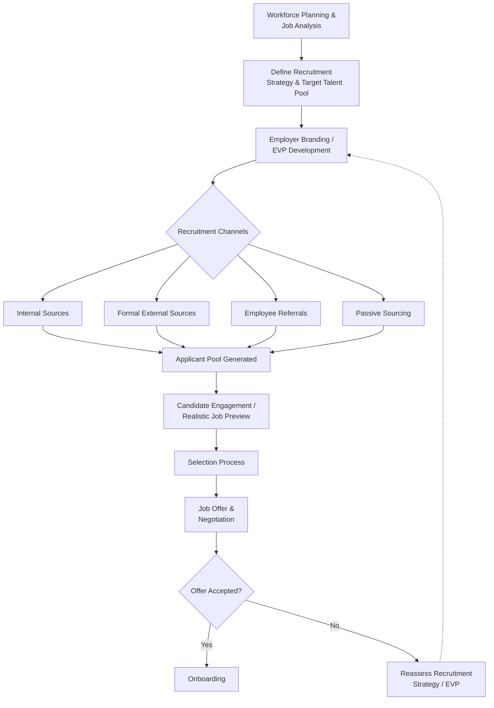

## Recruitment Strategy and Employer Branding

### Overview

Recruitment strategy encompasses the systematic processes an organization uses to identify, attract, and generate a pool of qualified applicants for open positions. Employer branding is the strategic discipline of managing and promoting an organization's identity as an employer to both external candidates and internal employees. Together, these form the front end of the staffing process, directly preceding personnel selection, and are foundational to an organization's ability to compete for talent.

### Recruitment: Definitions and Core Process

Recruitment is formally defined in I-O psychology as the set of organizational activities that (1) influence the number and/or types of applicants who apply for a job and/or (2) affect whether a job offer is accepted (Barber, 1998).

**Key Points**

- Recruitment is distinct from selection: recruitment is concerned with generating and attracting a qualified applicant pool, while selection is concerned with differentiating among applicants within that pool.
- Poor recruitment strategy constrains the ceiling of selection effectiveness — even the most valid selection system cannot compensate for a weak or poorly matched applicant pool.

### Three Stages of Recruitment (Barber, 1998)

1. **Generating Applicants** — activities aimed at attracting a sufficient quantity and quality of applicants (job postings, sourcing, employer branding campaigns, employee referral programs).
2. **Maintaining Applicant Status** — activities that keep candidates engaged and interested throughout the selection process (communication cadence, candidate experience, timely feedback).
3. **Influencing Job Choice** — activities that affect whether a selected candidate accepts a job offer (offer negotiation, realistic job previews, onboarding preview).

### Recruitment Sources

| Source Type | Examples | Characteristics |
| --- | --- | --- |
| Internal Sources | Internal job postings, promotions, transfers | Lower cost, faster onboarding, higher initial fit knowledge; can limit diversity of new perspectives |
| Formal External Sources | Job boards, career sites, recruitment agencies, campus recruiting | Wider reach; variable cost and quality depending on channel |
| Informal External Sources | Employee referrals, professional networks | [Unverified] Referral hires are frequently reported in practitioner literature and some academic studies as showing better retention and faster time-to-productivity than other sources, though effect sizes and consistency vary by study and industry |
| Passive Sourcing | Direct sourcing/headhunting via LinkedIn, sourcing tools, executive search | Targets candidates not actively job-seeking; common for specialized or senior roles |

### Employer Branding: Core Concept

Employer branding, a term introduced by Ambler and Barrow (1996), refers to the package of functional, economic, and psychological benefits provided by employment, and identified with the employing company. It applies marketing branding principles to the employment relationship, treating current and prospective employees as an internal "market."

**Key Points**

- Employer branding operates on two audiences simultaneously: external (attracting prospective candidates) and internal (reinforcing retention and engagement among current employees).
- The construct most closely associated with measuring the content of an employer brand is the **Employer Value Proposition (EVP)** — the set of perceived benefits an employee receives in exchange for the skills, capabilities, and experience they bring to the organization.

### Employer Value Proposition (EVP) Components

A commonly cited EVP framework (based on instrumental-symbolic branding theory, e.g., Lievens & Highhouse) includes:

1. **Instrumental Attributes** — objective, factual job/organization characteristics (pay, benefits, location, work hours, job security).
2. **Symbolic Attributes** — subjective, trait-inferred image characteristics (innovativeness, prestige, sincerity, competence — often drawing on brand personality dimensions).

**Example**

A technology firm's EVP might combine instrumental elements (competitive salary, remote work flexibility, stock options) with symbolic elements (a reputation for innovation, a "builder" culture, and prestige associated with working on cutting-edge products) — the combination differentiates the organization from competitors offering similar instrumental terms alone.

### Diagram: Recruitment and Employer Branding Process Flow

### Realistic Job Previews (RJPs)

A **Realistic Job Preview** provides candidates with balanced, accurate information about both the positive and negative aspects of a job prior to hire, rather than solely promotional content.

**Key Points**

- Meta-analytic research (e.g., Phillips, 1998) has found RJPs associated with modestly reduced turnover and improved self-selection accuracy, though effect sizes are generally small to moderate.
- RJPs function as an important link between recruitment strategy and Person-Job Fit outcomes, since they enable applicant self-selection based on more accurate fit information before the organization commits selection resources.
- RJPs can be delivered through multiple media: written materials, video, job shadowing, or site visits.

### Recruitment Strategy Design Considerations

1. **Talent Market Analysis** — assessing labor market supply/demand conditions for target skill sets, including geographic and competitive benchmarking.
2. **Targeting and Segmentation** — treating different candidate segments (early-career, experienced hires, passive candidates) with differentiated messaging and channels, analogous to marketing audience segmentation.
3. **Diversity Sourcing Strategy** — deliberate broadening of sourcing channels and messaging to reach underrepresented candidate populations, often integrated with organizational DEI (Diversity, Equity, and Inclusion) objectives.
4. **Candidate Experience Design** — managing the end-to-end experience (application ease, communication timeliness, interview process quality) as a driver of both offer acceptance and employer brand reputation (e.g., via public review platforms).
5. **Employer Brand Consistency** — ensuring alignment between the promoted EVP and actual organizational conditions; a mismatch (over-promising) is associated with post-hire disillusionment and early turnover, related conceptually to psychological contract breach.

### Recruitment Metrics

| Metric | Definition | Use |
| --- | --- | --- |
| Time-to-Fill | Days from job requisition opening to offer acceptance | Efficiency of recruitment process |
| Cost-per-Hire | Total recruitment costs divided by number of hires | Cost efficiency benchmarking |
| Applicant Yield Ratio | Proportion of applicants advancing at each selection stage | Funnel efficiency, channel quality |
| Offer Acceptance Rate | Percentage of extended offers accepted | Competitiveness of offer/EVP |
| Source-of-Hire Quality | Post-hire performance/retention broken down by recruitment source | Long-term validation of channel effectiveness |
| Quality of Hire | Composite post-hire performance, retention, and fit indicators | Overall recruitment effectiveness (most difficult to standardize) |

### Employer Branding and Signaling Theory

**Key Points**

- Signaling Theory (Spence, 1973), applied to recruitment, holds that because applicants have incomplete information about actual working conditions, they interpret organizational recruitment materials, website design, interview conduct, and even response speed as *signals* of underlying, otherwise unobservable organizational attributes (e.g., a disorganized interview process may signal broader organizational dysfunction).
- This theory provides part of the rationale for why employer branding and candidate experience quality affect recruitment outcomes beyond the literal content of job postings.

### Social Media and Digital Recruitment Channels

- **Professional Networking Platforms** (e.g., LinkedIn) — used for both passive sourcing and employer brand content distribution.
- **Career Site Optimization** — organizational career pages function as a primary EVP communication channel and are commonly evaluated for content quality, mobile usability, and application-process friction.
- **Employee-Generated Content / Employee Advocacy** — leveraging current employees as authentic brand messengers (e.g., employee testimonials, "day in the life" content), often perceived as more credible than corporate-generated content due to source credibility effects.
- **Employer Review Platforms** (e.g., Glassdoor-type sites) — external, employee-generated reviews that function as an uncontrolled but influential component of employer brand reputation.

### Recruitment Strategy vs. Selection: Boundary Distinction

| Dimension | Recruitment | Selection |
| --- | --- | --- |
| Primary Goal | Maximize quantity/quality of applicant pool | Differentiate and choose among applicants |
| Direction of Information Flow | Organization → Candidate (attraction) | Candidate → Organization (assessment) |
| Key Outcome Metric | Applicant volume, yield, offer acceptance | Predictive validity, adverse impact, hiring accuracy |
| Primary Theoretical Base | Signaling theory, employer branding, marketing | Psychometrics, validity theory, Person-Job Fit |

### Criticisms and Limitations

- **EVP-reality gap risk**: Organizations that over-invest in aspirational employer branding without corresponding internal culture investment risk creating a mismatch that damages both external reputation (via review platforms) and internal trust once discovered post-hire.
- **Measurement difficulty for "Quality of Hire"**: [Unverified] Despite widespread practitioner use, there is no single standardized, universally validated definition or measurement approach for "quality of hire," making cross-organizational benchmarking difficult and results context-dependent.
- **Referral program bias risk**: Heavy reliance on employee referral programs, while often efficient, can inadvertently reduce applicant pool diversity by replicating the demographic composition of the existing workforce through homophily effects.
- **RJP effect size variability**: [Unverified] While RJPs show generally positive meta-analytic effects on turnover reduction, individual study effect sizes vary considerably by industry, job type, and RJP delivery method, and the mechanism (self-selection vs. met-expectations vs. coping preparation) remains debated in the literature.
- **Rapid channel evolution**: [Inference] Because digital and social recruitment channels evolve quickly, specific channel effectiveness benchmarks tend to have a short shelf life; practitioners should treat channel-specific performance data as time-sensitive rather than assuming stability over multi-year periods.

### Related Topics / Next Steps

- **Personnel Selection Methods** — the downstream process recruitment strategy feeds into
- **Person-Organization Fit** — theoretical link between employer branding accuracy and post-hire attitudinal outcomes
- **Psychological Contract** — relevant to EVP-reality alignment and post-hire trust
- **Workforce Planning** — upstream input defining recruitment needs and target talent pools
- **Diversity, Equity, and Inclusion (DEI) in Staffing** — sourcing and outreach strategy considerations
- **Onboarding and Socialization** — the process stage immediately following successful recruitment
- **Applicant Reactions Theory** — research stream on how candidates perceive and respond to selection/recruitment procedures
- **Signaling Theory in Employment Contexts** — theoretical foundation for candidate interpretation of organizational cues