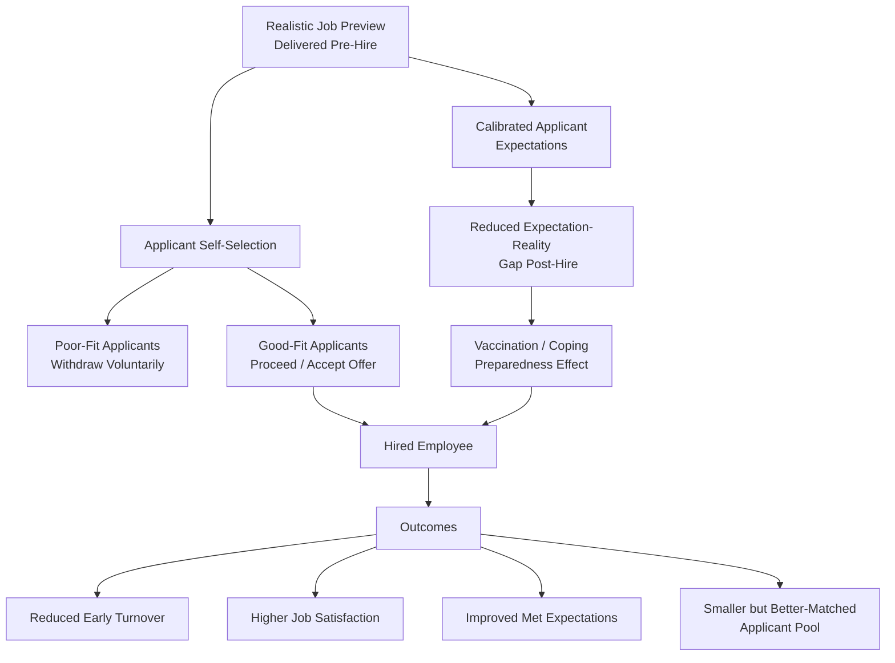

## Realistic Job Previews

### Overview

A Realistic Job Preview (RJP) is a recruitment and selection intervention in which an organization provides job applicants with balanced, accurate information about a position — including both attractive and unattractive aspects — rather than presenting an exclusively favorable portrayal. The concept was formally developed by John Wanous (1973, 1977, 1992) and remains one of the most researched interventions in staffing psychology for its effects on applicant self-selection, met expectations, and early turnover.

### Theoretical Rationale

RJPs are grounded in several interlocking mechanisms:

1. **Met Expectations Hypothesis** — new employees whose pre-hire expectations closely match post-hire reality experience less disillusionment, and disillusionment is a driver of early voluntary turnover.
2. **Self-Selection** — providing accurate information allows applicants to withdraw voluntarily from consideration if the role is a poor fit, improving the average Person-Job Fit of those who remain in the pipeline and accept offers.
3. **Vaccination/Inoculation Effect** — exposure to accurate negative information before hire is theorized to build coping resources and psychological preparedness, buffering the impact of that same negative information once encountered on the job (analogous to inoculation theory in attitude research).
4. **Perceived Honesty and Trust (Signaling)** — candor during recruitment signals organizational trustworthiness, which can enhance perceived organizational support and commitment among those who accept the offer.

### Traditional Job Preview vs. Realistic Job Preview

| Dimension | Traditional Job Preview | Realistic Job Preview |
| --- | --- | --- |
| Content valence | Predominantly positive/promotional | Balanced (positive and negative) |
| Applicant expectations | Often inflated relative to reality | Calibrated closer to actual conditions |
| Self-selection effect | Minimal | Encourages voluntary applicant withdrawal for poor fits |
| Risk | Post-hire "reality shock," met-expectations violation | Reduced applicant pool size (trade-off) |

### Diagram: RJP Mechanism Pathway

### Delivery Media

| Medium | Description | Notes |
| --- | --- | --- |
| Written Materials | Job description booklets, realistic brochures | Low cost; lower engagement than dynamic media |
| Video-Based RJPs | Recorded footage of actual job conditions, employee testimonials | Common in high-turnover roles (e.g., call centers, retail) |
| Job Shadowing / Site Visits | Direct in-person observation or trial exposure to the job | High fidelity; higher logistical cost |
| Web-Based / Interactive RJPs | Online realistic simulations, interactive career site content | [Unverified] Increasingly used in digital recruitment, though comparative effectiveness versus traditional video RJPs is less extensively benchmarked in the academic literature |
| Verbal/Interview-Based | Recruiter or hiring manager directly discussing job challenges during interviews | Common but harder to standardize for consistency and completeness |

### Empirical Findings (Meta-Analytic Evidence)

**Key Points**

- Phillips (1998) conducted a widely cited meta-analysis finding RJPs associated with statistically significant but modest reductions in turnover and modest improvements in job performance, job satisfaction, and met expectations, with self-selection and organizational commitment also showing positive associations.
- [Unverified] Effect sizes reported across RJP meta-analyses are generally described as small to moderate; the precise magnitude varies by outcome measured, delivery medium, and study methodology, so practitioners should not assume large effects from RJPs alone as a turnover-reduction lever.
- Some research suggests RJPs are more effective when delivered earlier in the recruitment process (before an applicant has made significant psychological investment) rather than late-stage (e.g., only at offer acceptance).

### Design Considerations for Effective RJPs

1. **Balance, Not Negativity** — an effective RJP is not simply a list of job negatives; it should present a genuinely balanced picture, since excessive negativity can needlessly reduce applicant pool size without corresponding fit benefits.
2. **Specificity** — concrete, specific examples of both rewarding and challenging job aspects are generally considered more credible and useful to applicants than vague or generic statements.
3. **Source Credibility** — information delivered by incumbent employees (rather than solely recruiters or marketing materials) tends to be perceived as more credible, consistent with source-credibility effects in persuasion research.
4. **Timing** — delivering the RJP early enough in the process to meaningfully inform self-selection decisions, rather than only after significant applicant investment has occurred.
5. **Content Coverage** — should address both **task-related content** (day-to-day duties, physical/cognitive demands) and **context-related content** (culture, supervision style, advancement opportunities, work-life balance conditions).

**Example**

A hospital nursing recruitment RJP might include video testimonials from current nurses describing both the emotional reward of patient care (positive) and the physical demands of long shifts and the emotional toll of difficult patient outcomes (negative), rather than presenting only promotional imagery of the facility.

### RJPs and the Recruitment-Selection Pipeline

**Key Points**

- RJPs are typically positioned at the recruitment or early selection stage, functioning as a bridge between employer branding/recruitment marketing (which is often promotionally oriented) and the more assessment-oriented later selection stages.
- RJPs directly support downstream Person-Job Fit outcomes by improving the accuracy of applicant self-assessment before formal selection procedures are applied, complementing (not replacing) organizational selection methods.
- Because RJPs can reduce applicant pool size through voluntary withdrawal, organizations must weigh this trade-off against the expected quality and retention benefits, particularly in tight labor markets where applicant volume is already constrained.

### Common Implementation Contexts

- **High-turnover roles** (call centers, retail, hospitality, entry-level manufacturing) — RJPs are especially common here given their potential to reduce costly early attrition.
- **Military recruitment** — one of the original application contexts for RJP research, given the significant training investment and high stakes of early attrition.
- **Emotionally or physically demanding professions** (nursing, social work, corrections) — RJPs help calibrate expectations for roles with significant hidden demands not evident from a job title alone.

### Criticisms and Limitations

- **Modest and variable effect sizes**: As noted above, meta-analytic effects, while generally positive, are modest; RJPs should be understood as one component of a broader retention and fit strategy rather than a standalone solution.
- **Implementation fidelity issues**: [Inference] The real-world effectiveness of an RJP likely depends heavily on how faithfully and specifically it represents actual job conditions; a superficial or generic "RJP" that does not genuinely convey negative job aspects may not produce the theorized self-selection or vaccination effects, though this depends on implementation quality rather than the RJP concept itself.
- **Applicant pool reduction trade-off**: In competitive labor markets or hard-to-fill roles, the self-selection effect that improves fit can also meaningfully shrink an already limited applicant pool, creating tension between quality and quantity objectives.
- **Mechanism ambiguity**: [Unverified] The relative contribution of the different proposed mechanisms (met expectations vs. self-selection vs. vaccination/coping) to observed RJP effects remains debated in the literature, and isolating their independent contributions is methodologically difficult.
- **Publication and context variability**: [Inference] Given that most RJP studies are conducted within specific industries and job types (frequently high-turnover, entry-level roles), generalizability of specific effect-size estimates to other job types (e.g., senior/executive roles) should be treated cautiously absent direct evidence.

### Related Topics / Next Steps

- **Recruitment Strategy and Employer Branding** — the broader process RJPs are embedded within
- **Person-Job Fit** — the fit-outcome construct RJPs are theorized to improve via self-selection
- **Psychological Contract** — theoretical link between pre-hire expectations and post-hire perceived breach
- **Onboarding and Organizational Socialization** — the post-hire process that continues expectation calibration after RJP exposure
- **Turnover and Retention Models** — downstream outcome variables most commonly studied in RJP research
- **Met Expectations Hypothesis** — core theoretical mechanism underlying RJP effects
- **Realistic Job Preview Meta-Analyses (Phillips, 1998)** — foundational empirical evidence base
- **Selection Procedure Validity** — complementary (not substitute) process for applicant evaluation