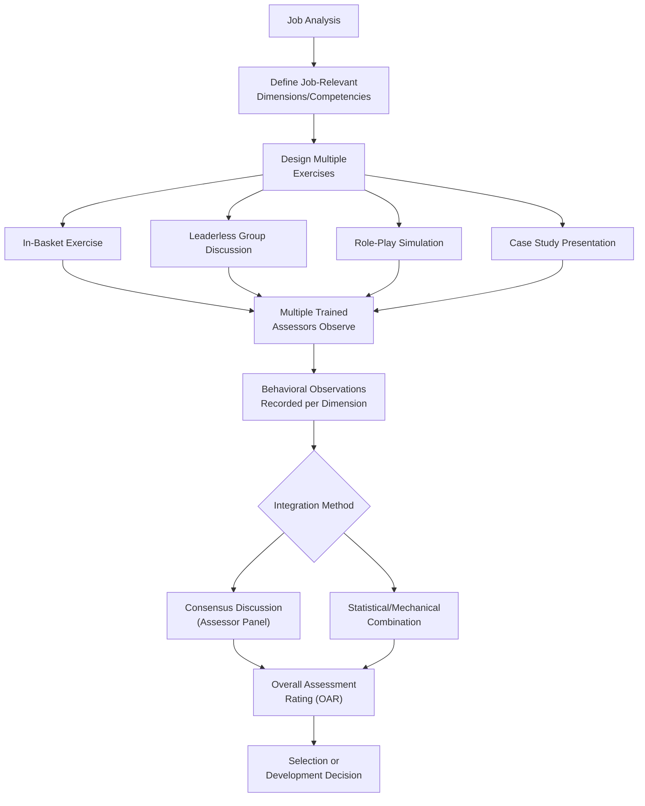

## Selection Interviews, Tests, and Assessment Centers

### Overview

Selection methods are the formal procedures organizations use to differentiate among applicants and predict future job performance. Three of the most widely used and researched categories are employment interviews, psychometric tests, and assessment centers. Each method category varies in predictive validity, cost, applicant reactions, adverse impact potential, and practical feasibility, and organizations typically combine multiple methods into a multi-hurdle or compensatory selection system.

### Foundational Concepts: Reliability and Validity

**Key Points**

- **Reliability** refers to the consistency of a measurement (test-retest, inter-rater, internal consistency); a selection tool cannot be valid if it is not reliable, though reliability alone does not guarantee validity.
- **Validity** in selection context most often refers to **criterion-related validity** (correlation between a predictor score and a job performance criterion, typically job performance ratings), commonly expressed as a validity coefficient ($r$).
- **Construct validity** and **content validity** are also relevant, particularly for job knowledge tests (content validity) and personality/cognitive measures (construct validity).
- Meta-analytic validity estimates (notably Schmidt & Hunter's cumulative body of work) are the standard evidentiary basis for comparing selection method effectiveness across the field.

### Employment Interviews

The interview remains the most universally used selection method, but its predictive validity depends heavily on its degree of structure.

#### Structured vs. Unstructured Interviews

| Dimension | Unstructured Interview | Structured Interview |
| --- | --- | --- |
| Question consistency | Varies by candidate | Standardized question set across candidates |
| Scoring | Global, holistic judgment | Behaviorally anchored rating scales (BARS) per question |
| Meta-analytic validity | Lower (historically around $r \approx .20$ range in older syntheses) | Substantially higher (historically approaching $r \approx .50$ range in some meta-analyses) |
| Legal defensibility | Weaker (higher subjectivity, higher adverse impact risk) | Stronger (documented, consistent criteria) |
| Rater training requirement | Minimal | Requires trained interviewers using anchored scales |

**Key Points**

- [Unverified] Reported validity coefficients for structured versus unstructured interviews vary meaningfully across meta-analyses depending on the specific studies included, the criterion measures used, and corrections applied (e.g., for range restriction and criterion unreliability); the general and well-replicated finding that structuring improves validity is robust, but exact numeric values should be treated as estimates rather than fixed constants.
- Structuring an interview involves multiple independent levers: standardizing questions, standardizing scoring/anchors, using multiple trained interviewers, and basing questions directly on a job analysis — each contributes incrementally to validity gains.

#### Interview Question Types

1. **Situational Interview Questions (SIQs)** — hypothetical, forward-looking questions ("What would you do if...") based on Latham's Goal-Setting Theory-derived methodology, asking candidates how they *would* respond to a job-relevant scenario.
2. **Behavioral/Patterned Behavior Description Interview (PBDI) Questions** — retrospective questions ("Tell me about a time when...") based on the principle that past behavior predicts future behavior.
3. **Job Knowledge Questions** — direct assessment of technical or procedural knowledge required for the role.

**Example**

A situational question: "If a customer became visibly upset because their order was delayed, what would you do?" A behavioral counterpart: "Tell me about a time you had to handle an upset customer. What did you do, and what was the outcome?" Both can be part of a structured interview, scored against pre-defined behavioral anchors.

#### Common Interview Rater Biases

- **Halo Effect** — allowing a single positive (or negative) impression to disproportionately influence overall evaluation.
- **First Impression / Primacy Bias** — over-weighting information gathered early in the interview.
- **Similar-to-Me Bias** — favoring candidates who share the interviewer's background, attitudes, or demographic characteristics.
- **Contrast Effect** — evaluating a candidate relative to the immediately preceding candidate rather than against an absolute standard.
- **Confirmation Bias** — seeking or interpreting information in a way that confirms an initial impression formed from the resume or early interaction.

### Psychometric Tests

| Test Category | Description | Typical Validity Profile |
| --- | --- | --- |
| Cognitive Ability Tests (General Mental Ability, GMA) | Measures reasoning, verbal, numerical, and/or spatial ability | Consistently among the strongest single predictors of job performance across job types in meta-analytic research, though this remains an area of ongoing debate regarding adverse impact trade-offs |
| Personality Inventories (Big Five-based) | Measures Conscientiousness, Emotional Stability, Extraversion, Agreeableness, Openness | Conscientiousness shows the most consistent, generalizable positive validity across job types; other traits show more job-specific validity patterns |
| Integrity/Honesty Tests | Overt and personality-based measures predicting counterproductive work behavior, theft | Used particularly in retail/service contexts; validity evidence generally supportive for predicting counterproductive work behaviors |
| Situational Judgment Tests (SJTs) | Present job-relevant scenarios with multiple response options, scored against expert/empirical keys | Moderate validity; often used as a lower-adverse-impact alternative or supplement to cognitive tests |
| Work Sample Tests | Direct simulation of actual job tasks | Among the higher-validity methods; particularly strong face validity and applicant acceptance |
| Physical Ability Tests | Measures strength, endurance, or specific physical capacities | Used for physically demanding jobs; must be closely job-analysis-linked to withstand legal scrutiny |

**Key Points**

- The combination of a cognitive ability test with a structured interview or an integrity test is frequently cited in the selection literature as producing higher incremental validity than cognitive ability alone, since these combinations capture non-overlapping variance in performance prediction.
- [Unverified] Exact incremental validity figures for specific test combinations vary across studies and job contexts; practitioners should consult current, job-specific validation evidence rather than assuming fixed universal figures.

### Assessment Centers

An **assessment center** is not a single test but a standardized selection/evaluation methodology in which multiple candidates are evaluated by multiple trained assessors using multiple exercises (simulations) designed to elicit behaviors relevant to job dimensions (competencies).

#### Defining Characteristics

- **Multiple Assessors** — typically several trained raters, often including a mix of psychologists and line managers.
- **Multiple Exercises** — commonly includes some combination of in-basket exercises, leaderless group discussions, role-plays, case study presentations, and one-on-one simulations.
- **Multiple Dimensions** — candidates are evaluated against a predefined set of job-relevant competencies/dimensions (e.g., decision-making, communication, leadership) derived from job analysis.
- **Behavioral Observation and Integration** — assessors independently record behavioral observations, which are then integrated (via consensus discussion or statistical/mechanical combination) into final ratings.

#### Common Assessment Center Exercises

| Exercise | Description |
| --- | --- |
| In-Basket Exercise | Candidate processes a simulated inbox of memos, emails, and decisions under time pressure |
| Leaderless Group Discussion (LGD) | Small group of candidates discusses/solves a problem with no assigned leader, observed for emergent leadership and collaboration behaviors |
| Role-Play Simulation | Candidate interacts with a trained role-player in a job-relevant scenario (e.g., a difficult employee conversation) |
| Case Study Analysis and Presentation | Candidate analyzes a business case and presents recommendations |
| Oral Presentation | Candidate delivers a structured presentation, assessed for communication and content quality |

### Diagram: Assessment Center Process Flow

### Assessment Centers: Validity Considerations

**Key Points**

- Assessment centers have shown generally favorable criterion-related validity in meta-analytic research, particularly for predicting managerial/leadership performance and potential.
- A long-standing methodological debate in the assessment center literature concerns the **construct validity puzzle**: ratings often correlate more strongly across dimensions *within* the same exercise than across the same dimension *across* different exercises, raising questions about whether assessment centers measure the intended cross-situational dimensions or are more heavily influenced by exercise-specific performance.
- [Unverified] The degree to which the construct validity puzzle undermines the practical (criterion-related) validity of assessment centers remains debated; predictive validity for performance outcomes has generally held up better than the internal construct-validity evidence would suggest, and explanations for this divergence are not fully settled in the literature.

### Comparative Summary Table

| Method | Typical Cost | Typical Validity | Applicant Reactions | Adverse Impact Risk |
| --- | --- | --- | --- | --- |
| Unstructured Interview | Low | Lower | Generally favorable | Higher (subjectivity-driven) |
| Structured Interview | Moderate | Higher | Generally favorable | Lower than unstructured |
| Cognitive Ability Test | Low-Moderate | High (general predictor) | Mixed; sometimes perceived as impersonal | Higher (notable subgroup differences reported in the literature) |
| Personality Inventory | Low-Moderate | Moderate (trait- and job-dependent) | Generally favorable | Generally lower |
| Work Sample Test | Moderate-High | High | Highly favorable (high face validity) | Generally lower |
| Assessment Center | High | Moderate-High | Generally favorable | Varies by exercise design |

### Combining Methods: Multi-Hurdle vs. Compensatory Models

- **Multi-Hurdle (Sequential) Model** — candidates must pass a minimum threshold at each successive stage to proceed (e.g., pass a cognitive test cutoff before being invited to interview).
- **Compensatory Model** — scores across multiple predictors are combined (often via weighted formula) into a composite, allowing strength on one predictor to offset weakness on another.

**Key Points**

- The choice between multi-hurdle and compensatory approaches involves trade-offs: multi-hurdle models are administratively efficient (reducing assessment costs for clearly unqualified candidates early) but can reject candidates who would have been high performers overall due to a single weak stage; compensatory models better reflect the reality that performance is typically multiply determined but require all assessments to be completed for every candidate.

### Legal and Adverse Impact Considerations

- **Adverse Impact** — a selection procedure that, though neutral on its face, has a disproportionately negative effect on a protected group (commonly assessed via the "four-fifths rule" in U.S. practice, though this is a rule of thumb rather than a strict legal standard).
- **Job-Relatedness and Business Necessity** — in jurisdictions following disparate impact frameworks (e.g., U.S. Title VII case law and the Uniform Guidelines on Employee Selection Procedures), a selection procedure with adverse impact must generally be justified by demonstrated job-relatedness and validity evidence.
- [Unverified] Specific legal standards, thresholds, and required validation procedures vary substantially by jurisdiction and are subject to change through legislation and case law; practitioners should consult current legal guidance and qualified employment law counsel rather than relying on general summaries for compliance decisions.

### Criticisms and Limitations

- **Cognitive ability tests and adverse impact trade-off**: While cognitive ability tests show strong criterion validity, they are also among the selection methods most associated with subgroup mean differences in the literature, creating a persistent practical and ethical tension between maximizing predictive validity and minimizing adverse impact — a topic with substantial ongoing debate in the field.
- **Interview structure adoption gap**: [Inference] Despite strong and long-standing evidence favoring structured interviews, many organizations continue to rely on unstructured or loosely structured interview formats in practice, likely due to organizational inertia, interviewer preference for perceived interpersonal judgment, and resource constraints on interviewer training, though the precise prevalence varies by organization and is not something this reference can quantify without current survey data.
- **Assessment center resource intensity**: High cost and administrative complexity of assessment centers can limit their use to higher-stakes selection decisions (e.g., managerial promotion, executive hiring) rather than high-volume entry-level hiring.
- **Construct validity puzzle (assessment centers)**: As noted above, this remains an unresolved methodological question that complicates confident claims about precisely what assessment centers measure, even where predictive validity is empirically supported.
- **Applicant faking on personality tests**: [Unverified] The extent to which social desirability/impression management distorts personality test scores in actual selection contexts (versus low-stakes research contexts) and the degree to which this distortion meaningfully harms predictive validity remain actively debated topics in the personality assessment literature.

### Related Topics / Next Steps

- **Job Analysis Methods** — the necessary foundation for both structured interview question design and assessment center dimension development
- **Person-Job Fit** — the underlying construct these selection methods are designed to assess
- **Realistic Job Previews** — complementary recruitment-stage intervention preceding formal selection
- **Utility Analysis in Selection** — economic evaluation of selection method cost-effectiveness
- **Adverse Impact and Fairness in Selection** — deeper legal/psychometric treatment of subgroup difference issues
- **Situational Judgment Tests (SJTs)** — extended treatment of this specific test format
- **Meta-Analytic Validity Generalization (Schmidt & Hunter)** — the methodological foundation for cross-study validity synthesis
- **Applicant Reactions to Selection Procedures** — procedural and distributive justice perceptions of selection methods