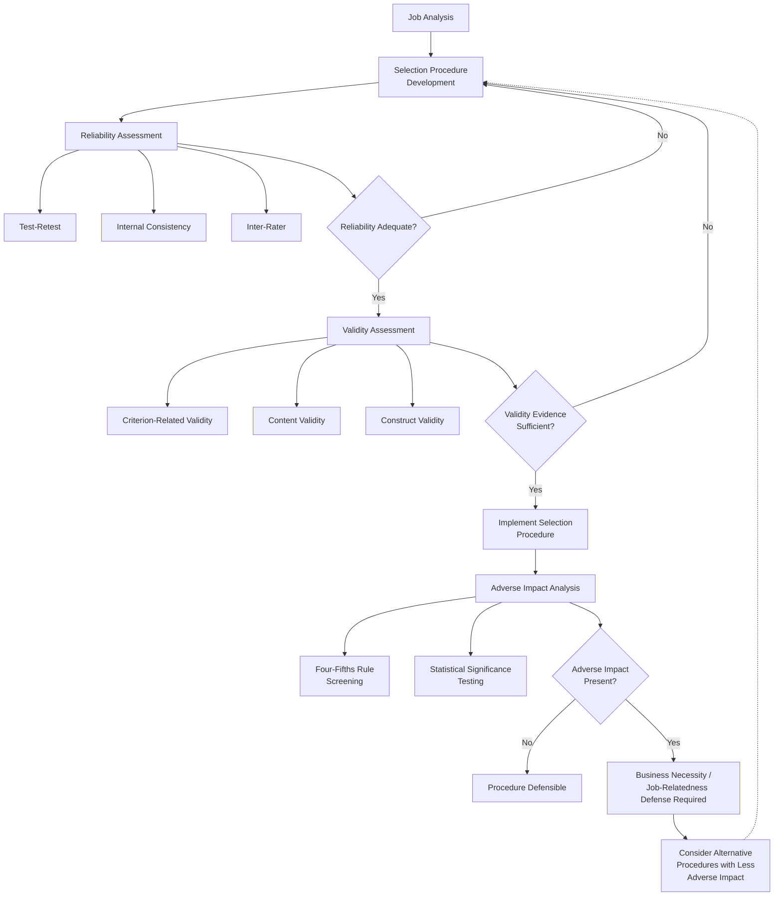

## Validity, Reliability, and Adverse Impact

### Overview

Validity, reliability, and adverse impact form the core psychometric and legal foundation for evaluating the quality and defensibility of personnel selection procedures. Validity concerns whether a measure assesses what it claims to assess and predicts job-relevant outcomes; reliability concerns the consistency of measurement; adverse impact concerns whether a facially neutral procedure produces disproportionate negative outcomes for protected subgroups. Together, they determine both the scientific soundness and the legal defensibility of a selection system.

### Reliability

Reliability refers to the consistency, stability, and precision of a measurement instrument across repeated applications, raters, or items.

#### Types of Reliability

| Type | Definition | Common Estimation Method |
| --- | --- | --- |
| Test-Retest Reliability | Consistency of scores when the same test is administered to the same individuals at two points in time | Correlation between Time 1 and Time 2 scores |
| Internal Consistency Reliability | Degree to which items within a test measure the same underlying construct | Cronbach's alpha, split-half reliability |
| Inter-Rater Reliability | Degree of agreement between two or more raters/assessors evaluating the same performance or response | Correlation coefficients, Intraclass Correlation Coefficient (ICC), Kappa |
| Parallel/Alternate Forms Reliability | Consistency of scores across two equivalent versions of a test | Correlation between forms administered to the same sample |

**Key Points**

- Reliability is a necessary but not sufficient condition for validity: an unreliable measure cannot be valid, but a highly reliable measure is not automatically valid (e.g., a perfectly reliable measure of shoe size would not validly predict job performance).
- Reliability directly constrains the theoretical upper bound of an observed validity coefficient through the mathematics of attenuation (see Correction for Attenuation below).

#### Correction for Attenuation

Because measurement unreliability in either the predictor or the criterion suppresses the observed correlation between them, researchers often apply a correction for attenuation to estimate the "true" relationship:

$$r_{corrected} = \frac{r_{xy}}{\sqrt{r_{xx} \cdot r_{yy}}}$$

Where $r_{xy}$ is the observed correlation between predictor and criterion, $r_{xx}$ is the reliability of the predictor, and $r_{yy}$ is the reliability of the criterion.

**Key Points**

- This correction is standard practice in meta-analytic validity generalization research (e.g., Schmidt & Hunter's psychometric meta-analysis methodology) but is debated when applied to single-study validation efforts, since it can produce corrected estimates that exceed what would be practically achievable given real-world measurement conditions.

### Validity

Validity is the degree to which accumulated evidence and theory support the specific interpretation of test scores for a proposed use (following the modern unitary view of validity codified in professional standards such as the *Standards for Educational and Psychological Testing*).

#### Major Forms of Validity Evidence

1. **Criterion-Related Validity** — the degree to which a predictor correlates with a relevant criterion (typically job performance).
   - **Concurrent Validity** — predictor and criterion data collected at approximately the same time (e.g., testing current employees and correlating scores with their existing performance ratings).
   - **Predictive Validity** — predictor data collected at selection, criterion data collected later after a period of job tenure (the design most directly relevant to actual selection use, though more resource-intensive to conduct).
2. **Content Validity** — the degree to which test content represents the full domain of knowledge, skills, or behaviors required by the job, typically established through expert judgment linked to job analysis (most applicable to job knowledge and work sample tests).
3. **Construct Validity** — the degree to which a test measures the theoretical construct it claims to measure, established through a pattern of convergent evidence (correlating with related constructs) and discriminant evidence (not correlating with unrelated constructs).

**Key Points**

- Modern psychometric theory treats these not as three separate "types" of validity but as three sources of evidence supporting a single, unified concept of validity for a specific intended use — a test is not "valid" or "invalid" in the abstract, only valid or invalid *for a particular purpose and population*.

#### Validity Generalization

**Validity Generalization (VG)** is the meta-analytic finding, most associated with Schmidt and Hunter's research program, that validity coefficients for certain predictors (most notably cognitive ability tests) generalize across jobs, organizations, and settings more than earlier "situational specificity" assumptions suggested.

**Key Points**

- Before VG research, it was commonly assumed that validity coefficients were highly situation-specific and required local validation studies for every new context; VG meta-analyses demonstrated that much of the observed variability across studies could be attributed to statistical artifacts (sampling error, range restriction, unreliability) rather than genuine situational differences.
- [Unverified] The degree to which VG fully eliminates the need for local validation studies remains debated among practitioners and researchers, particularly regarding legal defensibility requirements in specific jurisdictions, which may still expect local validation evidence regardless of meta-analytic generalization support.

### Diagram: Relationship Between Reliability, Validity, and Adverse Impact

### Adverse Impact

**Adverse impact** (also called disparate impact) occurs when a facially neutral selection procedure results in a substantially different selection rate for a protected subgroup compared to the majority or reference group, even without discriminatory intent.

#### The Four-Fifths (80%) Rule

A commonly used rule of thumb, originating from the U.S. Uniform Guidelines on Employee Selection Procedures (1978), for flagging potential adverse impact:

$$\text{Impact Ratio} = \frac{\text{Selection Rate}_{\text{minority group}}}{\text{Selection Rate}_{\text{majority group}}}$$

An impact ratio below $0.80$ (80%) is generally treated as an indicator warranting further scrutiny.

**Example**

If 60% of majority-group applicants pass a selection test but only 40% of a minority group pass, the impact ratio is $40/60 = 0.67$, which falls below the four-fifths threshold and would typically trigger closer examination of the procedure's job-relatedness and available alternatives.

**Key Points**

- [Unverified] The four-fifths rule is explicitly described even in its originating guidelines as a rule of thumb rather than a definitive legal standard; courts and regulatory bodies may also apply statistical significance testing (e.g., comparing selection rate differences using z-tests or chi-square tests) rather than relying solely on the ratio, and legal standards vary by jurisdiction and have evolved through case law since 1978.
- Adverse impact analysis is distinct from disparate treatment: adverse impact does not require proof of discriminatory intent, whereas disparate treatment claims allege intentional discrimination.

#### Legal Framework Context (U.S.)

- **Title VII of the Civil Rights Act (1964)** — foundational U.S. federal statute prohibiting employment discrimination based on race, color, religion, sex, and national origin.
- **Griggs v. Duke Power Co. (1971)** — landmark U.S. Supreme Court case establishing that facially neutral employment practices producing discriminatory effects require job-relatedness justification, regardless of intent.
- **Uniform Guidelines on Employee Selection Procedures (1978)** — joint federal agency guidelines establishing technical standards for validation and adverse impact assessment, including the four-fifths rule.
- [Unverified] Legal standards and their interpretation continue to evolve through subsequent case law and regulatory guidance; this overview reflects foundational, long-standing legal concepts rather than a current, jurisdiction-specific compliance assessment, and organizations should consult qualified employment law counsel for current requirements in their specific jurisdiction.

### The Validity-Adverse Impact Trade-off

**Key Points**

- A well-documented tension in the selection literature exists between predictors with strong criterion-related validity (particularly cognitive ability tests) and their tendency to produce greater subgroup mean score differences, creating adverse impact risk.
- Strategies proposed in the literature to manage this trade-off include: using test batteries that combine cognitive ability with lower-adverse-impact predictors (e.g., structured interviews, personality measures, situational judgment tests) to build a composite with reduced overall adverse impact while retaining reasonable validity; using predictors with inherently smaller subgroup differences where validity is comparable; and applying banding or other score-use strategies (though these approaches carry their own legal and methodological debates).
- [Unverified] The optimal balance between maximizing validity and minimizing adverse impact remains an actively debated and evolving area in both the scientific literature and legal practice; specific recommended strategies should be evaluated against current research and legal guidance rather than treated as settled best practice.

### Validation Study Designs

| Design | Description | Strengths | Limitations |
| --- | --- | --- | --- |
| Predictive (Follow-Up) Design | Test administered to applicants; criterion data collected after hire and tenure | Most closely mirrors actual selection use; avoids range restriction from prior selection | Time-intensive; requires hiring without full reliance on the predictor during validation |
| Concurrent Design | Test and criterion data collected simultaneously from current incumbents | Faster, less costly | Range restriction (incumbents already passed prior selection); potential motivational differences between incumbents and applicants |
| Content Validation Design | Expert judgment linking test content directly to job analysis-derived task/KSA requirements | Useful when criterion data is unavailable or sample sizes are too small for criterion-related studies | Does not directly demonstrate predictor-criterion relationship; more applicable to certain test types (e.g., work samples, job knowledge tests) |
| Validity Generalization / Transportability | Applying meta-analytically established validity evidence from prior research to a new but similar context | Avoids need for costly local study; supported by VG research | Requires demonstrating sufficient job similarity to the meta-analytic database used |

### Range Restriction

**Key Points**

- **Range restriction** occurs when the variability of scores in a validation sample is artificially reduced (most commonly because only individuals who already passed prior selection hurdles are included), which mathematically attenuates the observed correlation between predictor and criterion.
- Statistical corrections for range restriction (direct and indirect range restriction formulas) are commonly applied in meta-analytic and validation research to estimate what the correlation would be in an unrestricted (applicant) population.
- Concurrent validation designs are particularly susceptible to range restriction since incumbent samples have already been filtered by prior hiring decisions.

### Practical Application: Building a Legally Defensible Selection System

1. Conduct thorough **job analysis** to identify job-relevant KSAOs and performance criteria.
2. Select or develop predictors with documented validity evidence (criterion-related, content, or construct, and/or supported by validity generalization) linked to those KSAOs.
3. Assess and document **reliability** of both predictor measures and criterion measures.
4. Pilot and monitor **adverse impact** using selection rate data across protected subgroups (four-fifths rule as an initial screen, supplemented by statistical significance testing).
5. If adverse impact is identified, evaluate **equally valid alternative procedures** with less adverse impact, consistent with the principle that organizations should use the least discriminatory valid alternative reasonably available.
6. Maintain thorough documentation of the validation process, given that documentation is typically central to legal defensibility if a selection procedure is challenged.

### Criticisms and Limitations

- **Four-fifths rule statistical limitations**: [Unverified] The four-fifths rule is sensitive to small sample sizes, where a small number of individual hiring decisions can produce large swings in the impact ratio; statisticians and legal scholars have long noted this as a limitation of relying on the ratio alone without complementary significance testing, though how courts weigh this varies by case.
- **Debate over cognitive ability test use**: The field continues to actively debate the appropriate role of cognitive ability testing given its strong validity evidence alongside its adverse impact profile; this is not a fully resolved question and reasonable experts and practitioners differ in their recommended approaches.
- **Validity generalization vs. local validation requirements**: [Inference] Even where meta-analytic validity generalization evidence is strong, some organizations and jurisdictions may still expect or require local validation evidence for legal defensibility, creating a gap between what research methodology supports and what compliance practice sometimes demands; this varies by jurisdiction and should not be assumed uniform.
- **Evolving legal landscape**: [Unverified] Employment discrimination law, including standards for adverse impact analysis, is subject to ongoing legislative change and case law development; any specific legal claims in this reference reflect established historical/foundational concepts and should be verified against current law before being relied upon for compliance purposes.
- **Construct-criterion mismatch risk**: A selection procedure can show strong internal reliability and even construct validity evidence while still lacking adequate criterion-related validity for a specific job if the underlying construct is not actually predictive of performance in that context — underscoring why validity must be evaluated for a specific intended use rather than assumed to transfer automatically.

### Related Topics / Next Steps

- **Selection Interviews, Tests, and Assessment Centers** — the methods to which these validity/reliability/adverse impact principles are applied
- **Job Analysis Methods** — the foundational process linking selection procedures to job requirements
- **Utility Analysis in Selection** — economic modeling of selection procedure value, building on validity coefficients
- **Meta-Analytic Validity Generalization (Schmidt & Hunter)** — deeper methodological treatment of VG research
- **Employment Discrimination Law (Title VII, Disparate Impact/Treatment)** — legal framework underlying adverse impact analysis
- **Fairness and Bias in Psychological Testing** — broader psychometric fairness frameworks beyond adverse impact ratios
- **Range Restriction and Statistical Corrections in Meta-Analysis** — technical treatment of correction methodologies
- **Person-Job Fit** — conceptual outcome that valid, reliable selection procedures are designed to identify