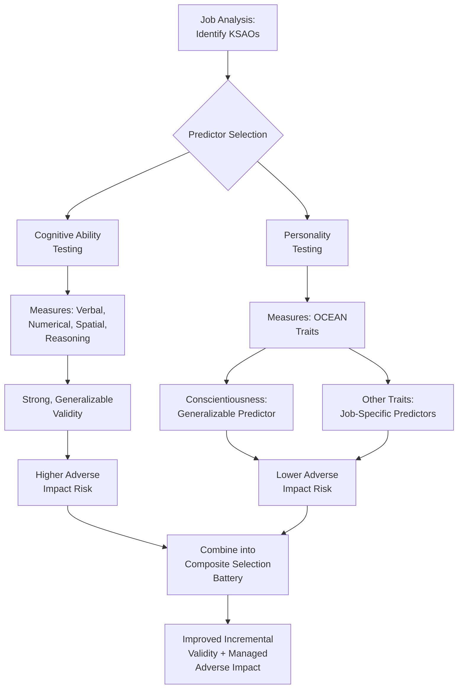

## Cognitive Ability and Personality Testing in Selection

### Overview

Cognitive ability tests and personality inventories represent two of the most extensively researched categories of psychometric predictors used in personnel selection. They differ fundamentally in what they measure (maximal performance capacity versus typical behavioral tendencies), in their validity profiles, and in their practical trade-offs regarding adverse impact and applicant reactions. Understanding both is central to designing an evidence-based, legally defensible selection system.

### Cognitive Ability Testing

#### Definition and Structure

**Cognitive ability** (also referred to as General Mental Ability, GMA, or general intelligence, $g$) refers to an individual's capacity for reasoning, problem-solving, learning, and information processing. Most cognitive ability tests used in selection are grounded, explicitly or implicitly, in hierarchical models of intelligence (e.g., the Cattell-Horn-Carroll model), which posit a general factor ($g$) alongside more specific ability factors (verbal, numerical, spatial, reasoning).

| Ability Domain | Description | Example Task Type |
| --- | --- | --- |
| Verbal Ability | Comprehension, vocabulary, verbal reasoning | Reading comprehension, analogies |
| Numerical Ability | Quantitative reasoning, arithmetic, data interpretation | Numerical series, word problems |
| Spatial/Mechanical Ability | Spatial visualization, mechanical reasoning | Rotated figures, mechanical comprehension |
| Abstract/Inductive Reasoning | Pattern recognition, logical inference | Matrix reasoning, sequence completion |

#### Validity Evidence

**Key Points**

- Cognitive ability is consistently identified in meta-analytic research (most notably the cumulative work associated with Schmidt and Hunter) as among the strongest single predictors of job performance across a broad range of job types and complexity levels.
- Validity tends to increase with job complexity: cognitive ability shows stronger predictive relationships for jobs with higher information-processing demands (e.g., professional, managerial, technical roles) compared to simpler, more routinized jobs, though it remains a positive predictor across complexity levels in most syntheses.
- [Unverified] Specific numeric validity coefficients reported for cognitive ability tests vary across meta-analyses depending on corrections applied (for range restriction, criterion unreliability) and the criterion measures used; general magnitude comparisons (cognitive ability as a strong predictor relative to many alternatives) are well-supported, but exact figures should be sourced from current primary meta-analytic literature rather than treated as fixed constants.
- Cognitive ability also shows a well-documented positive relationship with training performance/trainability, in addition to job performance.

#### Adverse Impact Considerations

**Key Points**

- Cognitive ability tests are among the selection methods most consistently associated with subgroup mean score differences in the empirical literature, making adverse impact a central practical and ethical consideration in their use.
- This creates the core tension addressed in the broader selection literature (see Validity, Reliability, and Adverse Impact): cognitive ability offers strong predictive validity but carries meaningfully higher adverse impact risk relative to several alternative or supplementary predictors.
- Common mitigation strategies discussed in the literature include combining cognitive ability tests with lower-adverse-impact predictors (structured interviews, personality measures, situational judgment tests) in a composite, though the effectiveness and legal treatment of such strategies is a debated and evolving area.

### Personality Testing

#### The Five-Factor Model (Big Five)

The dominant taxonomy for personality assessment in selection contexts is the **Five-Factor Model (FFM)**, commonly remembered via the acronym **OCEAN**:

1. **Openness to Experience** — intellectual curiosity, creativity, preference for novelty and variety.
2. **Conscientiousness** — dependability, organization, achievement-orientation, self-discipline.
3. **Extraversion** — sociability, assertiveness, energy, positive affect.
4. **Agreeableness** — cooperativeness, trust, empathy, interpersonal warmth.
5. **Neuroticism / Emotional Stability** — tendency toward negative affect, anxiety, and emotional volatility (often reverse-scored as "Emotional Stability" in selection contexts).

#### Validity Evidence by Trait

| Trait | General Validity Pattern for Job Performance |
| --- | --- |
| Conscientiousness | Most consistent, generalizable positive predictor across virtually all job types |
| Emotional Stability | Generally positive but more modest and situationally variable predictor |
| Extraversion | Job-specific predictor; stronger for roles involving social interaction (sales, management) |
| Agreeableness | Job-specific predictor; more relevant for teamwork- and customer-service-oriented roles |
| Openness | Job-specific predictor; more relevant for roles requiring adaptability, creativity, or training performance |

**Key Points**

- Conscientiousness stands out in the personality literature as the single trait with the most consistent cross-situational validity for predicting job performance, echoing its conceptual overlap with achievement striving and dependability.
- The other four traits function more as job-specific (situational) predictors, meaning their validity depends substantially on matching the trait to the specific demands of the target role, rather than acting as universal predictors like conscientiousness or cognitive ability.

#### Personality Assessment Formats

| Format | Description |
| --- | --- |
| Self-Report Inventories | Likert-scale items describing behaviors/preferences (e.g., NEO-PI-R, 16PF, HEXACO-based measures) |
| Forced-Choice Formats | Requires ranking or choosing among equally desirable-sounding statements, designed to reduce faking/social desirability distortion |
| Other-Report/360 Assessments | Ratings of the candidate's personality by others (supervisors, peers) rather than self-report |
| Personality-Based Integrity Tests | Personality items designed to predict counterproductive work behaviors (theft, absenteeism, rule violations) |

### Diagram: Cognitive Ability vs. Personality in the Selection Process

### Incremental Validity of Combining Cognitive Ability and Personality

**Key Points**

- Because cognitive ability and personality traits (particularly conscientiousness) represent largely independent (low-correlation) constructs, combining them in a selection battery tends to produce meaningful incremental validity over either predictor alone — each captures non-overlapping variance in job performance.
- This combination is frequently cited in the selection literature as a practically favorable strategy, since it can improve overall predictive accuracy while also moderating the adverse impact profile of the composite relative to using cognitive ability alone.
- [Unverified] The precise magnitude of incremental validity gained from combining these predictors varies across studies and job contexts; practitioners should consult job-specific or current meta-analytic evidence for quantitative estimates rather than assuming a fixed universal increment.

### The Faking/Social Desirability Problem in Personality Testing

**Key Points**

- A long-standing concern in personality assessment is that applicants, motivated to be selected, may respond in a socially desirable direction that does not reflect their typical (non-evaluative) behavior — a concern less applicable to cognitive ability tests, which measure maximal performance rather than self-reported typical behavior.
- [Unverified] The research literature is genuinely divided on both the extent to which faking occurs in real (high-stakes) selection settings versus low-stakes research settings, and the degree to which observed faking meaningfully degrades predictive validity; some studies find validity is relatively robust despite mean-score inflation from faking, while others find more substantial validity degradation, and this remains an actively debated area rather than a settled conclusion.
- Forced-choice response formats and certain scoring approaches (e.g., ipsative scoring) have been proposed as methods to reduce faking susceptibility, though these formats introduce their own psychometric complications (e.g., ipsative scores are not directly comparable across individuals in the same way as normative scores).

### Applicant Reactions

| Predictor Type | Typical Applicant Reaction Pattern |
| --- | --- |
| Cognitive Ability Tests | Mixed; sometimes perceived as impersonal or anxiety-inducing, though generally accepted as job-relevant for cognitively demanding roles |
| Personality Inventories | Generally favorable, though some applicants may perceive certain items as intrusive or irrelevant depending on content and framing |
| Work Sample/Job Simulations (for comparison) | Typically the most favorably received due to high face validity |

**Key Points**

- Applicant reactions research (e.g., drawing on organizational justice theory applied to selection contexts) generally finds that perceived job-relatedness of a test's content is a key driver of positive applicant reactions, regardless of predictor type — cognitive and personality tests that appear more directly tied to observable job tasks tend to be better received.

### Practical Example: Building a Composite Selection Battery

**Example**

An organization hiring for a customer service management role might combine: a cognitive ability test (to assess general reasoning and problem-solving capacity relevant to complex escalations), a conscientiousness-focused personality measure (to assess reliability and organization), and an extraversion/agreeableness-relevant personality measure (given the role's interpersonal demands) — then integrate scores into a compensatory composite, weighted according to job analysis-derived importance ratings, rather than relying on any single predictor alone.

### Comparative Summary

| Dimension | Cognitive Ability Tests | Personality Tests |
| --- | --- | --- |
| What is measured | Maximal cognitive performance capacity | Typical behavioral tendencies/traits |
| Generalizability of validity | High across job types, especially complex jobs | High for conscientiousness; job-specific for other traits |
| Adverse impact risk | Comparatively higher | Comparatively lower |
| Susceptibility to applicant distortion | Low (maximal performance measure) | Higher (self-report of typical behavior) |
| Best practical use | Core predictor, especially for complex/cognitively demanding roles | Complementary predictor, particularly valuable in composite batteries |

### Criticisms and Limitations

- **Adverse impact vs. validity tension (cognitive ability)**: As detailed above, this remains one of the most consequential and actively debated trade-offs in personnel selection, with reasonable disagreement among researchers and practitioners about the appropriate weighting of cognitive ability in selection systems given both scientific and legal/ethical considerations.
- **Faking debate (personality)**: The unresolved nature of the faking literature (noted above) means organizations adopting personality testing should be aware that both the extent of the problem and the effectiveness of proposed countermeasures remain genuinely contested in current research, not settled facts.
- **Job-specificity requirement for non-conscientiousness traits**: Because most Big Five traits beyond conscientiousness show job-specific rather than universally generalizable validity, personality test selection and validation should be tailored to the specific role via job analysis rather than applying a generic personality battery across all positions.
- **Construct-narrowness concerns**: [Inference] Because the Big Five model, while dominant, is not the only personality taxonomy in use (e.g., HEXACO models add an Honesty-Humility factor), organizations relying exclusively on FFM-based instruments may not capture all personality-related variance relevant to certain outcomes (e.g., counterproductive work behavior), though the comparative practical impact of using alternative taxonomies requires context-specific evaluation rather than a general claim of superiority.
- **Range restriction in ongoing validation**: As with other selection predictors, concurrent validation designs using incumbents for either cognitive ability or personality measures are subject to range restriction effects that can understate true predictor-criterion relationships (see Validity, Reliability, and Adverse Impact).

### Related Topics / Next Steps

- **Validity, Reliability, and Adverse Impact** — the psychometric and legal framework these predictors are evaluated within
- **Selection Interviews, Tests, and Assessment Centers** — broader selection method context, including how these tests combine with interviews
- **Situational Judgment Tests** — a related predictor format often used alongside or as an alternative to cognitive/personality tests
- **Integrity and Honesty Testing** — personality-based predictor category specifically targeting counterproductive work behavior
- **Meta-Analytic Validity Generalization (Schmidt & Hunter)** — methodological foundation for cross-study validity claims discussed here
- **Person-Job Fit** — the conceptual outcome these predictors aim to assess
- **Applicant Reactions and Organizational Justice in Selection** — deeper treatment of candidate perception research
- **Counterproductive Work Behavior (CWB)** — key outcome variable linked to certain personality and integrity predictors