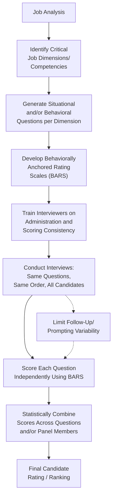

## Structured Interviewing Techniques

### Overview

Structured interviewing refers to a family of interview design and administration practices that standardize the questions asked, the criteria used to evaluate responses, and the conduct of the interview process itself, in order to maximize reliability, validity, and legal defensibility relative to unstructured interviewing. Structured interviewing is not a single technique but a continuum of practices that can be applied to varying degrees, with higher degrees of structure consistently associated with stronger predictive validity in the selection literature.

### The Structure Continuum

Campion, Palmer, and Campion (1997) proposed a widely referenced framework organizing structure into two broad categories, each composed of multiple independent components:

#### Content Structure (What is Asked)

1. **Basing questions on a systematic job analysis** — ensuring interview content directly reflects job-relevant tasks, competencies, or KSAOs.
2. **Asking the same questions of every candidate** — standardizing question content across the applicant pool.
3. **Limiting prompting, follow-up questioning, and elaboration** — reducing interviewer discretion to probe differently across candidates.
4. **Using better types of questions** — favoring situational or behavioral question formats over generic or hypothetical-trait questions.
5. **Using a longer interview / larger number of questions** — increasing the reliability of the sampled behavior domain.
6. **Controlling ancillary information** (e.g., limiting interviewer access to test scores, resumes, or GPA before the interview) — reducing halo and contamination effects from other candidate information.
7. **Not allowing follow-up questions from candidates to influence scoring** — maintaining consistency of the evaluation process.

#### Evaluation Structure (How Responses are Scored)

1. **Rating each answer/question individually** rather than forming a single global impression at the end.
2. **Using anchored rating scales** (Behaviorally Anchored Rating Scales, BARS) with descriptive benchmarks at each scale point.
3. **Taking detailed notes** during the interview to support accurate, evidence-based scoring.
4. **Using multiple interviewers** (panel interviews) to reduce the influence of any single rater's idiosyncratic bias.
5. **Using the same interviewer(s) across all candidates** for a given position, to maintain consistency of interpretation.
6. **Providing statistical rather than clinical (holistic) combination of scores** — mechanically summing or weighting scores rather than relying on a final subjective judgment call.
7. **Using standardized interviewer training** on how to ask questions, avoid bias, and apply rating scales consistently.

**Key Points**

- These components are not all-or-nothing; interviews can be structured to varying degrees along both dimensions, and meta-analytic evidence generally shows validity increases incrementally as more structure components are added, rather than requiring a single "fully structured" threshold to see benefit.
- [Unverified] The relative contribution of each individual structure component to overall validity gains is not uniformly established in the literature; some components (e.g., standardized questions, anchored scoring) are more consistently emphasized as high-impact than others, but precise incremental effect sizes per component vary across studies.

### Situational Interview vs. Behavioral (Patterned Behavior Description) Interview

| Dimension | Situational Interview (SI) | Behavioral/Patterned Behavior Description Interview (PBDI) |
| --- | --- | --- |
| Question orientation | Future/hypothetical ("What would you do if...") | Past/retrospective ("Tell me about a time when...") |
| Theoretical basis | Latham's application of Goal-Setting Theory: stated behavioral intentions predict future behavior | Consistency principle: past behavior is the best predictor of future behavior |
| Best suited for | Candidates with less job-specific experience (since it doesn't require a prior relevant incident) | Candidates with relevant prior experience to draw examples from |
| Faking susceptibility | [Unverified] Some research suggests situational questions may be more susceptible to candidates providing "correct-sounding" answers rather than authentic behavioral predictions, though findings on comparative fakability across formats are mixed | Can be difficult for candidates to fabricate convincing, detailed specifics under follow-up probing, though not immune to exaggeration |

### Behaviorally Anchored Rating Scales (BARS) in Interview Scoring

A BARS-based scoring approach provides interviewers with concrete behavioral examples illustrating what a response at each point on the rating scale looks like, reducing the subjectivity of translating a candidate's answer into a numeric score.

**Example**

For a situational question assessing "Handling an Upset Customer," a BARS might anchor a score of 5 (high) to a response describing active listening, empathy statements, and a clear resolution offer; a score of 3 (moderate) to a response describing a generic apology without a specific resolution plan; and a score of 1 (low) to a response describing defensiveness or escalation without de-escalation attempts.

### Diagram: Structured Interview Development Process

### Panel Interviews

**Key Points**

- Panel (multiple-interviewer) formats are a common evaluation structure component, intended to reduce the influence of any single interviewer's idiosyncratic bias through independent ratings that are later aggregated or discussed.
- Panels introduce their own considerations: without independent scoring before group discussion, panel dynamics can introduce conformity or dominant-member influence (a concern paralleling groupthink dynamics); many structured interview best-practice guides therefore recommend independent scoring by each panelist prior to any consensus discussion.
- Panel composition (e.g., including both HR professionals and line managers/subject matter experts) is often used to balance standardization expertise with job-specific content knowledge.

### Reducing Common Interviewer Biases Through Structure

| Bias | Structural Mitigation |
| --- | --- |
| Halo Effect | Rating each question/dimension independently rather than forming one global impression |
| Similar-to-Me Bias | Standardized questions and anchored scoring reduce reliance on subjective rapport-based judgment |
| Contrast Effect | Using absolute behavioral anchors rather than comparative judgment against the previous candidate |
| First Impression/Primacy Bias | Structured note-taking and evidence-based scoring throughout, rather than early holistic judgment |
| Confirmation Bias | Controlling ancillary information (limiting pre-interview exposure to resume/test scores) reduces the chance an initial impression biases question interpretation |

### Validity Evidence

**Key Points**

- Structured interviews consistently show higher criterion-related validity than unstructured interviews across decades of meta-analytic research, one of the most robust and widely replicated findings in personnel selection.
- Structured interviews also demonstrate meaningful incremental validity over cognitive ability tests alone, since interview content (particularly behavioral/situational questions targeting interpersonal and judgment-related competencies) captures variance in performance not fully accounted for by cognitive ability.
- [Unverified] Precise validity coefficients vary across meta-analyses depending on corrections applied and included studies; the well-replicated qualitative finding (structure improves validity, and structured interviews add incremental validity beyond cognitive tests) should be treated as more robust than any single specific numeric estimate.

### Legal Defensibility Advantages

**Key Points**

- Structured interviews generally offer stronger legal defensibility than unstructured formats because they produce documented, job-analysis-linked, consistently applied criteria — directly addressing the job-relatedness and consistency concerns central to adverse impact and disparate treatment claims.
- Standardization also facilitates statistical documentation of selection rates and score patterns across subgroups, supporting adverse impact monitoring (see Validity, Reliability, and Adverse Impact).

### Implementation Steps for a Structured Interview System

1. Conduct or review job analysis to identify critical performance dimensions/competencies.
2. Draft situational and/or behavioral questions targeting each dimension, ensuring direct linkage to job analysis findings.
3. Develop behaviorally anchored rating scales for each question, with concrete example responses at multiple scale points.
4. Pilot-test questions for clarity, difficulty range, and absence of adverse impact indicators.
5. Train all interviewers on standardized administration (question wording, order, limited follow-up) and consistent BARS-based scoring.
6. Implement panel or multiple-interviewer designs with independent scoring prior to any consensus discussion.
7. Establish a statistical (rather than purely holistic/clinical) method for combining scores across questions and interviewers into a final candidate evaluation.
8. Monitor selection outcomes over time for reliability, validity evidence, and adverse impact indicators, revising content as needed.

### Common Implementation Challenges

- **Interviewer resistance**: [Inference] Experienced interviewers and hiring managers sometimes perceive structured formats as impersonal or as constraining valuable professional judgment, which can create adoption resistance despite the strong validity evidence favoring structure; the extent of this resistance likely varies by organizational culture and interviewer background rather than being universal.
- **Time and resource investment**: Developing high-quality, job-analysis-linked questions with BARS anchors requires more upfront investment than convening an unstructured conversational interview, which can be a barrier in resource-constrained or high-volume hiring contexts.
- **Maintaining structure fidelity over time**: [Inference] Without ongoing monitoring, interviewers may gradually drift from standardized administration (adding unplanned follow-up questions, deviating from scripted order), eroding the structural integrity and associated validity benefits that justified the system's design; the rate and extent of such drift is context-dependent and not something this reference can quantify generally.

### Criticisms and Limitations

- **Applicant perception of rigidity**: Some candidates may perceive highly structured interviews as impersonal or mechanical compared to more conversational formats, though applicant reactions research generally finds perceived job-relatedness of questions is a stronger driver of positive reactions than conversational flexibility.
- **Reduced interviewer autonomy trade-off**: Structure intentionally limits interviewer discretion (a validity-enhancing feature), which can create tension with organizational cultures that value interviewer intuition or with hiring managers who feel ownership over selection decisions is diminished.
- **Component-level evidence gaps**: As noted above, while the overall structure-validity relationship is robust, the differential contribution of specific individual structure components remains less precisely established, making it harder to prioritize which components to implement first under resource constraints.
- **Standardization vs. candidate individuality tension**: [Inference] Rigid standardization can occasionally limit an interviewer's ability to explore a uniquely relevant but unanticipated aspect of a candidate's background; well-designed structured formats attempt to balance this through techniques like probing follow-up questions defined in advance for likely response patterns, though this balance is an implementation design choice rather than a fully solved methodological problem.

### Related Topics / Next Steps

- **Selection Interviews, Tests, and Assessment Centers** — broader selection method context for structured interviewing
- **Validity, Reliability, and Adverse Impact** — the psychometric and legal foundation structured interviewing is designed to strengthen
- **Job Analysis Methods** — the necessary foundation for developing job-relevant structured interview content
- **Situational Judgment Tests** — a related, more standardized assessment format sharing conceptual roots with situational interview questions
- **Interviewer Training and Rater Bias Reduction** — deeper treatment of bias mitigation techniques referenced here
- **Panel Interview Design and Group Decision Dynamics** — extended treatment of multiple-rater interview formats
- **Latham's Goal-Setting Theory** — theoretical foundation underlying the situational interview format
- **Applicant Reactions to Selection Procedures** — candidate perception research relevant to structured interview design choices