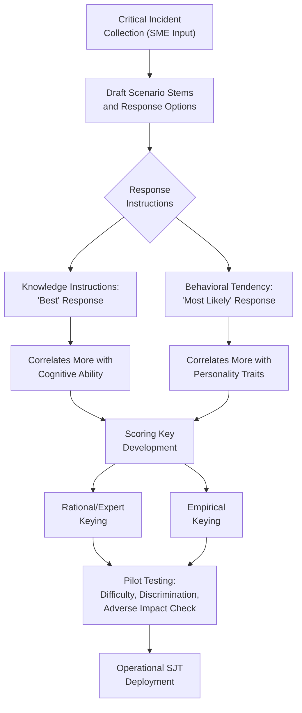

## Biodata and Situational Judgment Tests

### Overview

Biodata (biographical data) instruments and Situational Judgment Tests (SJTs) are two selection method categories that occupy a distinctive space in personnel selection: both are empirically-grounded, standardized assessment formats that often demonstrate favorable validity-to-adverse-impact ratios relative to cognitive ability tests, while capturing predictive variance not always well represented by traditional ability or personality measures. They are frequently grouped together in the selection literature due to shared measurement philosophy, though they differ meaningfully in content and theoretical grounding.

### Biodata (Biographical Data)

#### Definition and Rationale

**Biodata** refers to standardized, quantifiable information about a candidate's past life experiences, behaviors, attitudes, and accomplishments (education, work history, extracurricular involvement, developmental experiences) used to predict future job performance. Biodata rests on the behavioral consistency principle: past behavior and life experiences are predictive of future behavior, extending this logic beyond job-specific past behavior (as in behavioral interviews) to a broader biographical domain.

#### Biodata Item Construction Approaches

| Approach | Description |
| --- | --- |
| Rational (Theory-Based) Scaling | Items and scoring keys developed based on theoretical reasoning about which biographical experiences should relate to job performance |
| Empirical Keying | Items are weighted/scored based on their statistical relationship with a criterion (e.g., job performance or tenure) in a development sample, regardless of theoretical rationale for the relationship |
| Rational-Empirical (Hybrid) Approach | Combines theoretical item development with empirical validation/weighting, considered by many methodologists a stronger approach than either pure strategy alone |

**Key Points**

- Purely empirical keying, while historically capable of producing strong validity coefficients, has been criticized for producing scoring keys that lack a clear conceptual/theoretical rationale (an item might be weighted because of a statistical association with the criterion in a specific sample without a clear explanation for *why* that relationship exists), raising concerns about interpretability, fairness, and susceptibility to sample-specific capitalization on chance.
- Rational-empirical hybrid approaches are generally favored in contemporary practice as they balance predictive utility with interpretability and defensibility.

#### Types of Biodata Items

- **Hard/Verifiable Items** — objectively verifiable facts (e.g., "How many years of supervisory experience do you have?").
- **Soft/Unverifiable Items** — self-reported attitudes, preferences, or interpretive judgments about past experiences (e.g., "How would you rate your leadership ability in your last role?").

**Key Points**

- Hard/verifiable biodata items are generally considered less susceptible to intentional distortion than soft items, since responses are (at least in principle) checkable against external records, though verification is not always practically conducted.

#### Validity and Adverse Impact Profile

**Key Points**

- Meta-analytic evidence has generally found biodata to show moderate-to-good criterion-related validity for predicting job performance and turnover, with validity magnitude varying based on the development methodology used (rational-empirical approaches often cited as stronger than either pure approach alone).
- [Unverified] Reported biodata validity coefficients vary considerably across meta-analyses and individual studies, partly reflecting the heterogeneity of biodata instruments themselves (since "biodata" describes a broad measurement approach rather than a single standardized test); practitioners should treat validity claims as instrument-specific rather than assuming uniform validity across all biodata measures.
- Biodata has often been noted in the literature as showing more favorable (smaller) subgroup differences compared to cognitive ability tests, though this varies by specific instrument and item content, and should not be assumed universal without instrument-specific evidence.

#### Biodata Criticisms

- **Susceptibility to faking on soft items**: Self-reported, unverifiable biographical items are subject to similar social desirability concerns as personality inventories.
- **Legal/fairness concerns with empirical keying**: Statistically-derived item weights that lack a clear job-relevance rationale can be more difficult to defend under job-relatedness legal standards if adverse impact is identified, since content validity arguments are harder to construct for empirically-keyed items without a theoretical link to job requirements.
- **Item transportability**: [Inference] Because empirically keyed biodata scoring is often developed and validated within a specific organizational sample, transporting a scoring key to a different organization, job, or population without re-validation carries risk that the empirical weights will not hold, though the degree of this risk depends on job and context similarity.

### Situational Judgment Tests (SJTs)

#### Definition and Format

A **Situational Judgment Test (SJT)** presents candidates with realistic, job-relevant hypothetical scenarios (written, video, or interactive) accompanied by several possible response options, and asks candidates to evaluate, rank, or select the most (and sometimes least) effective response.

#### Response Format Variants

| Format | Description |
| --- | --- |
| Knowledge Instructions | "What is the *best* response to do in this situation?" (assesses judgment about correct action) |
| Behavioral Tendency Instructions | "What would you *most likely* do in this situation?" (assesses typical behavioral disposition, closer to a personality-like measure) |
| Ranking Format | Candidate ranks all response options from most to least effective |
| Pick Best/Worst Format | Candidate selects the single best and single worst option from a list |

**Key Points**

- The choice between knowledge and behavioral tendency instructions meaningfully affects what the SJT measures: knowledge-instruction SJTs tend to correlate more with cognitive ability, while behavioral tendency-instruction SJTs tend to correlate more with personality traits — meaning SJTs are best understood as a *measurement method* rather than a single construct, capable of assessing different underlying constructs depending on design choices.

#### SJT Construct Basis

**Key Points**

- SJTs are frequently described in the literature as measuring a mix of underlying constructs depending on design, potentially including cognitive ability, personality traits (particularly conscientiousness and emotional stability), practical intelligence/tacit knowledge, and job-specific experience or knowledge.
- This construct heterogeneity is a defining and somewhat debated characteristic of SJTs: unlike a cognitive ability test or a Big Five personality inventory with clearer construct boundaries, an SJT's construct composition depends heavily on its specific item content and response instructions.

#### SJT Development Process

1. **Critical Incident Collection** — gather real job-relevant scenarios, typically through interviews or workshops with subject matter experts (SMEs) describing effective and ineffective responses to actual workplace situations.
2. **Scenario and Response Option Drafting** — convert critical incidents into scenario stems with multiple plausible response options.
3. **Scoring Key Development** — establish correct/effective responses via expert judgment (rational keying) and/or empirical item-criterion relationships (empirical keying), paralleling biodata key development approaches.
4. **Piloting and Item Analysis** — test items for difficulty, discrimination, and adverse impact indicators before operational use.

### Diagram: SJT Development and Construct Composition

#### Validity and Adverse Impact Profile

**Key Points**

- Meta-analytic research has generally found SJTs to show moderate criterion-related validity for predicting job performance, and SJTs are commonly cited as showing meaningful incremental validity when combined with cognitive ability and/or personality measures, reflecting their construct heterogeneity.
- SJTs are frequently highlighted in the literature as showing smaller subgroup mean differences than cognitive ability tests, particularly when using behavioral tendency instructions or video-based delivery formats, making them attractive for balancing validity against adverse impact concerns — though, as with biodata, this varies by specific instrument design and should be verified per instrument rather than assumed universally.
- [Unverified] The degree to which video-based versus text-based SJT delivery affects subgroup differences and validity is an area with ongoing research; some studies suggest video formats reduce reliance on reading comprehension (potentially reducing adverse impact linked to that skill), but findings are not uniformly consistent across studies.

#### Applicant Reactions

**Key Points**

- SJTs are generally well-received by applicants due to their high face validity — the realistic, job-relevant scenario content is intuitively perceived as relevant to the job, similar to work sample tests in this respect.

### Comparative Summary: Biodata vs. SJT

| Dimension | Biodata | Situational Judgment Tests |
| --- | --- | --- |
| Content focus | Past life/work experiences and accomplishments | Hypothetical job-relevant scenarios |
| Theoretical basis | Behavioral consistency principle | Varies by design; blends multiple constructs |
| Construct measured | Typically treated as a composite predictor of experience-based tendencies | Heterogeneous: cognitive, personality, and/or tacit knowledge depending on format |
| Scoring approaches | Rational, empirical, or rational-empirical hybrid keying | Rational (expert) or empirical keying |
| Adverse impact profile | Generally favorable relative to cognitive tests, instrument-dependent | Generally favorable relative to cognitive tests, instrument-dependent |
| Applicant reactions | Moderate; depends on perceived relevance of items | Generally favorable due to high face validity |
| Faking susceptibility | Higher for soft/unverifiable items | Lower for knowledge-instruction format; higher for behavioral tendency format |

### Practical Application Example

**Example**

A retail management selection system might include a biodata questionnaire assessing prior supervisory experience, extracurricular leadership roles, and tenure patterns in past positions (hard/verifiable items weighted via a rational-empirical key), combined with a video-based SJT presenting scenarios such as handling an understaffed shift or resolving a conflict between two employees, using behavioral tendency instructions to assess typical response style — together forming a composite that captures both accumulated relevant experience and situational judgment not directly measured by a cognitive ability test alone.

### Practical Implementation Considerations

1. **Job analysis linkage**: Both biodata and SJT content should be developed from systematic job analysis or critical incident data to support content validity claims and legal defensibility.
2. **Scoring key transparency**: Favor rational-empirical hybrid keys over purely empirical keys where feasible, to support interpretability and job-relatedness defense if challenged.
3. **Piloting for adverse impact**: Both instrument types should be piloted with adverse impact analysis before operational deployment, since favorable adverse impact profiles are general literature findings, not guarantees for any specific instrument.
4. **Periodic re-validation**: Empirically-keyed instruments in particular benefit from periodic re-validation to confirm that item-criterion relationships remain stable over time and across organizational changes.

### Criticisms and Limitations

- **Construct ambiguity of SJTs**: The construct heterogeneity that makes SJTs practically useful (capturing multiple predictive dimensions in one instrument) also makes them harder to interpret theoretically — it is often unclear precisely what a given SJT score "means" psychologically, which can complicate validity generalization claims across different SJT instruments.
- **Empirical keying defensibility**: As with biodata, purely empirically-keyed SJT scoring can face job-relatedness challenges if adverse impact is identified and no clear rational/theoretical link between items and job performance can be articulated.
- **Heterogeneity limits generalization**: [Inference] Because both biodata and SJTs describe broad measurement *approaches* rather than single standardized instruments, meta-analytic validity and adverse impact findings represent averages across quite different specific instruments; applying general literature conclusions to a newly developed, unvalidated biodata or SJT instrument without instrument-specific validation evidence carries meaningfully more uncertainty than doing so for a well-established, singularly-defined test like a specific cognitive ability battery.
- **Coachability concerns**: [Unverified] Some practitioner and research discussion raises concern that SJTs, particularly knowledge-instruction formats with identifiable "correct" answers, may become coachable over time if item content becomes widely known or if test-preparation materials target common SJT scenario types; the extent of this effect on operational validity is not fully established in the literature.

### Related Topics / Next Steps

- **Selection Interviews, Tests, and Assessment Centers** — broader selection method context for these instrument types
- **Cognitive Ability and Personality Testing in Selection** — comparative predictor categories relevant to understanding SJT construct composition
- **Validity, Reliability, and Adverse Impact** — the psychometric and legal framework these instruments are evaluated within
- **Structured Interviewing Techniques** — shares conceptual roots with situational interview questions and situational judgment methodology
- **Job Analysis Methods** — the critical incident and content foundation for both biodata and SJT development
- **Empirical vs. Rational Test Construction** — deeper methodological treatment of scoring key development approaches
- **Counterproductive Work Behavior (CWB)** — outcome variable sometimes predicted by biodata-based integrity-related items
- **Meta-Analytic Validity Generalization (Schmidt & Hunter)** — methodological foundation for the validity claims summarized here