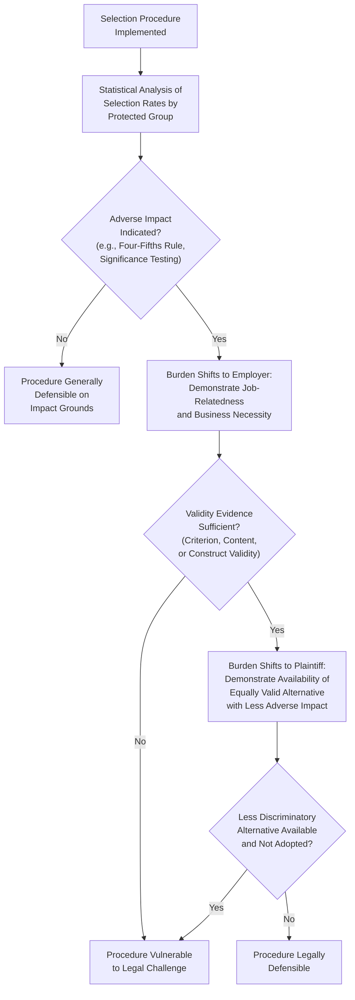

## Legal Issues in Employee Selection

### Overview

Legal issues in employee selection concern the body of statutes, regulations, case law, and administrative guidelines that govern how organizations may design, validate, and use personnel selection procedures without engaging in unlawful discrimination. This topic is primarily developed within the U.S. legal and regulatory context (given its centrality in I-O psychology's professional training and the Uniform Guidelines framework), though analogous employment discrimination principles exist internationally with jurisdiction-specific variation. This overview presents foundational, long-standing legal concepts; current compliance decisions should always be verified against up-to-date law and qualified legal counsel.

### Two Theories of Discrimination

U.S. employment discrimination law, and much comparable law internationally, generally recognizes two distinct theories under which a selection practice can be challenged:

| Theory | Definition | Intent Requirement | Key Evidence |
| --- | --- | --- | --- |
| Disparate Treatment | Intentional discrimination against an individual or group based on a protected characteristic | Requires proof of discriminatory intent | Direct evidence, or circumstantial evidence via burden-shifting frameworks |
| Disparate (Adverse) Impact | A facially neutral practice that disproportionately and negatively affects a protected group | Does NOT require proof of discriminatory intent | Statistical disparity in selection rates (e.g., four-fifths rule, significance testing) |

**Key Points**

- Disparate impact theory is of particular relevance to I-O psychology and personnel selection, since it directly implicates the statistical and psychometric properties of selection procedures (validity, adverse impact ratios) rather than only interviewer or decision-maker intent.
- The disparate impact framework places the burden on the employer to demonstrate job-relatedness and business necessity once a plaintiff establishes a statistical disparity, making validation evidence central to legal defense.

### Key U.S. Legal Foundations

#### Title VII of the Civil Rights Act (1964)

The foundational U.S. federal statute prohibiting employment discrimination on the basis of race, color, religion, sex, and national origin. Title VII established the Equal Employment Opportunity Commission (EEOC) as the primary federal enforcement agency.

#### Griggs v. Duke Power Co. (1971)

**Key Points**

- This landmark U.S. Supreme Court case established that Title VII prohibits not only intentional discrimination but also facially neutral employment practices that have a discriminatory effect, unless the employer can demonstrate the practice is job-related and consistent with business necessity — effectively establishing the disparate impact theory in U.S. law.
- The case specifically addressed the use of a high school diploma requirement and general intelligence tests that were not shown to be related to job performance and had a disproportionate adverse effect on Black applicants.

#### Uniform Guidelines on Employee Selection Procedures (1978)

**Key Points**

- Jointly issued by several U.S. federal agencies (including the EEOC), the Uniform Guidelines provide technical standards for employers regarding the validation of selection procedures and the assessment of adverse impact, including the widely referenced four-fifths rule.
- [Unverified] While influential and still frequently referenced in practice and litigation, the precise current legal weight and interpretation of the Uniform Guidelines has evolved through subsequent case law since 1978; practitioners should not treat them as a static, unchanging compliance checklist without considering more recent legal developments.

#### Additional Relevant U.S. Statutes

| Statute | Protected Basis / Focus |
| --- | --- |
| Age Discrimination in Employment Act (ADEA, 1967) | Age discrimination (workers age 40 and older) |
| Americans with Disabilities Act (ADA, 1990) | Disability discrimination; requires reasonable accommodation in selection processes |
| Equal Pay Act (1963) | Sex-based wage discrimination for substantially equal work |
| Pregnancy Discrimination Act (1978) | Pregnancy, childbirth, and related conditions as a form of sex discrimination |
| Civil Rights Act of 1991 | Amended Title VII; codified aspects of disparate impact theory following subsequent case law developments and clarified damages provisions |

**Key Points**

- [Unverified] This table reflects foundational, well-established statutes; additional protections (e.g., regarding genetic information under GINA, or evolving interpretations regarding other protected characteristics) exist and continue to develop, and a comprehensive current legal review should consult primary legal sources rather than this overview alone.

### Diagram: Disparate Impact Legal Analysis Framework

### The Burden-Shifting Framework in Disparate Impact Cases

**Key Points**

- U.S. disparate impact litigation generally follows a structured burden-shifting sequence: (1) plaintiff must first establish a statistically significant adverse impact caused by a specific employment practice; (2) if established, the burden shifts to the employer to demonstrate the practice is job-related for the position and consistent with business necessity; (3) if the employer succeeds, the burden shifts back to the plaintiff to show that an equally valid, less discriminatory alternative selection procedure existed and the employer refused to adopt it.
- This framework underscores why validation evidence (see Validity, Reliability, and Adverse Impact) is not merely a psychometric best practice but a central legal defense mechanism.

### Reasonable Accommodation in Selection (ADA Context)

**Key Points**

- Under the Americans with Disabilities Act, employers are generally required to provide reasonable accommodations in the selection process for qualified individuals with disabilities (e.g., alternative test formats, extended time, accessible testing environments), unless doing so would impose an undue hardship on the employer.
- [Unverified] The specific scope of what constitutes a "reasonable accommodation" versus an "undue hardship" is determined case-by-case and has been shaped by extensive subsequent case law and regulatory guidance; this overview provides the foundational concept only, not a comprehensive current compliance standard.
- Selection procedures should generally be designed and validated to distinguish between essential job functions (which may legitimately be assessed) and characteristics unrelated to essential functions that could inadvertently screen out individuals with disabilities.

### Selection Method-Specific Legal Considerations

| Method | Key Legal Considerations |
| --- | --- |
| Cognitive Ability Tests | Historically associated with higher documented adverse impact risk in the literature; strong validity evidence required to support business necessity defense |
| Physical Ability Tests | Must be closely tied to demonstrated essential physical job demands via job analysis; risk of disparate impact based on sex |
| Personality Tests | Generally lower adverse impact risk; ADA considerations arise if items could be construed as medical/psychological inquiries rather than personality assessment |
| Background Checks/Criminal History | Subject to increasing regulatory scrutiny in many jurisdictions (e.g., "ban the box" type laws in various U.S. states/localities restricting timing of criminal history inquiries); adverse impact concerns given documented disparate conviction rate patterns across demographic groups |
| Credit Checks | Some U.S. jurisdictions restrict or prohibit use of credit history in employment decisions for most positions |
| Medical/Psychological Inquiries | ADA restricts pre-offer medical inquiries and examinations; permissible only post-conditional-offer in most circumstances, and must be job-related |

**Key Points**

- [Unverified] Regulations regarding background checks, credit checks, and similar screening tools vary substantially by U.S. state and locality (and vary further internationally), and this area has seen active, ongoing legislative change; practitioners must verify current jurisdiction-specific requirements rather than relying on general summaries.

### International Context (Brief Note)

**Key Points**

- [Unverified] While the disparate treatment/disparate impact framework described here is specific to U.S. law, many other countries have analogous (though not identical) employment discrimination frameworks — for example, the EU's Equal Treatment framework and various national anti-discrimination statutes — but the specific legal tests, protected characteristics, and procedural requirements differ meaningfully by jurisdiction and should be researched independently for any non-U.S. context rather than assumed to mirror U.S. law.

### Best Practices for Legal Risk Mitigation in Selection

1. **Ground all selection procedures in systematic job analysis**, establishing a documented link between assessed content and actual job requirements.
2. **Maintain thorough validation documentation** (criterion-related, content, or construct validity evidence, or documented validity generalization/transportability rationale).
3. **Conduct regular adverse impact monitoring** across protected subgroups at each stage of the selection process, not only at final hiring decisions.
4. **Evaluate and document consideration of alternative procedures** with potentially less adverse impact when disparities are identified, consistent with the burden-shifting framework's final stage.
5. **Provide standardized, structured administration** of all selection procedures to support both validity and consistency-based legal defense (see Structured Interviewing Techniques).
6. **Train all personnel involved in selection decisions** on legal requirements, bias awareness, and standardized procedures.
7. **Establish reasonable accommodation procedures** for candidates with disabilities in the assessment process.
8. **Consult qualified employment law counsel** for jurisdiction-specific compliance requirements, particularly given the pace of legal change in areas like background check regulation.

### Criticisms and Limitations

- **Legal standard evolution**: [Unverified] Employment discrimination law, including the precise application of disparate impact analysis, continues to evolve through ongoing case law, regulatory guidance, and legislative action; any specific legal claims in this overview reflect foundational/historical legal concepts widely taught in I-O psychology curricula and should not be treated as a substitute for current legal research or counsel.
- **Tension between psychometric and legal standards**: [Inference] Selection procedures that are psychometrically well-validated by scientific standards can still face legal challenge if courts or regulators interpret job-relatedness, business necessity, or "less discriminatory alternative" requirements differently than the underlying research literature suggests is appropriate; this reflects an ongoing area of tension between the scientific and legal communities that is not fully resolved.
- **Four-fifths rule limitations**: As discussed in Validity, Reliability, and Adverse Impact, the four-fifths rule is a rule of thumb with known statistical limitations (particularly sensitivity to small sample sizes), and its application does not represent a complete legal adverse impact analysis on its own.
- **Jurisdictional fragmentation**: Particularly regarding newer areas of regulation (background checks, credit checks, and similar screening tools), the patchwork of differing state/local/national requirements creates ongoing compliance complexity for multi-jurisdiction employers, and general summaries cannot substitute for jurisdiction-specific legal review.
- **Reasonable accommodation ambiguity**: The case-by-case nature of "reasonable accommodation" and "undue hardship" determinations under disability law creates inherent interpretive uncertainty that general guidance cannot fully resolve without reference to specific facts and current case law.

### Related Topics / Next Steps

- **Validity, Reliability, and Adverse Impact** — the psychometric foundation underlying legal job-relatedness and business necessity defenses
- **Selection Interviews, Tests, and Assessment Centers** — selection methods to which these legal principles apply
- **Structured Interviewing Techniques** — practice supporting legal defensibility through standardization
- **Cognitive Ability and Personality Testing in Selection** — predictor categories with differing adverse impact and legal risk profiles
- **Diversity, Equity, and Inclusion (DEI) in Staffing** — organizational strategy considerations connected to adverse impact concerns
- **Reasonable Accommodation and Disability in Employment** — extended treatment of ADA-related selection considerations
- **Background Check and Criminal History Screening Regulation** — deeper treatment of this rapidly evolving regulatory area
- **Equal Employment Opportunity Commission (EEOC) Enforcement Guidance** — primary U.S. regulatory source for current interpretive guidance