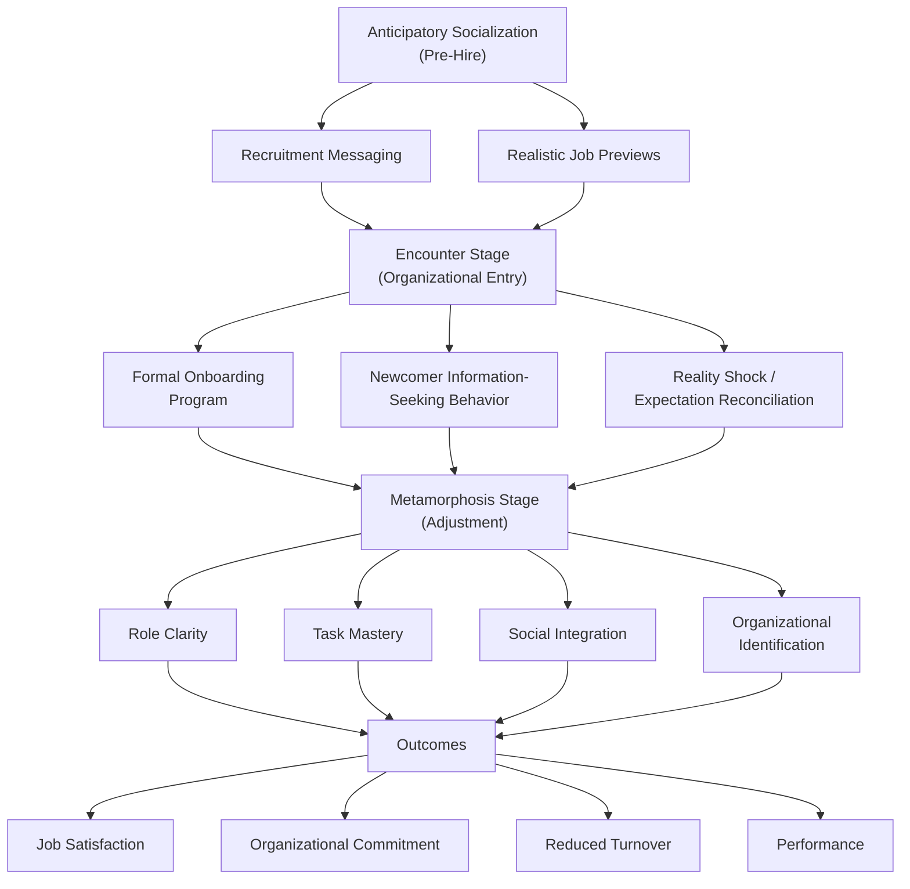

## Onboarding and Organizational Socialization

### Overview

Organizational socialization is the process through which a new employee acquires the knowledge, skills, and attitudes needed to become an effective and integrated organizational member. Onboarding refers to the formal organizational practices designed to facilitate this socialization process. While often used interchangeably in practitioner contexts, socialization is the broader psychological and social process an individual undergoes, while onboarding refers specifically to organizationally sponsored activities intended to support and accelerate that process.

### Theoretical Foundations

#### Van Maanen and Schein's Socialization Tactics Framework

Van Maanen and Schein (1979) proposed a foundational framework describing organizational socialization along six bipolar tactical dimensions, which organizations can structure to influence how newcomers experience the transition.

| Tactic Dimension | Poles |
| --- | --- |
| Collective vs. Individual | Newcomers processed as a group with shared experiences vs. individually and separately |
| Formal vs. Informal | Newcomer segregated in a distinct role during socialization (e.g., formal training program) vs. immediately immersed in the regular job role |
| Sequential vs. Random | Clear, defined sequence of steps toward the target role vs. ambiguous or variable sequence |
| Fixed vs. Variable | Fixed, known timetable for the socialization process vs. variable or unknown timetable |
| Serial vs. Disjunctive | Experienced organizational members groom and mentor the newcomer into an established role vs. no established role model provided |
| Investiture vs. Divestiture | Newcomer's existing identity and characteristics are affirmed and built upon vs. newcomer's existing identity is stripped down before rebuilding an organizationally-defined identity |

**Key Points**

- Jones (1986) later grouped these six tactics into two broader categories: **institutionalized socialization** (collective, formal, sequential, fixed, serial, investiture) and **individualized socialization** (individual, informal, random, variable, disjunctive, divestiture).
- Institutionalized tactics are generally associated in the literature with newcomers adopting a more **custodial** role orientation (accepting the existing role and organizational norms as given), while individualized tactics are associated with a more **innovative** role orientation (newcomers more likely to question, adapt, or change their role and organizational practices).

#### Uncertainty Reduction Theory

**Key Points**

- A core theoretical driver of socialization research holds that newcomers experience significant uncertainty upon organizational entry (about role expectations, social norms, performance standards), and socialization processes function largely to reduce this uncertainty through information-seeking and organizationally provided information.
- This theoretical lens frames newcomer information-seeking behavior (see below) as an adaptive response to uncertainty rather than a passive reception of organizationally delivered content.

### Stages of Organizational Socialization (Feldman's Model)

Feldman (1981) proposed a three-stage model of the socialization process:

1. **Anticipatory Socialization** — occurs before organizational entry, encompassing the expectations and information the individual has gathered during recruitment and selection (directly connected to Realistic Job Previews and the Met Expectations Hypothesis).
2. **Encounter Stage** — begins upon organizational entry, as the newcomer confronts the actual reality of the job and organization, often reconciling pre-entry expectations against experienced reality.
3. **Metamorphosis (Change and Acquisition) Stage** — the newcomer adjusts to the values, norms, and required behaviors of the organization/role, achieving role clarity, competence, and social integration.

### Diagram: Socialization Process and Onboarding Integration

### Newcomer Information-Seeking Behavior

**Key Points**

- Consistent with uncertainty reduction theory, socialization research emphasizes that newcomers are not passive recipients of organizational socialization efforts but actively engage in **proactive information-seeking** to reduce uncertainty about their role, performance standards, and social environment.
- Common information-seeking tactics identified in the literature include: direct inquiry (asking questions), observation of others, monitoring feedback cues, and testing limits through trial behavior.
- This proactive framing parallels the logic of Job Crafting, in that both literatures emphasize employee agency in shaping their own work experience rather than treating employees as purely passive recipients of organizational design.

### Content Domains of Socialization (Chao et al.)

Chao, O'Leary-Kelly, Wolf, Klein, and Gardner (1994) identified six content dimensions newcomers must learn during socialization:

1. **Performance Proficiency** — mastering the tasks required for the job.
2. **People** — establishing successful and satisfying working relationships with organizational members.
3. **Politics** — gaining information about formal and informal organizational power structures and relationships.
4. **Language** — learning technical jargon, acronyms, and organization-specific slang.
5. **Organizational Goals and Values** — understanding and internalizing the rules and principles that maintain organizational integrity.
6. **History** — learning organizational traditions, customs, myths, and rituals.

### Formal Onboarding Program Components

| Component | Description |
| --- | --- |
| Orientation Programs | Initial formal sessions covering administrative requirements, benefits, policies, and organizational overview |
| Role-Specific Training | Structured skill and knowledge development tied to specific job requirements |
| Mentoring/Buddy Programs | Pairing newcomers with experienced organizational members for guidance, informal knowledge transfer, and social integration support |
| Structured Check-Ins | Scheduled manager/HR touchpoints at defined intervals (e.g., 30/60/90 days) to assess adjustment and address concerns |
| Socialization Agents (Supervisors, Peers, HR) | Formal and informal individuals who transmit organizational knowledge, norms, and social support during the transition |
| Organizational Culture Immersion | Activities designed to convey and reinforce organizational values, history, and identity |

**Example**

A structured 90-day onboarding program might combine a formal Week 1 orientation (administrative/compliance content), an assigned peer mentor for informal question-asking throughout the first three months, role-specific technical training modules delivered incrementally, and scheduled 30/60/90-day check-in meetings with the direct supervisor to assess role clarity and address emerging concerns — illustrating the combination of institutionalized (formal, sequential, fixed) tactics with serial (mentor-provided) socialization support.

### Outcomes of Effective Socialization

**Key Points**

- Meta-analytic research (e.g., Bauer, Bodner, Erdogan, Truxillo, & Tucker, 2007) has linked successful socialization — particularly achievement of role clarity, self-efficacy, social acceptance, and knowledge of organizational culture — to positive outcomes including job satisfaction, organizational commitment, job performance, and reduced turnover intentions.
- Role clarity and social integration are frequently identified as particularly strong proximal predictors of successful newcomer adjustment, functioning as key mediating mechanisms between onboarding practices and distal outcomes like retention and performance.

### Onboarding's Position in the Broader Staffing Pipeline

**Key Points**

- Onboarding and socialization represent the process stage immediately following successful selection and offer acceptance, forming the critical link between recruitment/selection investment and long-term employee retention and productivity.
- Poor onboarding can undermine the value of an otherwise well-executed recruitment and selection process, since even a well-fitted hire (high Person-Job Fit at selection) can experience early disillusionment, role ambiguity, or inadequate social integration without effective socialization support — directly connecting to the Met Expectations Hypothesis discussed in Realistic Job Previews.
- Continuity of information delivered from Realistic Job Previews (pre-hire) through onboarding (post-hire) is theoretically important; inconsistency between pre-hire messaging and post-hire onboarding reality can produce a psychological contract violation (see Psychological Contract).

### Socialization Tactics and Role Orientation: Practical Implications

**Key Points**

- Organizations must weigh the trade-off between institutionalized tactics (which tend to produce faster role clarity and conformity, potentially valuable in highly standardized or compliance-sensitive roles) and individualized tactics (which tend to foster innovation and role redefinition, potentially valuable in roles requiring adaptability or creative problem-solving).
- [Inference] Because this trade-off is context-dependent, organizations seeking primarily consistent, standardized performance (e.g., certain regulated or safety-critical roles) may reasonably favor more institutionalized socialization tactics, while organizations seeking innovation or role evolution (e.g., certain leadership or R&D roles) may reasonably favor more individualized approaches — though the specific optimal balance for any given role requires context-specific judgment rather than a universal prescription.

### Remote and Hybrid Onboarding Considerations

**Key Points**

- [Unverified] The shift toward remote and hybrid work arrangements has generated increased practitioner and research interest in adapting traditional (often in-person-oriented) socialization tactics — particularly serial/mentoring relationships and informal information-seeking opportunities — to virtual contexts; the comparative effectiveness of specific virtual onboarding practices relative to established in-person norms is an evolving area, and current, context-specific evidence should be consulted rather than assuming established findings from in-person socialization research transfer directly to virtual settings without modification.

### Criticisms and Limitations

- **Institutionalized/individualized dichotomy oversimplification**: [Inference] While the Van Maanen and Schein framework remains foundational, real organizational socialization processes often combine tactics from both categories simultaneously in ways not fully captured by a clean institutionalized-versus-individualized dichotomy; treating this as a strict binary may oversimplify actual organizational practice.
- **Overemphasis on organizational agency in early research**: Socialization research historically emphasized organizationally controlled tactics before the more recent proactive information-seeking and newcomer-agency literature developed; earlier models may underweight the newcomer's own active role in shaping their socialization experience.
- **Measurement and outcome timeframe variability**: [Unverified] Studies examining socialization outcomes vary considerably in the timeframe over which adjustment and outcomes are measured (weeks versus months versus years post-hire), and findings regarding the durability of onboarding effects over longer time horizons are less consistently established than short-term adjustment findings.
- **Generalizability across role types and cultures**: [Inference] Much foundational socialization research (e.g., Van Maanen and Schein, Feldman) was developed in specific organizational and cultural contexts; the relative importance of specific content domains (e.g., "politics" or "history") and the effectiveness of specific tactics may vary by industry, organizational size, and national/cultural context, requiring context-specific validation rather than universal application.

### Related Topics / Next Steps

- **Realistic Job Previews** — the pre-hire anticipatory socialization stage directly preceding onboarding
- **Psychological Contract** — theoretical framework for understanding expectation-reality alignment throughout the socialization process
- **Person-Job Fit and Person-Organization Fit** — fit constructs that onboarding and socialization processes help realize or reinforce post-hire
- **Job Crafting** — related newcomer-agency literature emphasizing proactive employee shaping of the work role
- **Turnover and Retention Models** — key distal outcome variables connected to socialization success
- **Mentoring and Organizational Support Programs** — extended treatment of serial socialization mechanisms
- **Organizational Culture and Identity** — content domain central to the socialization process
- **Newcomer Adjustment and Role Clarity** — deeper treatment of proximal socialization outcome mechanisms