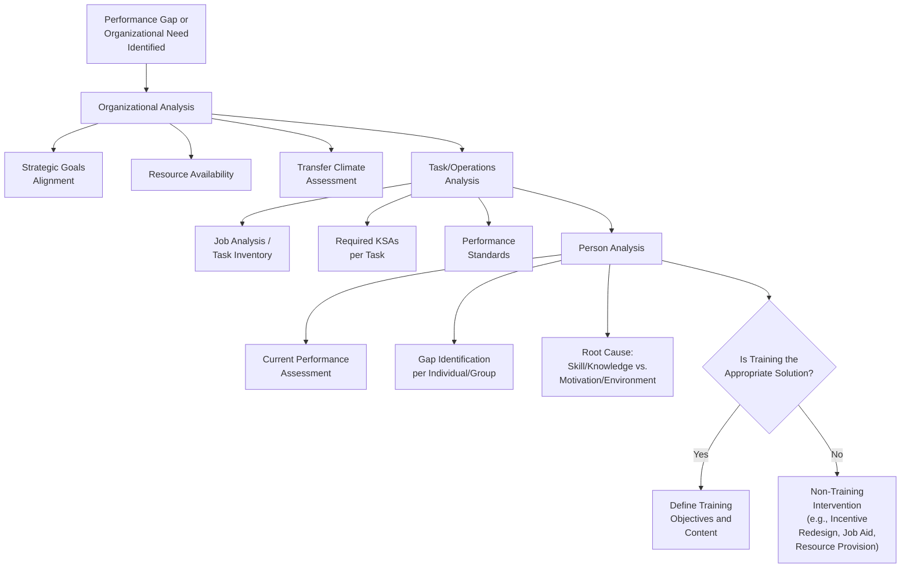
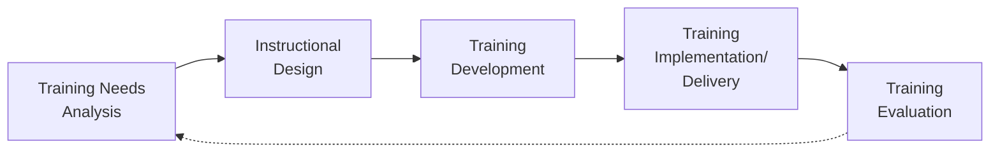

## Training Needs Analysis

### Overview

Training Needs Analysis (TNA), also referred to as Training Needs Assessment, is the systematic process of identifying gaps between current and desired organizational, task, and individual performance in order to determine whether training is an appropriate solution and, if so, what specific training content is required. TNA is the foundational first phase of the Instructional Systems Design (ISD) process and serves as a gatekeeping function: it determines whether a performance problem is actually a training problem at all, or whether it stems from non-training factors (e.g., inadequate resources, poor incentive structures, unclear expectations).

### The Three-Level Framework (McGehee & Thayer, 1961)

The foundational and still-dominant model of TNA, developed by McGehee and Thayer, decomposes needs analysis into three interconnected levels of analysis:

1. **Organizational Analysis** — examines organization-wide factors that influence whether and where training is needed and likely to be effective, including organizational goals, resources, climate for training transfer, and strategic priorities.
2. **Task (Operations) Analysis** — examines the specific tasks, duties, and standards required for effective job performance, identifying the knowledge, skills, and abilities (KSAs) needed to perform those tasks.
3. **Person Analysis** — examines individual employees' current performance levels relative to required standards, identifying who needs training and what specific gaps exist for each individual or group.

**Key Points**

- These three levels are sequential in logic but iterative in practice: organizational analysis establishes the context and priority for training investment, task analysis defines *what* needs to be trained, and person analysis defines *who* needs it and to what degree.
- A well-conducted TNA does not assume training is the answer; a core function of organizational and person analysis is to help distinguish genuine skill/knowledge deficits (trainable) from motivational, environmental, or resource-based performance problems (not solvable through training alone).

### Diagram: Three-Level TNA Framework

### Organizational Analysis: Key Components

- **Strategic Alignment** — determining whether proposed training supports broader organizational goals and strategic priorities, ensuring training investment is directed toward organizationally valued outcomes.
- **Resource Analysis** — assessing budget, time, personnel, and technological resources available to support training design, delivery, and transfer.
- **Climate for Transfer** — assessing whether the organizational environment (supervisor support, opportunity to apply new skills, reward systems) will support the application of trained skills back on the job; a supportive transfer climate is well-established in the training literature as critical to training effectiveness regardless of training design quality.
- **Support and Sponsorship** — evaluating leadership commitment and support for the training initiative, since a lack of managerial buy-in is a commonly cited practical barrier to training success.

### Task (Operations) Analysis: Key Components

- **Job/Task Analysis Foundation** — task analysis for TNA purposes overlaps methodologically with broader job analysis techniques (task inventories, critical incident technique, subject matter expert interviews) but is specifically oriented toward identifying the KSAs required for effective performance that can potentially be developed through training.
- **Performance Standards Definition** — establishing clear, measurable standards of acceptable task performance against which current performance gaps can be assessed.
- **Task Criticality and Frequency Weighting** — prioritizing training content development toward tasks that are most frequent, most critical to job success, or most difficult to learn (paralleling task analysis weighting approaches used in job analysis).

### Person Analysis: Key Components

- **Performance Data Review** — analyzing existing performance appraisal data, productivity metrics, quality/error rates, and customer feedback to identify performance gaps.
- **Skills/Competency Gap Assessment** — direct assessment (tests, observation, self-report, 360-degree feedback) of individual employees' current proficiency relative to required standards.
- **Root Cause (Gap Analysis) Diagnosis** — determining whether identified performance gaps stem from a genuine skill/knowledge deficit (addressable via training) or from non-training factors.

#### Mager and Pipe's Performance Analysis Framework

A widely referenced diagnostic framework (Mager & Pipe, 1970) for distinguishing training from non-training performance problems poses a sequence of diagnostic questions, generally including:

1. Is this actually a performance discrepancy worth addressing (is there a genuine gap with meaningful consequences)?
2. Is it a skill/knowledge deficiency (could the person do it if their life depended on it)?
3. If yes (skill deficiency) → training or practice is likely the appropriate solution.
4. If no (the person *could* do it but doesn't) → the problem likely lies in motivation, incentive structure, obstacles, or resource availability, and training alone will not resolve it.

**Example**

An organization observes that customer service representatives are frequently failing to follow a required escalation protocol. Applying Mager and Pipe's logic: if representatives cannot correctly describe or demonstrate the protocol when asked directly, this indicates a genuine skill/knowledge deficit appropriately addressed by training. If representatives *can* correctly describe and demonstrate the protocol but frequently fail to apply it during actual high-pressure calls, this suggests a motivational, workload, or systemic obstacle (e.g., time pressure, unclear incentive to follow the slower correct process) that training alone is unlikely to resolve.

### Data Collection Methods for TNA

| Method | Description | Best Suited For |
| --- | --- | --- |
| Surveys/Questionnaires | Structured self-report instruments distributed broadly | Large-scale person analysis; efficient but relies on self-perception accuracy |
| Interviews (Individual/Focus Group) | Direct qualitative inquiry with employees, supervisors, or SMEs | Rich contextual detail; task and organizational analysis |
| Direct Observation | Observing employees performing actual job tasks | Task analysis; identifying discrepancies between reported and actual performance |
| Performance Records Review | Analysis of existing performance appraisals, productivity data, error/quality logs, customer complaints | Person analysis; objective, existing data source |
| Critical Incident Technique | Collection of specific examples of especially effective/ineffective job behavior | Task analysis; identifying critical KSAs |
| Assessment Centers/Skills Testing | Direct, standardized assessment of current competency levels | Person analysis; more resource-intensive but higher precision |
| Advisory/Steering Committees | Groups of SMEs, managers, and stakeholders providing structured input | Organizational analysis; strategic alignment validation |

### Proactive vs. Reactive TNA

**Key Points**

- **Reactive TNA** is triggered by an identified performance problem or gap (e.g., declining quality metrics, customer complaints, safety incidents) and works backward to determine training needs.
- **Proactive TNA** is triggered by anticipated future needs (e.g., new technology implementation, organizational strategic shifts, new regulatory requirements, succession planning) rather than an existing observed performance deficit, and seeks to build capability ahead of need.
- [Inference] Organizations with more mature, strategically integrated training functions likely conduct a higher proportion of proactive relative to reactive TNA, since proactive analysis allows training investment to be planned and resourced ahead of urgent need; however, the actual balance of proactive versus reactive TNA activity in any given organization depends on that organization's specific planning maturity and is not something this reference can generalize with precision.

### Output of TNA: Defining Training Objectives

**Key Points**

- A well-conducted TNA culminates in clearly defined **training objectives** — specific, measurable statements of what trainees should know or be able to do upon completion of training — which then directly inform subsequent instructional design, delivery method selection, and evaluation criteria (linking TNA to downstream training evaluation frameworks such as Kirkpatrick's levels).
- Training objectives derived from rigorous task analysis are more likely to be genuinely job-relevant, supporting both training transfer and, where relevant, legal defensibility of training-linked employment decisions (e.g., certification requirements).

### TNA's Position in the Instructional Systems Design (ISD) Process

**Key Points**

- TNA occupies the first and arguably most consequential position in the broader ISD (often referred to as the ADDIE — Analysis, Design, Development, Implementation, Evaluation — model) process, since errors or gaps in the needs analysis phase propagate through all subsequent design, delivery, and evaluation stages.
- Evaluation findings (see Training Evaluation Methods) often feed back into future TNA cycles, creating an iterative rather than strictly linear process in mature training functions.

### Common Practical Challenges in Conducting TNA

- **Time and resource constraints**: Comprehensive multi-level TNA can be resource- and time-intensive, creating organizational pressure to skip or abbreviate the analysis phase in favor of moving directly to training design, particularly under urgent business pressure.
- **Political and stakeholder dynamics**: Organizational analysis and prioritization decisions can be influenced by internal politics or stakeholder preferences, potentially at odds with objective data-driven prioritization.
- **Self-report limitations in person analysis**: Reliance on employee self-report (e.g., survey-based skills gap identification) can be subject to self-assessment bias, either underestimating or overestimating actual competency gaps relative to objective performance data.
- **Solution-first bias**: Organizations sometimes begin the process already committed to a specific training solution (e.g., "we need leadership training") without conducting genuine needs analysis to confirm the underlying problem and appropriate solution, undermining the diagnostic function TNA is intended to serve.

### Criticisms and Limitations

- **Resource-intensity vs. rigor trade-off**: [Inference] Because comprehensive three-level TNA is resource-intensive, organizations may face genuine trade-offs between analytical rigor and practical feasibility, particularly for smaller-scale or time-sensitive training initiatives; the appropriate level of TNA investment likely scales with the cost, risk, and scope of the training decision, though this is a practical judgment rather than a fixed rule established in the literature.
- **Static snapshot limitation**: [Inference] Traditional TNA processes can produce a needs assessment that reflects a point-in-time snapshot, which may become outdated in rapidly changing job requirements or technology contexts; the extent to which this is a practical limitation depends on the pace of change in the specific job or industry context.
- **Difficulty operationalizing "climate for transfer"**: While organizational analysis frameworks emphasize assessing transfer climate, [Unverified] there is no single universally standardized measurement approach for transfer climate, and practitioners may rely on varying informal or formal assessment methods with different levels of rigor.
- **Underuse of proactive analysis**: As noted above, the balance between proactive and reactive TNA practice likely varies substantially across organizations, and reactive-only approaches risk perpetually addressing performance problems after they have already caused organizational cost, rather than anticipating and preventing them.

### Related Topics / Next Steps

- **Training Evaluation Methods (Kirkpatrick's Levels)** — the downstream evaluation framework that TNA-derived objectives feed into
- **Instructional Systems Design (ISD/ADDIE Model)** — the broader training development process TNA initiates
- **Job Analysis Methods** — methodological overlap and foundation for task-level TNA
- **Training Transfer and Transfer Climate** — deeper treatment of organizational-level factors affecting training effectiveness
- **Performance Management and Appraisal** — data source and diagnostic partner for person analysis
- **Mager and Pipe's Performance Analysis Model** — extended treatment of the training vs. non-training diagnostic framework
- **Succession Planning and Workforce Development** — proactive TNA application context
- **Adult Learning Theory (Andragogy)** — relevant to designing training content once needs are identified