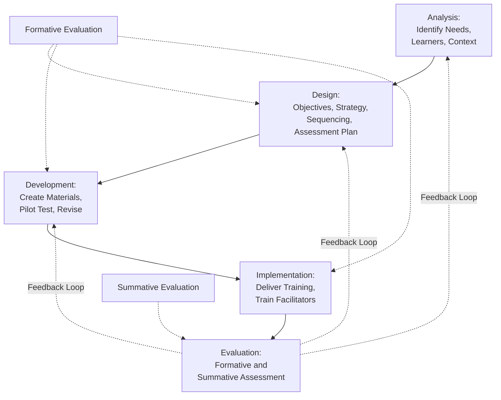
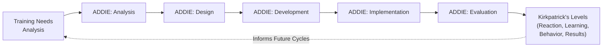

## Instructional Design and the ADDIE Model

### Overview

Instructional design is the systematic process of analyzing learning needs and designing, developing, implementing, and evaluating instructional materials and experiences to achieve specific learning outcomes. Within Organizational Psychology, instructional design provides the methodological backbone for converting training needs (identified via Training Needs Analysis) into effective, evaluable training programs. The **ADDIE model** (Analysis, Design, Development, Implementation, Evaluation) is the most widely referenced generic instructional systems design (ISD) framework used to structure this process.

### Origins and Status of the ADDIE Model

**Key Points**

- ADDIE emerged from instructional systems design work originating in U.S. military and government training contexts in the 1970s and has since become the dominant generic framework referenced across corporate, educational, and military training design.
- [Unverified] Despite its near-universal reference in training literature, ADDIE is more accurately described as a generic conceptual framework or umbrella model rather than a single, formally codified, universally standardized model with one canonical original source document; many specific instructional design models (e.g., Dick and Carey's model) can be understood as more detailed elaborations within the broader ADDIE framework.
- ADDIE is frequently criticized in contemporary instructional design literature for implying an overly linear, rigid process; most modern applications treat it as an iterative, cyclical framework rather than a strict waterfall sequence.

### The Five Phases of ADDIE

#### 1. Analysis

The analysis phase determines training needs, learner characteristics, and performance gaps — directly corresponding to and often overlapping with Training Needs Analysis.

Key activities:

- Identifying the performance gap and confirming training is the appropriate solution (as opposed to non-training interventions)
- Analyzing learner characteristics (prior knowledge, experience level, motivation, learning preferences where relevant)
- Analyzing the learning context and constraints (available time, budget, technology, delivery environment)
- Defining high-level learning goals that will be refined into specific objectives in the design phase

#### 2. Design

The design phase translates identified needs into a structured blueprint for the training program.

Key activities:

- Writing specific, measurable **learning objectives** (often using frameworks such as Bloom's Taxonomy or Mager's three-component objective format: performance, conditions, criteria)
- Selecting instructional strategies and methods appropriate to the objectives and learner population (e.g., lecture, simulation, case-based learning, e-learning modules)
- Sequencing content in a logical, pedagogically sound order
- Designing assessment/evaluation instruments aligned with learning objectives
- Creating a design document or storyboard specifying content structure before full development begins

#### 3. Development

The development phase involves creating the actual instructional materials and content based on the design blueprint.

Key activities:

- Producing content materials (slide decks, e-learning modules, videos, job aids, facilitator guides, participant workbooks)
- Building any technology-based components (e-learning platforms, simulations, learning management system content)
- Pilot testing materials with a small representative sample before full-scale rollout
- Revising materials based on pilot feedback

#### 4. Implementation

The implementation phase involves the actual delivery of the training program to the intended learner population.

Key activities:

- Delivering training via the selected method (instructor-led, e-learning, blended/hybrid, on-the-job)
- Preparing facilitators/trainers, including train-the-trainer sessions where applicable
- Managing logistics (scheduling, enrollment, technology access, materials distribution)
- Providing learner support during the training experience

#### 5. Evaluation

The evaluation phase assesses whether the training achieved its intended objectives and identifies opportunities for improvement.

Key activities:

- **Formative evaluation** — evaluation conducted *during* development and early implementation to identify and correct problems before or during rollout (e.g., pilot testing feedback).
- **Summative evaluation** — evaluation conducted *after* full implementation to assess overall training effectiveness against objectives, commonly structured using frameworks such as Kirkpatrick's four levels (reaction, learning, behavior, results).

**Key Points**

- Although evaluation is positioned as the final ADDIE phase, most contemporary instructional design practice treats evaluation as occurring throughout the process (formative evaluation embedded in design and development, not only as a final summative step), reflecting the iterative rather than strictly linear nature of real-world ADDIE application.

### Diagram: ADDIE Model as an Iterative Cycle

### Writing Learning Objectives: Mager's Three-Component Format

A widely used framework for writing clear, measurable learning objectives (Mager, 1962) specifies three components:

1. **Performance** — what the learner will be able to do (an observable, measurable behavior).
2. **Conditions** — the circumstances under which the performance will occur (tools, resources, or constraints available).
3. **Criteria** — the standard of acceptable performance (accuracy level, time limit, quality standard).

**Example**

A poorly specified objective: "Trainees will understand customer service principles." A Mager-format objective: "Given a simulated customer complaint scenario (condition), the trainee will apply the organization's de-escalation protocol (performance) correctly in at least 4 out of 5 practice scenarios (criterion)."

### Bloom's Taxonomy and Objective Design

**Key Points**

- Bloom's Taxonomy (original 1956 version; revised by Anderson and Krathwohl, 2001) provides a hierarchical classification of cognitive learning objectives, commonly used in instructional design to ensure objectives target appropriate levels of cognitive complexity: Remember, Understand, Apply, Analyze, Evaluate, Create (revised taxonomy ordering).
- Matching instructional strategy and assessment method to the intended taxonomy level is a common design principle — for example, a "Remember" or "Understand" level objective might be adequately assessed via multiple-choice testing, while an "Apply" or "Analyze" level objective typically requires performance-based or scenario-based assessment to genuinely measure the intended cognitive skill.

### Selecting Instructional Strategies and Delivery Methods

| Method | Description | Typical Best Fit |
| --- | --- | --- |
| Instructor-Led Training (ILT) | Traditional classroom/facilitator-led delivery | Complex interpersonal skills, discussion-dependent content |
| E-Learning/Self-Paced Modules | Digital, learner-controlled content delivery | Standardized knowledge content, large/distributed audiences, compliance training |
| Blended/Hybrid Learning | Combination of in-person and digital delivery | Content requiring both standardized knowledge transfer and applied practice/discussion |
| Simulation-Based Training | Realistic practice environments (physical or virtual) | High-stakes or complex procedural skills where real-world practice carries risk |
| On-the-Job Training (OJT) | Structured learning embedded in actual work performance | Task-specific skill development with immediate application context |
| Microlearning | Short, focused learning modules targeting a single objective | Just-in-time performance support, reinforcement of previously trained content |

**Key Points**

- [Unverified] While extensive practitioner and research literature discusses matching delivery method to content type, learner population, and organizational constraints, claims about the superiority of any single delivery method in the abstract should be treated cautiously; comparative effectiveness is generally found to depend heavily on how well the chosen method is executed and aligned with specific learning objectives, rather than being an inherent property of the method itself.

### Instructional Design Principles Relevant to Adult Learning

**Key Points**

- Instructional design in organizational/workplace contexts is commonly informed by **andragogy** (Knowles' theory of adult learning), which emphasizes that adult learners are self-directed, bring prior experience as a learning resource, are motivated by problems relevant to their immediate life/work context, and are oriented toward immediate application rather than future or abstract use.
- These andragogical principles inform design choices such as incorporating learner prior experience into instructional content, emphasizing practical relevance and immediate applicability, and providing learner autonomy where feasible within the training structure.

### ADDIE's Relationship to Training Needs Analysis and Evaluation

**Key Points**

- ADDIE's Analysis phase directly incorporates and builds upon Training Needs Analysis output, while its Evaluation phase is commonly operationalized using established training evaluation frameworks such as Kirkpatrick's four levels, illustrating how ADDIE functions as connective tissue between upstream needs identification and downstream effectiveness measurement.

### Alternative and Related Instructional Design Models

| Model | Distinguishing Feature |
| --- | --- |
| Dick and Carey Model | More granular, procedural elaboration of a systems-approach design process, with explicit steps for instructional analysis and criterion-referenced testing |
| SAM (Successive Approximation Model) | Explicitly iterative, rapid-prototyping-oriented alternative to ADDIE, designed to address criticism of ADDIE's perceived linearity |
| Rapid Prototyping Approaches | General category of iterative design approaches emphasizing early, frequent testing of draft materials rather than extensive upfront design documentation |

**Key Points**

- [Unverified] The degree to which SAM and similar rapid-prototyping models represent a genuinely distinct methodology versus an iterative *application* of ADDIE's same underlying phases is debated among instructional design practitioners; many describe SAM as addressing a common *implementation* failure of ADDIE (rigid linear application) rather than proposing fundamentally different phases.

### Practical Application Example

**Example**

An organization identifies (via Training Needs Analysis) that newly promoted supervisors lack skill in conducting difficult performance conversations. In the Analysis phase, the design team confirms this is a genuine skill gap (not a motivational issue) and profiles the learner population (experienced individual contributors, new to supervisory role). In Design, they write a Mager-format objective ("Given a simulated underperformance scenario, the supervisor will conduct a structured feedback conversation using the organization's feedback model, correctly applying all four steps"), select role-play simulation as the primary instructional strategy, and design a behavioral checklist assessment. In Development, they create scenario scripts, trainer guides, and a pilot-test the role-play exercise with a small supervisor cohort, revising based on pilot feedback. In Implementation, they deliver the finalized program across all newly promoted supervisors, supported by trained facilitators. In Evaluation, they assess Kirkpatrick Level 1 (reaction via post-training survey), Level 2 (learning via the behavioral checklist during role-play), and later Level 3 (behavior via manager observation of actual performance conversations on the job).

### Criticisms and Limitations of ADDIE

- **Perceived rigidity**: The most common criticism of ADDIE is that its five-phase structure, if applied as a strict linear sequence, can be slow, inflexible, and poorly suited to fast-changing organizational needs or agile development environments — a critique that has driven the development of alternative models like SAM.
- **Conceptual vs. prescriptive ambiguity**: Because ADDIE functions more as a generic conceptual umbrella than a single prescriptive methodology, the specific techniques used within each phase can vary substantially across practitioners and organizations, making direct comparison of "ADDIE-based" programs across different contexts difficult without examining the specific methods actually used within each phase.
- **Resource-intensity of rigorous application**: [Inference] A thorough application of all five ADDIE phases, including genuine pilot testing and multi-level evaluation, requires substantial time and resource investment; organizations under time or budget pressure may compress or skip phases (most commonly rigorous analysis and evaluation), which likely undermines the overall effectiveness of the resulting training, though the specific impact of any given compression depends on which phase is shortened and by how much.
- **Evaluation phase underutilization**: [Unverified] Practitioner literature frequently notes that the Evaluation phase, particularly higher-level evaluation (behavior and organizational results, per Kirkpatrick's framework), is the most commonly underutilized or superficially executed phase of ADDIE in actual organizational practice, though the extent of this pattern is difficult to quantify precisely without current, representative survey data across organizations.

### Related Topics / Next Steps

- **Training Needs Analysis** — the upstream process feeding directly into ADDIE's Analysis phase
- **Training Evaluation Methods (Kirkpatrick's Levels)** — the framework most commonly used to operationalize ADDIE's Evaluation phase
- **Adult Learning Theory (Andragogy)** — theoretical foundation for adult-oriented instructional design choices
- **Bloom's Taxonomy** — cognitive objective classification framework used in the Design phase
- **E-Learning and Technology-Based Training Design** — extended treatment of digital delivery method design considerations
- **Successive Approximation Model (SAM)** — alternative iterative instructional design framework
- **Training Transfer and Transfer Climate** — organizational factors affecting whether ADDIE-designed training translates to on-the-job performance change
- **Simulation-Based and Experiential Learning Design** — extended treatment of high-fidelity instructional strategy design