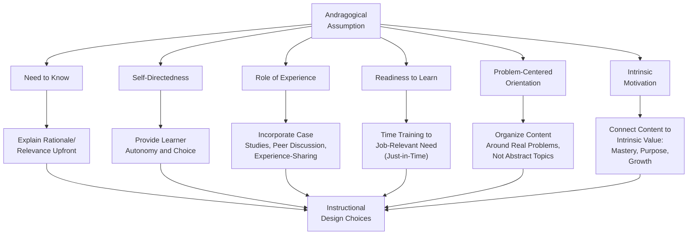

## Adult Learning Theory

### Overview

Adult Learning Theory refers to the body of theoretical frameworks explaining how adults learn differently from children, and how these differences should inform the design and delivery of workplace training and development. The dominant framework in this domain is **andragogy**, most closely associated with Malcolm Knowles, though the broader field also draws on experiential learning theory, self-directed learning theory, and transformative learning theory. Within Organizational Psychology, adult learning theory provides the psychological foundation underlying instructional design choices made during the Design phase of the ADDIE model and other instructional systems design frameworks.

### Andragogy (Knowles)

Knowles (1968, 1980) popularized the term **andragogy** — the art and science of helping adults learn — explicitly contrasting it with **pedagogy** (the art and science of teaching children), arguing that adult learners possess distinct characteristics requiring a different instructional approach.

#### Knowles' Six Core Assumptions of Andragogy

1. **Need to Know** — adults need to understand *why* they need to learn something before undertaking the learning; instruction should make the practical relevance and rationale explicit.
2. **Self-Concept (Self-Directedness)** — adults have a self-concept of being responsible for their own decisions and prefer to be treated as capable of self-direction in their learning, rather than being directed as dependent learners.
3. **Role of Experience** — adults bring a growing reservoir of life and work experience that serves as a rich resource for learning (both their own and others'), and instructional approaches should actively leverage this experience rather than ignore it.
4. **Readiness to Learn** — adults become ready to learn when they experience a need to know or do something to cope more effectively with real-life situations, often tied to developmental tasks or social roles.
5. **Orientation to Learning** — adults are life-centered (or task/problem-centered) in their orientation to learning, motivated to learn content that helps solve real problems, in contrast to a more subject-centered orientation common in pedagogical (child-focused) education.
6. **Motivation** — while adults respond to some external motivators (pay increases, promotions), the most potent motivators are internal/intrinsic (job satisfaction, self-esteem, quality of life).

**Key Points**

- [Unverified] Knowles himself later revised his position on the strictness of the pedagogy-andragogy dichotomy, acknowledging that these assumptions exist along a continuum rather than representing an absolute categorical difference between how children and adults learn; the framework is best understood as a set of tendencies more descriptive of adult learners on average rather than universal, invariant laws.
- Andragogy has faced ongoing academic critique regarding the strength and universality of its empirical evidence base; [Unverified] while it remains highly influential in workplace training design practice, some scholars have characterized it more as a set of useful design heuristics or an organizing philosophy than as a rigorously validated, testable scientific theory in the way other psychological theories (e.g., Job Characteristics Theory) are validated.

### Diagram: Andragogy's Six Assumptions Applied to Training Design

### Experiential Learning Theory (Kolb)

Kolb's (1984) Experiential Learning Theory proposes that learning is a cyclical process grounded directly in experience, comprising four stages:

1. **Concrete Experience (CE)** — the learner engages in or encounters a new experience or reinterprets an existing one.
2. **Reflective Observation (RO)** — the learner reflects on the experience, considering what happened and what it means.
3. **Abstract Conceptualization (AC)** — the learner draws conclusions and forms or modifies general concepts/theories based on the reflection.
4. **Active Experimentation (AE)** — the learner tests the new concepts/understanding in a new situation, generating a new concrete experience and restarting the cycle.

**Key Points**

- Kolb's model is frequently applied in workplace training design to structure experiential learning activities (e.g., simulations, role-plays, action learning projects) so that they explicitly cycle learners through all four stages rather than stopping at the experience itself without structured reflection and conceptualization.
- Kolb also proposed an associated **Learning Styles Inventory**, categorizing learners by their preferred entry point/emphasis within the cycle (Diverging, Assimilating, Converging, Accommodating); [Unverified] the broader construct of fixed individual "learning styles" and the practice of tailoring instruction to match a learner's identified style has faced substantial empirical criticism in recent educational psychology research, with several systematic reviews failing to find support for improved learning outcomes from styles-matched instruction, so this aspect of Kolb's broader framework should be treated as more contested than the experiential cycle concept itself.

### Self-Directed Learning (SDL)

**Key Points**

- Self-Directed Learning refers to a process in which individuals take the initiative, with or without the help of others, in diagnosing their learning needs, formulating learning goals, identifying resources, selecting and implementing learning strategies, and evaluating learning outcomes (a definition closely associated with Knowles).
- SDL is conceptually linked to andragogy's self-concept assumption and has gained renewed practical relevance with the growth of on-demand, learner-controlled digital training formats (e-learning platforms, microlearning libraries) that place more control over pacing and content selection in the learner's hands.
- [Unverified] The effectiveness of self-directed learning formats appears to depend substantially on individual learner characteristics (e.g., self-regulation skill, intrinsic motivation) and is not uniformly effective across all learner populations or content types; organizations should not assume SDL formats are universally superior simply because they align with andragogical philosophy.

### Transformative Learning Theory (Mezirow)

**Key Points**

- Mezirow's Transformative Learning Theory describes a process by which adults critically examine and revise deeply held assumptions, beliefs, and frames of reference (which Mezirow termed "meaning perspectives"), often triggered by a "disorienting dilemma" — an experience that challenges existing assumptions and cannot be resolved through existing ways of thinking.
- This theory is most commonly applied in organizational contexts involving significant mindset or paradigm shifts (e.g., leadership development addressing deeply held managerial assumptions, diversity and inclusion training aimed at examining unconscious bias) rather than skill-based technical training, where andragogy and experiential learning frameworks are more directly applicable.

### Comparative Summary of Major Adult Learning Frameworks

| Framework | Primary Author(s) | Core Focus | Most Applicable Training Context |
| --- | --- | --- | --- |
| Andragogy | Knowles | Characteristics distinguishing adult learners from children | General workplace training design principles |
| Experiential Learning Theory | Kolb | Cyclical process of learning through experience and reflection | Simulation-based, action learning, skill-practice training |
| Self-Directed Learning | Knowles (and others) | Learner autonomy in diagnosing needs and directing own learning process | E-learning, microlearning, continuous/on-demand development |
| Transformative Learning Theory | Mezirow | Critical examination and revision of deeply held assumptions/frames | Leadership development, mindset-shift and bias-awareness training |

### Practical Application: Andragogical Principles in Training Design

1. **Open with relevance** — begin training by explicitly connecting content to a real job-relevant problem or need, addressing the "need to know" assumption.
2. **Build in learner choice where feasible** — offer options in sequencing, practice scenarios, or pacing to support the self-directedness assumption, particularly in digital/self-paced formats.
3. **Leverage participant experience** — incorporate case discussion, peer sharing, and scenario analysis that draws on learners' existing job experience rather than presenting content as entirely novel abstract theory.
4. **Time training to genuine need** — where feasible, deliver training close to the point of actual application (just-in-time training) rather than far in advance of when skills will be used, supporting the readiness-to-learn assumption.
5. **Organize around problems, not topics** — structure content around realistic job problems/scenarios to be solved rather than abstract subject-matter categories, supporting the problem-centered orientation assumption.
6. **Emphasize intrinsic value** — frame training benefits in terms of mastery, professional growth, and job effectiveness, not only compliance or extrinsic requirement, to align with adult intrinsic motivation patterns.

**Example**

A cybersecurity awareness training redesigned using andragogical principles might replace a generic, topic-organized lecture ("Types of Phishing Attacks") with a scenario-based module opening with a realistic simulated phishing email relevant to the learners' actual job context (need to know, problem-centered), inviting participants to share past experiences with suspicious emails (role of experience), and offering a choice of practice scenarios matched to different job functions (self-directedness) — rather than a single uniform lecture-based module for all employees regardless of role.

### Criticisms and Limitations

- **Empirical evidence base of andragogy**: As noted above, andragogy's status as a rigorously empirically validated theory (versus a widely adopted practical framework/philosophy) remains genuinely debated in adult education and training literature; its widespread adoption in practice should not be equated with the same level of controlled empirical validation associated with more narrowly testable psychological theories.
- **Learning styles critique (Kolb)**: The learning-styles-matching aspect of Kolb's broader framework has faced substantial empirical challenge; [Unverified] while the four-stage experiential cycle itself remains widely used as a design structuring tool, the practice of diagnosing and matching instruction to individual "learning styles" specifically lacks strong supporting evidence in more recent systematic reviews, and practitioners should be cautious about over-relying on this specific application.
- **Overgeneralization risk**: [Inference] Applying andragogical or experiential learning principles uniformly across all adult learners and all training content types risks overgeneralizing what are likely tendencies rather than universal laws; individual differences in learner background, prior domain expertise, and content complexity likely moderate how well any single framework's prescriptions apply in a given training context, though the specific moderating effects are not something this reference can quantify generally.
- **Cultural generalizability**: [Inference] Adult learning frameworks, particularly andragogy, were developed primarily within Western (especially U.S.) educational and cultural contexts; the degree to which assumptions like self-directedness or problem-centered orientation generalize equally across cultures with different educational traditions or power-distance norms requires context-specific validation rather than assumption, paralleling similar generalizability concerns raised for other foundational I-O theories.

### Related Topics / Next Steps

- **Instructional Design and the ADDIE Model** — the design process most directly informed by adult learning theory principles
- **Training Needs Analysis** — upstream process establishing learner characteristics relevant to andragogical design
- **Training Evaluation Methods (Kirkpatrick's Levels)** — evaluation frameworks assessing whether andragogically-designed training achieves intended outcomes
- **E-Learning and Self-Paced Training Design** — extended treatment of self-directed learning application in digital contexts
- **Simulation-Based and Experiential Learning Design** — extended treatment of Kolb's cycle applied to structured practice activities
- **Leadership Development Programs** — common application context for transformative learning theory
- **Motivation Theories in Organizational Psychology** — broader theoretical connections to the intrinsic motivation assumption in andragogy
- **Training Transfer and Transfer Climate** — organizational factors affecting whether andragogically-sound training translates to on-the-job application