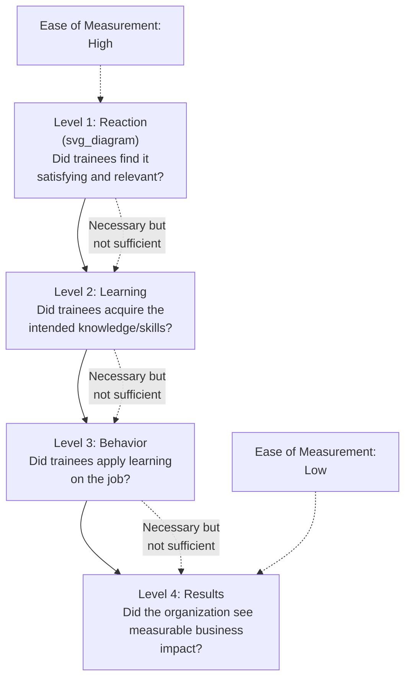
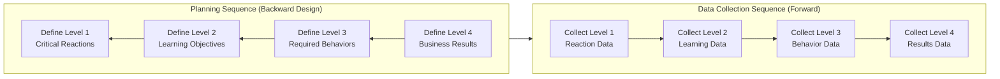

## Training Evaluation and the Kirkpatrick Model

### Overview

Training evaluation is the systematic process of collecting and analyzing data to determine the effectiveness, value, and impact of a training program. The **Kirkpatrick Model**, developed by Donald Kirkpatrick (1959, later elaborated across subsequent decades), is the most widely referenced framework for structuring training evaluation, organizing assessment into four progressively more consequential and progressively more difficult-to-measure levels. It functions as the primary methodological tool for operationalizing the Evaluation phase of the ADDIE instructional design model.

### The Four Levels of the Kirkpatrick Model

| Level | Name | What It Measures | Typical Measurement Method |
| --- | --- | --- | --- |
| Level 1 | Reaction | Trainees' satisfaction with and perceived relevance/usefulness of the training | Post-training surveys, "smile sheets," feedback forms |
| Level 2 | Learning | The degree to which trainees acquired the intended knowledge, skills, or attitudes | Tests, skill demonstrations, simulations, pre/post assessments |
| Level 3 | Behavior | The degree to which trainees apply what they learned back on the job | Supervisor/peer observation, 360-degree feedback, on-the-job performance metrics |
| Level 4 | Results | The tangible organizational outcomes resulting from the training | Productivity metrics, quality metrics, turnover rates, sales figures, ROI/cost-benefit analysis |

**Key Points**

- The four levels are cumulative and hierarchical in logic: positive reaction (Level 1) does not guarantee learning occurred (Level 2); learning does not guarantee behavior change on the job (Level 3); and behavior change does not guarantee measurable organizational results (Level 4) — each level represents a necessary but not sufficient condition for the next.
- Evaluation effort and measurement difficulty generally increase moving from Level 1 to Level 4: Level 1 data is cheap and fast to collect, while Level 4 data often requires longer time horizons, more sophisticated measurement, and greater ability to isolate training's contribution from other confounding organizational factors.

### Diagram: The Four Levels of the Kirkpatrick Model

### Level 1: Reaction — Detailed Treatment

**Key Points**

- Level 1 evaluation assesses trainees' immediate subjective response to the training experience, commonly including perceived relevance, engagement, instructor/facilitator quality, and satisfaction with logistics and materials.
- While the easiest and most commonly collected level of evaluation data in organizational practice, Level 1 data has been criticized in the training literature as a weak proxy for actual learning or performance impact; positive reactions do not reliably predict Level 2, 3, or 4 outcomes, and over-reliance on "smile sheet" data alone can create a false sense of training program success.
- Some more sophisticated Level 1 instruments distinguish between **affective reactions** (enjoyment, satisfaction) and **utility reactions** (perceived usefulness/relevance to the job), with utility reactions generally considered a somewhat stronger (though still limited) predictor of subsequent training outcomes than pure affective satisfaction.

### Level 2: Learning — Detailed Treatment

**Key Points**

- Level 2 evaluation directly measures whether the specific learning objectives defined during instructional design (see Instructional Design and the ADDIE Model) were achieved, typically through knowledge tests, skill demonstrations, or simulation-based assessment.
- A rigorous Level 2 evaluation design often employs a pre-test/post-test approach to isolate the specific knowledge or skill gain attributable to the training, rather than relying solely on a single post-training assessment (which cannot distinguish prior knowledge from newly acquired learning).
- Learning objectives written in Mager's three-component format (performance, conditions, criteria) directly support clear, measurable Level 2 assessment design.

### Level 3: Behavior — Detailed Treatment

**Key Points**

- Level 3 evaluation assesses **training transfer** — the degree to which knowledge and skills acquired during training are actually applied in the on-the-job context, representing a critical and frequently under-measured link between training investment and organizational value.
- Level 3 measurement requires sufficient time after training completion for trainees to have opportunities to apply learned behaviors on the job, making this level inherently more time-delayed and logistically complex to assess than Levels 1 and 2.
- Common methods include direct supervisor observation using behaviorally anchored checklists, 360-degree feedback instruments, and analysis of job performance metrics plausibly linked to trained behaviors.
- Level 3 outcomes are substantially influenced by organizational **transfer climate** factors (supervisor support, opportunity to apply new skills, alignment of incentive structures) that are largely outside the direct control of the training program itself — meaning poor Level 3 results do not necessarily indicate poor training design; they may instead reflect an unsupportive transfer environment (see Training Needs Analysis for related discussion of organizational-level factors).

### Level 4: Results — Detailed Treatment

**Key Points**

- Level 4 evaluation connects training to tangible, typically financially or operationally meaningful organizational outcomes (productivity, quality, safety incidents, turnover, customer satisfaction, sales, and ultimately return on investment).
- Level 4 evaluation is widely recognized in the training literature as the most methodologically challenging level to conduct rigorously, primarily due to the difficulty of isolating training's causal contribution to organizational results from other simultaneous influences (market conditions, concurrent organizational initiatives, seasonal effects, and other confounds).
- Rigorous Level 4 evaluation designs, where feasible, employ comparison/control groups (e.g., comparing trained versus untrained employee or unit performance) or time-series analysis to strengthen causal inference, though true experimental control is often impractical in applied organizational settings.

### The "New World Kirkpatrick Model" and Return on Expectations

**Key Points**

- In later elaborations of the framework (notably associated with James and Wendy Kirkpatrick), the model was revised to emphasize beginning the evaluation design process with Level 4 (defining desired organizational results first) and working backward through Levels 3, 2, and 1 during the *planning* stage — sometimes summarized as evaluating "backward" from intended business impact even though data is still typically *collected* in forward sequence (1 through 4) after training delivery.
- This revision also introduced the concept of **Leading Indicators** at Level 3 — near-term, observable behavioral signals that a desired Level 4 result is likely to follow — intended to provide earlier evidence of probable business impact without requiring the full time lag needed to observe final Level 4 results.
- [Unverified] The degree to which contemporary training organizations have adopted this "backward design" refinement versus continuing to apply the original forward-sequence four-level model varies across organizations and is not something this reference can quantify with precision.

### Return on Investment (ROI) as an Extension (Phillips' Fifth Level)

**Key Points**

- Jack Phillips proposed adding a fifth evaluation level — **ROI** — as an extension beyond Kirkpatrick's original four levels, explicitly calculating the financial return of a training program relative to its cost, typically expressed as:

$$ROI\% = \frac{\text{Net Program Benefits} - \text{Program Costs}}{\text{Program Costs}} \times 100$$

- [Unverified] Calculating a defensible Level 4/ROI figure requires isolating the specific financial contribution of training from other confounding factors (often using techniques such as control group comparison, trend line analysis, or expert/participant estimation of the percentage of improvement attributable to training), and different isolation methods can produce meaningfully different ROI estimates for the same underlying program; ROI figures in practitioner reports should be interpreted with attention to the specific isolation methodology used rather than taken as a straightforwardly objective figure.

### Diagram: Evaluation Planning Sequence vs. Data Collection Sequence

### Practical Application Example

**Example**

An organization implementing a new safety procedures training program might evaluate it as follows: Level 1 — post-session survey asking whether the training felt relevant and well-delivered; Level 2 — a written test and hands-on demonstration assessing whether trainees can correctly perform the new safety procedure; Level 3 — supervisor spot-checks over the following two months observing whether trained employees actually follow the new procedure during real work tasks; Level 4 — comparing safety incident rates in the trained unit before and after training (ideally against a comparison unit not yet trained) to assess organizational-level impact. A program showing strong Level 1 and 2 results but no Level 3 change would suggest a transfer climate problem (e.g., supervisors not reinforcing the new procedure, or production pressure discouraging its use) rather than a training design problem.

### Common Practical Challenges in Applying the Kirkpatrick Model

- **Over-reliance on Level 1 data**: Organizations frequently collect only Level 1 (reaction) data due to its low cost and ease of collection, creating an incomplete and potentially misleading picture of overall training effectiveness, since reaction data is a weak predictor of the higher, more organizationally consequential levels.
- **Resource and time constraints for Levels 3 and 4**: Rigorous Level 3 and Level 4 evaluation requires sustained post-training data collection and, ideally, comparison group designs, both of which demand more time, resources, and methodological sophistication than most organizations routinely invest in training evaluation.
- **Causal attribution difficulty**: Isolating training's specific causal contribution to Level 4 organizational results from simultaneous confounding factors remains a persistent methodological challenge, even when organizations do attempt higher-level evaluation.
- **Transfer climate confound**: Because Level 3 outcomes are heavily influenced by organizational transfer climate factors outside the training program's direct control, a Level 3 failure can be misattributed to poor training design when the underlying cause is an unsupportive post-training work environment.

### Criticisms and Limitations of the Kirkpatrick Model

- **Assumed causal chain not always empirically supported**: [Unverified] While the model's hierarchical logic (reaction → learning → behavior → results) is intuitive and influential, some training evaluation researchers have questioned the strength and consistency of empirical relationships between adjacent levels (e.g., the correlation between Level 1 reaction and Level 2 learning outcomes has been found to be weaker and less consistent across studies than the model's implied causal chain might suggest); the model should be understood as a useful organizing framework for evaluation planning rather than a strictly validated causal theory with uniform inter-level correlations.
- **Oversimplification of complex evaluation needs**: [Inference] The four-level structure, while practically useful for organizing evaluation activity, may oversimplify the full complexity of training evaluation (e.g., it does not explicitly address evaluation of the instructional design process itself, or formative evaluation conducted during development, both of which are addressed in broader ADDIE-level evaluation practice); it is best understood as a framework for evaluating training outcomes rather than a comprehensive evaluation methodology covering the entire instructional design lifecycle.
- **Level 4/ROI methodological contestability**: As discussed above, the specific technique used to isolate training's financial contribution for ROI calculation is not standardized across the field, and different legitimate methodological choices can produce different ROI figures for the same program, limiting straightforward cross-program or cross-organization ROI comparison.
- **Practical underutilization of higher levels**: The well-documented gap between how frequently Level 1 versus Level 3/4 data is actually collected in organizational practice represents an ongoing, unresolved practical limitation of the model's real-world application, independent of the model's own theoretical validity.

### Related Topics / Next Steps

- **Instructional Design and the ADDIE Model** — the broader instructional design process whose Evaluation phase the Kirkpatrick Model most commonly operationalizes
- **Training Needs Analysis** — upstream process establishing the objectives against which Level 2 learning outcomes are assessed
- **Training Transfer and Transfer Climate** — deeper treatment of organizational factors specifically affecting Level 3 outcomes
- **Adult Learning Theory** — theoretical foundation for instructional strategies whose effectiveness Kirkpatrick evaluation assesses
- **Utility Analysis in Selection** — related economic/ROI-oriented evaluation methodology used elsewhere in I-O practice
- **Phillips' ROI Methodology** — extended treatment of the fifth-level financial evaluation extension
- **Performance Management and Appraisal** — related data source for Level 3 behavior and Level 4 results measurement
- **Formative vs. Summative Evaluation** — extended methodological treatment of evaluation timing distinctions