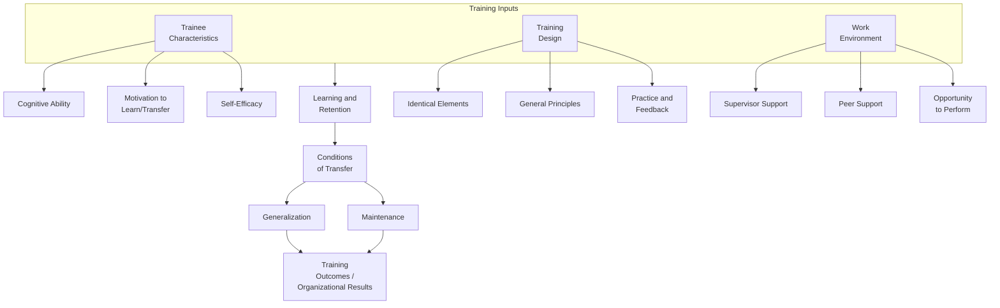
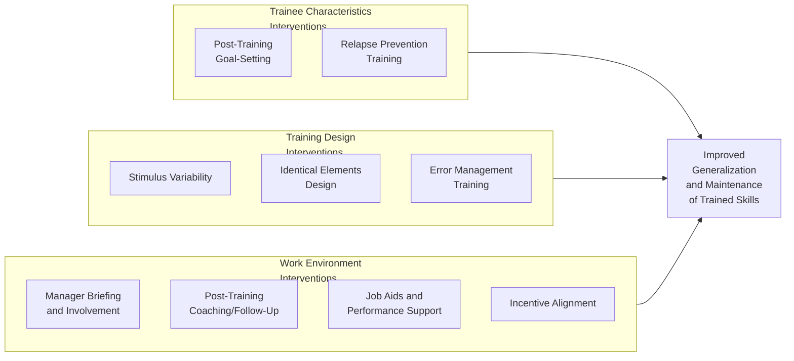

## Transfer of Training

### Overview

Transfer of training refers to the degree to which knowledge, skills, and attitudes acquired during a training program are applied, generalized, and maintained by trainees in their actual job performance over time. Transfer represents the critical link between training investment (analysis, design, development, and delivery) and organizational value, and is widely regarded in the training literature as one of the most persistent challenges in workplace learning — the well-documented gap between what is learned in training and what is actually applied on the job is often referred to as the "transfer problem."

### Defining Transfer: Generalization and Maintenance

**Key Points**

- Transfer of training is commonly decomposed into two related but distinct components: **generalization** (the degree to which trained skills are applied across situations that differ from the training context, not merely replicated in identical conditions) and **maintenance** (the degree to which trained skills continue to be applied over time after training concludes, rather than decaying or being abandoned).
- This distinction matters practically: a training program might produce strong initial application immediately after training (suggesting successful learning and short-term transfer) but show substantial decay in application months later (a maintenance failure), or might produce durable application only in situations closely resembling the training context (a generalization failure).

### Baldwin and Ford's Transfer of Training Model (1988)

The most widely cited theoretical framework for understanding transfer, developed by Baldwin and Ford, organizes the factors influencing transfer into three categories of inputs, which combine to determine transfer conditions and ultimately training outcomes.

#### Three Categories of Training Inputs

1. **Trainee Characteristics** — individual differences among learners that affect their capacity and motivation to transfer learning, including cognitive ability, motivation to learn/transfer, self-efficacy, and personality traits (e.g., conscientiousness).
2. **Training Design** — features of the instructional program itself, including the use of identical elements (similarity between training and job context), general principles instruction, stimulus variability (practicing across varied scenarios), and the provision of adequate practice and feedback opportunities.
3. **Work Environment** — organizational and social context factors surrounding the trainee's return to the job, including supervisor support, peer support, opportunity to perform trained tasks, and the reward/incentive structure for applying new skills.

**Key Points**

- Baldwin and Ford's model explicitly frames transfer as a joint function of these three input categories operating together, rather than being determined by training design quality alone — meaning even a well-designed training program can fail to transfer if trainee motivation is low or the work environment does not support application.

### Diagram: Baldwin and Ford's Transfer of Training Model

### Trainee Characteristics Affecting Transfer

- **Motivation to Transfer** — distinct from motivation to learn during training, motivation to transfer specifically concerns the trainee's intention and drive to apply learned material once back on the job; consistently identified in the literature as a key proximal predictor of actual transfer behavior.
- **Self-Efficacy** — a trainee's belief in their own capability to successfully perform the trained behaviors is associated with greater persistence in attempting to apply new skills, particularly when initial attempts encounter difficulty.
- **Cognitive Ability** — associated with both learning acquisition (Level 2 in the Kirkpatrick framework) and the capacity to adapt learned principles to novel situations relevant to generalization.
- **Career/Goal Orientation** — trainees with stronger career commitment or learning goal orientation (versus performance goal orientation focused primarily on looking competent) are generally associated in the literature with greater engagement in the transfer process.

### Training Design Factors Affecting Transfer

- **Identical Elements Theory (Thorndike)** — the foundational principle that transfer is facilitated when the training context (stimuli, equipment, procedures) closely resembles the actual job context; the more physically and psychologically similar the training environment is to the work environment, the more directly transfer is expected to occur.
- **General Principles Theory** — an alternative/complementary theory holding that teaching underlying principles and rules (rather than only specific procedures) supports better generalization to novel situations that differ from the specific training scenarios encountered.
- **Stimulus Variability** — providing practice across a range of varied scenarios and conditions (rather than a single repeated scenario) is associated with improved generalization to the diverse conditions trainees will actually encounter on the job.
- **Behavioral Modeling and Practice** — providing opportunities to observe correct performance (modeling) combined with guided practice and feedback is a well-established instructional design element supporting skill acquisition and subsequent transfer.
- **Error Management Training** — an instructional approach that deliberately allows trainees to make and learn from errors during training (with guided reflection), theorized to build more robust, adaptable skill application and error-recovery capability than error-avoidant training approaches; [Unverified] comparative effectiveness findings for error management training versus traditional error-avoidant training vary somewhat across studies and task types.

### Work Environment Factors Affecting Transfer: The Transfer Climate Construct

**Key Points**

- **Transfer climate** refers to the set of situational cues and consequences in the work environment that either support or inhibit the application of trained skills, and is one of the most consistently emphasized organizational-level predictors of successful transfer in the literature.
- Key components of a supportive transfer climate typically include: **supervisor support** (encouragement, modeling, and reinforcement of trained behaviors by the trainee's direct manager), **peer support** (encouragement and collaborative reinforcement among coworkers), **opportunity to perform** (the trainee actually being given tasks and situations requiring application of the trained skills), and **positive consequences/rewards** for applying trained behaviors (versus a reward structure that inadvertently discourages the slower or unfamiliar application of new methods).
- Research has consistently found that supervisor support, in particular, functions as one of the strongest and most replicated work-environment predictors of successful training transfer.

### The Transfer Problem: Documented Decay

**Key Points**

- [Unverified] The training literature widely references a substantial "forgetting curve" and application decay following training, commonly summarized in practitioner literature with claims that a large proportion of trained content is not applied or is forgotten within a relatively short period post-training; however, the precise percentages cited in popular practitioner sources vary considerably in their methodological rigor and original sourcing, and specific numeric decay estimates should be treated cautiously rather than as a precisely established universal constant. The well-supported qualitative conclusion — that transfer decay is a real, common, and significant organizational problem — is more robust than any single specific percentage figure often circulated in practitioner contexts.

### Strategies for Improving Training Transfer

1. **Relapse Prevention Training** — adapted from clinical psychology, this approach involves explicitly training learners to anticipate high-risk situations for reverting to old behaviors and to develop coping strategies in advance, building resilience against transfer decay.
2. **Goal-Setting Post-Training** — having trainees set specific, measurable application goals immediately following training (drawing on Goal-Setting Theory) is associated with improved follow-through on applying trained content.
3. **Manager/Supervisor Involvement** — actively involving supervisors before, during, and after training (briefing them on training content, encouraging their reinforcement of trained behaviors, and holding follow-up conversations) directly targets the supervisor support component of transfer climate.
4. **Post-Training Follow-Up and Coaching** — structured check-ins, coaching sessions, or booster/refresher sessions after initial training delivery help combat maintenance decay over time.
5. **Communities of Practice/Peer Support Structures** — formal or informal peer networks that continue to reinforce and discuss application of trained content after formal training concludes.
6. **Job Aids and Performance Support Tools** — providing reference materials, checklists, or embedded performance support tools available at the point of application can reduce reliance on unaided memory retrieval, supporting more consistent application.
7. **Aligning Incentive Structures** — ensuring that organizational reward systems do not inadvertently penalize the initial slower or less fluent application of newly trained methods relative to familiar prior habits.

**Example**

A sales organization training representatives on a new consultative selling methodology might combine: pre-training manager briefings so supervisors understand and can reinforce the new approach; varied practice scenarios during training (stimulus variability) rather than a single scripted role-play; post-training goal-setting where each representative commits to specific application targets for their first month; scheduled 30-day follow-up coaching sessions with their manager; and a readily accessible job aid summarizing the methodology's key steps for in-the-moment reference during actual sales calls — collectively targeting trainee motivation, training design, and work environment support simultaneously, consistent with Baldwin and Ford's three-input framework.

### Diagram: Strategies Mapped to Baldwin and Ford's Input Categories

### Transfer of Training's Position in the Broader Training Evaluation Framework

**Key Points**

- Transfer of training corresponds directly to **Level 3 (Behavior)** in the Kirkpatrick Model of training evaluation, and difficulty achieving strong transfer is a primary reason Level 3 evaluation results are frequently weaker or more variable than Level 1 and Level 2 results.
- Poor transfer results should prompt diagnostic investigation into which of Baldwin and Ford's three input categories is the likely bottleneck (trainee motivation, training design quality, or work environment support) rather than an automatic assumption that the training content or delivery itself was deficient.

### Criticisms and Limitations

- **Decay statistic overuse and imprecision**: As noted above, widely circulated specific numeric claims about how much trained content is forgotten or unapplied often originate from sources with unclear or dated methodology; practitioners should treat the general phenomenon as well-established while treating any specific percentage figure with appropriate caution absent a clearly sourced, current empirical basis.
- **Difficulty isolating input category contributions**: [Inference] Because trainee characteristics, training design, and work environment factors interact and operate simultaneously in real organizational settings, precisely isolating which specific input category is most responsible for a given transfer failure can be methodologically difficult in applied (non-experimental) organizational contexts, even though the Baldwin and Ford framework conceptually separates them for analytical clarity.
- **Identical elements vs. general principles tension**: These two training design theories offer somewhat different prescriptions (maximize training-job similarity vs. teach abstract transferable principles), and the literature does not offer a single universal resolution to when each approach is preferable; [Inference] the appropriate balance likely depends on the specific task's complexity and the degree of variability the trainee will encounter on the job, though this is a contextual judgment rather than a fixed rule.
- **Organizational climate as a persistent, hard-to-change barrier**: Even well-designed interventions targeting transfer climate (manager involvement, incentive alignment) require sustained organizational commitment beyond the training function's direct control, meaning training professionals often have limited unilateral ability to fully resolve transfer climate barriers rooted in broader organizational culture, leadership priorities, or incentive systems.

### Related Topics / Next Steps

- **Training Evaluation and the Kirkpatrick Model** — the broader evaluation framework in which transfer corresponds to Level 3 (Behavior)
- **Training Needs Analysis** — the upstream process where transfer climate is first assessed as part of organizational analysis
- **Instructional Design and the ADDIE Model** — the design process responsible for training design factors affecting transfer
- **Adult Learning Theory** — theoretical foundation relevant to trainee motivation and engagement factors
- **Goal-Setting Theory** — theoretical basis for post-training goal-setting as a transfer-enhancement strategy
- **Self-Efficacy Theory (Bandura)** — theoretical foundation for the trainee self-efficacy construct within the Baldwin and Ford model
- **Performance Management and Coaching** — organizational practices directly supporting post-training follow-up and supervisor reinforcement
- **Organizational Climate and Culture** — broader context shaping the work-environment transfer factors discussed here