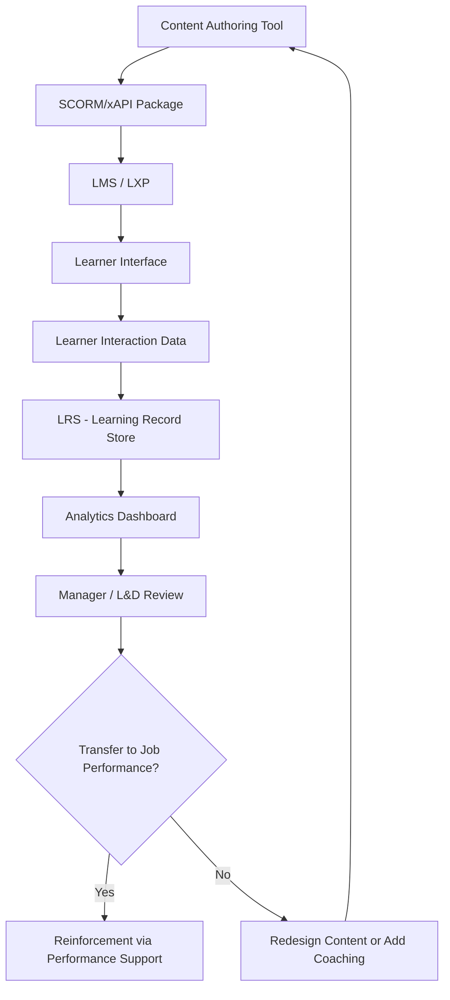

## E-Learning and Technology-Based Training

### Definition and Scope

E-learning and technology-based training refers to the delivery of instructional content through digital platforms, devices, and networks rather than exclusively through in-person, instructor-led methods. In organizational psychology, this domain examines how digital delivery mechanisms interact with cognitive, motivational, and social processes that determine whether training transfers into improved job performance. The field spans asynchronous self-paced modules, synchronous virtual instructor-led training (VILT), mobile learning (m-learning), simulations, virtual reality (VR) and augmented reality (AR) training, adaptive learning systems, and microlearning formats.

Technology-based training is not merely a delivery-medium substitution for classroom instruction. It restructures the psychological experience of learning by changing pacing control, social presence, feedback immediacy, and the learner's sense of autonomy — all variables with established effects on motivation and retention.

### Theoretical Foundations

**Cognitive Load Theory (Sweller)**

Cognitive Load Theory underpins most instructional design decisions in e-learning. It distinguishes three load types:

- Intrinsic load: inherent complexity of the material itself
- Extraneous load: load imposed by poor instructional design (e.g., split-attention effects, redundant on-screen text with narration)
- Germane load: load devoted to schema construction and learning

Well-designed e-learning minimizes extraneous load so cognitive resources are available for germane processing. This is the theoretical basis for principles like Mayer's Cognitive Theory of Multimedia Learning.

**Mayer's Multimedia Learning Principles**

Richard Mayer's research produced empirically validated principles that directly guide e-learning content design:

| Principle | Description |
| --- | --- |
| Coherence | Exclude extraneous material (decorative images, irrelevant audio) |
| Signaling | Highlight essential organization/cues |
| Redundancy | Avoid presenting identical text and narration simultaneously |
| Spatial Contiguity | Place corresponding text and graphics near each other |
| Temporal Contiguity | Present corresponding narration and animation simultaneously |
| Segmenting | Break content into learner-paced segments |
| Pre-training | Introduce names/characteristics of key concepts before the main lesson |
| Modality | Prefer graphics + narration over graphics + on-screen text |

**Self-Determination Theory (Deci & Ryan) Applied to E-Learning**

E-learning platforms affect the three basic psychological needs:

- Autonomy: self-paced and asynchronous formats increase perceived control
- Competence: adaptive systems and immediate feedback loops support competence perception
- Relatedness: the primary vulnerability of e-learning; poorly designed asynchronous courses can reduce social connectedness, which is linked to lower motivation and higher attrition

**Social Cognitive Theory (Bandura)**

Self-efficacy — a learner's belief in their capacity to execute a task — predicts e-learning completion and transfer. Technology-based training can build self-efficacy through mastery experiences (practice simulations), vicarious experiences (video modeling of expert performance), and verbal persuasion (automated encouraging feedback).

### Modalities of Technology-Based Training

**Asynchronous E-Learning**

Self-paced modules (often SCORM- or xAPI-packaged) accessed via a Learning Management System (LMS). Advantages: scalability, scheduling flexibility, standardized content delivery. Psychological risk: lower social presence, higher dropout rates absent structured accountability mechanisms.

**Synchronous Virtual Instructor-Led Training (VILT)**

Live delivery via video conferencing platforms. Preserves some social presence and real-time Q&A but introduces "Zoom fatigue" — a documented phenomenon linked to nonverbal overload, mirror anxiety (seeing one's own video feed), and reduced mobility during sessions.

**Mobile Learning (m-Learning)**

Content optimized for smartphone/tablet consumption, frequently used for microlearning. Enables spaced repetition and just-in-time performance support (accessing a job aid at the point of need rather than in a training event divorced from application context).

**Simulations and Serious Games**

Simulations replicate job-relevant scenarios (e.g., customer service role-plays, equipment operation) allowing experiential learning within Kolb's experiential learning cycle (concrete experience → reflective observation → abstract conceptualization → active experimentation). Serious games apply game mechanics (points, levels, narrative) to training content — distinct from "gamification," which layers game elements onto non-game training activities.

**Virtual Reality (VR) and Augmented Reality (AR) Training**

VR immerses the learner in a simulated environment; AR overlays digital information onto the physical environment. VR is used for high-risk or low-frequency scenarios (emergency response, equipment failure) where real-world practice is costly or dangerous. [Inference] Meta-analytic evidence on VR training effectiveness compared to traditional methods shows mixed and context-dependent results, with stronger effects for psychomotor and spatial tasks than for declarative knowledge acquisition.

**Adaptive Learning Systems**

Use algorithms (often rule-based branching or, increasingly, machine-learning-driven) to adjust content difficulty, sequence, or remediation based on learner performance data. Grounded in the psychological principle of the Zone of Proximal Development (Vygotsky) — content should be calibrated to challenge without overwhelming.

**Microlearning**

Short, focused learning units (typically 3–10 minutes) targeting a single learning objective. Aligns with the spacing effect (distributed practice produces better long-term retention than massed practice) documented extensively in cognitive psychology.

### Standards and Technical Infrastructure

**SCORM (Sharable Content Object Reference Model)**

A technical standard governing how e-learning content packages communicate with an LMS (tracking completion, score, time spent). SCORM 1.2 and SCORM 2004 are the most widely deployed versions.

**xAPI (Experience API / Tin Can API)**

A newer specification that extends tracking beyond the LMS to capture learning experiences occurring outside a traditional course structure (e.g., reading an article, completing an on-the-job task, mentoring interactions), storing statements in a Learning Record Store (LRS) using an "actor-verb-object" data structure (e.g., "Employee completed Simulation").

**LMS/LXP Distinction**

- Learning Management System (LMS): administrator-centric, focused on compliance tracking, course assignment, and completion records
- Learning Experience Platform (LXP): learner-centric, emphasizes content discovery, personalized recommendations, and informal/social learning — reflecting a shift in organizational psychology toward learner autonomy models

### Evaluation Frameworks Applied to E-Learning

**Kirkpatrick's Four Levels**, adapted for digital training:

1. Reaction: often captured via embedded post-module surveys
2. Learning: assessed through knowledge checks, quizzes embedded in the LMS
3. Behavior: measured via on-the-job observation, manager ratings, or xAPI-tracked performance-support usage
4. Results: organizational KPIs (error rates, productivity, safety incidents)

**Kraiger, Ford, and Salas Learning Outcomes Taxonomy**

Distinguishes cognitive, skill-based, and affective learning outcomes — useful in e-learning evaluation because different modalities differentially support each outcome type (e.g., simulations favor skill-based outcomes; video content favors affective/attitudinal outcomes).

### Learner Engagement and Attrition Considerations

Asynchronous e-learning is associated with markedly higher dropout rates than instructor-led formats. [Inference] This is commonly attributed to reduced social accountability, absence of a fixed schedule, and lower intrinsic motivation triggers relative to a classroom setting, though completion rates vary substantially by organizational context, content relevance, and whether completion is mandatory versus voluntary.

Design mitigations grounded in psychological theory:

- **Chunking and pacing cues** to manage cognitive load
- **Social learning features** (discussion forums, cohort-based structures) to address the relatedness deficit
- **Gamification elements** (badges, leaderboards, progress bars) leveraging goal-setting theory (Locke & Latham) — visible progress functions as a proximal goal
- **Spaced retrieval practice** (quizzes distributed over time) to counter the forgetting curve (Ebbinghaus)
- **Manager involvement checkpoints** to reinforce transfer climate, a factor Baldwin and Ford's transfer model identifies as critical to training transfer regardless of delivery medium

### Technology-Based Training Architecture (Conceptual)

### Learner Cognitive Load Flow (svg_diagram)

<svg xmlns="http://www.w3.org/2000/svg" viewBox="0 0 640 260">
<text x="320" y="24" text-anchor="middle" font-size="16" font-weight="bold" fill="#1f2937">Cognitive Load in E-Learning Design (svg_diagram)</text>
<rect x="20" y="60" width="160" height="70" rx="8" fill="#dbeafe" stroke="#3b82f6" />
<text x="100" y="90" text-anchor="middle" font-size="12" fill="#1e3a8a">Intrinsic Load</text>
<text x="100" y="108" text-anchor="middle" font-size="10" fill="#1e3a8a">Task complexity</text>
<rect x="240" y="60" width="160" height="70" rx="8" fill="#fee2e2" stroke="#ef4444" />
<text x="320" y="90" text-anchor="middle" font-size="12" fill="#991b1b">Extraneous Load</text>
<text x="320" y="108" text-anchor="middle" font-size="10" fill="#991b1b">Poor design/clutter</text>
<rect x="460" y="60" width="160" height="70" rx="8" fill="#dcfce7" stroke="#22c55e" />
<text x="540" y="90" text-anchor="middle" font-size="12" fill="#166534">Germane Load</text>
<text x="540" y="108" text-anchor="middle" font-size="10" fill="#166534">Schema building</text>
<line x1="100" y1="130" x2="300" y2="180" stroke="#6b7280" stroke-width="2" />
<line x1="320" y1="130" x2="310" y2="180" stroke="#6b7280" stroke-width="2" />
<line x1="540" y1="130" x2="330" y2="180" stroke="#6b7280" stroke-width="2" />
<rect x="220" y="180" width="200" height="60" rx="8" fill="#fef3c7" stroke="#f59e0b" />
<text x="320" y="205" text-anchor="middle" font-size="12" fill="#78350f">Total Cognitive Capacity</text>
<text x="320" y="222" text-anchor="middle" font-size="10" fill="#78350f">Finite working memory</text>
</svg>

### Applied Example

**Example**

A retail organization deploys a compliance training module via SCORM package on their LMS. Completion rate after 30 days is 42%, far below the target 90%. Applying the theoretical frameworks above, an organizational psychologist would diagnose several likely contributors: absence of spaced retrieval (content presented in one 45-minute block, violating segmenting principles), no social accountability structure (fully asynchronous, no cohort or discussion component undermining relatedness), and extraneous load (decorative stock video clips unrelated to content, violating the coherence principle). Redesign would break the module into five 8-minute microlearning segments delivered via spaced release (one every three days), add a brief manager check-in after each segment to reinforce transfer climate, and strip nonessential media to reduce extraneous load.

### Limitations and Contextual Factors

- **Digital literacy variance**: Employees with lower technology self-efficacy may experience elevated anxiety that confounds learning outcome measurement independent of content quality
- **Access equity**: Bandwidth, device availability, and time-zone differences in distributed workforces can affect completion beyond motivational factors
- **Content-modality mismatch**: [Inference] Highly interpersonal skills (e.g., conflict resolution, negotiation) generally transfer less effectively through purely asynchronous digital formats compared to skills that are procedural or declarative in nature, though blended approaches combining digital pre-work with live practice sessions are commonly used to address this gap
- Behavioral claims about specific platforms (completion analytics accuracy, adaptive algorithm effectiveness) may vary by vendor implementation and should be validated against the specific system in use

### Related Topics

- Blended Learning Models
- Instructional Systems Design (ADDIE, SAM)
- Learning Transfer Climate
- Gamification vs. Game-Based Learning
- Learning Analytics and People Analytics
- Onboarding Program Design
- Microlearning and Spaced Repetition Systems
- Virtual Team Training and Remote Workforce Development