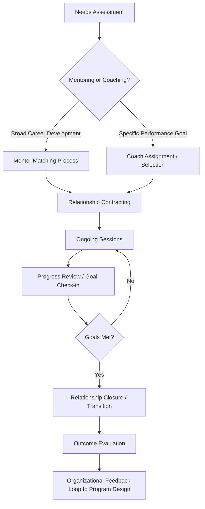

## Mentoring and Coaching

### Definitions and Distinctions

Mentoring and coaching are both developmental relationships used within organizations, but they differ in structure, focus, and theoretical grounding.

| Dimension | Mentoring | Coaching |
| --- | --- | --- |
| Primary Focus | Career development, holistic growth | Specific performance/skill improvement |
| Relationship Duration | Long-term (months to years) | Short-to-medium term, often goal-bounded |
| Power Dynamic | Typically senior-junior (informal or formal) | Can be peer, external, or manager-as-coach |
| Directiveness | Advice-giving, sponsorship, role modeling | Facilitative, questioning-based (non-directive in most models) |
| Content Scope | Broad (career, organizational politics, identity) | Narrow (specific competency, behavior, goal) |

**Mentoring** is a developmental relationship in which a more experienced individual (mentor) provides guidance, psychosocial support, and career-related assistance to a less experienced individual (protégé/mentee). Kram's (1985) foundational framework identifies two core mentoring functions:

- **Career functions**: sponsorship, exposure-and-visibility, coaching, protection, challenging assignments
- **Psychosocial functions**: role modeling, acceptance-and-confirmation, counseling, friendship

**Coaching** is a structured, often time-bound process focused on enhancing performance, skill acquisition, or goal attainment through a facilitative (typically non-advice-giving) relationship. Organizational psychology distinguishes several coaching types:

- Executive coaching (senior leaders, often externally provided)
- Performance coaching (specific job-competency focus)
- Peer coaching (lateral, non-hierarchical)
- Manager-as-coach (line manager applying coaching skills within supervisory role)

### Theoretical Foundations

**Social Learning Theory (Bandura)**

Mentoring functions substantially through vicarious learning and role modeling — mentees observe and internalize behaviors demonstrated by mentors, consistent with Bandura's emphasis on observational learning and modeling as mechanisms of behavior acquisition.

**Adult Learning Theory / Andragogy (Knowles)**

Coaching aligns closely with andragogical principles: problem-centered (versus subject-centered) learning, leveraging the learner's experience as a resource, and self-directed goal ownership. Effective coaching relies on the coachee driving the agenda rather than being taught content.

**Goal-Setting Theory (Locke & Latham)**

Most coaching models are structurally built around goal-setting mechanics — specific, measurable goals with feedback loops produce higher performance than vague or absent goals. Coaching frameworks (see GROW model below) operationalize this directly.

**Self-Determination Theory (Deci & Ryan)**

Both mentoring and coaching effectiveness depend on supporting the three basic psychological needs. Coaching's non-directive questioning approach is specifically designed to preserve autonomy (versus directive instruction, which can undermine it), while mentoring's psychosocial support functions address relatedness and, through role modeling and encouragement, competence.

**Social Exchange Theory**

Mentoring relationships are sustained through reciprocal exchange — mentors gain generativity satisfaction, visibility, and loyal networks; mentees gain career capital. Perceived imbalance in this exchange is a documented predictor of relationship dissolution or dysfunction.

### Coaching Models and Frameworks

**GROW Model (Whitmore)**

The most widely used coaching conversation structure:

- **G**oal: What does the coachee want to achieve?
- **R**eality: What is the current situation?
- **O**ptions: What possible courses of action exist?
- **W**ill (or Way Forward): What will the coachee commit to doing?

**OSKAR Model** (solution-focused alternative)

- **O**utcome, **S**cale, **K**now-how, **A**ffirm, **R**eview — emphasizes solution-focused brief therapy principles over problem analysis.

**CLEAR Model**

Contracting, Listening, Exploring, Action, Review — emphasizes the contracting phase (establishing explicit coaching agreement) more heavily than GROW.

### Mentoring Program Structures

**Formal vs. Informal Mentoring**

- Informal mentoring arises organically based on interpersonal attraction/compatibility; research generally finds informal relationships produce stronger psychosocial outcomes
- Formal mentoring is organizationally sponsored and matched; offers scalability and equity of access but risks lower relational quality if matching is poor

**Mentoring Configurations**

- Traditional dyadic (one senior mentor, one mentee)
- Peer mentoring (similar-status colleagues)
- Group mentoring (one mentor, multiple mentees, or mentee cohort structure)
- Reverse mentoring (junior employee mentors senior employee, often on technology or generational-perspective topics)
- Mentoring networks/constellations — the mentee draws developmental support from multiple mentors simultaneously, a model reflecting recognition that no single mentor can fulfill all career and psychosocial functions

### Manager-as-Coach Model

Organizations increasingly train line managers in coaching skills rather than relying solely on formal executive coaching engagements. Core competencies typically trained:

- Active listening (distinguishing from listening-to-respond)
- Powerful/open questioning (avoiding leading or closed questions)
- Withholding premature advice-giving
- Constructive feedback delivery (e.g., Situation-Behavior-Impact model)
- Accountability follow-through structuring

[Inference] Evidence on manager-as-coach effectiveness is mixed relative to professional/external coaching, largely because the inherent power differential and performance-evaluation role of the manager can undermine the psychological safety required for open, non-defensive coaching conversations — though outcomes vary considerably based on organizational trust climate and manager skill level.

### Coaching and Mentoring Process Flow

### Relationship Lifecycle (Kram's Mentoring Phase Model)

<svg xmlns="http://www.w3.org/2000/svg" viewBox="0 0 680 220">
<text x="340" y="24" text-anchor="middle" font-size="16" font-weight="bold" fill="#1f2937">Kram's Mentoring Relationship Phases (svg_diagram)</text>
<rect x="20" y="60" width="140" height="80" rx="8" fill="#e0e7ff" stroke="#6366f1" />
<text x="90" y="90" text-anchor="middle" font-size="12" fill="#312e81">Initiation</text>
<text x="90" y="108" text-anchor="middle" font-size="10" fill="#312e81">6-12 months</text>
<rect x="190" y="60" width="140" height="80" rx="8" fill="#dbeafe" stroke="#3b82f6" />
<text x="260" y="90" text-anchor="middle" font-size="12" fill="#1e3a8a">Cultivation</text>
<text x="260" y="108" text-anchor="middle" font-size="10" fill="#1e3a8a">2-5 years</text>
<rect x="360" y="60" width="140" height="80" rx="8" fill="#fef3c7" stroke="#f59e0b" />
<text x="430" y="90" text-anchor="middle" font-size="12" fill="#78350f">Separation</text>
<text x="430" y="108" text-anchor="middle" font-size="10" fill="#78350f">Role/structure change</text>
<rect x="530" y="60" width="140" height="80" rx="8" fill="#dcfce7" stroke="#22c55e" />
<text x="600" y="90" text-anchor="middle" font-size="12" fill="#166534">Redefinition</text>
<text x="600" y="108" text-anchor="middle" font-size="10" fill="#166534">Peer-like ongoing tie</text>
<line x1="160" y1="100" x2="188" y2="100" stroke="#6b7280" stroke-width="2" marker-end="url(#arrow)" />
<line x1="330" y1="100" x2="358" y2="100" stroke="#6b7280" stroke-width="2" marker-end="url(#arrow)" />
<line x1="500" y1="100" x2="528" y2="100" stroke="#6b7280" stroke-width="2" marker-end="url(#arrow)" />
</svg>

### Applied Example

**Example**

A mid-sized technology firm launches a formal mentoring program pairing senior engineers with newly promoted managers. Six months in, engagement data shows 60% of pairs meeting regularly, but exit interviews reveal frustration: several mentees report their mentor "just tells me what to do" rather than helping them think through decisions. Diagnosis: the mentors are conflating mentoring's legitimate advice-giving/sponsorship function with coaching's non-directive facilitation function, producing a mismatch with mentee expectations for autonomy-supportive development. Intervention: introduce brief coaching-skills training (active listening, GROW-based questioning) for mentors, paired with explicit relationship contracting at program start that clarifies when the mentor will advise versus facilitate.

### Measurement and Evaluation

Common outcome measures in organizational research:

- **Career outcomes**: promotion rate, compensation growth, retention/turnover intention
- **Psychosocial outcomes**: job satisfaction, organizational commitment, self-efficacy, role clarity
- **Coaching-specific outcomes**: goal attainment scaling, 360-degree feedback score change, behavioral observation ratings
- **Relationship quality measures**: instruments such as the Mentoring Functions Scale (based on Kram's framework) or the Working Alliance Inventory (adapted from coaching/therapy research) to assess trust and rapport

### Limitations and Contextual Factors

- **Matching quality** is consistently identified as a primary determinant of formal mentoring success; poor matching (forced pairing without input from either party) is associated with lower relationship quality and higher dissolution
- **Cross-gender and cross-race mentoring** dynamics carry documented complexities including reduced psychosocial function delivery in some studies, attributed to identification and stereotype-related dynamics rather than any deficit in mentor capability
- **Executive coaching ROI** claims in commercial coaching literature often rely on self-report and lack rigorous experimental controls; [Speculation] reported ROI multiples in vendor marketing materials should be treated with substantial skepticism absent independent methodological review
- Behavioral outcomes of any specific coaching or mentoring program depend heavily on organizational trust climate, participant voluntariness, and facilitator/mentor skill level, and may not generalize across contexts

### Next Steps

- Coaching Competency Frameworks (ICF Core Competencies)
- Mentoring Program Design and Matching Algorithms
- 360-Degree Feedback and Coaching Integration
- Psychological Safety in Developmental Relationships
- Career Development Theory (Super, Holland)
- Succession Planning and High-Potential Development
- Feedback Delivery Models (SBI, Radical Candor)