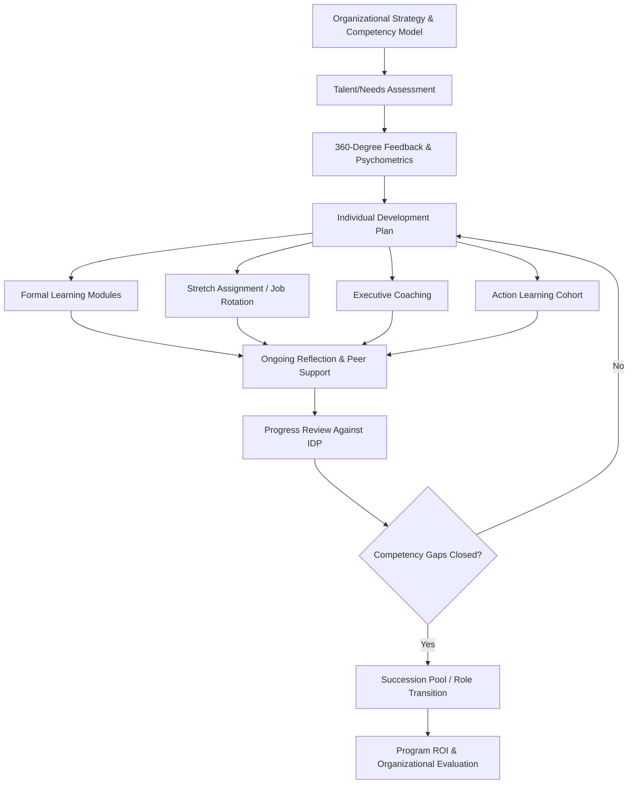

## Leadership Development Programs

### Definition and Scope

Leadership development programs (LDPs) are structured organizational interventions designed to build the knowledge, skills, abilities, and psychological capacities required for effective leadership at individual, dyadic, team, and organizational-system levels. Day (2000) distinguishes **leader development** (building intrapersonal competence in individuals — self-awareness, self-regulation, self-motivation) from **leadership development** (building interpersonal, networked, and relational capacity across the organization). This distinction is foundational: many programs fail because they invest exclusively in leader development (individual skill-building) while neglecting the relational and systemic capacity that leadership development requires.

### Theoretical Foundations

**Leader Identity Development Theory**

Grounded in identity theory and Day and Harrison's work, this perspective holds that leadership development is fundamentally an identity construction process — individuals must come to internalize "leader" as a valued part of their self-concept before behavioral skill-building translates into sustained leadership behavior. Programs that focus only on competency checklists without identity work show weaker long-term behavior change.

**Experiential Learning Theory (Kolb)**

Most effective LDPs are structured around Kolb's cycle: concrete experience (stretch assignments, simulations) → reflective observation (structured debriefs, journaling) → abstract conceptualization (frameworks, models) → active experimentation (applying new behavior on the job). The often-cited "70-20-10" framework (70% experiential/on-the-job, 20% social/relational, 10% formal instruction), popularized by the Center for Creative Leadership, reflects this experiential emphasis, though the precise ratio is a heuristic rather than an empirically fixed proportion. [Inference] The specific 70-20-10 percentages are best treated as a directional principle favoring experience-based development rather than a precisely validated ratio.

**Social Learning Theory (Bandura)**

Role modeling by senior leaders, action-learning peer groups, and coaching relationships operate through observational learning mechanisms — a core reason mentoring and 360-degree feedback are frequently embedded within LDPs.

**Adaptive Leadership Theory (Heifetz)**

Distinguishes technical problems (solvable with existing knowledge/authority) from adaptive challenges (requiring new learning, values shifts, and loss). Contemporary LDPs increasingly incorporate adaptive-challenge simulations rather than purely technical skill training, reflecting recognition that senior leadership roles disproportionately involve adaptive rather than technical problems.

**Full Range Leadership Model / Transformational Leadership (Bass & Avolio)**

Many LDPs are explicitly structured around developing transformational leadership behaviors: idealized influence, inspirational motivation, intellectual stimulation, individualized consideration — often measured pre/post via the Multifactor Leadership Questionnaire (MLQ).

**Authentic Leadership Theory**

Emphasizes self-awareness, relational transparency, balanced processing, and internalized moral perspective. Influential in executive-level LDPs, particularly those incorporating reflective and narrative-based methods (leadership life-story exercises).

### Common Program Components

**360-Degree Feedback**

Multi-rater assessment (self, manager, peers, direct reports) providing a fuller perceptual picture than self-report or single-rater appraisal alone. Critical design consideration: feedback must be paired with structured interpretation support (a coach or facilitator) — unstructured 360 feedback delivered without interpretive scaffolding is associated with defensive reactions and limited behavior change.

**Assessment Centers and Psychometric Instruments**

Use of simulations (in-basket exercises, leaderless group discussions, role-plays) combined with standardized assessments (e.g., personality inventories, cognitive ability measures, leadership-style instruments) to generate a multi-method competency profile.

**Executive Coaching**

Individual coaching engagements, often paired with 360 feedback interpretation, goal-setting, and ongoing accountability check-ins (see prior Mentoring and Coaching reference for theoretical grounding).

**Action Learning**

Small cohorts work on real, unresolved organizational problems ("live" business challenges) while a facilitator structures reflection on both the task and the group process. Revans' original action-learning formula, L = P + Q (Learning = Programmed knowledge + Questioning insight), captures the combination of formal input and reflective inquiry.

**Stretch Assignments and Job Rotation**

Deliberately placing developing leaders in roles that exceed current competency, creating productive disequilibrium that drives learning — directly operationalizes Kolb's concrete-experience stage and is consistently identified in CCL and related research as the highest-impact developmental lever, though its effectiveness depends heavily on the availability of adequate support and reflection structures alongside the challenge.

**Simulations and Business Games**

Computer-based or in-person simulations replicating strategic decision-making environments, allowing safe-to-fail practice of high-stakes judgment.

**Mentoring Integration**

LDPs frequently embed formal mentoring components (see prior reference) to provide psychosocial support alongside skill development.

### Program Design Models

**ADDIE Applied to Leadership Development**

Analysis (competency gap identification via job analysis and organizational strategy alignment) → Design (learning objectives, method selection) → Development (content/simulation build) → Implementation → Evaluation.

**Leadership Pipeline Model (Charan, Drotter, Noel)**

Identifies distinct "passages" requiring fundamentally different skill sets, time application, and work values at each transition:

| Passage | Shift Required |
| --- | --- |
| Managing Self → Managing Others | From individual contribution to enabling others' work |
| Managing Others → Managing Managers | From managing work to managing managers, selecting/developing talent |
| Managing Managers → Functional Manager | From tactical to strategic, cross-functional influence |
| Functional Manager → Business Manager | Integrating functions, balancing short/long-term trade-offs |
| Business Manager → Group Manager | Valuing others' business success, portfolio strategy |
| Group Manager → Enterprise Manager | Enterprise-wide vision, external stakeholder relationships |

The Leadership Pipeline framework's core organizational-psychology implication: generic leadership training that ignores which "passage" a leader is navigating will misallocate development resources, since the required competencies differ qualitatively (not just in magnitude) across transitions.

### Leadership Development Program Flow

### 70-20-10 Development Mix (svg_diagram)

<svg xmlns="http://www.w3.org/2000/svg" viewBox="0 0 640 260">
<text x="320" y="24" text-anchor="middle" font-size="16" font-weight="bold" fill="#1f2937">70-20-10 Leadership Development Mix (svg_diagram)</text>
<rect x="40" y="60" width="280" height="140" fill="#dbeafe" stroke="#3b82f6" />
<text x="180" y="130" text-anchor="middle" font-size="14" fill="#1e3a8a">70%</text>
<text x="180" y="150" text-anchor="middle" font-size="11" fill="#1e3a8a">Experiential</text>
<text x="180" y="165" text-anchor="middle" font-size="10" fill="#1e3a8a">(stretch roles, projects)</text>
<rect x="320" y="60" width="160" height="140" fill="#dcfce7" stroke="#22c55e" />
<text x="400" y="130" text-anchor="middle" font-size="14" fill="#166534">20%</text>
<text x="400" y="150" text-anchor="middle" font-size="11" fill="#166534">Social</text>
<text x="400" y="165" text-anchor="middle" font-size="10" fill="#166534">(coaching, mentoring)</text>
<rect x="480" y="60" width="120" height="140" fill="#fef3c7" stroke="#f59e0b" />
<text x="540" y="130" text-anchor="middle" font-size="14" fill="#78350f">10%</text>
<text x="540" y="150" text-anchor="middle" font-size="11" fill="#78350f">Formal</text>
<text x="540" y="165" text-anchor="middle" font-size="10" fill="#78350f">(courses, workshops)</text>
</svg>

### Applied Example

**Example**

A financial services firm identifies a leadership gap at the "Managing Others to Managing Managers" pipeline transition — newly promoted directors continue behaving as high-performing individual managers rather than developing and selecting talent within their teams. Applying the Leadership Pipeline framework, the organization designs a targeted six-month program: 360-degree feedback focused specifically on delegation and talent-development behaviors, a stretch assignment leading a cross-functional initiative requiring reliance on subordinate managers rather than direct execution, paired executive coaching using the GROW model to address the underlying identity shift from "doer" to "developer of doers," and a quarterly action-learning cohort where directors present real delegation challenges to peers. Progress is evaluated via pre/post 360 comparison and retention/promotion-readiness ratings at 12 months.

### Evaluation and ROI Considerations

Kirkpatrick's four levels apply here as in other training contexts, with Level 3 (behavior change, typically via longitudinal 360 comparison) and Level 4 (business results — succession bench strength, leader retention, team engagement scores under the developed leader) being the most organizationally meaningful but hardest to isolate causally from confounding variables (market conditions, concurrent initiatives, selection effects in who receives development investment).

**Conclusion**

Leadership development programs are most effective when they combine experiential challenge (stretch assignments), relational support (coaching and mentoring), and structured reflection, calibrated to the specific leadership pipeline transition the individual is navigating, rather than applying generic competency training uniformly across leadership levels.

### Limitations and Contextual Factors

- **Selection bias in program evaluation**: LDPs are frequently offered to already high-potential employees, making it difficult to disentangle program effect from pre-existing ability/motivation differences in observational (non-experimental) organizational studies
- **Transfer climate dependency**: Even well-designed LDPs show attenuated impact when the organizational culture, immediate manager, or incentive structure does not support application of newly developed behaviors — consistent with Baldwin and Ford's transfer of training model
- **Cultural generalizability**: [Inference] Leadership models developed predominantly in Western (particularly U.S.) organizational contexts, including much of the transformational and authentic leadership literature, may require adaptation when applied in cultures with different power-distance or collectivism norms, though the extent of necessary adaptation varies by specific competency and cultural context
- ROI figures cited in vendor or consultancy leadership-development marketing materials should be treated cautiously absent transparent, independently reviewed methodology

### Related Topics

- Succession Planning
- High-Potential (HiPo) Identification Models
- 360-Degree Feedback Systems
- Executive Coaching (see Mentoring and Coaching)
- Organizational Culture and Transfer Climate
- Talent Management Systems
- Change Leadership and Adaptive Capacity