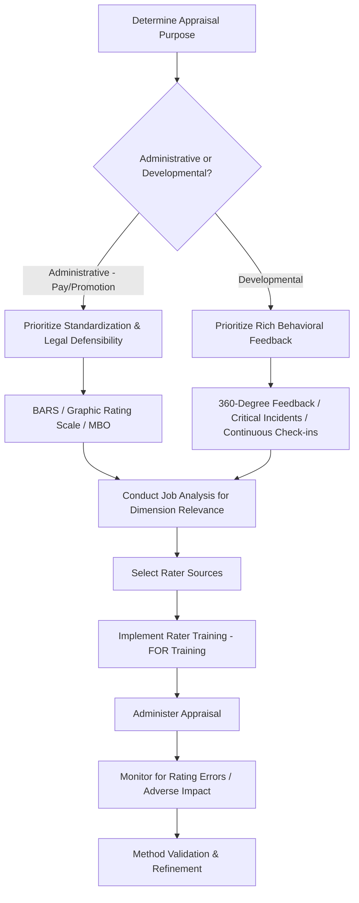

## Performance Appraisal Methods

### Definition and Scope

Performance appraisal methods are the structured techniques and instruments organizations use to formally evaluate employee job performance against defined standards, typically for purposes spanning administrative decisions (compensation, promotion), developmental feedback, and legal defensibility of personnel actions. Method choice has substantial psychometric consequences: different formats vary systematically in reliability, susceptibility to rating error, legal defensibility, and perceived fairness by ratees.

### Theoretical Foundations

**Social Cognitive Theory of Performance Rating (DeNisi & Murphy; Ilgen, Barnes-Farrell & McKellin)**

Performance appraisal is fundamentally an information-processing task: raters must observe behavior, encode it into memory, retrieve relevant information at rating time, and integrate it into an evaluative judgment. Each stage introduces potential distortion (attention limitations, memory decay, categorization biases), which is why appraisal method design focuses heavily on structuring observation and reducing cognitive load at each stage.

**Implicit Performance Theories**

Raters hold pre-existing schemas about what constitutes "good performance" that bias information processing before formal evaluation occurs — a foundational reason for rater training interventions (see Frame of Reference training below).

**Attribution Theory (Kelley; Heider)**

Raters' causal attributions for observed performance (ability vs. effort vs. situational factors) systematically influence appraisal ratings; self-serving and fundamental attribution biases are well-documented sources of rating distortion, particularly in comparing self-ratings to supervisor ratings.

**Organizational Justice Theory (Colquitt's four-factor model)**

Perceived fairness of appraisal methods operates through distinct justice dimensions:

- Distributive justice: perceived fairness of the rating outcome itself
- Procedural justice: fairness of the process used to arrive at the rating
- Interpersonal justice: treatment during the appraisal interaction
- Informational justice: adequacy of explanation given for the rating

Method selection interacts heavily with procedural justice perceptions — methods incorporating employee voice (self-assessment, appeals mechanisms) generally produce higher procedural justice perceptions independent of the actual rating received.

### Comparative (Relative) Appraisal Methods

**Ranking**

Raters order employees from best to worst performer. Simple to administer; eliminates leniency/central tendency error by forcing differentiation, but provides no information about the magnitude of performance differences and can produce interpersonal conflict.

**Paired Comparison**

Each employee is compared against every other employee in pairwise judgments; the number of comparisons required is $n(n-1)/2$ for $n$ employees, making this method impractical beyond small groups.

**Forced Distribution ("Stack Ranking" / "Rank and Yank")**

Raters must distribute ratings according to a predetermined distribution (e.g., 20% top, 70% middle, 10% bottom), historically associated with General Electric under Jack Welch. [Inference] Forced distribution systems have become substantially less common in recent years, with several major technology and consulting firms publicly discontinuing them, largely due to documented negative effects on collaboration and psychological safety when scarce top/bottom categories create zero-sum competition among team members; however, adoption levels vary by industry and organization.

### Absolute (Individual) Appraisal Methods

**Graphic Rating Scales**

Employees are rated on a numeric or descriptive scale (e.g., 1–5) across defined dimensions (quality, quantity, teamwork). Widely used due to simplicity and ease of quantitative aggregation, but vulnerable to leniency error, central tendency error, and halo effect (a favorable impression on one dimension inflating ratings on unrelated dimensions).

**Behaviorally Anchored Rating Scales (BARS)**

Developed by Smith and Kendall, BARS scales anchor each numeric point with specific, observable behavioral examples derived from critical incident analysis, rather than abstract adjectives (e.g., "excellent," "poor"). This reduces ambiguity in what each scale point represents and improves inter-rater reliability relative to generic graphic scales, though development cost (requiring job analysis and critical incident collection per job family) is substantially higher.

**Behavioral Observation Scales (BOS)**

Similar to BARS but rates the *frequency* with which specific behaviors are observed (e.g., "almost never" to "almost always") rather than rating a single point on a behavioral continuum.

**Management by Objectives (MBO)**

Drucker's framework applied to appraisal: performance is evaluated against specific, mutually agreed-upon objectives set collaboratively between employee and manager at the start of the period. Strongly aligned with goal-setting theory (Locke & Latham); effectiveness depends heavily on goal specificity and the degree of genuine (versus nominal) employee participation in goal-setting.

**Critical Incidents Method**

Supervisors maintain ongoing logs of specific instances of especially effective or ineffective behavior throughout the review period, reducing reliance on end-of-period memory reconstruction (directly addressing the memory-decay stage of the rating information-processing model).

**Essay/Narrative Method**

Open-ended written evaluation of employee performance. Rich qualitative detail but low standardization, poor comparability across raters, and high vulnerability to rater writing skill confounding evaluation quality.

**Checklist Method**

Rater selects from a predetermined list of behavioral statements describing the employee; a weighted checklist variant assigns different point values to statements based on prior job-analysis-derived importance weighting.

### Multi-Source and Modern Methods

**360-Degree Feedback**

Aggregates ratings from multiple sources — self, supervisor, peers, direct reports, sometimes external customers — providing a broader performance perspective than single-rater appraisal. Commonly used for developmental purposes; use for purely administrative decisions (pay, promotion) is more contested due to rater motivation differences (peers may inflate ratings to maintain relationships; direct reports may fear retaliation).

**Continuous Performance Management / Frequent Check-Ins**

A shift away from single annual reviews toward ongoing, frequent (often weekly or biweekly) structured conversations between manager and employee, paired with lighter-weight periodic formal documentation. [Inference] This shift, adopted by numerous large technology and professional services firms over the past decade, is generally attributed to closer alignment with how feedback actually influences behavior (proximal, frequent feedback being more behaviorally effective than distal, infrequent feedback per feedback intervention theory), though rigorous comparative effectiveness research against traditional annual review cycles remains more limited than the popularity of the shift would suggest.

**OKRs (Objectives and Key Results) as an Appraisal Input**

Originating at Intel and popularized by Google, OKRs set qualitative objectives paired with quantitative key results; while primarily a goal-management framework rather than a rating method per se, OKR attainment data is frequently incorporated as an input into broader performance appraisal.

### Rater Error and Bias Considerations

| Error Type | Description |
| --- | --- |
| Leniency/Severity | Systematic tendency to rate consistently high or low regardless of true performance |
| Central Tendency | Avoiding extreme ratings, clustering around the midpoint |
| Halo/Horn Effect | One positive/negative trait unduly influences ratings on unrelated dimensions |
| Recency Effect | Overweighting recent performance relative to the full review period |
| Similar-to-Me Bias | Rating more favorably those perceived as similar to the rater |
| Contrast Effect | Rating influenced by comparison to the immediately preceding ratee rather than an absolute standard |

**Frame of Reference (FOR) Training**

The most empirically supported rater training intervention; trains raters on a shared conceptual standard for what constitutes different performance levels, using practice ratings with expert-rated feedback to calibrate rater judgment against a common frame of reference. FOR training has shown more consistent improvements in rating accuracy in research compared to rater error training alone (which only teaches raters to avoid statistical error patterns without improving underlying judgment accuracy).

### Method Selection Decision Flow

### BARS Construction Process (svg_diagram)

<svg xmlns="http://www.w3.org/2000/svg" viewBox="0 0 640 260">
<text x="320" y="24" text-anchor="middle" font-size="16" font-weight="bold" fill="#1f2937">BARS Development Process (svg_diagram)</text>
<rect x="20" y="60" width="130" height="60" rx="8" fill="#dbeafe" stroke="#3b82f6" />
<text x="85" y="95" text-anchor="middle" font-size="11" fill="#1e3a8a">Critical Incidents Collection</text>
<rect x="180" y="60" width="130" height="60" rx="8" fill="#e0e7ff" stroke="#6366f1" />
<text x="245" y="95" text-anchor="middle" font-size="11" fill="#312e81">Cluster into Performance Dimensions</text>
<rect x="340" y="60" width="130" height="60" rx="8" fill="#fef3c7" stroke="#f59e0b" />
<text x="405" y="95" text-anchor="middle" font-size="11" fill="#78350f">Retranslation (independent verification)</text>
<rect x="500" y="60" width="130" height="60" rx="8" fill="#dcfce7" stroke="#22c55e" />
<text x="565" y="95" text-anchor="middle" font-size="11" fill="#166534">Anchor Scale Points with Retained Incidents</text>
<line x1="150" y1="90" x2="178" y2="90" stroke="#6b7280" stroke-width="2" />
<line x1="310" y1="90" x2="338" y2="90" stroke="#6b7280" stroke-width="2" />
<line x1="470" y1="90" x2="498" y2="90" stroke="#6b7280" stroke-width="2" />
</svg>

### Applied Example

**Example**

A manufacturing company using a generic 1–5 graphic rating scale finds substantial rater disagreement — the same employee receives markedly different ratings from different shift supervisors, and legal counsel flags the current system's vulnerability in a pending disparate-treatment complaint due to lack of documented behavioral standards. The organizational psychologist recommends transitioning to BARS for the "safety compliance" and "quality control" dimensions specifically, since these are high-stakes, frequently litigated performance areas. The development process involves collecting critical incidents from supervisors and high-performing employees, clustering them into behavioral dimensions, having a separate panel retranslate incidents to confirm dimension-anchor agreement (typically requiring 70–80% agreement for retention), and then anchoring the 1–5 scale with the retained, agreed-upon behavioral examples. This directly improves both inter-rater reliability and legal defensibility, since ratings are now tied to observable, job-analysis-derived behaviors rather than abstract trait judgments.

### Legal and Psychometric Standards

Performance appraisal methods used for employment decisions (termination, promotion, compensation) are subject to the same validity and adverse-impact scrutiny as selection instruments under frameworks such as the U.S. Uniform Guidelines on Employee Selection Procedures. Key defensibility factors include: job-relatedness (appraisal dimensions traceable to job analysis), standardization (consistent administration across raters/ratees), documented rater training, and availability of an appeals or review mechanism (informational and procedural justice supports).

### Limitations and Contextual Factors

- **Rater cognitive limitations are not fully eliminable**: even well-designed methods (BARS, FOR training) reduce but do not eliminate rating error, since human judgment remains the core measurement instrument
- **Cross-cultural variation**: [Inference] Appraisal method acceptance and effectiveness may vary across cultures differing in power distance and individualism/collectivism — for example, public ranking methods may generate more resistance in high-collectivism contexts — though the degree and consistency of this variation across specific methods is not uniformly established in the literature
- **Method-purpose mismatch risk**: using a single method simultaneously for both developmental and high-stakes administrative purposes is a common design flaw, since ratees' incentive to be candid in developmental self-assessment is undermined when the same data feeds compensation decisions
- Reported effectiveness of any specific appraisal method may vary substantially based on organizational implementation quality, rater training investment, and cultural context, and should not be assumed to generalize uniformly across settings

### Next Steps

- Job Analysis and Competency Modeling
- Performance Feedback and Delivery Models (SBI, Radical Candor)
- Goal-Setting Theory Applications in Appraisal
- Legal Compliance in Performance Management (Adverse Impact, Uniform Guidelines)
- Continuous Performance Management Systems
- Rater Training Interventions (FOR Training, Rater Error Training)
- Performance-Based Compensation Design