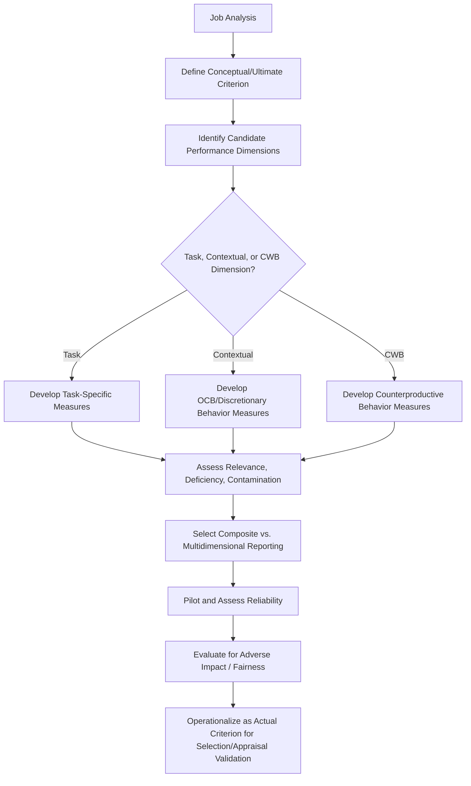

## Criterion Theory and Performance Dimensions

### Definition and Scope

Criterion theory concerns the conceptualization, definition, and measurement of job performance itself — the dependent variable against which selection tools, training programs, and appraisal systems are ultimately validated. It addresses a foundational question in industrial-organizational psychology: what exactly constitutes "performance," and how well do the measures organizations actually use (criteria) capture the construct they are theoretically intended to represent (the conceptual criterion)?

Criterion theory is distinct from performance appraisal methods (the *how* of rating) — it addresses the prior, more fundamental question of *what* should be measured and why available measures are typically imperfect representations of true performance.

### The Criterion Problem

**Ultimate Criterion vs. Actual Criterion (Thorndike, 1949)**

Thorndike's classic distinction remains foundational:

- **Ultimate criterion**: the complete, theoretical, multidimensional conceptualization of what constitutes successful job performance — inherently unmeasurable in full because it includes every relevant aspect of performance across all time
- **Actual criterion**: the specific, operationalized measure used in practice (e.g., supervisor ratings, sales figures, error counts)

The gap between these two is the **criterion problem**: no actual criterion perfectly captures the ultimate criterion, and organizational psychologists must explicitly reason about the nature and consequences of this gap rather than treating available measures as unproblematic ground truth.

**Criterion Relevance, Deficiency, and Contamination**

This framework decomposes the relationship between the actual criterion and the conceptual criterion:

- **Criterion relevance**: the degree to which the actual criterion overlaps with the conceptual criterion (the "true" performance construct of interest)
- **Criterion deficiency**: the portion of the conceptual criterion *not* captured by the actual criterion (e.g., a sales-only metric that omits customer relationship maintenance, a component of the true performance domain)
- **Criterion contamination**: the portion of the actual criterion that reflects variance *unrelated* to the conceptual criterion (e.g., territory quality systematically inflating some salespeople's numbers regardless of individual skill)

<svg xmlns="http://www.w3.org/2000/svg" viewBox="0 0 620 280">
<text x="310" y="24" text-anchor="middle" font-size="16" font-weight="bold" fill="#1f2937">Criterion Relevance, Deficiency, Contamination (svg_diagram)</text>
<circle cx="230" cy="150" r="100" fill="#dbeafe" fill-opacity="0.6" stroke="#3b82f6" stroke-width="2" />
<text x="170" y="90" font-size="12" fill="#1e3a8a">Conceptual Criterion</text>
<text x="170" y="105" font-size="10" fill="#1e3a8a">(Ultimate Criterion)</text>
<circle cx="330" cy="150" r="90" fill="#fee2e2" fill-opacity="0.6" stroke="#ef4444" stroke-width="2" />
<text x="420" y="90" font-size="12" fill="#991b1b">Actual Criterion</text>
<text x="420" y="105" font-size="10" fill="#991b1b">(Measured Score)</text>

<text x="200" y="150" font-size="11" fill="`#1e3a8a`" font-weight="bold">Deficiency</text>

<text x="200" y="165" font-size="9" fill="`#1e3a8a`">(unmeasured true perf.)</text>

<text x="280" y="150" font-size="11" fill="`#4c1d95`" font-weight="bold">Relevance</text>

<text x="278" y="165" font-size="9" fill="`#4c1d95`">(valid overlap)</text>

<text x="380" y="150" font-size="11" fill="`#991b1b`" font-weight="bold">Contamination</text>

<text x="378" y="165" font-size="9" fill="`#991b1b`">(irrelevant variance)</text>

</svg>

**Criterion Deficiency Example**: A call-center appraisal measuring only average call handling time captures speed but is deficient with respect to resolution quality, customer satisfaction, and issue escalation avoidance — all arguably part of the true performance domain.

**Criterion Contamination Example**: Sales figures used as the sole performance criterion are contaminated by territory assignment, economic conditions, and marketing support — factors outside the individual salesperson's control that nonetheless influence the actual criterion score.

### Static vs. Dynamic Criteria

**Criterion Stability Debate**

A long-running debate in the literature concerns whether individual performance rankings remain stable over time (static criterion) or shift meaningfully as employees gain experience, as job demands change, or as different performance determinants (e.g., initial learning vs. sustained motivation) become more or less relevant at different career stages (dynamic criterion). [Inference] Early influential work (Ghiselli; later Hofmann, Jacobs, and Gerras) argued for dynamic criteria, but subsequent reanalyses and meta-analytic work (notably by Austin, Humphreys, and others in the 1990s) suggested that much of the apparent instability in longitudinal performance data may be attributable to statistical artifacts (unreliability, regression to the mean) rather than genuine change in the underlying performance construct; the degree to which true performance dynamism exists independent of measurement artifact remains an area of ongoing scholarly discussion rather than settled consensus.

### Composite vs. Multidimensional Criteria

**Composite Criterion Approach**

Combines multiple performance indicators into a single overall score (often via weighted linear combination), producing one number for decision-making (e.g., overall performance rating for promotion decisions). Advantage: administrative simplicity for a single decision. Disadvantage: obscures which specific performance dimensions drive the overall score, and the weighting scheme itself embeds implicit value judgments about the relative importance of different performance aspects.

**Multiple/Multidimensional Criterion Approach**

Retains distinct performance dimensions as separate scores rather than collapsing them into one composite (e.g., separately reporting task performance, teamwork, and safety compliance). Preserves diagnostic and developmental value; complicates single-number administrative decisions requiring an explicit or implicit weighting choice to be made regardless, whether by the organization systematically or the individual decision-maker informally.

### Major Performance Dimension Taxonomies

**Task Performance vs. Contextual Performance (Borman & Motowidlo, 1993)**

A highly influential distinction in the performance-dimension literature:

- **Task performance**: proficiency in activities that directly contribute to the organization's technical core — the formal job duties captured in traditional job descriptions
- **Contextual performance**: discretionary behaviors that support the broader organizational, social, and psychological environment (volunteering for extra work, helping coworkers, following organizational rules even when personally inconvenient, persisting with enthusiasm) — conceptually overlapping with, though not identical to, Organizational Citizenship Behavior (OCB) as developed by Organ and colleagues

This distinction matters because task and contextual performance often have different predictors (cognitive ability predicts task performance more strongly; personality traits like conscientiousness and agreeableness predict contextual performance more strongly) and are frequently weighted differently, explicitly or implicitly, in overall performance judgments.

**Counterproductive Work Behavior (CWB)**

A third major performance dimension category, distinct from task and contextual performance: behaviors that actively harm organizational or individual interests (theft, absenteeism, workplace aggression, sabotage). Some theoretical frameworks (e.g., Rotundo & Sackett's integrative model) treat CWB as a conceptually distinct third pillar of the overall performance domain, given its differing motivational and dispositional predictors relative to positive-direction task and contextual performance.

**Campbell's Eight-Factor Model of Job Performance (1990)**

One of the most comprehensive taxonomies, proposing performance is composed of up to eight latent factors (not all applicable to every job): job-specific task proficiency, non-job-specific task proficiency, written and oral communication, demonstrating effort, maintaining personal discipline, facilitating peer and team performance, supervision/leadership, and management/administration. Campbell's model explicitly argues these represent the latent factor structure underlying performance across virtually all jobs, with different jobs weighting different factors.

### Criteria for Evaluating Criteria

Organizational psychologists apply explicit standards when judging whether a given actual criterion is adequate:

| Standard | Question Addressed |
| --- | --- |
| Relevance | Does it reflect the conceptual criterion of interest? |
| Reliability | Is the measure consistent across time, raters, or items? |
| Sensitivity/Discriminability | Does it distinguish between different performance levels? |
| Practicality | Is it feasible to collect given organizational constraints? |
| Fairness/Freedom from bias | Does it produce systematically different scores for protected groups unrelated to true performance differences? |

### Criterion Development Process

### Applied Example

**Example**

An organization validating a new selection test for customer service representatives initially uses "average customer satisfaction score" as its sole criterion measure. A criterion-theory analysis reveals two problems: deficiency, since the measure captures interaction-level satisfaction but omits contextual performance behaviors like helping overwhelmed colleagues during peak call volume; and contamination, since satisfaction scores are influenced by factors outside representative control, such as product defects driving the customer's call in the first place, which vary systematically by product line assignment. The organizational psychologist recommends supplementing the criterion with a multidimensional approach: retaining customer satisfaction as one task-performance indicator, adding a supervisor-rated contextual performance measure (peer helping, adherence to procedure), and statistically controlling for product-line assignment when validating the selection test against the satisfaction score, thereby reducing the contamination's distorting effect on the observed validity coefficient.

### Relationship to Selection and Validation

Criterion theory is the conceptual backbone of criterion-related validity in personnel selection (see predictive and concurrent validity designs): a selection test cannot be meaningfully validated against a criterion that is itself poorly conceptualized or badly contaminated, since the resulting validity coefficient reflects the test's relationship to a flawed proxy rather than to true job performance. This is frequently summarized as "the criterion problem constrains the selection problem" — no selection procedure's estimated validity can exceed the quality of the criterion against which it was validated, a relationship formalized in the correction for criterion unreliability within classical validity generalization methodology:

$$r_{corrected} = \frac{r_{observed}}{\sqrt{r_{xx}}}$$

where $r_{xx}$ is the reliability of the criterion measure.

### Limitations and Contextual Factors

- **The ultimate criterion is inherently unmeasurable**: by definition, criterion theory works with an idealized construct that can never be fully operationalized, meaning all criterion decisions involve some irreducible judgment about acceptable trade-offs between deficiency and practicality
- **Composite weighting is a value judgment, not a purely technical decision**: whichever weights are chosen for combining task, contextual, and CWB dimensions into an overall score reflect organizational priorities that are not dictated by measurement theory alone
- **Dynamic criterion evidence remains contested**: [Inference] whether true rank-order performance changes substantially over time independent of measurement artifact is not fully resolved in the literature, and practitioners should be cautious about assuming either strict stability or strict dynamism without context-specific evidence
- Findings regarding predictor-criterion relationships (e.g., cognitive ability predicting task performance more than contextual performance) represent general patterns from meta-analytic research and may not hold uniformly across all job types or organizational contexts

### Related Topics

- Performance Appraisal Methods
- Validity and Validation Strategies (Criterion-Related, Content, Construct)
- Organizational Citizenship Behavior (OCB)
- Counterproductive Work Behavior (CWB)
- Job Analysis Methods
- Utility Analysis in Personnel Selection
- Meta-Analysis and Validity Generalization