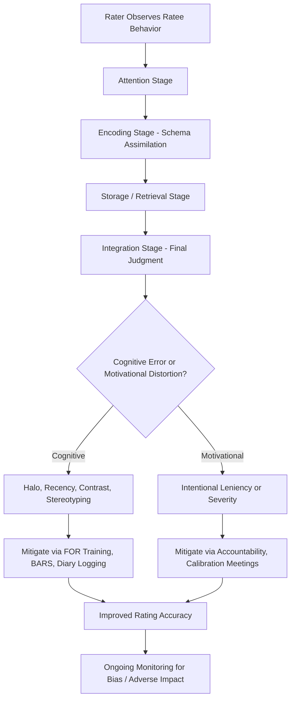

## Rater Biases and Rating Errors

### Definition and Scope

Rater biases and rating errors refer to systematic distortions in performance ratings that arise from the cognitive, motivational, and social processes involved in human judgment, rather than from true variance in ratee performance. These errors degrade the psychometric quality of performance data — reducing validity (accuracy relative to true performance) and, in some cases, reliability (consistency) — with downstream consequences for the legal defensibility, developmental value, and perceived fairness of appraisal systems.

This topic overlaps with, but is more granular than, the general performance-appraisal-methods literature: it focuses specifically on the *rater* as the source of measurement error, addressing why the same true performance level can generate different ratings depending on who is observing and judging it.

### Theoretical Foundations

**Information-Processing Model of Performance Rating (DeNisi, Cafferty & Meglino; Feldman)**

Rating errors are conceptualized as arising at distinct cognitive stages:

1. **Attention**: what behavior the rater notices in the first place (selective attention shaped by expectations)
2. **Encoding**: how observed behavior is categorized and stored in memory (often assimilated into pre-existing schemas)
3. **Storage/Retrieval**: what is retained and accessible in memory at rating time (subject to decay and reconstruction)
4. **Integration**: how retrieved information is combined into a final evaluative judgment

Different rating errors map onto different stages — recency effects are primarily retrieval-stage phenomena, while halo effects are primarily encoding/integration-stage phenomena (a global impression coloring the categorization of subsequent specific behaviors).

**Schema Theory and Implicit Performance Theories**

Raters hold pre-existing cognitive schemas about what "good performance" looks like, formed prior to any specific observation period. Incoming behavioral information is assimilated into these schemas, which can both aid efficient processing (schema-consistent information is easier to encode and recall) and introduce systematic distortion (schema-inconsistent information may be discounted, forgotten, or reinterpreted to fit the existing schema).

**Attribution Theory (Kelley; Weiner)**

Raters make causal attributions about *why* observed performance occurred (ability, effort, task difficulty, luck), and these attributions systematically shape ratings independent of the raw behavioral evidence. The **fundamental attribution error** — overweighting dispositional (person) explanations and underweighting situational explanations — is a well-documented contributor to rater bias, particularly when raters lack full visibility into the ratee's situational constraints.

**Motivational/Political Model of Rating (Longenecker, Sims & Gioia)**

Not all rating distortion is purely cognitive error; some is intentional and politically motivated. Raters may deliberately inflate ratings to avoid confrontation, motivate an employee, support a compensation request, or avoid the documentation burden of a low rating, or deliberately deflate ratings to justify termination, "manage out" an underperformer, or shock an employee into improved performance. This motivational perspective is distinct from cognitive-error explanations and requires different remediation strategies (accountability structures rather than training alone).

### Classic Rating Errors (Distributional/Statistical Errors)

| Error | Description | Primary Stage |
| --- | --- | --- |
| Leniency Error | Systematic tendency to rate higher than warranted by true performance | Integration/Motivational |
| Severity Error | Systematic tendency to rate lower than warranted by true performance | Integration/Motivational |
| Central Tendency Error | Avoidance of extreme (high or low) ratings, clustering near the scale midpoint | Integration |
| Restriction of Range | Ratings cluster within a narrow band, whether centrally, leniently, or severely, reducing the measure's ability to differentiate performance levels | Integration |

### Classic Rating Errors (Correlational/Content Errors)

| Error | Description | Primary Stage |
| --- | --- | --- |
| Halo Effect | A favorable overall impression, or high rating on one salient dimension, inflates ratings on unrelated dimensions | Encoding/Integration |
| Horn Effect | The negative-direction counterpart to halo — one unfavorable impression depresses ratings across unrelated dimensions | Encoding/Integration |
| Recency Effect | Recent behavior is disproportionately weighted relative to behavior earlier in the review period | Retrieval |
| Primacy Effect | Early impressions disproportionately shape overall judgment, with subsequent information interpreted to fit the initial impression | Encoding |
| Contrast Effect | A ratee's evaluation is influenced by comparison to the immediately preceding ratee rather than an absolute performance standard | Integration |
| Similar-to-Me Bias | Raters evaluate more favorably those they perceive as similar to themselves (background, attitudes, demographics) | Attention/Integration |
| Stereotyping | Ratings influenced by group-based expectations (demographic, role-based) rather than individuated behavioral evidence | Encoding |
| First-Impression Error | A variant of primacy in which initial trait judgments anchor the entire subsequent evaluation | Encoding |

### Distinguishing Rating Errors from True Score Variance

A critical methodological point: not all inter-rater disagreement or unusual rating distributions constitute "error" in a statistical sense. If different raters genuinely observe a ratee in different contexts (e.g., a peer observes collaboration behaviors a supervisor rarely sees), disagreement may reflect **true multidimensional performance variance** rather than rater error — this is a foundational rationale for 360-degree feedback rather than a psychometric flaw to be corrected. The distinction matters practically: statistical patterns that look like "error" (e.g., low supervisor-peer rating correlations) may sometimes indicate genuinely different, valid information rather than measurement failure.

### Bias vs. Error: A Conceptual Distinction

Though often used interchangeably in applied contexts, organizational psychology distinguishes:

- **Rating error**: statistical/psychometric distortion (leniency, halo, etc.) that can, in principle, affect any ratee regardless of group membership
- **Rating bias**: systematic differences in ratings that correlate with ratee group membership (race, gender, age, etc.) unrelated to true performance differences, raising adverse impact and discrimination concerns under frameworks such as the Uniform Guidelines on Employee Selection Procedures

A rater can exhibit classic errors (e.g., leniency) uniformly across all ratees without exhibiting bias, or can exhibit bias (systematically rating one demographic group lower) without necessarily showing classic distributional errors — the two constructs are related but not identical, and interventions targeting one do not automatically resolve the other.

### Rater Training Interventions

**Rater Error Training (RET)**

Teaches raters to recognize and consciously avoid classic statistical errors (halo, leniency, central tendency). [Inference] RET has shown limited and sometimes counterproductive effects in research — teaching raters to avoid halo, for instance, can paradoxically reduce rating *accuracy* if raters overcorrect and introduce artificial dimension differentiation that does not reflect genuine independent variance in the ratee's actual performance across dimensions.

**Frame of Reference (FOR) Training**

Generally considered the more empirically supported approach; trains raters on a shared, expert-calibrated conceptual standard for what different performance levels look like on each dimension, using practice ratings of vignettes or videos with expert-rater feedback to correct miscalibration. FOR training targets rating *accuracy* directly (correspondence to a defined standard) rather than merely reducing statistical error patterns, which is the key theoretical distinction from RET.

**Behavioral Observation Training**

Focuses on improving the attention and encoding stages directly — training raters to systematically observe and log specific behaviors (often via structured diaries or critical incident logging) throughout the review period rather than relying on end-of-period reconstructed memory, directly mitigating recency effects.

### Structural and Design-Based Mitigations

Beyond rater training, several structural interventions reduce error independent of individual rater skill:

- **BARS/BOS instruments**: anchor scale points with concrete behavioral examples, reducing reliance on ambiguous trait-level judgments that are more halo-prone
- **Multiple raters (360-degree feedback)**: averaging across independent raters reduces the influence of any single rater's idiosyncratic error, provided rater independence is genuine
- **Forced distribution**: mechanically addresses leniency/central tendency by requiring differentiation, though at the cost of potentially introducing new distortions when true performance does not follow the imposed distribution
- **Diary-keeping/critical incident logging**: reduces recency and primacy effects by capturing behavior throughout the period rather than relying on end-of-period recall
- **Accountability mechanisms** (e.g., requiring raters to justify ratings, calibration meetings across raters): address motivationally driven distortion (leniency to avoid conflict) that training alone does not resolve, since the rater may be fully capable of accurate judgment but motivated to misreport it

### Rating Error Source and Mitigation Flow

### Halo Effect Mechanism (svg_diagram)

<svg xmlns="http://www.w3.org/2000/svg" viewBox="0 0 640 240">
<text x="320" y="24" text-anchor="middle" font-size="16" font-weight="bold" fill="#1f2937">Halo Effect: Global Impression Contaminating Dimensions (svg_diagram)</text>
<circle cx="320" cy="90" r="45" fill="#fef3c7" stroke="#f59e0b" stroke-width="2" />
<text x="320" y="94" text-anchor="middle" font-size="11" fill="#78350f">Global Impression</text>
<rect x="60" y="170" width="120" height="50" rx="6" fill="#dbeafe" stroke="#3b82f6" />
<text x="120" y="200" text-anchor="middle" font-size="11" fill="#1e3a8a">Quality Rating</text>
<rect x="200" y="170" width="120" height="50" rx="6" fill="#dbeafe" stroke="#3b82f6" />
<text x="260" y="200" text-anchor="middle" font-size="11" fill="#1e3a8a">Teamwork Rating</text>
<rect x="340" y="170" width="120" height="50" rx="6" fill="#dbeafe" stroke="#3b82f6" />
<text x="400" y="200" text-anchor="middle" font-size="11" fill="#1e3a8a">Punctuality Rating</text>
<rect x="480" y="170" width="120" height="50" rx="6" fill="#dbeafe" stroke="#3b82f6" />
<text x="540" y="200" text-anchor="middle" font-size="11" fill="#1e3a8a">Initiative Rating</text>
<line x1="300" y1="130" x2="150" y2="168" stroke="#f59e0b" stroke-width="1.5" />
<line x1="310" y1="132" x2="270" y2="168" stroke="#f59e0b" stroke-width="1.5" />
<line x1="330" y1="132" x2="390" y2="168" stroke="#f59e0b" stroke-width="1.5" />
<line x1="340" y1="130" x2="510" y2="168" stroke="#f59e0b" stroke-width="1.5" />
</svg>

### Applied Example

**Example**

An organization notices that one supervisor's team consistently receives higher performance ratings than comparably performing teams under other supervisors, and further analysis shows this supervisor's ratings across all dimensions (quality, teamwork, initiative, punctuality) are highly intercorrelated (r > .85) regardless of dimension content — a signature pattern of halo effect combined with possible leniency. Rather than assuming individual employee performance differences explain the pattern, an organizational psychologist would first investigate rater-level explanations: does this supervisor observe employees less frequently (reducing dimension-specific behavioral evidence and increasing reliance on a single global impression)? Does the supervisor avoid documentation-heavy low ratings due to past employee pushback (motivational leniency)? Diagnosis would likely involve comparing this supervisor's inter-dimension rating correlations against organizational norms, then applying FOR training calibrated to behavioral anchors specific to each dimension, paired with a calibration meeting where this supervisor's ratings are reviewed alongside peer supervisors' ratings for similarly performing employees.

### Consequences for Organizational Decision-Making

Rating errors are not merely an academic measurement concern; they propagate into concrete organizational harms: compensation and promotion decisions based on inflated or contaminated ratings misallocate resources away from true high performers, legal exposure increases when rating patterns correlate with protected-class membership (potential disparate impact claims), and developmental feedback loses value when ratings do not accurately reflect specific behavioral strengths and weaknesses, undermining the diagnostic purpose of appraisal for training needs analysis.

### Limitations and Contextual Factors

- **Overcorrection risk**: as noted above, rater error training aimed at eliminating halo can paradoxically reduce accuracy if it induces artificial dimension differentiation; awareness of rating errors does not guarantee improved judgment without proper calibration-based training
- **Bias vs. legitimate multidimensionality**: not all cross-rater disagreement indicates error — distinguishing genuine rater bias/error from valid differences in observational context (as in 360-degree feedback) requires careful methodological analysis rather than assuming disagreement equals inaccuracy
- **Motivational distortion resists training-only interventions**: since intentional rating manipulation is a motivational rather than purely cognitive phenomenon, structural and accountability interventions are necessary complements to rater training programs
- [Inference] The relative prevalence and magnitude of specific rating errors (e.g., leniency versus severity, halo strength) may vary across organizational cultures, industries, and performance management system designs, and generalized error-rate estimates from the research literature should be treated as illustrative patterns rather than fixed universal parameters

### Next Steps

- Frame of Reference (FOR) Training Design
- Performance Appraisal Methods (BARS, 360-Degree Feedback)
- Criterion Theory and Performance Dimensions
- Organizational Justice and Appraisal Fairness Perceptions
- Adverse Impact and Legal Defensibility in Performance Management
- Calibration Meetings and Rater Consistency Processes