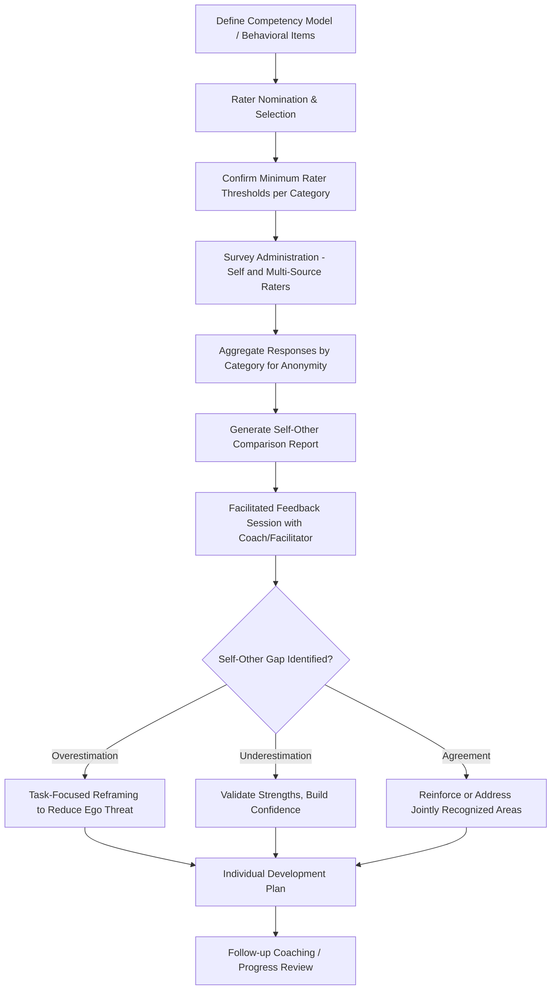

## 360-Degree Feedback

### Definition and Scope

360-degree feedback (also termed multi-rater or multisource assessment) is a performance feedback methodology in which an individual's performance data is gathered from multiple perspectives surrounding the ratee — typically self, direct supervisor, peers, direct reports, and sometimes external stakeholders such as customers — rather than relying on a single supervisory rating. The term "360 degrees" reflects the intent to capture a full circle of perspectives around the individual's role. It is distinct from, but frequently integrated into, both performance appraisal systems and leadership development programs.

### Theoretical Foundations

**Social Comparison Theory (Festinger)**

360-degree feedback operates partly through social comparison mechanisms: individuals gain self-insight by comparing their self-ratings against how others perceive them, a process theorized to be a primary driver of behavior change when self-other rating gaps are revealed.

**Self-Awareness and Self-Other Rating Agreement (SOA) Theory**

A substantial body of research (notably Atwater, Ostroff, Yammarino, and Fleenor) organizes 360 feedback around self-other rating agreement categories:

- **In agreement/good** (self-rating aligns with others' ratings, both favorable)
- **In agreement/poor** (self-rating aligns with others' ratings, both unfavorable)
- **Overestimators** (self-rating higher than others' ratings)
- **Underestimators** (self-rating lower than others' ratings)

[Inference] Research on these categories has generally found that overestimators show the most subsequent performance improvement following feedback (since the gap reveals a previously unrecognized development need), while the relationship for underestimators is less consistent — some studies suggest underestimation is associated with anxiety or excessive self-criticism rather than functioning as a straightforward motivator, though findings vary across samples and organizational contexts.

**Johari Window Model (Luft & Ingham)**

Frequently used as an explanatory heuristic for why multi-rater feedback adds value beyond single-source feedback: it is theorized to reduce the "blind spot" quadrant (behaviors visible to others but unknown to self) by systematically surfacing others' perceptions across multiple relationship types.

**Feedback Intervention Theory (Kluger & DeNisi, 1996)**

A meta-analytically grounded, cautionary theoretical framework of central importance to 360 feedback design: feedback interventions do not uniformly improve performance, and in a substantial proportion of studies reviewed, feedback interventions *decreased* performance. Kluger and DeNisi's core argument is that feedback effects depend on where attention is directed — feedback that shifts attention to the *task* tends to improve performance, while feedback that shifts attention to the *self* (ego-level, especially when threatening to self-esteem) can impair performance. This theory is a major reason 360 feedback delivery emphasizes behavioral specificity and coaching support rather than raw numeric score distribution alone.

**Social Exchange and Trust Theory**

Rater honesty in 360 systems (particularly peer and subordinate ratings) depends heavily on perceived confidentiality and absence of retaliation risk; trust in the process is a documented precondition for rating validity, not merely a procedural nicety.

### Rater Source Characteristics and Known Patterns

| Rater Source | Typical Vantage Point | Common Pattern |
| --- | --- | --- |
| Self | Intentions, effort, internal constraints | Often more lenient than others' ratings on average, though variance across individuals is substantial |
| Supervisor | Task performance, goal outcomes | Emphasizes task performance and results-oriented dimensions |
| Peers | Day-to-day collaboration, contextual performance | Often best positioned to observe teamwork/citizenship behaviors; may show leniency due to reciprocity concerns |
| Direct Reports | Leadership/supervisory behavior, fairness | Can be most sensitive to power-related behaviors; may underreport due to fear of identification/retaliation |
| Customers/External | Service quality, external-facing behavior | Captures dimensions invisible to internal raters; subject to factors outside ratee's control |

Low inter-rater correlations across these sources (a well-documented empirical finding) are frequently and mistakenly treated as measurement error; criterion theory suggests this pattern more often reflects genuinely different observational vantage points and potentially different underlying performance dimensions being observed (see prior reference on Criterion Theory and Performance Dimensions) rather than purely statistical unreliability.

### Purposes: Developmental vs. Administrative Use

**Developmental Use**

The historically dominant and most empirically supported application — feedback is used exclusively for individual growth planning, often paired with executive coaching to interpret results, with no direct linkage to compensation or promotion decisions. Confidentiality of individual rater responses (aggregated reporting) is typically preserved to encourage rating honesty.

**Administrative Use**

Using 360 data as an input to formal performance ratings, compensation, or promotion decisions. This use is more contested in the literature: [Inference] research and practitioner consensus generally suggest that administrative use of 360 feedback tends to reduce rater candor (peers and subordinates may inflate ratings knowing the stakes for the ratee, or in some cases use ratings punitively), undermining the data quality benefits that motivated multi-rater collection in the first place — though organizations continue to vary in how they balance this tension against the desire for richer input into high-stakes decisions.

### Process Design Components

**Rater Selection**

Typically the ratee nominates raters (sometimes with manager approval/adjustment) from among those with sufficient direct working contact; minimum rater-per-category thresholds (commonly 3+ per category) are standard practice to preserve anonymity through aggregation and prevent individual responses from being identifiable.

**Instrument Design**

Items are typically behaviorally specific (grounded in a competency model derived from job/leadership analysis) rather than trait-based, consistent with the broader appraisal-method principle that behavioral anchoring improves rating accuracy and reduces halo (see prior reference on Rater Biases and Rating Errors).

**Aggregation and Anonymity**

Individual rater responses within a category (peers, direct reports) are aggregated and reported as category averages rather than individually attributable, both to protect rater safety/honesty and, in many jurisdictions, to manage legal exposure around identifiable adverse feedback.

**Feedback Delivery**

Best practice strongly favors facilitated delivery (a trained coach or HR professional presents and helps interpret results) over unmediated report distribution, directly reflecting Feedback Intervention Theory's caution that raw, unscaffolded feedback — especially containing negative or unexpected self-other gaps — carries meaningful risk of ego-threat responses that impair rather than improve subsequent performance.

**Action Planning**

Structured follow-up (often an Individual Development Plan) translating feedback themes into specific behavioral goals, frequently integrated with coaching or mentoring relationships for accountability and skill-building support.

### 360-Degree Feedback Process Flow

### Self-Other Rating Agreement Quadrants (svg_diagram)

<svg xmlns="http://www.w3.org/2000/svg" viewBox="0 0 560 400">
<text x="280" y="24" text-anchor="middle" font-size="16" font-weight="bold" fill="#1f2937">Self-Other Rating Agreement (svg_diagram)</text>
<line x1="80" y1="60" x2="80" y2="360" stroke="#9ca3af" stroke-width="2" />
<line x1="80" y1="360" x2="520" y2="360" stroke="#9ca3af" stroke-width="2" />
<text x="30" y="210" font-size="11" fill="#374151" transform="rotate(-90 30 210)">Self-Rating</text>
<text x="300" y="385" text-anchor="middle" font-size="11" fill="#374151">Others' Rating</text>
<rect x="80" y="60" width="220" height="150" fill="#dcfce7" fill-opacity="0.7" />
<text x="190" y="130" text-anchor="middle" font-size="12" fill="#166534">Agreement / Good</text>
<text x="190" y="148" text-anchor="middle" font-size="10" fill="#166534">Low self / Low other</text>
<rect x="300" y="60" width="220" height="150" fill="#fef3c7" fill-opacity="0.7" />
<text x="410" y="130" text-anchor="middle" font-size="12" fill="#78350f">Underestimator</text>
<text x="410" y="148" text-anchor="middle" font-size="10" fill="#78350f">Low self / High other</text>
<rect x="80" y="210" width="220" height="150" fill="#fee2e2" fill-opacity="0.7" />
<text x="190" y="280" text-anchor="middle" font-size="12" fill="#991b1b">Overestimator</text>
<text x="190" y="298" text-anchor="middle" font-size="10" fill="#991b1b">High self / Low other</text>
<rect x="300" y="210" width="220" height="150" fill="#dbeafe" fill-opacity="0.7" />
<text x="410" y="280" text-anchor="middle" font-size="12" fill="#1e3a8a">Agreement / Poor</text>
<text x="410" y="298" text-anchor="middle" font-size="10" fill="#1e3a8a">High self / High other</text>
</svg>

### Applied Example

**Example**

A director in a professional services firm receives 360 feedback showing strong supervisor and peer ratings on strategic thinking but notably low direct-report ratings on "provides clear direction" and "approachable when problems arise," while the director's self-ratings on these same items are high — an overestimator pattern specifically concentrated in the direct-report source. Applying Feedback Intervention Theory, the facilitator avoids presenting this as a blunt numeric gap (risking ego-threat and defensive disengagement) and instead reframes the conversation around specific behavioral examples drawn from open-ended comments (e.g., instances where direction was communicated only via brief email rather than discussion), redirecting attention to task-level behavior change rather than triggering a self-esteem-protective reaction. The resulting development plan includes a specific, measurable action (weekly team check-ins) paired with a peer-coaching partnership, and a planned pulse-survey follow-up at 90 days to assess whether direct-report perceptions have shifted.

### Psychometric and Practical Considerations

- **Reliability**: individual rater ratings can be noisy; category-level aggregation (averaging across 3+ raters per source) improves reliability relative to any single rater, consistent with classical test theory principles regarding aggregation and measurement error reduction
- **Rater fatigue**: employees serving as raters for many colleagues across multiple simultaneous 360 cycles can experience declining response quality/candor, a practical organizational-design constraint
- **Cultural variation**: [Inference] direct upward feedback from subordinates to supervisors may be experienced differently across cultures varying in power distance, with some research suggesting greater subordinate reluctance to provide candid upward feedback in higher power-distance cultural contexts, though this varies by specific organizational climate and anonymity safeguards in place
- **Legal considerations**: when used administratively, 360 systems are subject to the same job-relatedness and adverse-impact scrutiny as other performance measures

### Limitations and Contextual Factors

- **Feedback can backpiece performance**: per Feedback Intervention Theory, a meaningful proportion of feedback interventions in the broader research literature are associated with performance decreases rather than increases, making delivery quality (facilitation, framing, task-focus) as important as the underlying rating data itself
- **Administrative use trade-off**: linking 360 data to high-stakes decisions is a documented threat to rater candor; organizations should treat this as an explicit design trade-off rather than an incidental implementation detail
- **Low cross-source correlation is not automatically error**: as with general criterion theory, differing rater-source ratings often reflect genuine differences in observational access rather than unreliability, and treating all disagreement as noise to be "corrected" can discard valid information
- Behavioral change outcomes following 360 feedback are moderated by numerous factors (facilitator skill, organizational follow-up support, individual openness to feedback) and should not be assumed to occur automatically from the assessment process alone

### Next Steps

- Feedback Intervention Theory and Ego-Threat Dynamics
- Rater Biases and Rating Errors
- Criterion Theory and Performance Dimensions
- Executive Coaching Integration with Multi-Rater Feedback
- Individual Development Plan (IDP) Design
- Organizational Justice Perceptions of Multi-Rater Systems