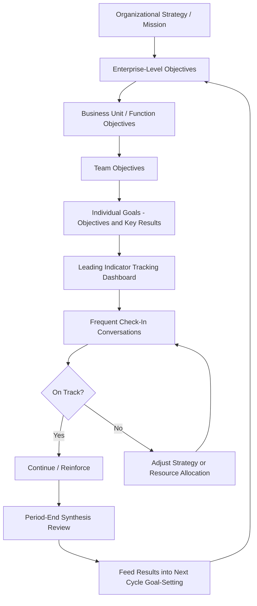

## Goal Alignment and Performance Management Systems

### Definition and Scope

Goal alignment and performance management systems concern the organizational architecture through which individual, team, and unit-level goals are connected vertically (to organizational strategy) and horizontally (across interdependent functions), and the ongoing management processes (goal-setting, tracking, feedback, review) that operationalize this alignment over time. This topic sits at the intersection of goal-setting psychology, strategic management, and the performance appraisal infrastructure covered in prior references — it addresses the systemic question of *how organizations translate strategy into individual behavior* rather than the measurement question of how any single performance episode is rated.

### Theoretical Foundations

**Goal-Setting Theory (Locke & Latham)**

The foundational psychological theory underlying essentially all goal alignment systems. Core, extensively replicated findings:

- Specific, difficult goals produce higher performance than vague ("do your best") or easy goals, provided the goal is accepted
- Goal commitment moderates the difficulty-performance relationship — difficult goals without commitment do not produce the performance benefit
- Feedback is necessary for goal-setting to translate into performance improvement, since individuals need to track progress against the goal to adjust effort and strategy
- Task complexity moderates the relationship — for highly complex tasks, goal-setting effects are attenuated unless adequate strategy development time is provided

**Goal Orientation Theory (Dweck; VandeWalle)**

Distinguishes learning goal orientation (motivation to develop competence and master new skills) from performance goal orientation (motivation to demonstrate competence and avoid unfavorable judgments), with the latter further split into performance-prove and performance-avoid orientations. This distinction matters for alignment system design: cascading systems that emphasize only outcome/results metrics without learning-oriented components can inadvertently favor risk-averse, performance-avoid behavior over the experimentation needed for adaptive organizational performance.

**Path-Goal and Expectancy Theory (Vroom)**

Goal alignment systems function partly through expectancy mechanisms: employees are motivated toward goals to the degree they believe effort leads to performance (expectancy), performance leads to outcomes (instrumentality), and those outcomes are valued (valence). Poorly designed cascading systems that create goals disconnected from employees' actual control or from valued organizational outcomes undermine motivation through this expectancy chain regardless of goal specificity.

**Systems Theory / Vertical and Horizontal Alignment**

Organizational goal systems are conceptualized as requiring alignment in two directions:

- **Vertical alignment**: individual and team goals derive coherently from function, business-unit, and enterprise strategy (a "line of sight" from daily work to organizational mission)
- **Horizontal alignment**: goals across interdependent functions (e.g., sales and operations) do not create conflicting incentives that optimize one unit's metrics at another's expense

Horizontal misalignment is a well-documented organizational pathology — e.g., sales goals rewarding volume without accounting for downstream fulfillment or service capacity constraints.

### Major Goal Alignment Frameworks

**Management by Objectives (MBO) — Drucker**

The historical precursor to modern cascading goal systems: objectives are set collaboratively between employee and manager, cascading from organizational objectives downward, with periodic review against agreed objectives. Criticized in later literature for tendencies toward rigid annual cycles and insufficient adaptability to changing conditions within the review period.

**Balanced Scorecard (Kaplan & Norton)**

A strategic performance management framework organizing goals/metrics across four linked perspectives: Financial, Customer, Internal Business Process, and Learning & Growth, with causal linkages theorized to run from Learning & Growth capabilities through Process improvements to Customer outcomes to ultimate Financial results. Its central contribution to alignment theory is insisting that financial outcome metrics alone are lagging indicators, and sustainable performance requires attention to leading indicators (capability-building, process quality) that drive future financial results.

**OKRs (Objectives and Key Results)**

Originating at Intel under Andy Grove and popularized in Silicon Valley (notably via Google's adoption), OKRs pair qualitative, inspirational Objectives with 3-5 quantitative, verifiable Key Results per objective. Distinctive design features relative to traditional MBO:

- Typically set on shorter cycles (quarterly rather than annual), supporting faster strategic adaptation
- Often explicitly decoupled from compensation determination, intended to encourage ambitious ("stretch") goal-setting without the sandbagging incentive that direct compensation linkage can create
- Frequently made organization-wide transparent (visible across the organization) rather than confidential, intended to support horizontal alignment by making interdependencies visible

[Inference] The "0.7 average attainment is good" norm associated with Google's OKR implementation (i.e., achieving roughly 70% of an ambitious key result is considered successful, since 100% attainment may indicate insufficiently ambitious goal-setting) is a widely cited practitioner heuristic rather than a rigorously validated psychological principle, and its appropriateness depends heavily on whether an organization's OKRs are genuinely intended as stretch targets versus committed deliverables — conflating the two within one system is a commonly cited implementation failure mode.

**Cascading Goals vs. FAST Goals**

Traditional cascading (goals flow strictly top-down, each level's goals derived mechanically from the level above) has been critiqued for creating rigid, slow-to-adapt goal trees disconnected from ground-level reality. More recent frameworks (e.g., the FAST goals concept — Frequently discussed, Ambitious, Specific, Transparent, proposed by Doerr and colleagues) emphasize goal-setting *frequency* and transparency as alignment mechanisms superior to rigid mechanical cascading, reflecting the broader continuous-performance-management shift discussed in relation to appraisal methods.

### Continuous Performance Management Integration

Modern goal alignment systems are increasingly paired with the continuous/frequent check-in performance management model rather than annual review cycles: goals are set, tracked via dashboards, and discussed in frequent (weekly/biweekly) structured manager-employee conversations, with formal review periods serving as synthesis/documentation checkpoints rather than the sole feedback event. This design choice is grounded in feedback intervention research (see prior reference on 360-Degree Feedback) suggesting more frequent, proximal feedback better sustains goal-directed effort than infrequent, distal feedback.

### System Design Considerations

**Goal Cascading Method**

| Approach | Mechanism | Trade-off |
| --- | --- | --- |
| Strict Top-Down Cascade | Each level's goals mechanically derived from level above | Strong vertical alignment; risk of rigidity and delayed adaptation |
| Bottom-Up with Alignment Review | Teams propose goals, reviewed/adjusted for strategic fit | Higher ownership/commitment; requires more coordination overhead |
| Hybrid (Committed + Aspirational) | Mix of assigned committed goals and self-generated stretch goals | Balances direction-setting with autonomy-supportive motivation |

**Metric Design — Leading vs. Lagging Indicators**

Effective goal systems distinguish lagging indicators (outcome measures, often only observable after the fact — revenue, churn) from leading indicators (earlier, more controllable predictors of the lagging outcome — pipeline activity, engagement scores). Systems relying exclusively on lagging indicators provide feedback too late in the cycle for course-correction, undermining the feedback-loop requirement of goal-setting theory.

**Goal Interdependence and Sabotage Risk**

Goal systems that create competitive zero-sum dynamics between interdependent units or individuals (echoing forced-distribution appraisal critiques) risk incentivizing behavior that undermines organizational rather than merely individual performance — a horizontal alignment failure with direct motivational-theory grounding in how perceived goal conflict affects cooperative behavior.

### Goal Alignment System Architecture

### Vertical and Horizontal Alignment (svg_diagram)

<svg xmlns="http://www.w3.org/2000/svg" viewBox="0 0 620 340">
<text x="310" y="24" text-anchor="middle" font-size="16" font-weight="bold" fill="#1f2937">Vertical and Horizontal Goal Alignment (svg_diagram)</text>
<rect x="220" y="50" width="180" height="45" rx="6" fill="#e0e7ff" stroke="#6366f1" />
<text x="310" y="77" text-anchor="middle" font-size="11" fill="#312e81">Enterprise Strategy</text>
<rect x="100" y="140" width="150" height="45" rx="6" fill="#dbeafe" stroke="#3b82f6" />
<text x="175" y="167" text-anchor="middle" font-size="11" fill="#1e3a8a">Function A Goals</text>
<rect x="370" y="140" width="150" height="45" rx="6" fill="#dbeafe" stroke="#3b82f6" />
<text x="445" y="167" text-anchor="middle" font-size="11" fill="#1e3a8a">Function B Goals</text>
<rect x="60" y="230" width="120" height="45" rx="6" fill="#dcfce7" stroke="#22c55e" />
<text x="120" y="257" text-anchor="middle" font-size="10" fill="#166534">Team Goals</text>
<rect x="400" y="230" width="120" height="45" rx="6" fill="#dcfce7" stroke="#22c55e" />
<text x="460" y="257" text-anchor="middle" font-size="10" fill="#166534">Team Goals</text>
<line x1="300" y1="95" x2="200" y2="138" stroke="#6b7280" stroke-width="2" />
<line x1="330" y1="95" x2="420" y2="138" stroke="#6b7280" stroke-width="2" />
<line x1="160" y1="185" x2="130" y2="228" stroke="#6b7280" stroke-width="2" />
<line x1="440" y1="185" x2="450" y2="228" stroke="#6b7280" stroke-width="2" />
<line x1="250" y1="162" x2="368" y2="162" stroke="#f59e0b" stroke-width="2" stroke-dasharray="4,3" />
<text x="310" y="155" text-anchor="middle" font-size="9" fill="#78350f">Horizontal Alignment Check</text>
</svg>

### Applied Example

**Example**

A software company adopts quarterly OKRs, cascading an enterprise objective ("Achieve market leadership in mid-market segment") to a sales function key result ("Increase mid-market new logo count by 40%") and a customer success function key result ("Maintain 95% renewal rate"). Three months in, sales exceeds its key result by aggressively discounting to close volume, but customer success renewal rates decline, since many newly acquired accounts were poor product fits attracted by discounting rather than genuine need. This is a horizontal alignment failure: the two functions' key results were set independently without an explicit alignment review, creating goal conflict where sales' local optimization undermined the customer success function's — and ultimately the enterprise objective's — actual outcome. The redesign introduces a shared cross-functional key result (net revenue retention, jointly owned by sales and customer success) alongside each function's individual key results, and adds a quarterly cross-functional alignment review before goals are finalized, directly addressing the horizontal alignment gap that the purely vertical cascade had missed.

### Evaluation and Common Failure Modes

**Conclusion**

Goal alignment systems succeed or fail less on the specific framework chosen (OKRs versus balanced scorecard versus MBO) and more on whether the system maintains genuine vertical line-of-sight without rigidity, actively manages horizontal interdependencies rather than assuming functional silos will self-coordinate, and pairs goal-setting with sufficiently frequent feedback to allow course-correction — consistent with the core requirements identified in goal-setting theory since Locke and Latham's earliest work.

Common documented failure modes: goal proliferation (too many simultaneous objectives diluting focus, undermining the specificity principle of goal-setting theory), stale cascades (goals set annually but never revisited as conditions change), compensation-linkage distortion (sandbagging or gaming when stretch goals are directly tied to pay), and metric myopia (optimizing measured leading indicators at the expense of the true underlying strategic intent they were meant to proxy — a systemic parallel to the criterion contamination/deficiency problem discussed in relation to performance criteria).

### Limitations and Contextual Factors

- **Framework transportability**: [Inference] Frameworks like OKRs, developed and popularized primarily in fast-moving technology-sector contexts, may require substantial adaptation for organizations with longer production cycles, heavily regulated environments, or lower tolerance for public goal transparency, though the underlying goal-setting psychology (specificity, feedback, commitment) is generally considered more universally applicable than the specific framework mechanics
- **Transparency trade-offs**: fully transparent goal systems (a design feature of many OKR implementations) can support horizontal alignment but may also create unintended social comparison pressure or discourage ambitious goal-setting if employees fear public underperformance, an effect likely moderated by organizational psychological safety climate
- **Measurement of "alignment" itself is difficult**: unlike individual performance ratings, the degree of true vertical/horizontal alignment across a large organization is not straightforwardly quantifiable, and organizations often rely on proxy indicators (goal-cascade completeness, cross-functional goal overlap analysis) that are themselves imperfect
- Reported outcomes of specific goal alignment framework adoptions (e.g., OKR case studies from well-known technology companies) often reflect organization-specific implementation quality and cultural context, and should not be assumed to generalize directly to organizations with different structures, sizes, or industries

### Related Topics

- Goal-Setting Theory (Locke & Latham) Deep Dive
- Balanced Scorecard Implementation
- Continuous Performance Management Systems
- Performance Appraisal Methods
- Criterion Theory and Performance Dimensions
- Strategic Management and Strategy Cascading
- Compensation Design and Pay-for-Performance Linkage