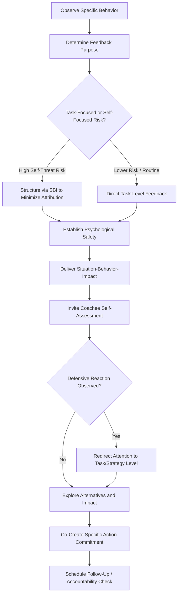

## Feedback Delivery and Developmental Coaching

### Definition and Scope

Feedback delivery and developmental coaching concerns the interpersonal process by which performance information is communicated to an individual and translated into sustained behavioral change. This is distinct from prior references on appraisal methods, rater bias, and 360-degree feedback, which address how performance data is *generated*; this topic addresses how that data — or ongoing observational feedback more generally — is *delivered* in a manner that supports rather than undermines motivation, learning, and performance improvement.

### Theoretical Foundations

**Feedback Intervention Theory (Kluger & DeNisi, 1996)**

The central organizing theory for this topic, introduced in the prior 360-degree feedback reference and elaborated here. Feedback interventions operate by directing attention across a hierarchy of processing levels: the task-learning level (how to perform the task), the task-motivation level (effort/persistence on the task), and the meta-task/self level (the self-concept, ego, and self-esteem). Kluger and DeNisi's meta-analysis found that feedback interventions decreased performance in a substantial minority of studies reviewed, and identified feedback sign (positive/negative), specificity, and — most critically — the degree to which delivery draws attention to the self rather than the task as key moderators. Feedback that triggers self-level processing (particularly negative feedback perceived as identity-threatening) is associated with defensive responses, effort withdrawal, or performance decline; feedback that maintains task-level focus is more consistently associated with improvement.

**Situation-Behavior-Impact (SBI) Model (Center for Creative Leadership)**

A widely used practical feedback-structuring framework directly operationalizing the task-focus principle from Feedback Intervention Theory:

- **Situation**: specific context in which the behavior occurred (when/where)
- **Behavior**: objectively observable action (not inferred trait or motive)
- **Impact**: the concrete effect the behavior had

The model's core mechanism is replacing trait-level or motive-level statements ("you're not a team player") with specific, observable, non-attributional descriptions ("in yesterday's client call, when you interrupted Maria's point three times, the client appeared to disengage from the conversation"), which reduces the self-threat that triggers defensive processing.

**Radical Candor Framework (Scott)**

A popular practitioner framework organizing feedback along two axes — "Care Personally" and "Challenge Directly" — yielding four quadrants: Radical Candor (high care, high challenge), Ruinous Empathy (high care, low challenge — withholding needed feedback to avoid discomfort), Obnoxious Aggression (low care, high challenge — blunt feedback without relational investment), and Manipulative Insincerity (low care, low challenge — withholding honest feedback for self-interested reasons). [Inference] While influential in management practice, Radical Candor is a practitioner-derived framework rather than one built through the peer-reviewed empirical research tradition underlying Feedback Intervention Theory or SBI, and its constructs, while intuitively compelling, have not been subject to the same level of psychometric validation.

**Constructive vs. Destructive Feedback Distinction**

Organizational research (e.g., Baron's work on feedback and reactions) distinguishes feedback along dimensions of specificity, attributional focus (behavior vs. person), and tone (considerate vs. inconsiderate), with destructive feedback (vague, person-focused, harshly delivered) reliably associated with anger, reduced self-efficacy, and goal-setting withdrawal, while constructive feedback sharing the same underlying negative content but delivered with behavioral specificity and non-hostile tone shows substantially more favorable reactions.

**Growth Mindset Theory (Dweck)**

Feedback framing interacts with implicit theories of ability: feedback framed around effort, strategy, and process ("growth mindset" framing) versus fixed ability ("you're naturally talented" or "you're just not good at this") differentially affects subsequent resilience to setbacks and willingness to engage with challenging feedback. This has direct implications for coaching language — praising process/effort rather than fixed traits supports more adaptive responses to future difficulty.

### Coaching as a Feedback Delivery Modality

Developmental coaching (see prior reference on Mentoring and Coaching for full theoretical grounding) functions substantially as a structured, ongoing feedback delivery mechanism. Its non-directive, questioning-based approach (operationalized in models like GROW) is itself a feedback-delivery strategy consistent with Feedback Intervention Theory: rather than the coach delivering a verdict (high self-threat risk), the coachee is guided to generate their own assessment through structured questioning, which tends to preserve autonomy (per Self-Determination Theory) and reduce the ego-threat associated with externally imposed judgment.

**Coaching Conversation Structure for Feedback Delivery**

| Phase | Function | Theoretical Grounding |
| --- | --- | --- |
| Establish Psychological Safety | Reduce baseline defensiveness before difficult content | Edmondson's psychological safety research |
| Present Specific, Observable Data | Ground conversation in behavior, not inference | SBI Model |
| Invite Self-Assessment | Preserve autonomy, reduce imposed-judgment threat | Self-Determination Theory |
| Explore Impact and Alternatives | Shift attention to task/strategy level | Feedback Intervention Theory |
| Co-Create Action Commitment | Translate insight into specific, goal-set behavior | Goal-Setting Theory |

### Timing and Frequency Considerations

**Immediacy vs. Delay**

Feedback proximal to the behavior in question is generally more effective for skill-based/procedural learning, since delayed feedback allows memory decay of the specific behavioral details necessary for precise correction (directly related to the retrieval-stage rating error concerns discussed in the Rater Biases reference). This is a primary theoretical driver behind the shift from annual-only review cycles toward continuous/frequent check-in models discussed in the Goal Alignment reference.

**"Feedback Sandwich" Critique**

The traditional practice of embedding critical feedback between two positive statements is widely taught in management training but has drawn substantial practitioner and some research-based criticism: [Inference] critics argue the pattern can reduce the perceived credibility of the positive statements (recognized as merely a rhetorical buffer), can dilute the clarity of the critical message such that it is not registered as needing action, and does not directly address the underlying self-threat mechanism identified in Feedback Intervention Theory — direct, specific, behaviorally-framed feedback delivered with genuine care is generally considered a more theoretically grounded alternative than mechanically alternating valence.

### Feedback Delivery Process Flow

### Attention-Level Hierarchy in Feedback Intervention Theory (svg_diagram)

<svg xmlns="http://www.w3.org/2000/svg" viewBox="0 0 620 280">
<text x="310" y="24" text-anchor="middle" font-size="16" font-weight="bold" fill="#1f2937">Feedback Intervention Theory: Attention Levels (svg_diagram)</text>
<rect x="180" y="50" width="260" height="55" rx="8" fill="#fee2e2" stroke="#ef4444" stroke-width="2" />
<text x="310" y="78" text-anchor="middle" font-size="12" fill="#991b1b">Meta-Task / Self Level</text>
<text x="310" y="95" text-anchor="middle" font-size="9" fill="#991b1b">Highest risk of impaired performance</text>
<rect x="180" y="130" width="260" height="55" rx="8" fill="#fef3c7" stroke="#f59e0b" stroke-width="2" />
<text x="310" y="158" text-anchor="middle" font-size="12" fill="#78350f">Task-Motivation Level</text>
<text x="310" y="175" text-anchor="middle" font-size="9" fill="#78350f">Effort and persistence</text>
<rect x="180" y="210" width="260" height="55" rx="8" fill="#dcfce7" stroke="#22c55e" stroke-width="2" />
<text x="310" y="238" text-anchor="middle" font-size="12" fill="#166534">Task-Learning Level</text>
<text x="310" y="255" text-anchor="middle" font-size="9" fill="#166534">Most consistently supports improvement</text>
<line x1="60" y1="60" x2="60" y2="250" stroke="#6b7280" stroke-width="2" />
<text x="35" y="160" font-size="10" fill="#374151" transform="rotate(-90 35 160)">Effective delivery redirects downward</text>
</svg>

### Applied Example

**Example**

A team lead needs to give feedback to an engineer whose code reviews have become increasingly terse and dismissive toward junior colleagues, generating complaints. A poorly structured approach might open with "you've been kind of harsh lately" — a vague, trait-adjacent statement likely to trigger self-level defensive processing per Feedback Intervention Theory. Applying the SBI model instead, the lead prepares specific instances: "In the last three code reviews on the payments module, your comments were single-line rejections without explanation — for example, 'this is wrong, redo it' — and two of the junior engineers mentioned they weren't sure what to fix or felt hesitant to ask follow-up questions afterward." This grounds the conversation in observable behavior and concrete impact rather than character judgment. The lead then shifts to coaching mode, asking "what's your read on how that landed?" rather than prescribing the fix directly — inviting self-assessment to preserve autonomy — before collaboratively identifying a specific, actionable commitment (including a one-sentence rationale with each review comment going forward) and scheduling a two-week follow-up check-in.

### Manager and Coach Skill Development

Organizations increasingly invest in training managers directly in these frameworks (SBI, growth-mindset framing, coaching-style questioning) as part of manager-as-coach initiatives (see prior Mentoring and Coaching reference), reflecting recognition that feedback delivery skill is a distinct, trainable competency separate from technical job expertise, and that untrained delivery — even of technically accurate performance information — can produce net-negative outcomes per Feedback Intervention Theory's core finding.

### Limitations and Contextual Factors

- **Framework popularity does not equal empirical validation**: models like Radical Candor and the feedback sandwich are widely taught in management practice but rest on differing levels of empirical support; SBI and Feedback Intervention Theory have stronger grounding in peer-reviewed organizational research, while some popular frameworks are primarily practitioner-derived heuristics
- **Individual differences in feedback reception**: [Inference] Responses to identical feedback delivery approaches likely vary based on individual differences such as self-esteem stability, cultural background, and prior feedback experiences, though the research base quantifying these moderating effects across delivery frameworks specifically is less extensive than the core Feedback Intervention Theory findings themselves
- **Power dynamics constrain delivery approach effectiveness**: as noted in the Mentoring and Coaching reference regarding manager-as-coach limitations, feedback delivered within an evaluative power relationship (manager to direct report) carries inherent self-threat risk that even well-structured delivery techniques can only partially mitigate
- Behavioral outcomes of any specific feedback delivery framework depend substantially on relationship trust, organizational psychological safety climate, and deliverer skill, and should not be assumed to produce uniform results across all contexts or individuals

### Next Steps

- Psychological Safety in Teams (Edmondson)
- Coaching Competency Frameworks (GROW, ICF Core Competencies)
- Performance Appraisal Methods
- Rater Biases and Rating Errors
- Goal Alignment and Performance Management Systems
- Manager-as-Coach Training Design
- Self-Determination Theory Applications in Workplace Feedback