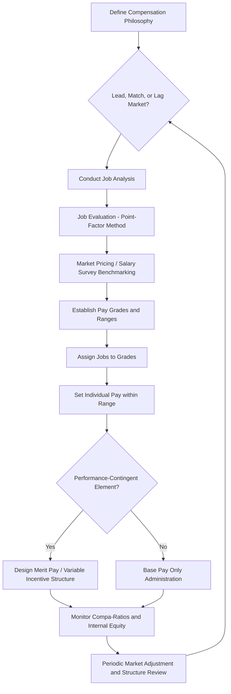

## Compensation Theory and Pay Structures

### Definition and Scope

Compensation theory and pay structures address the psychological, economic, and organizational-design principles governing how organizations determine pay levels, pay differentials, and pay architecture. This spans the theoretical bases for why compensation motivates (or fails to motivate) behavior, and the structural mechanisms (pay grades, job evaluation, market pricing) organizations use to translate compensation philosophy into administrable pay systems.

### Theoretical Foundations

**Equity Theory (Adams, 1963)**

A foundational compensation psychology theory: individuals evaluate the fairness of their pay not in absolute terms but by comparing their outcome-to-input ratio against a referent other's ratio. Perceived inequity (whether under-reward or over-reward) generates psychological tension that motivates equity-restoring behavior — reducing effort, seeking a raise, cognitively distorting the comparison, or exiting the relationship (turnover). Equity theory is the primary theoretical basis for pay transparency debates and internal pay-equity analysis, since the *referent other* comparison is often an internal colleague whose pay may become known or inferred.

**Expectancy Theory (Vroom)**

As introduced in the Goal Alignment reference, expectancy theory holds that motivation depends on effort-performance expectancy, performance-outcome instrumentality, and outcome valence. Applied to compensation: pay-for-performance systems motivate only to the degree employees believe effort translates to measurable performance (expectancy), performance translates reliably to pay (instrumentality), and the pay outcome is personally valued relative to alternatives (valence). Weak instrumentality — pay determined more by factors outside individual control (see Criterion Theory's contamination concept) than by actual performance — undermines the motivational value of pay-for-performance regardless of the amount at stake.

**Reinforcement Theory (Skinner) Applied to Pay**

Operant conditioning principles underlie the design logic of incentive pay schedules: continuous reinforcement (pay tied directly and immediately to each performance instance) versus variable/intermittent reinforcement schedules (e.g., periodic bonuses, profit-sharing) produce different behavioral persistence patterns, with variable-ratio schedules generally associated with greater resistance to extinction — a consideration in designing sales commission structures and bonus program cadence.

**Two-Factor Theory (Herzberg)**

Herzberg's classic distinction between hygiene factors (including pay, in Herzberg's original formulation) and motivators (achievement, recognition, growth) proposed that pay primarily prevents dissatisfaction rather than actively generating satisfaction or motivation once a baseline adequacy threshold is met. [Inference] This claim has been influential but is also among the more contested propositions in compensation psychology; subsequent research has generally found pay can function as both a hygiene factor and, particularly through its symbolic and social-comparison functions (per equity theory), a genuine motivator — the strict hygiene/motivator dichotomy for pay specifically is not universally supported in later empirical work.

**Self-Determination Theory and the Crowding-Out Debate**

A significant and ongoing theoretical tension: SDT-grounded research (notably Deci, Koestner, and Ryan's meta-analytic work) suggests that contingent extrinsic rewards, including performance-contingent pay, can under certain conditions undermine intrinsic motivation for tasks that were originally intrinsically interesting — a phenomenon termed motivational "crowding out." [Inference] The conditions under which this effect meaningfully applies in real organizational compensation contexts (versus laboratory tasks) remain debated; many compensation scholars argue the effect is most relevant for inherently interesting, autonomy-rich creative or knowledge work and less relevant for tasks with lower baseline intrinsic interest, though the boundary conditions are not fully settled.

**Efficiency Wage Theory (Economics)**

An economic theory relevant to compensation psychology: paying above-market wages can improve organizational outcomes (reduced turnover, increased effort, improved applicant quality via adverse-selection avoidance) sufficiently to offset the higher direct wage cost, providing an economic rationale for above-market pay positioning beyond pure labor-market competition.

### Compensation Philosophy and Market Positioning

**Pay Level Policy**

Organizations typically position their overall pay level relative to the labor market using one of three broad strategies:

- **Lead**: pay above market median to attract and retain top talent, often paired with efficiency-wage-style expectations of superior performance/retention
- **Match/Meet**: pay at approximately market median, balancing cost control with competitive adequacy
- **Lag**: pay below market median, typically offset by other total-reward elements (equity, benefits, mission-driven appeal) or used where labor supply exceeds demand for the relevant role

**Total Rewards Framework**

Compensation is increasingly conceptualized within a broader Total Rewards model encompassing base pay, variable/incentive pay, benefits, and non-financial rewards (recognition, development opportunities, work-life quality) — reflecting recognition that base pay alone is an incomplete lens for understanding what drives attraction, retention, and motivation.

### Job Evaluation and Internal Equity Methods

**Job Ranking**

Simplest method — jobs are ordered by overall perceived worth without decomposing into specific compensable factors; suitable only for small organizations given its subjectivity and lack of scalability.

**Job Classification**

Jobs are sorted into predefined grade levels with written grade descriptions (common in government/public-sector systems), providing more structure than ranking but still relying on holistic judgment against grade definitions.

**Point-Factor Method**

The most widely used systematic job evaluation method: jobs are rated on multiple compensable factors (commonly including skill, effort, responsibility, and working conditions, reflecting the U.S. Equal Pay Act's own compensable factor language), each factor weighted and scored, producing a total point value that determines relative internal job worth and corresponding pay grade placement. This method's structured, factor-based approach provides stronger legal defensibility for internal equity than holistic ranking methods.

**Factor Comparison Method**

A more complex hybrid method ranking jobs against each other separately on each compensable factor and directly allocating dollar values to each factor — largely superseded in contemporary practice by the more administrable point-factor method combined with market pricing.

**Market Pricing**

Increasingly dominant in practice: rather than relying primarily on internal job evaluation point totals, pay is set predominantly by matching jobs to external salary survey benchmark data, reflecting an organizational emphasis on external competitiveness over strict internal job-worth hierarchies. Most contemporary systems use a hybrid of point-factor internal equity analysis and market pricing rather than either method in isolation.

### Pay Structure Architecture

**Pay Grades and Ranges**

Jobs of broadly similar evaluated worth (via point-factor score or market pricing band) are grouped into pay grades, each with a minimum, midpoint, and maximum salary range. Range spread (the percentage difference between range minimum and maximum) is typically wider for higher-level/more strategic roles, reflecting greater legitimate variance in individual contribution at senior levels.

**Broadbanding**

A structural alternative consolidating many narrow traditional grades into a smaller number of much wider salary bands, intended to support greater lateral mobility and reduce the administrative rigidity and promotion-focused culture that narrow-grade systems can encourage, at the cost of less granular internal-equity signaling.

**Compa-Ratio**

A standard metric expressing an individual's pay relative to their grade's midpoint:

$$\text{Compa-Ratio} = \frac{\text{Individual Salary}}{\text{Range Midpoint}} \times 100$$

A compa-ratio of 100 indicates pay exactly at midpoint; values are used to monitor internal equity, identify pay compression (new hires paid close to or above tenured employees' pay), and guide merit budget allocation.

### Pay-for-Performance Design

**Merit Pay**

Base salary increases tied to individual performance ratings, typically administered via a merit matrix combining performance rating and current compa-ratio position (lower compa-ratio, high performers typically receive larger percentage increases, reflecting both performance recognition and market/internal-equity catch-up logic).

**Variable/Incentive Pay**

Non-base compensation contingent on performance (individual, team, or organizational), including bonuses, commissions, profit-sharing, and gainsharing. Distinguished from merit pay by not compounding into base salary, allowing organizations to maintain pay-for-performance linkage without permanently escalating fixed labor costs.

**Long-Term Incentives (LTI)**

Equity-based compensation (stock options, restricted stock units) intended to align individual behavior with longer-term organizational value creation and support retention through vesting schedules — theoretically grounded in agency theory's concern with aligning agent (employee) incentives with principal (shareholder/organization) interests over a time horizon exceeding typical annual incentive cycles.

### Compensation System Design Flow

### Pay Range Structure with Compa-Ratio Zones (svg_diagram)

<svg xmlns="http://www.w3.org/2000/svg" viewBox="0 0 640 220">
<text x="320" y="24" text-anchor="middle" font-size="16" font-weight="bold" fill="#1f2937">Pay Grade Range Structure (svg_diagram)</text>
<line x1="60" y1="120" x2="580" y2="120" stroke="#374151" stroke-width="2" />
<line x1="60" y1="100" x2="60" y2="140" stroke="#3b82f6" stroke-width="2" />
<text x="60" y="160" text-anchor="middle" font-size="10" fill="#1e3a8a">Min (80)</text>
<line x1="320" y1="90" x2="320" y2="150" stroke="#22c55e" stroke-width="2" />
<text x="320" y="170" text-anchor="middle" font-size="10" fill="#166534">Midpoint (100)</text>
<line x1="580" y1="100" x2="580" y2="140" stroke="#ef4444" stroke-width="2" />
<text x="580" y="160" text-anchor="middle" font-size="10" fill="#991b1b">Max (120)</text>
<rect x="60" y="112" width="520" height="16" fill="#e5e7eb" opacity="0.5" />
<circle cx="200" cy="120" r="6" fill="#f59e0b" />
<text x="200" y="100" text-anchor="middle" font-size="9" fill="#78350f">Compa-Ratio 92</text>
<circle cx="450" cy="120" r="6" fill="#8b5cf6" />
<text x="450" y="100" text-anchor="middle" font-size="9" fill="#4c1d95">Compa-Ratio 108</text>
</svg>

### Applied Example

**Example**

A technology company conducts an internal pay equity audit and discovers that recently hired software engineers, brought in during a competitive hiring period, have compa-ratios averaging 105, while tenured engineers with strong performance histories average 88 — a classic pay compression pattern arising from market-driven starting salaries outpacing internal merit-increase budgets over time. Applying equity theory, this creates a high-risk inequity condition: tenured high performers, aware of or suspecting new-hire pay levels (a common informal information channel despite formal pay secrecy norms), experience an unfavorable outcome-to-input ratio comparison, predicting increased turnover risk and effort withdrawal among exactly the retention-critical population the organization can least afford to lose. The compensation team's remediation combines an off-cycle equity adjustment targeted at tenured employees with compa-ratios below 90 and strong recent performance ratings, alongside a structural change increasing the annual merit budget's differentiation for top performers to prevent future compression recurrence, addressing both the immediate equity violation and its underlying structural cause.

### Legal and Regulatory Considerations

Compensation systems in many jurisdictions are subject to equal-pay legislation (e.g., the U.S. Equal Pay Act and Title VII) requiring that pay differences for substantially similar work be justified by legitimate, non-discriminatory factors such as seniority, merit, or quantity/quality of production — directly connecting job evaluation methodology (particularly the point-factor method's compensable-factor structure) to legal defensibility, since documented, factor-based job worth determinations provide stronger evidentiary support than undocumented or purely market-driven pay decisions.

### Limitations and Contextual Factors

- **Crowding-out effect boundary conditions remain debated**: [Inference] whether and to what extent performance-contingent pay undermines intrinsic motivation is not a settled empirical question across all task types and organizational contexts, and compensation designers should be cautious about over-applying laboratory-derived crowding-out findings to complex real-world jobs without contextual validation
- **Market pricing data quality varies**: salary survey benchmarking depends on accurate job matching and sufficient survey participant sample sizes per role; poorly matched benchmark jobs can introduce systematic market-pricing error independent of any internal job evaluation rigor
- **Pay transparency effects are context-dependent**: [Inference] research on pay transparency's effects on motivation and equity perceptions shows mixed findings — transparency can improve perceived fairness when pay differences are genuinely justifiable and well-communicated, but can increase social comparison-driven dissatisfaction when differences appear arbitrary or poorly explained, suggesting transparency's net effect depends heavily on the underlying pay system's actual equity rather than transparency being uniformly beneficial or harmful
- Compensation system outcomes depend substantially on labor market conditions, organizational financial constraints, and cultural context, and specific design choices (lead/lag positioning, LTI usage, broadbanding) that work well in one industry or region may not transfer directly to others

### Related Topics

- Equity Theory and Organizational Justice
- Job Analysis and Job Evaluation Methods
- Incentive Pay Design and Sales Compensation
- Executive Compensation and Agency Theory
- Benefits Design and Total Rewards Strategy
- Pay Transparency Policy and Practice
- Criterion Theory and Performance Dimensions (Pay-for-Performance Linkage)