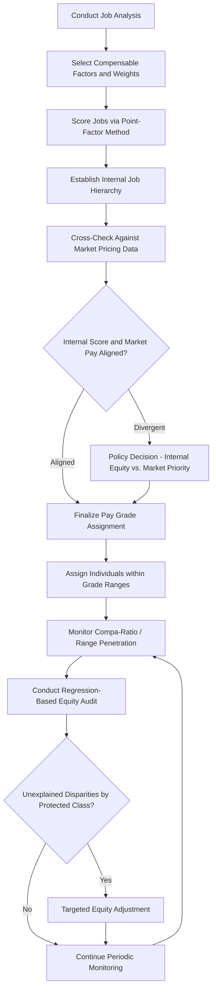

## Job Evaluation and Internal Equity

### Definition and Scope

Job evaluation is the systematic process of determining the relative worth of jobs within an organization, independent of the specific individuals performing them, in order to establish a defensible internal pay hierarchy. Internal equity refers to the perceived and actual fairness of pay relationships *among* jobs and employees within the same organization — distinct from external equity (fairness relative to the external labor market, addressed in the prior Compensation Theory reference) and individual equity (fairness of pay differences among individuals performing the same job, typically based on performance or tenure). This reference elaborates the job evaluation methodologies introduced previously and examines internal equity as a psychological and organizational-design construct in its own right.

### Theoretical Foundations

**Equity Theory (Adams) — Internal Referent Comparisons**

As introduced previously, equity theory's core mechanism is comparison of one's own outcome-to-input ratio against a referent other. Internal equity concerns specifically address the case where that referent is a *colleague within the same organization* — a comparison that is typically more salient, more frequently made, and often more information-rich (given proximity and informal information-sharing) than external market comparisons. This makes internal equity a particularly potent driver of the equity-restoring behaviors (effort withdrawal, turnover, grievance) that equity theory predicts.

**Distributive Justice (Homans; Adams; Deutsch)**

Distributive justice theory extends equity theory by examining the *norms* organizations use to allocate outcomes, principally contrasting an equity norm (allocation proportional to contribution/input) against an equality norm (equal allocation regardless of input) and a need-based norm (allocation according to need). Job evaluation systems are fundamentally an institutionalization of the equity norm — formally defining and weighting the "inputs" (skill, effort, responsibility, working conditions) that justify differential pay, making the evaluation methodology itself a distributive-justice mechanism rather than a purely technical exercise.

**Procedural Justice (Thibaut & Walker; Leventhal)**

Leventhal's procedural justice criteria — consistency, bias suppression, accuracy, correctability, representativeness, and ethicality — provide the standard against which job evaluation *processes* (not just outcomes) are judged fair. A job evaluation system can produce a defensible outcome yet still generate dissatisfaction if the process used to arrive at it is perceived as inconsistent, biased, or lacking an appeals mechanism — directly paralleling the procedural justice considerations discussed regarding performance appraisal methods.

**Human Capital Theory (Becker; Mincer)**

An economic complement to the psychological justice theories: human capital theory holds that pay differentials are, or should be, substantially explained by differences in productivity-relevant investment (education, training, experience). Job evaluation's compensable-factor structure (particularly the "skill" factor) operationalizes this economic logic within an internal pay hierarchy.

### Job Evaluation Methods (Detailed)

**Whole-Job (Non-Analytical) Methods**

- **Ranking**: jobs ordered holistically from highest to lowest perceived worth without factor decomposition. Fast and low-cost but highly subjective, poorly scalable beyond small job counts, and difficult to defend under legal challenge since no explicit compensable-factor rationale is documented.
- **Classification/Grading**: jobs matched against predefined grade-level descriptions (common in civil service/government systems, e.g., the U.S. federal General Schedule). More structured than pure ranking but still relies on holistic judgment against grade narratives rather than decomposed factor scoring.

**Analytical (Factor-Based) Methods**

- **Point-Factor Method**: the dominant contemporary method. Compensable factors (commonly skill/know-how, effort/problem-solving, responsibility/accountability, working conditions — closely tracking the U.S. Equal Pay Act's statutory factor language) are each assigned a maximum point value and weight reflecting organizational priorities, degree levels within each factor are defined with descriptive anchors (analogous in logic to BARS anchoring in performance appraisal), and each job is scored factor-by-factor, with the sum determining total job worth and grade placement.
- **Factor Comparison Method**: jobs are ranked separately on each compensable factor, and a subset of well-understood "benchmark jobs" with known, presumed-fair market pay is used to directly allocate dollar amounts to each factor, against which all other jobs are then compared factor-by-factor. More precise in theory than point-factor but substantially more complex to administer and communicate, contributing to its decline relative to point-factor and market-pricing hybrids in contemporary practice.

**Hybrid Market-Pricing Approaches**

Most contemporary organizations combine point-factor internal evaluation with external market pricing (salary survey benchmarking) rather than relying on either exclusively — internal evaluation establishes defensible internal equity relationships and legal compensable-factor documentation, while market pricing ensures external competitiveness, with the two reconciled when they diverge (a job with high internal point value but low market pay, or vice versa) through explicit organizational policy decisions about which consideration takes precedence.

### Compensable Factors: Standard Structure

| Factor Category | Illustrative Sub-Factors |
| --- | --- |
| Skill/Know-How | Education/certification requirements, experience required, complexity of judgment |
| Effort/Problem-Solving | Mental effort, physical effort, creativity/analytical demand |
| Responsibility/Accountability | Scope of impact, budget/resource authority, supervisory responsibility, error consequence |
| Working Conditions | Physical environment, hazard exposure, schedule demands |

The specific factors chosen and their relative weights are not neutral technical choices — they embed organizational values about what constitutes valuable work, which has direct implications for pay equity across job types disproportionately held by different demographic groups (a central concern in comparable-worth/pay-equity policy debates, discussed further below).

### Internal Equity Measurement and Monitoring

**Compa-Ratio Analysis**

As introduced in the prior Compensation Theory reference, compa-ratio (individual salary divided by range midpoint) is a primary internal-equity monitoring tool; systematic compa-ratio differences correlated with tenure, demographic group, or hire cohort (rather than performance or grade-relevant factors) are a standard red flag in internal pay equity audits.

**Range Penetration**

A related metric expressing where an individual sits within their grade's full range as a percentage:

$$\text{Range Penetration} = \frac{\text{Individual Salary} - \text{Range Minimum}}{\text{Range Maximum} - \text{Range Minimum}} \times 100$$

Used similarly to compa-ratio but anchored to the full range span rather than the midpoint, useful when comparing positioning across grades with different range widths.

**Regression-Based Pay Equity Analysis**

Statistical method commonly used in formal pay equity audits: a multiple regression model predicts pay from legitimate compensable factors (job grade, tenure, performance rating, location), and the residual (unexplained) variance is examined for systematic correlation with protected-class membership (gender, race/ethnicity) — a significant residual correlation suggests potential inequity not explained by legitimate factors, informing both remediation and legal risk assessment.

**Pay Compression**

A specific and increasingly common internal equity pathology: when external market pay growth for new hires outpaces internal merit-increase budgets over time, tenured employees' pay converges toward or falls below newer hires' pay despite greater experience and often stronger performance histories — directly threatening the equity-norm foundation of the job evaluation system, since input differences (tenure, demonstrated skill) are no longer reflected in proportional outcome differences.

### Job Evaluation and Internal Equity Process Flow

### Point-Factor Job Evaluation Matrix (svg_diagram)

<svg xmlns="http://www.w3.org/2000/svg" viewBox="0 0 640 260">
<text x="320" y="24" text-anchor="middle" font-size="16" font-weight="bold" fill="#1f2937">Point-Factor Compensable Factor Weighting (svg_diagram)</text>
<rect x="40" y="60" width="130" height="160" fill="#dbeafe" stroke="#3b82f6" />
<text x="105" y="85" text-anchor="middle" font-size="11" fill="#1e3a8a">Skill</text>
<text x="105" y="100" text-anchor="middle" font-size="10" fill="#1e3a8a">40% weight</text>
<rect x="180" y="90" width="130" height="130" fill="#dcfce7" stroke="#22c55e" />
<text x="245" y="115" text-anchor="middle" font-size="11" fill="#166534">Effort</text>
<text x="245" y="130" text-anchor="middle" font-size="10" fill="#166534">25% weight</text>
<rect x="320" y="75" width="130" height="145" fill="#fef3c7" stroke="#f59e0b" />
<text x="385" y="100" text-anchor="middle" font-size="11" fill="#78350f">Responsibility</text>
<text x="385" y="115" text-anchor="middle" font-size="10" fill="#78350f">30% weight</text>
<rect x="460" y="180" width="130" height="40" fill="#fee2e2" stroke="#ef4444" />
<text x="525" y="203" text-anchor="middle" font-size="10" fill="#991b1b">Working Cond. 5%</text>
</svg>

### Applied Example

**Example**

A healthcare organization undertakes a job evaluation project after informal complaints suggest inconsistent pay logic between clinical support roles (predominantly held by women) and facilities/technical roles (predominantly held by men) with superficially comparable point-factor scores but notably different market pay. Applying the point-factor methodology, the compensation team scores both job families on the same four compensable factors, finding the clinical support roles actually score higher on the "skill" factor (given licensure/certification requirements) but lower on "working conditions" (climate-controlled indoor settings versus facilities roles' physical/hazard exposure), producing similar total point values despite the different market pay levels for each family. This is a case where internal equity (point-factor parity) and external equity (market pay) diverge, requiring an explicit policy decision: the organization must decide, and document its rationale, for whether to prioritize internal consistency (adjusting facilities pay down or clinical support pay up toward parity) or market competitiveness (maintaining the market-driven differential), recognizing that the compensable-factor weighting itself (how much "working conditions" should weigh against "skill") is a value-laden choice with direct pay-equity implications across a role distribution correlated with gender.

### Comparable Worth and Pay Equity Policy

The comparable worth (or "pay equity") movement, prominent in policy debate from the 1980s onward, argues that job evaluation's compensable-factor logic should be applied *across* traditionally male-dominated and female-dominated job families to identify and remedy systematic undervaluation of historically female-dominated work (e.g., comparing a female-dominated administrative role's point-factor score against a male-dominated technical role's score, even though the jobs are not directly comparable in content). [Inference] Comparable worth as formal legal doctrine has had mixed and limited adoption in the United States compared to some other jurisdictions (several Canadian provinces have enacted comparable-worth-oriented pay equity legislation), and remains a genuinely contested area combining technical job-evaluation methodology with broader labor-economics and social-policy debate about the causes of and appropriate remedies for gender-correlated pay gaps.

### Limitations and Contextual Factors

- **Compensable factor selection is not value-neutral**: the choice of which factors to include and how heavily to weight them (e.g., physical effort versus emotional/interpersonal effort, which has historically been underweighted in many traditional systems) embeds implicit judgments about what work is valuable, with documented implications for gender-correlated pay patterns across job families
- **Point-factor scoring still involves subjective judgment**: despite its more structured, analytical appearance relative to ranking, point-factor evaluation still requires human judgment in scoring jobs against factor-degree definitions, and inter-rater consistency in job evaluation scoring is itself a documented source of variance requiring calibration analogous to rater training in performance appraisal
- **Market pricing and internal equity can structurally conflict**: when hot-skill external market premiums (e.g., for in-demand technical roles) diverge sharply from internal point-factor-based job worth, organizations face a genuine trade-off between external competitiveness and internal consistency that no evaluation methodology alone resolves — it requires explicit organizational policy
- Regression-based pay equity audit findings depend heavily on model specification (which factors are included as "legitimate" explanatory variables); omitting a factor that is itself a product of historical discrimination (e.g., using prior salary history as a predictor) can mask rather than reveal underlying inequity, a methodological concern that should inform audit design

### Related Topics

- Compensation Theory and Pay Structures
- Equity Theory and Organizational Justice
- Comparable Worth and Pay Equity Legislation
- Job Analysis Methods
- Performance Appraisal Methods (Individual Equity Linkage)
- Legal Compliance in Compensation (Equal Pay Act, Title VII)