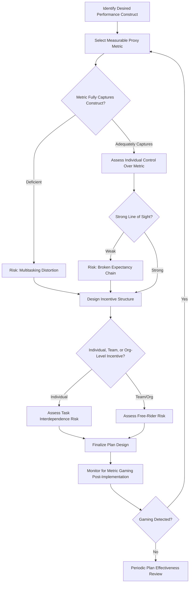

## Pay-for-Performance Systems

### Definition and Scope

Pay-for-performance (PFP) systems link compensation outcomes — merit increases, bonuses, commissions, or equity awards — directly to measured individual, team, or organizational performance, with the explicit design intent of using financial incentive to motivate effort and align employee behavior with organizational objectives. This reference synthesizes and extends the motivational theory (expectancy theory, reinforcement theory, the SDT crowding-out debate) introduced in the prior Compensation Theory reference, focusing specifically on the design mechanics, empirical effectiveness evidence, and known failure modes of performance-contingent pay systems.

### Theoretical Foundations

**Expectancy Theory (Vroom) — The PFP Motivational Chain**

PFP's motivational logic rests entirely on an unbroken expectancy-instrumentality-valence chain: employees must believe (1) effort will produce the required performance level (expectancy), (2) that performance level will reliably produce the promised pay outcome (instrumentality), and (3) the pay outcome is sufficiently valued relative to alternatives (valence). PFP system failures are frequently traceable to a break at one specific link in this chain — for instance, a well-designed bonus structure (strong instrumentality and valence) fails to motivate if employees do not believe their individual effort can meaningfully move the performance metric (weak expectancy), as is common when the metric is heavily influenced by factors outside individual control.

**Agency Theory (Jensen & Meckling; Eisenhardt)**

An economic theory framing the employment relationship as a principal-agent problem: the organization (principal) cannot perfectly observe or verify employee (agent) effort, and the agent may have incentives to shirk or pursue interests misaligned with the principal's given information asymmetry. PFP is theorized as a mechanism to realign incentives by tying agent compensation to observable outcomes correlated with the unobservable effort/behavior the principal actually wants — though this framing inherits all the criterion theory problems (deficiency, contamination) discussed previously, since the observable, measurable outcome is rarely a perfect proxy for true desired contribution.

**Reinforcement Theory and Schedule Effects (Skinner)**

As introduced previously, the schedule of reinforcement (continuous versus variable, fixed-interval versus variable-ratio) shapes behavioral persistence patterns. Sales commission structures paid per transaction (continuous reinforcement) versus periodic discretionary bonuses (variable, less predictable) produce theoretically different motivational dynamics, with variable-ratio schedules generally more resistant to extinction — relevant to designing incentive cadence and payout unpredictability in commission and bonus plan architecture.

**Self-Determination Theory and Motivational Crowding-Out**

As introduced previously, SDT-grounded research raises the possibility that performance-contingent extrinsic rewards can undermine intrinsic motivation, particularly for tasks with high baseline intrinsic interest and autonomy. This tension is central to ongoing debate about PFP appropriateness for knowledge work, creative work, and professions with strong pre-existing intrinsic/professional motivation (e.g., research scientists, physicians), where some evidence suggests overly salient contingent pay can shift attention toward the metric itself rather than the underlying quality the metric was meant to proxy.

**Goodhart's Law and Metric Gaming**

Though originating in economics rather than organizational psychology specifically, Goodhart's Law ("when a measure becomes a target, it ceases to be a good measure") is highly relevant to PFP design: once employees know precisely which metric determines pay, behavior shifts toward optimizing that specific metric, which — per criterion contamination and deficiency concepts — frequently diverges from the true underlying performance construct the metric was intended to represent.

### Individual-Level Pay-for-Performance Mechanisms

**Merit Pay**

Base salary increases allocated according to performance ratings, typically via a merit matrix combining performance level and current compa-ratio (see prior references). Merit increases compound into base pay permanently, meaning merit budgets carry long-term fixed-cost implications distinct from non-compounding variable pay.

**Individual Incentive/Bonus Plans**

Non-base, typically annual or periodic payments contingent on individual goal attainment (frequently linked to the goal alignment systems discussed previously — OKR or MBO attainment feeding directly into bonus calculation).

**Sales Commission Structures**

A distinctive PFP category given its typically high pay-at-risk proportion and direct, often immediate, linkage between individual transaction-level performance and pay. Common structural variants include straight commission (100% variable), base-plus-commission (blended fixed/variable), tiered/accelerator commission (increasing commission rate above quota attainment thresholds, intended to sustain motivation among already-high performers), and draw-against-commission (guaranteed minimum advanced against future commission earnings, mitigating income volatility risk for new hires still building pipeline).

**Piece-Rate Pay**

The most direct and historically oldest PFP form, paying strictly per unit of output; largely confined in contemporary practice to specific production/manufacturing and some gig-economy contexts given its vulnerability to quality-quantity trade-off gaming (Goodhart's Law in its most literal application — maximizing counted units at the expense of unmeasured quality dimensions).

### Team and Organizational-Level Mechanisms

**Gainsharing**

Team or plant-level incentive plans (e.g., the Scanlon Plan, Rucker Plan) sharing productivity or cost-savings gains with the employees who generated them, typically calculated against a historical baseline ratio (e.g., labor cost as a percentage of sales value of production). Distinguished from profit-sharing by focusing specifically on controllable operational efficiency metrics rather than overall organizational profitability, which is influenced by many factors outside frontline employee control — addressing the expectancy-theory concern about weak perceived linkage between individual/team effort and the incentive metric.

**Profit-Sharing**

Distributions tied to overall organizational profitability, typically at a broader (often company-wide) level. Stronger alignment with overall organizational success but weaker individual-level expectancy linkage given the diffuse, often distant connection between any single employee's effort and firm-wide profit outcomes — a textbook illustration of the "line of sight" problem in incentive design.

**Long-Term Incentives (Equity-Based)**

As introduced previously, stock options and restricted stock units align employee incentives with longer-term shareholder value creation, grounded in agency theory's temporal alignment concern, typically vesting over multi-year periods to support both alignment and retention objectives simultaneously.

### Empirical Effectiveness Evidence

**Meta-Analytic Findings**

[Inference] Meta-analytic research (e.g., work synthesized by Jenkins and colleagues, and later reviews) has generally found financial incentives produce measurable positive effects on quantifiable, controllable performance outcomes, particularly for relatively simple, well-specified tasks; effects are typically smaller and more variable for complex, creative, or difficult-to-measure work, consistent with the theoretical concerns above about metric deficiency and potential crowding-out on intrinsically engaging tasks — though the magnitude and consistency of these effects vary considerably across the specific meta-analyses and moderating conditions studied.

**Line of Sight Requirement**

A consistently identified design principle across the empirical literature: PFP effectiveness depends heavily on employees perceiving a clear, credible connection between their own behavior and the incentive metric (directly mapping onto expectancy theory's expectancy and instrumentality components) — incentive plans with metrics substantially influenced by factors outside individual or team control (broad organizational profit-sharing for frontline employees, for example) show weaker motivational effects than tightly-scoped, controllable metrics.

**Pay Dispersion Effects**

Research on within-team pay dispersion arising from differentiated PFP payouts shows mixed findings: [Inference] some studies find high dispersion can motivate through tournament-style competitive effort in contexts with genuine individual performance differentiation and low interdependence, while other research finds high dispersion undermines cooperation and team cohesion in highly interdependent work, suggesting the optimal degree of PFP-driven pay differentiation is contingent on task interdependence rather than uniformly beneficial or harmful.

### Known Failure Modes

| Failure Mode | Mechanism |
| --- | --- |
| Metric Gaming (Goodhart's Law) | Employees optimize the measured proxy at the expense of the true underlying performance construct |
| Weak Line of Sight | Metric influenced by uncontrollable factors, breaking the expectancy-instrumentality chain |
| Crowding-Out | Salient contingent pay undermines pre-existing intrinsic/professional motivation |
| Multitasking Distortion | When only some job dimensions are incentivized, effort shifts disproportionately toward measured dimensions at the expense of unmeasured but important dimensions |
| Unintended Interdependence Conflict | Individual incentives in highly interdependent work undermine necessary cooperation |
| Ratchet Effect | Employees strategically underperform against stretch targets to avoid a higher target being set the following period based on demonstrated capability |

**Multitasking Problem (Holmstrom & Milgrom)**

A particularly important formal economic result directly relevant to PFP design: when a job involves multiple tasks or dimensions but incentive pay is tied to only a subset (because the rest are harder to measure), rational agents rationally reallocate effort toward the measured dimensions — this is a formalization of the same underlying logic as criterion deficiency (see prior Criterion Theory reference) applied specifically to incentive-driven behavioral distortion rather than mere measurement inaccuracy.

### Pay-for-Performance Design and Failure-Mode Flow

### Expectancy Chain and Break Points (svg_diagram)

<svg xmlns="http://www.w3.org/2000/svg" viewBox="0 0 640 200">
<text x="320" y="24" text-anchor="middle" font-size="16" font-weight="bold" fill="#1f2937">Expectancy Theory Chain in PFP Design (svg_diagram)</text>
<rect x="20" y="60" width="150" height="60" rx="8" fill="#dbeafe" stroke="#3b82f6" />
<text x="95" y="85" text-anchor="middle" font-size="11" fill="#1e3a8a">Effort</text>
<text x="95" y="102" text-anchor="middle" font-size="9" fill="#1e3a8a">Expectancy Link</text>
<rect x="245" y="60" width="150" height="60" rx="8" fill="#fef3c7" stroke="#f59e0b" />
<text x="320" y="85" text-anchor="middle" font-size="11" fill="#78350f">Performance</text>
<text x="320" y="102" text-anchor="middle" font-size="9" fill="#78350f">Instrumentality Link</text>
<rect x="470" y="60" width="150" height="60" rx="8" fill="#dcfce7" stroke="#22c55e" />
<text x="545" y="85" text-anchor="middle" font-size="11" fill="#166534">Pay Outcome</text>
<text x="545" y="102" text-anchor="middle" font-size="9" fill="#166534">Valence</text>
<line x1="170" y1="90" x2="243" y2="90" stroke="#6b7280" stroke-width="2" />
<line x1="395" y1="90" x2="468" y2="90" stroke="#6b7280" stroke-width="2" />

<text x="205" y="140" text-anchor="middle" font-size="9" fill="`#991b1b`">Break: uncontrollable factors</text>

<text x="430" y="140" text-anchor="middle" font-size="9" fill="`#991b1b`">Break: unpredictable/delayed payout</text>

</svg>

### Applied Example

**Example**

A software company introduces individual bonuses tied to the number of code commits merged per quarter, intending to incentivize productivity. Within two quarters, code review teams report a rise in unnecessarily fragmented commits (splitting what should be one logical change into many small commits) and a decline in refactoring/technical-debt-reduction work, which does not generate new commits in the same way. This is a textbook multitasking distortion: the measured proxy (commit count) is deficient relative to the true desired construct (valuable engineering output), and rational effort reallocation toward the measured dimension occurred exactly as the Holmstrom-Milgrom framework predicts. The remediation replaces the single quantitative metric with a broader evaluation incorporating peer code-review quality ratings and a qualitative technical-debt-contribution assessment, explicitly trading some measurement simplicity for reduced deficiency, and reduces the proportion of bonus tied to any single quantitative metric to limit the incentive intensity for gaming any one dimension.

### Limitations and Contextual Factors

- **Effect sizes vary substantially by task type**: [Inference] the empirical PFP effectiveness literature generally shows stronger, more consistent effects for simple, quantifiable, individually-controlled tasks than for complex, creative, or highly interdependent work, and generalized claims about PFP effectiveness should specify the task context rather than treating findings as universally applicable
- **Crowding-out remains a genuinely contested empirical question**: as discussed in the Compensation Theory reference, the conditions under which extrinsic incentive undermines intrinsic motivation in real organizational (versus laboratory) settings are not fully resolved, and PFP designers should treat this as a risk to be monitored rather than either a certainty or a non-issue
- **Gaming risk is inherent, not merely an implementation flaw**: per Goodhart's Law and the multitasking problem, any sufficiently salient incentive tied to an imperfect proxy metric will generate some degree of behavioral distortion toward the metric; this is a structural property of PFP systems rather than something eliminable through better plan design alone, making ongoing monitoring for gaming a necessary permanent feature rather than a one-time design task
- Specific plan design choices (commission structure type, gainsharing versus profit-sharing, degree of pay-at-risk) that succeed in one organizational or task context may not transfer directly to others, given the strong moderating role of task interdependence, measurability, and existing intrinsic motivation levels

### Next Steps

- Compensation Theory and Pay Structures
- Job Evaluation and Internal Equity
- Criterion Theory and Performance Dimensions (Metric Deficiency Linkage)
- Goal Alignment and Performance Management Systems
- Agency Theory and Executive Compensation
- Team-Based Incentive Design and Interdependence