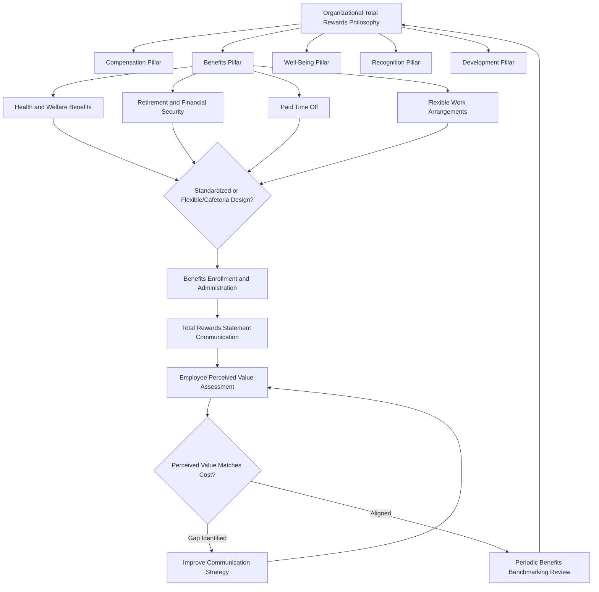

## Benefits and Total Rewards Strategy

### Definition and Scope

Benefits and total rewards strategy addresses the design and integration of non-cash and indirect compensation elements — health insurance, retirement contributions, paid leave, flexible work arrangements, wellness programs, and other employer-provided offerings — alongside cash compensation within a unified framework intended to attract, retain, and motivate employees. Total Rewards is the organizing framework (most prominently articulated by WorldatWork) that positions benefits not as a peripheral cost center but as one interdependent pillar alongside compensation, within a broader model that also typically includes development and work experience/culture elements.

### Theoretical Foundations

**Total Rewards Model (WorldatWork)**

The standard practitioner framework organizes rewards into interconnected pillars — commonly Compensation, Benefits, Well-Being, Recognition, and Development — with the explicit theoretical claim that these elements interact rather than operate independently: an employee's overall retention and motivation response reflects the combined, perceived value of the full portfolio rather than any single element in isolation. This framing directly addresses a limitation of pure pay-for-performance thinking (discussed in the prior reference) by recognizing that many valued organizational offerings are poorly suited to direct performance-contingency (health insurance, for instance, is nearly universally offered as a fixed entitlement rather than performance-variable).

**Herzberg's Two-Factor Theory — Benefits as Hygiene**

As discussed regarding base pay, Herzberg's original hygiene/motivator framework classified most benefits (health insurance, retirement plans, working conditions) as hygiene factors — necessary to prevent dissatisfaction but not typically generating active motivation once adequate. [Inference] This classification remains broadly influential in benefits strategy (explaining why benefits programs are typically framed around competitive adequacy and risk protection rather than performance incentive), though, as with pay generally, the strict hygiene/motivator dichotomy has been qualified by later research showing some benefits (particularly those with strong signaling or identity value, such as generous parental leave) can function beyond pure dissatisfaction-prevention.

**Maslow's Hierarchy of Needs Applied to Benefits Portfolio Design**

Frequently used as an organizing heuristic (rather than a rigorously tested model in this specific application) for benefits categorization: health insurance and retirement security map to safety needs, wellness and work-life balance programs map to a blend of safety and esteem, and development/growth-oriented benefits map to self-actualization needs — providing practitioners a conceptual scaffold for ensuring a benefits portfolio addresses a range of underlying employee needs rather than concentrating entirely in one category.

**Signaling Theory (Spence)**

Originally developed in labor economics to explain education's role in job markets, signaling theory has direct application to benefits strategy: benefit offerings communicate information about organizational values and quality to both prospective and current employees under conditions of imperfect information — generous parental leave signals family-friendliness, extensive mental health coverage signals wellbeing prioritization, and the mere presence of comprehensive benefits can signal organizational financial stability and long-term orientation, independent of the benefits' direct utility to any specific employee.

**Person-Environment (P-E) Fit Theory**

Benefits preference heterogeneity (some employees highly value retirement matching, others prioritize flexible work arrangements or dependent care support) motivates flexible/voluntary benefits and cafeteria-style plan design, grounded in P-E fit theory's premise that satisfaction and retention improve when the specific offerings available align with individual employee needs and values rather than a uniform one-size-fits-all package.

### Core Benefits Categories

**Health and Welfare Benefits**

Medical, dental, vision, life, and disability insurance. In the U.S. context, structured heavily around employer-sponsored group health plans (historically incentivized by favorable tax treatment); internationally, the relative importance of employer-provided health benefits varies substantially depending on the extent of public/national health system coverage, making this category's strategic weight highly country-context-dependent.

**Retirement and Financial Security Benefits**

Defined contribution plans (e.g., U.S. 401(k) with employer match) have become the dominant model in most private-sector contexts, substantially displacing defined benefit (traditional pension) plans over recent decades — a shift with significant risk-transfer implications, moving investment and longevity risk from employer to employee, a point of ongoing labor-economics and policy discussion.

**Paid Time Off (PTO)**

Vacation, sick leave, holidays, and parental/family leave. Structural design choices include traditional bucketed leave (separate vacation/sick banks) versus unlimited/flexible PTO policies; [Inference] research and practitioner reporting on "unlimited PTO" policies has found a frequently counterintuitive effect where actual usage sometimes *decreases* relative to traditional accrued-leave systems, plausibly due to ambiguity about appropriate usage norms and the loss of a visible accrued-balance signal that traditionally prompted usage — though this finding is not uniform across all organizational implementations and depends heavily on managerial modeling and explicit cultural reinforcement of usage.

**Flexible Work Arrangements**

Remote/hybrid work options, flexible scheduling, compressed workweeks. Increasingly central to total rewards strategy, particularly following widespread post-2020 shifts in employee expectations regarding work location flexibility; functions partly as a benefit with direct utility (commute reduction, autonomy) and partly as a signaling/recruitment differentiator.

**Wellness and Mental Health Programs**

Employee Assistance Programs (EAPs), wellness stipends, mental health coverage, and increasingly, more structural interventions (workload management, manager training) addressing wellbeing at a systemic rather than purely individual-remediation level — reflecting an evolving recognition in organizational psychology that individual-focused wellness programs alone show limited effectiveness without addressing organizational-level stressors.

**Voluntary and Supplemental Benefits**

Employee-paid or employee-elected offerings (supplemental life insurance, pet insurance, legal services, identity theft protection) typically offered at group rates through employer facilitation without direct employer cost, extending the perceived breadth of the total rewards portfolio at minimal direct organizational expense.

### Benefits Strategy Design Considerations

**Standardized vs. Flexible (Cafeteria) Benefits**

- **Standardized**: a single, uniform benefits package for all eligible employees; administratively simpler and supports internal equity perceptions but poorly matched to heterogeneous employee needs (e.g., a single employee may not value family-oriented dependent-care benefits as highly as an employee with children)
- **Flexible/Cafeteria Plans**: employees allocate a benefits budget across a menu of options according to individual preference, directly reflecting P-E fit theory's emphasis on need-alignment, at the cost of greater administrative complexity and, in some designs, risk of employees under-electing benefits they will later need (e.g., inadequate disability coverage) due to present-bias in benefit election decisions

**Total Rewards Statements**

A communication practice translating the full value of benefits (often substantial but frequently under-perceived by employees, since much of the value is invisible relative to a visible paycheck) into an explicit, itemized total compensation statement — directly addressing a documented gap between actual and perceived benefits value that can otherwise undermine the retention/attraction value the organization is paying for.

**Benefits Communication and Perceived Value**

[Inference] A consistent finding in benefits research is that employees frequently underestimate the monetary value of employer-provided benefits relative to their actual cost, suggesting that benefits strategy effectiveness depends not only on plan design and generosity but substantially on communication quality — an under-communicated generous benefits package may deliver less retention/attraction value than a more modest package that is clearly and personally communicated.

### Total Rewards Framework Architecture

### Total Rewards Pillars (svg_diagram)

<svg xmlns="http://www.w3.org/2000/svg" viewBox="0 0 640 260">
<text x="320" y="24" text-anchor="middle" font-size="16" font-weight="bold" fill="#1f2937">Total Rewards Model Pillars (svg_diagram)</text>
<rect x="20" y="60" width="115" height="140" rx="8" fill="#dbeafe" stroke="#3b82f6" />
<text x="77" y="130" text-anchor="middle" font-size="11" fill="#1e3a8a">Compensation</text>
<rect x="145" y="60" width="115" height="140" rx="8" fill="#dcfce7" stroke="#22c55e" />
<text x="202" y="130" text-anchor="middle" font-size="11" fill="#166534">Benefits</text>
<rect x="270" y="60" width="115" height="140" rx="8" fill="#fef3c7" stroke="#f59e0b" />
<text x="327" y="130" text-anchor="middle" font-size="11" fill="#78350f">Well-Being</text>
<rect x="395" y="60" width="115" height="140" rx="8" fill="#fce7f3" stroke="#ec4899" />
<text x="452" y="130" text-anchor="middle" font-size="11" fill="#9d174d">Recognition</text>
<rect x="520" y="60" width="100" height="140" rx="8" fill="#e0e7ff" stroke="#6366f1" />
<text x="570" y="130" text-anchor="middle" font-size="11" fill="#312e81">Development</text>

<text x="320" y="225" text-anchor="middle" font-size="11" fill="`#374151`">Interdependent pillars — perceived total value, not additive silos</text>

</svg>

### Applied Example

**Example**

A mid-sized organization observes exit interview data indicating departing employees frequently cite "better benefits elsewhere" despite the organization's benefits spend being at or above the 75th percentile of its labor market. Rather than immediately increasing benefits spend, a total-rewards-informed diagnosis first investigates the communication and perceived-value gap: a survey reveals most employees significantly underestimate the employer's retirement matching contribution and are largely unaware of the mental health coverage details available to them. Applying signaling theory and the perceived-value research above, the organization's primary intervention is not richer benefits but a personalized total rewards statement issued annually, paired with benefits-literacy sessions during open enrollment, addressing the gap between actual and perceived value before considering costlier plan-design changes — a lower-cost intervention directly targeting the diagnosed root cause rather than assuming the exit-interview complaint reflects genuine benefit-generosity inadequacy.

### Measurement and Evaluation

Total rewards effectiveness is typically evaluated through a combination of competitive benchmarking (comparing benefits offerings and spend against labor-market peers via compensation/benefits surveys), utilization analysis (which benefits are actually used, informing future plan-design investment), employee perception surveys (perceived value and satisfaction, distinct from objective cost/generosity), and downstream outcome metrics (retention, offer-acceptance rates, engagement survey results), reflecting the broader principle that benefits strategy should be evaluated on realized organizational and employee outcomes rather than input generosity alone.

### Limitations and Contextual Factors

- **Country and regulatory context substantially shapes benefits strategy**: the relative strategic importance of specific benefit categories (health insurance, retirement) varies enormously depending on public-sector provision in a given country, meaning benefits strategy frameworks developed primarily in a U.S. employer-sponsored-benefits context require substantial adaptation for organizations operating in countries with more extensive public social insurance systems
- **Unlimited PTO usage effects are not uniform**: [Inference] the counterintuitive usage-reduction finding associated with some unlimited PTO implementations depends heavily on organizational culture and explicit managerial reinforcement, and should not be assumed to generalize to every unlimited-PTO adoption
- **Cafeteria plan election behavior is subject to behavioral biases**: present-bias and choice-overload effects in benefits election research suggest employees do not always select benefits that would maximize their long-term welfare when given full flexibility, a consideration relevant to benefits communication and potential default-option design (leveraging behavioral economics' findings on defaults' power in shaping choices)
- Specific benefits program outcomes (utilization rates, perceived value, retention impact) depend substantially on workforce demographics, organizational communication quality, and competitive labor-market context, and general research findings should be treated as directional patterns rather than guarantees applicable to any specific organizational implementation

### Next Steps

- Compensation Theory and Pay Structures
- Pay-for-Performance Systems
- Employee Wellbeing and Occupational Health Psychology
- Behavioral Economics Applications in Benefits Design (Defaults, Choice Architecture)
- Work-Life Balance and Flexible Work Arrangement Research
- Global Total Rewards Strategy Across Regulatory Contexts