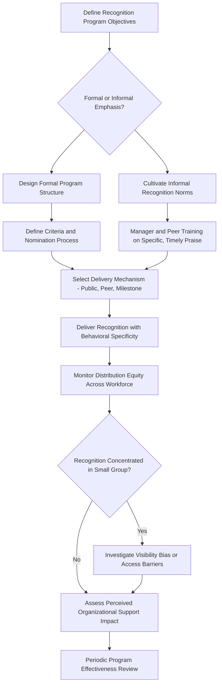

## Recognition Programs

### Definition and Scope

Recognition programs are formal and informal organizational mechanisms for acknowledging employee contributions, behaviors, or achievements through non-monetary or low-monetary-value means — distinct from base pay, incentive pay, and benefits, though functioning as an interdependent pillar within the broader Total Rewards framework introduced in the prior reference. Recognition addresses a psychologically distinct need from financial compensation: the desire for social acknowledgment, esteem, and validation of contribution, operating through motivational mechanisms that differ meaningfully from the extrinsic financial-incentive logic underlying pay-for-performance systems.

### Theoretical Foundations

**Reinforcement Theory (Skinner) — Recognition as Reinforcer**

Recognition functions as a positive reinforcer in operant conditioning terms, strengthening the likelihood of recurrence for the specific behavior being recognized. A critical design implication directly paralleling incentive pay design: recognition's reinforcing power depends heavily on specificity and timing — recognition tied closely in time to the specific behavior, and describing that behavior concretely, produces stronger reinforcement than generic, delayed, or vague praise, mirroring the behavioral-specificity principles found in the SBI feedback model discussed previously.

**Self-Determination Theory (Deci & Ryan)**

Recognition interacts with the three basic psychological needs in ways that can differ substantially from financial incentives: informational recognition (praise that conveys competence-relevant information without being experienced as controlling) tends to support autonomy and competence needs, whereas recognition perceived as controlling (explicitly tied to inducing specific future behavior, or delivered in a manipulative or contingent manner) can undermine autonomy in ways structurally similar to the crowding-out concerns raised regarding contingent pay. This distinction — informational versus controlling framing — is a central design consideration differentiating effective from counterproductive recognition practice.

**Social Exchange Theory (Blau)**

Recognition, as a form of socioemotional benefit exchanged within the employment relationship, contributes to the broader reciprocal exchange dynamic between employee and organization; recognized employees are theorized to reciprocate through increased discretionary effort, organizational citizenship behavior, and commitment, consistent with the norm of reciprocity underlying social exchange theory more broadly.

**Organizational Support Theory (Eisenberger)**

Recognition is one concrete behavioral signal contributing to employees' broader perceived organizational support (POS) — the global belief that the organization values their contributions and cares about their wellbeing. POS is a well-established predictor of affective commitment, reduced turnover intention, and extra-role performance, positioning recognition programs as one operational lever for building this broader perceptual construct rather than an isolated HR practice.

**Equity Theory — Recognition as an Outcome**

As with pay, recognition functions as an "outcome" in equity theory's outcome-to-input ratio comparison. Perceived recognition inequity (colleagues receiving disproportionate recognition relative to comparable contribution) can generate the same equity-restoring behavioral responses (effort withdrawal, resentment, turnover intention) associated with pay inequity, making recognition program fairness and consistency a genuine organizational-justice concern rather than a purely motivational "nice-to-have."

### Recognition Program Typologies

**Formal vs. Informal Recognition**

- **Formal recognition**: structured, programmatic mechanisms with defined criteria, nomination/selection processes, and often institutional visibility (employee-of-the-month programs, formal awards ceremonies, service-anniversary recognition, structured peer-nomination platforms)
- **Informal recognition**: spontaneous, unstructured acknowledgment (a manager's verbal thanks, a peer's public shout-out) occurring outside formal program structures; research generally suggests informal, immediate recognition can carry strong motivational value precisely because of its spontaneity and specificity, complementing rather than being superseded by formal programs

**Manager-to-Employee vs. Peer-to-Peer Recognition**

Peer-to-peer recognition platforms have grown substantially in contemporary practice, reflecting recognition that peers often observe day-to-day contextual performance and collaborative behaviors (see the task/contextual performance distinction from Criterion Theory) that a supervisor may not directly witness, making peer recognition a potentially more criterion-relevant information source for certain performance dimensions than exclusively top-down recognition.

**Monetary-Adjacent vs. Purely Symbolic Recognition**

Some recognition programs incorporate small monetary or gift-card rewards alongside acknowledgment (sometimes termed "recognition and rewards" platforms), while others rely purely on symbolic/social acknowledgment (certificates, public announcement, badges). [Inference] The presence of a monetary component does not straightforwardly increase motivational value and can, per the SDT-grounded crowding-out and controlling-versus-informational framing concerns above, shift the psychological experience of the reward from social/esteem-based toward transactional, potentially diluting the distinct motivational contribution recognition is theorized to offer beyond pay.

**Milestone/Tenure Recognition**

Service-anniversary and tenure-based recognition (5-year, 10-year awards) reflect a distinct rationale from performance-contingent recognition — acknowledging loyalty and continuity itself as a valued organizational contribution, tied more to social exchange theory's relationship-maintenance function than to reinforcement theory's behavior-shaping function.

### Design Principles Grounded in Theory

**Specificity**

Directly paralleling the SBI feedback model and reinforcement theory's emphasis on clear behavior-consequence linkage: effective recognition names the specific behavior or contribution being acknowledged rather than offering generic praise, both strengthening the reinforcement signal and reducing the risk that recognition is perceived as arbitrary (an equity-theory fairness concern).

**Timeliness**

Reinforcement theory's temporal-contiguity principle applies directly: recognition delivered promptly after the recognized behavior produces a stronger behavior-consequence association than recognition delayed to a periodic formal ceremony disconnected in time from the triggering contribution.

**Frequency and Distribution Equity**

Recognition programs concentrated on a small, recurring set of recipients (whether due to visibility bias, in-group favoritism, or genuine differential performance) risk generating the same equity-theory-predicted resentment among non-recipients that inequitable pay distribution produces; monitoring recognition distribution patterns across the workforce is a parallel practice to the pay-equity monitoring discussed in prior references, though typically less formalized in most organizations' HR practice.

**Autonomy-Supportive Framing**

Per SDT, recognition framed informationally ("this analysis identified a risk the team had missed, and that changed our approach") tends to support intrinsic motivation more robustly than recognition framed in a controlling manner ("great job, keep doing exactly this so we hit our numbers"), even when both forms of praise are well-intentioned and specific.

### Recognition Program Design Flow

### Reinforcement Timing and Specificity Effect (svg_diagram)

<svg xmlns="http://www.w3.org/2000/svg" viewBox="0 0 620 240">
<text x="310" y="24" text-anchor="middle" font-size="16" font-weight="bold" fill="#1f2937">Recognition Reinforcement Strength (svg_diagram)</text>
<line x1="60" y1="200" x2="580" y2="200" stroke="#374151" stroke-width="2" />
<line x1="60" y1="200" x2="60" y2="50" stroke="#374151" stroke-width="2" />
<text x="320" y="225" text-anchor="middle" font-size="10" fill="#374151">Delay Between Behavior and Recognition</text>
<path d="M 60 70 Q 200 90 350 150 Q 450 180 580 195" fill="none" stroke="#3b82f6" stroke-width="3" />
<text x="140" y="60" font-size="10" fill="#1e3a8a">Specific + Immediate</text>
<path d="M 60 130 Q 250 160 580 195" fill="none" stroke="#f59e0b" stroke-width="2" stroke-dasharray="5,4" />
<text x="400" y="150" font-size="10" fill="#78350f">Generic + Delayed</text>
</svg>

### Applied Example

**Example**

An organization's existing "Employee of the Month" program, selected by senior leadership based on limited visibility into day-to-day work, has drawn quiet criticism that it consistently favors employees in client-facing or highly visible roles while overlooking equally valuable but less visible contributions (e.g., infrastructure reliability work that prevents problems rather than visibly solving them). Applying equity theory and organizational support theory, the pattern risks generating perceived recognition inequity among the overlooked group, potentially undermining rather than building perceived organizational support for exactly the employees whose less-visible work the organization most needs to sustain. The redesign introduces a peer-nomination component (leveraging peers' more complete visibility into contextual and behind-the-scenes contributions), requires nominators to specify the concrete behavior being recognized (operationalizing the specificity principle), and adds a parallel, more frequent informal recognition channel (a team-visible peer-to-peer acknowledgment tool) to reduce reliance on a single monthly, leadership-selected mechanism as the sole formal recognition pathway.

### Measurement and Evaluation

Recognition program effectiveness is typically assessed through engagement survey items specifically addressing feeling valued/recognized, recognition distribution/equity analysis across demographic and role groups, program participation and utilization rates (for peer-to-peer platforms), and correlational analysis against retention and discretionary-effort outcomes — though, as with most organizational interventions, isolating recognition's independent causal contribution from the broader total rewards and culture context in which it operates is methodologically challenging in observational organizational data.

### Limitations and Contextual Factors

- **Cultural variation in recognition preference and delivery norms**: [Inference] public individual recognition, common in many Western organizational contexts, may be experienced differently in more collectivist cultural contexts where individual singling-out can create discomfort or perceived unfairness toward the broader team; team-based or more private recognition delivery may be better received in some cultural contexts, though the degree of adaptation needed varies by specific culture and individual preference
- **Monetary-symbolic blending effects are not fully settled**: the SDT-grounded concern that adding monetary value to recognition may dilute its distinct socioemotional/esteem-based motivational contribution is theoretically grounded but not universally demonstrated across all recognition-and-rewards program implementations, and effects likely depend on how the monetary element is framed and delivered
- **Recognition cannot substitute for underlying compensation or working-condition adequacy**: per Herzberg's hygiene-factor logic discussed regarding benefits, symbolic recognition is unlikely to meaningfully offset genuine dissatisfaction stemming from inadequate pay, unmanageable workload, or poor working conditions, and over-reliance on low-cost recognition programs as a substitute for addressing more fundamental compensation or workload concerns is a documented organizational pitfall
- Specific recognition program outcomes depend substantially on organizational culture, program design fidelity (specificity, timeliness, distribution equity), and the broader total rewards and management context in which recognition is embedded, and should not be assumed to generalize uniformly across organizations or workforce populations

### Related Topics

- Benefits and Total Rewards Strategy
- Self-Determination Theory and Workplace Motivation
- Perceived Organizational Support and Affective Commitment
- Feedback Delivery and Developmental Coaching
- Organizational Justice and Equity Perceptions
- Organizational Citizenship Behavior