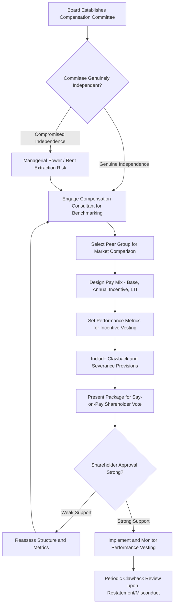

## Executive Compensation Issues

### Definition and Scope

Executive compensation concerns the distinct theoretical, structural, and governance issues arising when designing pay for senior leadership — particularly C-suite executives and boards — where the scale, structure, visibility, and governance context differ substantially from the general compensation principles discussed in prior references. While grounded in the same foundational theories (agency theory, equity theory, expectancy theory), executive compensation introduces additional considerations: board governance and oversight, shareholder alignment, extreme pay dispersion relative to the broader workforce, and heightened public/regulatory scrutiny.

### Theoretical Foundations

**Agency Theory (Jensen & Meckling) — The Central Framework**

Executive compensation is the paradigmatic application of agency theory: executives (agents) possess substantial discretion over firm resources and strategy, while shareholders (principals) cannot fully observe or verify executive effort and decision quality. Executive pay structures are theorized as the primary mechanism for aligning executive incentives with shareholder value creation, typically through substantial equity-based compensation tying personal wealth to firm performance. The theory's core prediction — that well-designed incentive alignment reduces agency costs (value loss from misaligned principal-agent interests) — provides the formal economic rationale for the heavy use of long-term equity incentives at the executive level relative to lower organizational levels.

**Managerial Power Theory (Bebchuk & Fried)**

A significant counter-perspective to the pure agency-alignment view: managerial power theory argues that executive compensation is not purely the product of arm's-length, efficient contracting between board and executive, but is substantially shaped by executives' influence over the board and compensation-setting process itself (particularly where board independence is weak or executives have substantial influence over board composition), leading to compensation outcomes that exceed what efficient incentive-alignment alone would predict — a phenomenon sometimes termed "rent extraction." This theory directly challenges the assumption that observed executive pay levels straightforwardly reflect efficient market-clearing or incentive-optimal design.

**Tournament Theory (Lazear & Rosen)**

An economic framework explaining large pay gaps between CEO and other executives (rather than gradual, proportional differentials) as functioning like a tournament prize: the large gap itself is theorized to motivate effort and competition among the broader executive pool competing for eventual promotion to CEO, with the prize's size (rather than the winner's specific marginal productivity) providing the motivational mechanism — an alternative explanation for large pay gaps distinct from pure marginal-productivity or agency-alignment reasoning.

**Social Comparison and Equity Theory at Extreme Pay Ratios**

As CEO-to-median-worker pay ratios have grown substantially in many economies over recent decades, equity theory's referent-other comparison mechanism becomes relevant at an organizational-culture level: [Inference] research on the relationship between CEO pay ratio and broader employee morale, motivation, and turnover shows some evidence that very high ratios can be associated with negative workforce perceptions of fairness, though isolating this specific effect from the many confounding organizational and industry factors that also influence both pay ratios and employee outcomes is methodologically challenging, and the literature does not establish a precise "threshold" ratio beyond which negative effects reliably emerge.

**Upper Echelons Theory (Hambrick & Mason)**

While primarily a strategic management theory concerning how executive characteristics shape organizational strategy and outcomes, upper echelons theory is relevant to executive compensation design in that it reinforces the premise underlying high executive pay — that senior leadership decisions have outsized, firm-wide consequences relative to most other roles — providing part of the justification for concentrated incentive-alignment investment at this organizational level.

### Executive Compensation Structure

**Base Salary**

Typically a smaller proportion of total executive compensation relative to lower organizational levels, reflecting the theoretical emphasis on variable, performance-contingent pay for aligning executive incentives with firm performance rather than guaranteeing fixed compensation regardless of outcomes.

**Annual/Short-Term Incentives**

Bonus plans tied to annual financial and strategic performance metrics (revenue, earnings, specific strategic milestones), functioning similarly in design logic to the individual/organizational incentive mechanisms discussed in the prior Pay-for-Performance reference, but typically with a substantially larger proportion of total compensation at risk.

**Long-Term Incentives (LTI)**

The dominant component of senior executive pay in most large public-company contexts, typically comprising stock options, restricted stock units (RSUs), and performance shares (equity grants vesting contingent on multi-year performance conditions such as relative total shareholder return against a peer index). LTI design directly operationalizes agency theory's temporal-alignment concern — vesting schedules spanning multiple years are intended to discourage short-termism and align executive decision-making with sustained value creation rather than near-term metric optimization.

**Severance and Change-in-Control Provisions**

"Golden parachute" provisions guaranteeing payment upon termination (particularly following a change in company control, such as an acquisition) are theorized to serve a specific agency-theory function distinct from ongoing incentive alignment: reducing executives' personal incentive to resist value-maximizing corporate transactions (such as an acquisition beneficial to shareholders) purely to protect their own job security, thereby better aligning executive and shareholder interests specifically around major strategic/ownership transitions.

**Perquisites ("Perks")**

Non-cash benefits (executive travel arrangements, additional insurance, club memberships) representing a typically small but symbolically and often controversially scrutinized component of executive pay, frequently a focus of managerial-power-theory-oriented critique given perquisites' comparatively weak direct linkage to performance incentive relative to their visibility as potential rent-extraction indicators.

### Governance Mechanisms

**Compensation Committee Structure**

Board sub-committees, ideally composed of independent (non-executive) directors, formally responsible for setting executive pay; managerial power theory's core concern centers on the degree to which this committee's independence is genuine versus compromised by informal executive influence over director selection, committee composition, or the compensation consultants engaged to benchmark pay levels.

**Say-on-Pay**

Regulatory mechanisms (such as those introduced under the U.S. Dodd-Frank Act) requiring periodic non-binding shareholder votes on executive compensation packages, intended as a market-based governance check against managerial-power-theory-predicted rent extraction, though the non-binding nature of most say-on-pay votes in the U.S. context limits their direct enforcement power relative to their signaling and reputational function.

**Compensation Consultants and Peer Benchmarking**

Common practice of benchmarking executive pay against a selected peer group of comparable companies; [Inference] this practice has drawn methodological criticism in the academic literature (particularly associated with Bebchuk and colleagues' work) for a potential upward-ratcheting dynamic — if peer-group benchmarking systematically targets pay above the peer median (a documented tendency in some analyses), and each company's subsequent pay level then becomes part of the peer group for others, the practice can contribute to sustained upward pressure on executive pay levels across an industry independent of any corresponding change in performance or value creation.

**Clawback Provisions**

Increasingly common (and in some jurisdictions now regulatorily mandated, such as under U.S. SEC clawback rules following Dodd-Frank) contractual provisions allowing organizations to recoup previously paid incentive compensation in cases of financial restatement or executive misconduct, directly addressing an agency-theory concern that purely forward-looking incentive alignment does not adequately deter or remedy incentive-driven short-term metric manipulation discovered after payment has already occurred.

### Executive Compensation Governance Flow

### Executive Pay Mix Structure (svg_diagram)

<svg xmlns="http://www.w3.org/2000/svg" viewBox="0 0 620 240">
<text x="310" y="24" text-anchor="middle" font-size="16" font-weight="bold" fill="#1f2937">Typical Senior Executive Pay Mix (svg_diagram)</text>
<rect x="40" y="60" width="80" height="150" fill="#dbeafe" stroke="#3b82f6" />
<text x="80" y="140" text-anchor="middle" font-size="10" fill="#1e3a8a" transform="rotate(-90 80 140)">Base ~15%</text>
<rect x="150" y="90" width="110" height="120" fill="#fef3c7" stroke="#f59e0b" />
<text x="205" y="150" text-anchor="middle" font-size="10" fill="#78350f" transform="rotate(-90 205 150)">Annual Incentive ~20%</text>
<rect x="290" y="60" width="280" height="150" fill="#dcfce7" stroke="#22c55e" />
<text x="430" y="140" text-anchor="middle" font-size="12" fill="#166534">Long-Term Incentives (Equity) ~65%</text>
</svg>

### Applied Example

**Example**

A publicly traded company's compensation committee is reviewing the CEO's pay package following a weak say-on-pay vote (62% approval, notably lower than the prior year's 91%) and proxy-advisor criticism citing pay levels above the peer median despite below-median three-year total shareholder return. Applying the governance frameworks above, the committee investigates whether the peer group used for benchmarking was constructed to include disproportionately larger or higher-paying companies (a documented critique from the compensation-consultant benchmarking literature), and finds this is indeed the case — the peer group skews toward companies with substantially larger market capitalization. The remediation involves reconstructing a more comparable peer group aligned on revenue and market cap, explicitly linking a larger proportion of the CEO's LTI to relative total shareholder return against that revised peer group rather than absolute metrics alone (directly tightening the agency-theory alignment between pay and genuine relative performance), and adding a clawback provision applicable to the annual incentive in the event of future financial restatement — addressing both the substantive pay-performance misalignment and the specific governance weaknesses the say-on-pay result and proxy criticism identified.

### Public Policy and Regulatory Context

Executive compensation has drawn sustained regulatory and public policy attention in multiple jurisdictions, including pay-ratio disclosure requirements (mandating public companies disclose the ratio between CEO and median employee pay, as under U.S. Dodd-Frank Section 953(b)), say-on-pay voting requirements, and clawback mandates — reflecting broader societal and policy-level concern (extending beyond pure agency-theory efficiency questions into distributive-justice and political-economy considerations) about rising executive-to-worker pay disparities, a topic that intersects organizational psychology with labor economics and public policy debate.

### Limitations and Contextual Factors

- **Agency theory and managerial power theory offer competing, only partially reconciled explanations**: the academic literature has not settled definitively on the degree to which observed executive pay levels and structures reflect efficient incentive-alignment contracting versus governance-failure-enabled rent extraction, and the appropriate interpretation likely varies by specific company governance quality and context rather than being uniform across all executive pay arrangements
- **Cross-national variation is substantial**: [Inference] executive compensation levels, structures (equity-heavy U.S. practice versus, in some cases, more salary/pension-weighted structures in certain other developed economies), and regulatory/disclosure regimes vary considerably across countries, and findings or design principles drawn predominantly from U.S. public-company research should not be assumed to transfer directly to other national governance and regulatory contexts
- **Say-on-pay's practical enforcement power is limited in many jurisdictions**: since most say-on-pay votes are non-binding, their governance effect operates primarily through reputational and signaling channels rather than direct legal constraint, meaning their practical effectiveness as a check on managerial power depends substantially on board responsiveness to vote outcomes rather than the voting mechanism alone
- Findings regarding CEO pay ratio effects on workforce morale and specific benchmarking-driven pay escalation dynamics represent patterns identified in academic research subject to ongoing debate and methodological limitations, and should be treated as areas of continued scholarly discussion rather than settled, universally quantified relationships

### Next Steps

- Agency Theory and Corporate Governance
- Pay-for-Performance Systems
- Job Evaluation and Internal Equity (Extreme Pay Dispersion Linkage)
- Board Governance and Compensation Committee Design
- Say-on-Pay Regulation and Shareholder Activism
- Compensation Consulting and Peer Benchmarking Methodology