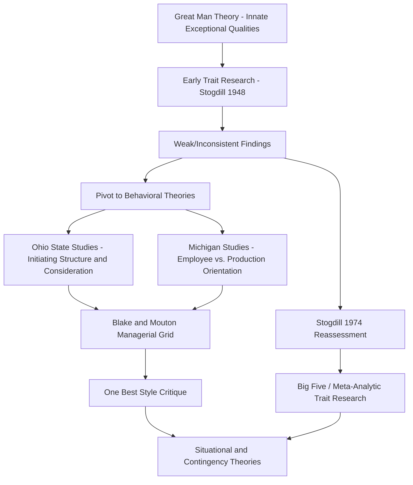

## Trait and Behavioral Theories of Leadership

### Definition and Scope

Trait and behavioral theories of leadership represent the two earliest major paradigms in the systematic study of leadership within organizational psychology, historically preceding — and providing the conceptual foundation that later situational, contingency, and contemporary (transformational, authentic) leadership theories developed in response to. Trait theories ask "what personal characteristics distinguish leaders from non-leaders (or effective from ineffective leaders)?" Behavioral theories shift the question to "what do effective leaders actually *do*?" — a deliberate pivot from stable individual attributes toward observable, and therefore theoretically trainable, actions.

### Trait Theories of Leadership

**Historical Origins: The "Great Man" Theory**

The earliest leadership scholarship, dating to the late 19th and early 20th centuries (associated with Carlyle's writings), held that leaders are born with innate, exceptional qualities distinguishing them from ordinary individuals — a largely untested, essentialist premise that modern trait research has substantially moved beyond, though it remains historically important as the paradigm against which subsequent empirical trait research reacted.

**Early Empirical Trait Research and Its Limitations**

Systematic empirical trait research beginning in the early-to-mid 20th century (notably Stogdill's influential 1948 review) initially found disappointingly weak and inconsistent relationships between measured traits and leadership emergence/effectiveness across studies — a finding that substantially contributed to the field's subsequent pivot toward behavioral and later situational theories, since traits alone appeared insufficient to explain leadership outcomes across varying contexts.

**Stogdill's Later Reassessment**

Stogdill's follow-up review (1974), incorporating a larger and more methodologically refined body of research, found more consistent (though still moderate) trait-leadership relationships than his earlier review had suggested, helping to partially rehabilitate trait-based approaches and setting the stage for the more rigorous, meta-analytically grounded trait research of subsequent decades.

**Contemporary Trait Research: The Five-Factor Model (Big Five) Applications**

Modern trait leadership research, particularly following the widespread adoption of the Five-Factor (Big Five) personality model, has produced more robust and replicated findings via meta-analysis (notably Judge, Bono, Ilies, and Gerhardt's influential 2002 meta-analysis). Key patterns:

| Big Five Trait | Relationship to Leadership Emergence/Effectiveness |
| --- | --- |
| Extraversion | Generally the strongest and most consistent positive predictor across studies |
| Conscientiousness | Consistent positive predictor, particularly for leadership effectiveness |
| Openness to Experience | Generally positive predictor, though somewhat weaker and less consistent than extraversion/conscientiousness |
| Emotional Stability (low Neuroticism) | Positive predictor, generally moderate in strength |
| Agreeableness | Weakest and least consistent relationship among the five factors |

[Inference] While these meta-analytic relationships are considered reasonably well-established within the field, the effect sizes involved are moderate rather than large, meaning traits alone explain a meaningful but incomplete portion of variance in leadership emergence and effectiveness — a nuance frequently lost in more popularized accounts of "leadership personality" that overstate trait determinism.

**Other Notable Trait Constructs**

- **Cognitive ability/intelligence**: consistently, though moderately, associated with leadership effectiveness; the relationship is complicated by findings that very high intelligence differentials between leader and followers can sometimes impair communication and rapport (an early, less rigorously established finding sometimes termed the "intelligence gap" concern)
- **Self-monitoring**: individuals high in self-monitoring (sensitivity to and adaptation of behavior based on social/situational cues) show more consistent positive association with leadership emergence in some research, plausibly reflecting greater behavioral flexibility across varying leadership contexts
- **Leader motive patterns (McClelland)**: McClelland's "leadership motive pattern" — high need for power (particularly socialized power oriented toward organizational rather than personal ends) combined with moderate-to-high need for achievement and relatively lower need for affiliation — has been associated with managerial success in some longitudinal research, though this remains a more specialized and less universally replicated line of trait inquiry than Big Five-based research

### Critiques and Limitations of Trait Theory

The central and enduring critique of pure trait approaches is that traits alone do not adequately account for the substantial situational variation in what constitutes effective leadership — the same trait profile may be highly effective in one organizational context (e.g., a crisis requiring decisive, directive action) and poorly suited to another (e.g., a collaborative, expertise-driven team requiring participative facilitation), a limitation that directly motivated both behavioral theory's shift toward observable action and the subsequent situational/contingency theories.

### Behavioral Theories of Leadership

**Theoretical Rationale for the Behavioral Shift**

Behavioral theories share a foundational premise distinguishing them from trait approaches: if leadership is defined by *behavior* rather than fixed personal characteristics, then leadership is, in principle, learnable and trainable — a premise with direct and significant implications for the leadership development programs discussed in a prior reference, since training interventions logically presuppose behavioral (rather than purely dispositional) malleability.

**Ohio State Leadership Studies**

A highly influential research program (beginning late 1940s) empirically deriving, through factor analysis of leader behavior questionnaires, two largely independent behavioral dimensions:

- **Initiating Structure**: the degree to which a leader defines and structures their own role and subordinates' roles toward goal attainment — task assignment, scheduling, performance standard-setting, and role clarification
- **Consideration**: the degree to which a leader demonstrates concern for subordinates' welfare, builds mutual trust and rapport, and shows warmth and approachability

A key finding distinguishing this research from earlier assumptions: these two dimensions were found to be statistically largely independent (orthogonal) rather than opposite ends of a single continuum — meaning a leader could score high on both, low on both, or high on one and low on the other, contradicting an earlier implicit assumption that task-focus and people-focus necessarily trade off against each other.

**University of Michigan Leadership Studies**

A parallel, contemporaneous research program identifying broadly similar behavioral dimensions but conceptualized somewhat differently — distinguishing **employee-oriented** leader behavior (emphasizing interpersonal relationships and subordinate needs) from **production-oriented** behavior (emphasizing technical/task aspects of the job), with Michigan researchers' initial framing treating these as somewhat more bipolar (opposite ends of a continuum) than the Ohio State studies' orthogonal-dimension finding, an important methodological and conceptual distinction between the two research traditions.

**The Managerial (Leadership) Grid (Blake & Mouton)**

A highly influential practitioner-oriented framework building directly on the Ohio State/Michigan two-dimensional behavioral findings, plotting leadership style on two axes — concern for production (task) and concern for people — on a 1-9 scale each, yielding a 9x9 grid with named archetypal positions:

| Grid Position | Concern for Production | Concern for People | Style Label |
| --- | --- | --- | --- |
| (1,1) | Low | Low | Impoverished Management |
| (9,1) | High | Low | Authority-Compliance |
| (1,9) | Low | High | Country Club Management |
| (5,5) | Moderate | Moderate | Middle-of-the-Road Management |
| (9,9) | High | High | Team Management |

Blake and Mouton's normative claim — that (9,9) Team Management represents the universally optimal style — was influential in management training practice but drew subsequent theoretical criticism for its implicit "one best way" assumption, a critique paralleling trait theory's limitation and again motivating the field's subsequent turn toward contingency/situational theories that explicitly reject a single universally optimal leadership style.

### Trait vs. Behavioral Theory Comparison

| Dimension | Trait Theories | Behavioral Theories |
| --- | --- | --- |
| Core Question | Who are leaders (stable characteristics)? | What do leaders do (observable actions)? |
| Assumed Malleability | Relatively fixed/stable | Learnable/trainable |
| Primary Method | Personality assessment, meta-analysis | Behavioral rating questionnaires, factor analysis |
| Key Limitation | Insufficient account of situational variation | "One best style" assumption in some formulations (e.g., Blake & Mouton) |
| Key Legacy | Selection/assessment applications; foundation for later dispositional leadership research | Direct foundation for leadership training/development practice |

### Trait and Behavioral Theory Development Flow

### Ohio State Two-Dimensional Model (svg_diagram)

<svg xmlns="http://www.w3.org/2000/svg" viewBox="0 0 560 400">
<text x="280" y="24" text-anchor="middle" font-size="16" font-weight="bold" fill="#1f2937">Initiating Structure vs. Consideration (svg_diagram)</text>
<line x1="80" y1="60" x2="80" y2="360" stroke="#9ca3af" stroke-width="2" />
<line x1="80" y1="360" x2="520" y2="360" stroke="#9ca3af" stroke-width="2" />
<text x="30" y="210" font-size="11" fill="#374151" transform="rotate(-90 30 210)">Consideration</text>
<text x="300" y="385" text-anchor="middle" font-size="11" fill="#374151">Initiating Structure</text>
<rect x="80" y="60" width="220" height="150" fill="#fef3c7" fill-opacity="0.7" />
<text x="190" y="130" text-anchor="middle" font-size="12" fill="#78350f">High Consideration</text>
<text x="190" y="148" text-anchor="middle" font-size="10" fill="#78350f">Low Structure</text>
<rect x="300" y="60" width="220" height="150" fill="#dcfce7" fill-opacity="0.7" />
<text x="410" y="130" text-anchor="middle" font-size="12" fill="#166534">High Both</text>
<text x="410" y="148" text-anchor="middle" font-size="10" fill="#166534">High Structure/Consideration</text>
<rect x="80" y="210" width="220" height="150" fill="#fee2e2" fill-opacity="0.7" />
<text x="190" y="280" text-anchor="middle" font-size="12" fill="#991b1b">Low Both</text>
<text x="190" y="298" text-anchor="middle" font-size="10" fill="#991b1b">Low Structure/Consideration</text>
<rect x="300" y="210" width="220" height="150" fill="#dbeafe" fill-opacity="0.7" />
<text x="410" y="280" text-anchor="middle" font-size="12" fill="#1e3a8a">High Structure</text>
<text x="410" y="298" text-anchor="middle" font-size="10" fill="#1e3a8a">Low Consideration</text>
</svg>

### Applied Example

**Example**

A manufacturing plant manager is rated by subordinates as very high on Initiating Structure (clear task assignments, tight scheduling, explicit performance standards) but very low on Consideration (rarely checks in on wellbeing, dismisses interpersonal concerns as distractions from output). Under the older Michigan bipolar assumption, this might be interpreted as an inevitable trade-off of task-focus for people-focus. Applying the Ohio State orthogonal-dimensions finding instead, the organizational psychologist recognizes these are independent dimensions — the manager could, in principle, increase Consideration without sacrificing Initiating Structure, since the two are not opposite ends of one continuum. A targeted development intervention (see prior Leadership Development Programs reference) focusing specifically on Consideration-building behaviors (structured one-on-ones, explicit acknowledgment of subordinate concerns) is designed without requiring any reduction in the manager's already-effective task-structuring behaviors, directly reflecting the empirical independence the Ohio State research established.

### Legacy and Contemporary Relevance

**Conclusion**

While largely superseded as complete explanatory frameworks by subsequent situational, contingency, and transformational leadership theories, trait and behavioral theories remain foundational: trait research (particularly Big Five-based work) continues to inform leadership selection and assessment practice, while the Ohio State/Michigan behavioral dimensions (task-oriented versus relationship-oriented behavior) persist as a core organizing distinction embedded within virtually all subsequent leadership frameworks, including situational leadership models and the task/contextual performance distinction discussed in the Criterion Theory reference.

### Limitations and Contextual Factors

- **Meta-analytic trait effect sizes are moderate, not large**: [Inference] popularized accounts of leadership personality often overstate the deterministic power of traits; the empirical Big Five-leadership relationships, while reasonably well-replicated, leave substantial unexplained variance attributable to situational, behavioral, and developmental factors
- **Behavioral measurement via subordinate rating questionnaires carries its own measurement limitations**: Ohio State/Michigan-style behavioral assessments rely on subordinate perception, which is subject to the same rater bias considerations (halo, leniency) discussed in prior references on performance rating
- **Blake and Mouton's universal (9,9) claim has not held up as a context-free prescription**: subsequent situational leadership research has generally found that optimal behavioral emphasis (task versus relationship orientation) depends on follower readiness, task structure, and other contextual moderators, rather than one style being universally superior across all situations
- **Cross-cultural generalizability of both trait and behavioral findings is not fully established**: [Inference] most of the foundational trait and behavioral leadership research originated in North American organizational contexts, and the degree to which specific trait-effectiveness or behavior-effectiveness relationships generalize across cultures with different leadership expectations and power-distance norms remains an area requiring further context-specific research rather than settled cross-cultural consensus

### Next Steps

- Situational and Contingency Leadership Theories (Fiedler, Hersey-Blanchard)
- Transformational and Transactional Leadership
- Leadership Development Programs
- Big Five Personality Model in Organizational Psychology
- Leader-Member Exchange (LMX) Theory
- Authentic and Servant Leadership Theories