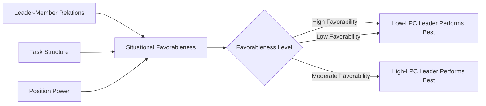
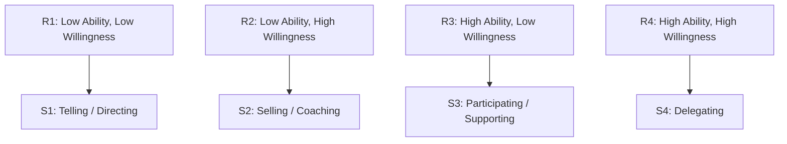
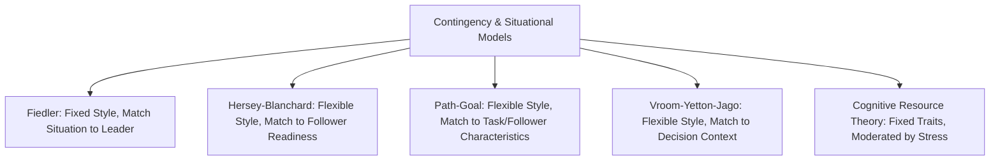

## Contingency and Situational Leadership Models

### Overview

Contingency and situational leadership models reject the notion that a single "best" leadership style exists universally. Instead, they argue that leadership effectiveness depends on the interaction between the leader's style, follower characteristics, and situational variables. This family of theories emerged in the 1960s–1970s as a response to trait and behavioral theories, which had failed to consistently predict leadership effectiveness across contexts.

The core proposition uniting these models: **effective leadership = f(leader style, situational favorableness/follower readiness)**. Where the models diverge is in what they treat as the critical situational variable and whether they assume leader style is fixed (contingency) or adaptable (situational).

### Fiedler's Contingency Model

#### Theoretical Foundation

Developed by Fred Fiedler, this is the earliest formal contingency theory. Fiedler's central claim is that leadership style is a relatively fixed trait, so matching the leader to the situation (or changing the situation to fit the leader) produces better outcomes than trying to retrain the leader.

**Least Preferred Co-worker (LPC) Scale**: Leaders rate the co-worker they least enjoyed working with across bipolar adjective pairs (e.g., friendly–unfriendly, cooperative–uncooperative) on a scale, typically 1–8.

- High LPC score → relationship-motivated leader (describes the least-preferred co-worker relatively favorably)
- Low LPC score → task-motivated leader (describes the least-preferred co-worker harshly)

#### Situational Favorableness

Fiedler identified three variables, weighted in order of importance, that determine how favorable a situation is for the leader:

1. **Leader-Member Relations** — degree of trust, confidence, and respect subordinates have for the leader (good/poor)
2. **Task Structure** — clarity of task goals, procedures, and performance criteria (structured/unstructured)
3. **Position Power** — the formal authority the leader holds (e.g., ability to hire, fire, reward, discipline) (strong/weak)

These combine into eight situational categories (octants), ranging from highly favorable (good relations, structured task, strong power) to highly unfavorable (poor relations, unstructured task, weak power).

**Key Points**

- Task-motivated (low-LPC) leaders perform best in situations of very high or very low favorableness
- Relationship-motivated (high-LPC) leaders perform best in situations of moderate favorableness
- Because Fiedler viewed style as fixed, the practical implication is **job engineering**: reshape the situation to match the leader, rather than train the leader to adapt

[Inference] Fiedler's assumption that LPC score reflects a stable personality trait rather than a state-dependent attitude has been one of the model's most persistent points of academic contention, since it implies leaders cannot be developed to shift style.

### Hersey-Blanchard Situational Leadership Theory (SLT)

#### Theoretical Foundation

Unlike Fiedler, Hersey and Blanchard assume leader behavior is flexible and should adapt to follower **readiness** (originally termed "maturity"), defined along two dimensions:

- **Ability** — job-relevant knowledge, skills, and experience
- **Willingness** — confidence, commitment, and motivation

#### Four Leadership Styles

Plotted against two behavioral axes — **task behavior** (directive) and **relationship behavior** (supportive) — the model defines four styles:

| Style | Task Behavior | Relationship Behavior | Label |
| --- | --- | --- | --- |
| S1 | High | Low | Telling/Directing |
| S2 | High | High | Selling/Coaching |
| S3 | Low | High | Participating/Supporting |
| S4 | Low | Low | Delegating |

#### Follower Readiness Levels

| Readiness | Description | Matched Style |
| --- | --- | --- |
| R1 | Unable and unwilling/insecure | S1 (Telling) |
| R2 | Unable but willing/motivated | S2 (Selling) |
| R3 | Able but unwilling/insecure | S3 (Participating) |
| R4 | Able and willing/confident | S4 (Delegating) |

**Example**: A new hire (R1) assigned a critical, unfamiliar task benefits from S1 — explicit instructions, close supervision, and clearly defined roles. As they gain competence but remain unsure of themselves (R2), the leader shifts to S2, still providing direction but adding explanation and encouragement. A competent employee who has become disengaged (R3) needs less task direction and more relational support — S3. A fully competent, self-motivated veteran (R4) is best served by S4, receiving autonomy and delegated responsibility.

**Key Points**

- The model prescribes dynamic adjustment: as follower readiness evolves (ideally upward), the leader should reduce directive behavior and, at higher readiness, also reduce relational behavior
- Widely adopted in corporate leadership training due to its intuitive, prescriptive simplicity
- [Unverified] Empirical support for the specific prescriptive matches (e.g., that R2 followers respond optimally only to S2) is mixed in the peer-reviewed literature relative to its popularity in practitioner training programs

### Path-Goal Theory (House)

#### Theoretical Foundation

Robert House's Path-Goal Theory, rooted in expectancy theory, holds that a leader's core function is to clarify the "path" to goal attainment by removing obstacles and providing support that followers cannot supply themselves. Effectiveness depends on matching leader behavior to **employee characteristics** and **environmental/task characteristics**.

#### Four Leader Behaviors

1. **Directive** — sets clear expectations, schedules, and standards
2. **Supportive** — shows concern for follower well-being, creates a friendly climate
3. **Participative** — consults followers, incorporates suggestions before decisions
4. **Achievement-oriented** — sets challenging goals, expects high performance, shows confidence in followers' abilities

#### Contingency Variables

- **Follower characteristics**: locus of control, experience, perceived ability
- **Environmental characteristics**: task structure, formal authority system, work group dynamics

**Example**: For an ambiguous, unstructured task (e.g., a novel R&D project), directive leadership reduces role ambiguity and improves satisfaction. For a highly structured, repetitive task (e.g., assembly-line work), directive leadership becomes redundant or even irritating, since the path is already clear — supportive leadership adds more value here by addressing the psychological toll of monotony.

### Vroom-Yetton-Jago Decision Model

#### Theoretical Foundation

This model is narrower in scope than the others: it focuses specifically on the **decision-making process** — how much follower participation a leader should invite for a given decision. It uses a decision-tree structure driven by diagnostic questions (e.g., "Is there a quality requirement such that one solution is likely to be more rational than another?", "Is the problem structured?").

#### Five Decision Styles (Original Formulation)

| Style | Description |
| --- | --- |
| AI (Autocratic I) | Leader decides alone using existing information |
| AII (Autocratic II) | Leader obtains information from followers, then decides alone |
| CI (Consultative I) | Leader shares problem with followers individually, then decides |
| CII (Consultative II) | Leader shares problem with followers as a group, then decides |
| GII (Group II) | Leader shares problem with group; group generates and evaluates alternatives; leader implements group consensus |

**Key Points**

- Decision quality and follower acceptance are the two outcome criteria the model optimizes for
- The model is diagnostic and situational, not developmental — it does not track how a follower changes over time (unlike Hersey-Blanchard)
- [Inference] Because it demands answering a sequence of contextual questions rather than applying a memorized style-matrix, this model is comparatively underused in day-to-day management practice despite strong internal logic

### Cognitive Resource Theory

An extension of Fiedler's work (Fiedler & Garcia), this model incorporates the leader's **intelligence and experience** as moderating variables interacting with stress:

- Under low stress, leader intelligence correlates positively with group performance
- Under high stress, leader experience becomes the stronger predictor, while intelligence effects diminish or even invert — stress narrows cognitive bandwidth, and experienced leaders default more effectively to overlearned routines than intelligent-but-inexperienced leaders can improvise

### Comparative Synthesis

| Dimension | Fiedler | Hersey-Blanchard | Path-Goal | Vroom-Yetton-Jago |
| --- | --- | --- | --- | --- |
| Assumes leader style is | Fixed | Flexible | Flexible | Flexible |
| Key situational variable | Situational favorableness | Follower readiness | Task/follower characteristics | Decision structure |
| Primary lever | Change the situation | Adapt behavior over time | Adapt behavior to context | Adapt participation level |
| Scope | General leadership effectiveness | General leadership effectiveness | Motivation and goal clarity | Specific decisions |

### Critiques and Limitations

- **Fiedler**: LPC scale has questionable construct validity and low test-retest reliability; the model offers limited practical guidance since it recommends changing jobs rather than developing leaders
- **Hersey-Blanchard**: Lacks strong empirical validation for the precise style-readiness matches; "readiness" is difficult to measure reliably and may fluctuate task-by-task rather than being a stable employee attribute
- **Path-Goal**: Highly complex with many interacting variables, making it difficult to test comprehensively or apply consistently in practice
- **Vroom-Yetton-Jago**: Assumes leaders can accurately diagnose situational variables in real time, which may not hold under time pressure or incomplete information

[Inference] A recurring criticism across the entire contingency/situational family is that these models describe correlational patterns from field and lab studies rather than establishing clear causal mechanisms, making prescriptive claims ("do X in situation Y") stronger in practitioner training materials than in the underlying research base.

### Practical Application in Organizations

- **Leadership development programs** frequently use Hersey-Blanchard due to its accessible four-quadrant framework, despite weaker empirical backing than Path-Goal
- **Succession planning** can apply Fiedler's logic by matching candidate LPC-style profiles to roles with known task structure and positional power characteristics
- **Decision governance frameworks** in matrixed organizations often mirror Vroom-Yetton-Jago logic informally (e.g., RACI matrices encode similar participation-level distinctions)

**Related Topics**

- Transformational vs. Transactional Leadership
- Leader-Member Exchange (LMX) Theory
- Trait Theory and the Big Five in Leadership Research
- Servant Leadership and Authentic Leadership Models
- Team Development Stages (Tuckman) and Leadership Adaptation
- Expectancy Theory of Motivation (foundational to Path-Goal Theory)
- Power and Influence Tactics in Organizations