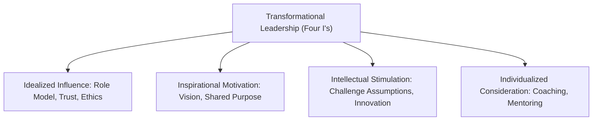
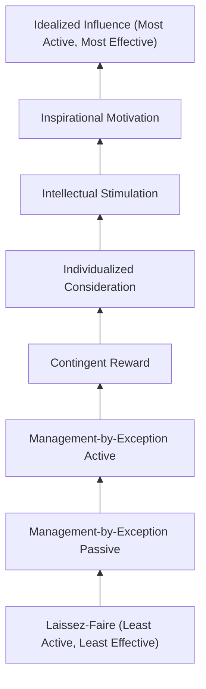

## Transformational and Transactional Leadership

### Overview

Transformational and transactional leadership represent a foundational dichotomy in modern leadership theory, originally distinguished by James MacGregor Burns (1978) and later refined into a measurable framework by Bernard Bass. The distinction rests on the nature of the leader-follower exchange: **transactional leadership** operates through a contingent exchange of rewards for performance, while **transformational leadership** operates by elevating followers' motivations, values, and aspirations beyond immediate self-interest toward collective goals.

Bass's key contribution was to reframe these not as opposite ends of a single continuum but as **distinct, additive dimensions** — a leader can exhibit both, and the most effective leaders typically exhibit high transformational behavior built atop a foundation of consistent transactional behavior (the "augmentation effect").

### Transactional Leadership

#### Theoretical Foundation

Transactional leadership is grounded in social exchange theory and reinforcement principles. The leader-follower relationship is fundamentally a series of transactions: followers receive rewards, resources, or recognition in exchange for meeting specified performance criteria.

#### Core Dimensions (Bass's Full Range Model)

1. **Contingent Reward (CR)** — the leader clarifies expectations and offers rewards (or avoids punishment) contingent on meeting agreed-upon objectives. This is the most constructive transactional dimension.
2. **Management-by-Exception, Active (MBEA)** — the leader actively monitors follower performance and intervenes with corrective action before problems become serious.
3. **Management-by-Exception, Passive (MBEP)** — the leader intervenes only after problems have already occurred or standards have not been met, often reactively.

**Key Points**

- Contingent Reward is generally positively correlated with follower satisfaction and performance, making it the most effective transactional behavior
- MBEA and MBEP tend to correlate negatively or negligibly with performance outcomes; MBEP in particular resembles a "hands-off until failure" approach that followers often perceive as neglectful
- Transactional leadership is well suited to stable environments with clear, measurable performance metrics (e.g., sales quotas, production targets)

**Example**: A sales manager who tells a team "hit 110% of quota this quarter and you'll receive a bonus and public recognition at the town hall" is exercising Contingent Reward. If that same manager only steps in to address underperformance after quarterly numbers come in low, that is Management-by-Exception, Passive.

### Laissez-Faire Leadership (Non-Leadership)

Bass includes a third category, often treated as the absence of leadership rather than a style: the leader avoids decisions, abdicates responsibility, and does not engage with followers' needs. Laissez-faire is consistently the weakest predictor of positive outcomes across the Full Range Leadership Model and should not be confused with delegative or empowering leadership styles that involve active trust-building.

### Transformational Leadership

#### Theoretical Foundation

Transformational leaders move followers beyond transactional self-interest by appealing to higher-order needs and shared purpose (drawing conceptually on Maslow's hierarchy and Burns's notion of "mutual stimulation and elevation"). The goal is not merely task compliance but genuine follower development, engagement, and internalization of organizational values.

#### The Four I's (Bass & Avolio)

1. **Idealized Influence (II)** — the leader acts as a role model, demonstrating high ethical standards and conviction, earning followers' trust, admiration, and respect. Often split into:
   - *Idealized Influence (Attributed)* — follower perceptions of the leader's charisma and power
   - *Idealized Influence (Behavior)* — the leader's actual value-driven, principled conduct
2. **Inspirational Motivation (IM)** — the leader articulates a compelling vision, communicates high expectations, and uses symbols and emotional appeals to focus follower effort toward shared goals.
3. **Intellectual Stimulation (IS)** — the leader encourages followers to question assumptions, reframe problems, and approach old situations in new ways, fostering innovation and creative problem-solving.
4. **Individualized Consideration (IC)** — the leader attends to each follower's individual needs for achievement and growth, acting as a coach or mentor rather than treating followers as a uniform group.

**Example**: A hospital administrator who articulates a compelling vision of "zero preventable harm" (Inspirational Motivation), personally follows the same safety protocols she asks of staff (Idealized Influence), invites nurses to redesign a flawed handoff procedure (Intellectual Stimulation), and takes time to understand each department head's individual career goals (Individualized Consideration) is exhibiting the full range of transformational behavior.

### The Full Range Leadership Model (FRLM)

Bass and Avolio integrated transactional, transformational, and laissez-faire behaviors into a single continuum of leadership frequency and effectiveness, typically visualized as a hierarchy from least to most effective:

**Key Points**

- This is the theoretical basis for the **Multifactor Leadership Questionnaire (MLQ)**, the most widely used instrument for measuring transformational, transactional, and laissez-faire behaviors
- The model predicts that leadership frequency and effectiveness generally increase moving from laissez-faire through transactional to transformational behaviors, though this is a general pattern rather than a strict rule for every individual case

### The Augmentation Effect

Bass's most cited empirical claim is that transformational leadership **augments** transactional leadership rather than replacing it — transformational behaviors predict incremental variance in follower effort, satisfaction, and performance beyond what transactional behaviors alone explain.

$$\text{Follower Performance} = \beta_1(\text{Transactional}) + \beta_2(\text{Transformational}) + \varepsilon$$

[Inference] The practical implication is that transformational leadership is not a substitute for basic transactional competence (clear expectations, fair rewards) — a leader who inspires vision but fails to deliver on basic contingent rewards may still generate follower cynicism, since the transactional foundation underlies perceived leader trustworthiness.

### Comparative Analysis

| Dimension | Transactional | Transformational |
| --- | --- | --- |
| Basis of exchange | Contingent rewards/punishments | Shared vision and values |
| Follower motivation targeted | Extrinsic, self-interest | Intrinsic, collective interest |
| Time horizon | Short-term task completion | Long-term development and change |
| Best suited context | Stable, routine, clearly measurable work | Change, uncertainty, need for innovation |
| Follower outcome | Compliance | Commitment and identification |
| Risk | Can feel transactional/cold; may not sustain discretionary effort | Risk of unchecked charismatic influence without ethical grounding |

### Authentic vs. Pseudo-Transformational Leadership

A critical refinement addresses a documented risk: transformational techniques (vision, charisma, emotional appeal) are ethically neutral tools that can be used toward self-serving or even destructive ends. Bass and Steidlmeier (1999) distinguish:

- **Authentic transformational leadership** — grounded in moral values, transparency, and genuine concern for follower welfare
- **Pseudo-transformational leadership** — uses the same behavioral repertoire (charisma, vision, emotional appeal) but toward self-aggrandizing, manipulative, or exploitative ends

[Inference] This distinction is frequently invoked to explain how demagogic or manipulative leaders can display surface-level transformational behaviors (compelling vision, personal charisma) while lacking the ethical substance that authentic transformational theory presumes, though the two categories can be difficult to distinguish empirically in real time rather than in historical retrospect.

### Empirical Evidence and Critiques

- Meta-analyses consistently find transformational leadership positively correlated with follower job satisfaction, organizational commitment, and both individual and organizational performance measures
- **Critiques**:
  - Conceptual overlap and lack of discriminant validity between the "Four I's" — factor-analytic studies often struggle to cleanly separate them
  - The MLQ has been criticized for measuring follower *perceptions* and *attributions* of leadership rather than observable leader behaviors directly, raising concerns about common-method bias in studies that use the same source for both leadership ratings and outcome ratings
  - Potential conflation of transformational leadership with generic leader effectiveness or likability ("halo effect"), where followers who are simply satisfied with outcomes retroactively rate their leader as more transformational
  - Cultural universality is debated: [Unverified] the specific behavioral expressions of each "I" (e.g., what counts as appropriately "inspirational") may vary across high vs. low power-distance cultures, even if the broad constructs replicate cross-culturally in aggregate

### Practical Application in Organizations

- **Change management initiatives** disproportionately rely on transformational leadership behaviors (vision articulation, intellectual stimulation) to overcome resistance to change
- **Performance management systems** are typically built on transactional logic (contingent reward structures, KPI-linked compensation) even within organizations that emphasize transformational culture at the top
- **Leadership development programs** frequently use 360-degree MLQ assessments to benchmark managers against the Four I's and identify coaching priorities
- **Succession and executive selection** increasingly screens for transformational competencies in roles requiring innovation or cultural transformation, while transactional competence remains a baseline expectation across all managerial roles

**Related Topics**

- Contingency and Situational Leadership Models
- Charismatic Leadership Theory (Conger & Kanungo)
- Leader-Member Exchange (LMX) Theory
- Authentic Leadership and Ethical Leadership
- Organizational Change Management (Kotter's 8-Step Model)
- The Multifactor Leadership Questionnaire (MLQ): Psychometric Properties
- Servant Leadership Theory