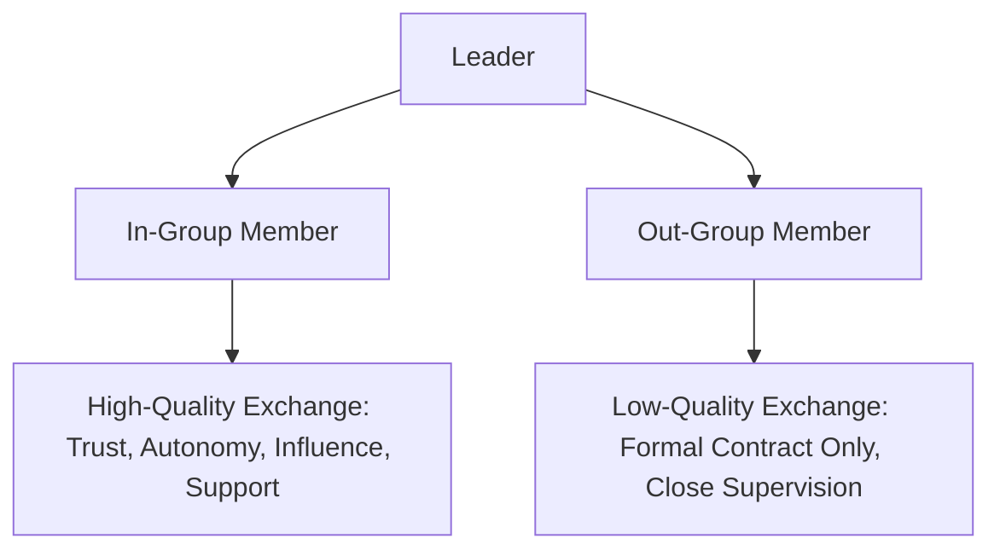
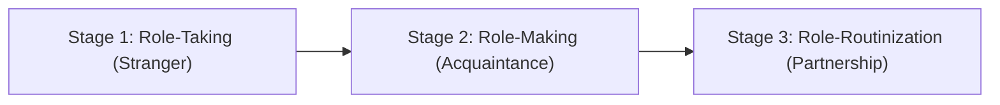

## Leader-Member Exchange Theory

### Overview

Leader-Member Exchange (LMX) Theory departs from earlier leadership theories in a fundamental way: rather than asking "what style does the leader use with the group?", it asks "what unique dyadic relationship does the leader form with each individual follower?" LMX theory holds that leaders do not treat all subordinates uniformly — they develop differentiated relationships across a spectrum, and the quality of this dyadic exchange is a primary determinant of follower outcomes, independent of the leader's general style.

The theory originated as **Vertical Dyad Linkage (VDL)** theory (Dansereau, Graen, and Haga, 1975) and was later developed into LMX theory by Graen and colleagues through the 1980s–1990s.

### Theoretical Foundation

#### From Average Leadership Style to Vertical Dyads

Prior leadership models implicitly assumed an "Average Leadership Style" (ALS) — that a leader exhibits one consistent behavioral pattern applied equally across all subordinates. VDL research found this assumption empirically false: leaders form qualitatively distinct relationships with different subordinates within the same team, even when performing the same formal role.

#### In-Groups and Out-Groups

Based on the quality of the dyadic exchange, followers are informally sorted (often implicitly, not through any de jure process) into two broad categories:

- **In-group members**: characterized by high-quality exchange — mutual trust, respect, obligation, and influence that extends beyond the formal employment contract. In-group members often receive greater autonomy, information access, developmental opportunities, and informal support.
- **Out-group members**: characterized by low-quality exchange — interactions remain confined to the formal employment contract ("cash and carry" exchange). Out-group members typically receive more supervision, less discretion, and fewer developmental resources.

**Key Points**

- In-group/out-group status is not typically an explicit managerial decision but emerges through repeated interactions and reciprocal exchanges over time
- Role differentiation happens early in the relationship, often during a "role-taking" phase shortly after the follower joins the team or the leader-follower pairing begins
- [Inference] Because in-group status often correlates with follower competence and initiative rather than being purely leader-driven favoritism, disentangling cause from effect (does high LMX cause high performance, or does perceived high performance cause high LMX?) remains a persistent empirical challenge in the literature

### The Role-Making Model and LMX Development Stages

Graen and Scandura (1987) proposed a three-stage model describing how LMX relationships form over time:

1. **Role-Taking (Stranger phase)** — the leader and follower first interact; the follower's capabilities and motivations are assessed; interactions are formal, contractual, and low in trust
2. **Role-Making (Acquaintance phase)** — an informal, unstructured testing period occurs; the leader offers opportunities (a "test"), and the follower's response (accepting increased responsibility, demonstrating reliability) shapes whether the relationship escalates or remains transactional; social exchanges begin to extend beyond the formal job description
3. **Role-Routinization (Partnership/Mature phase)** — established patterns of exchange become routine; in mature high-LMX relationships, exchange evolves into a stable pattern of mutual trust, respect, and obligation (sometimes described as approaching a form of reciprocal loyalty)

**Example**: A new project manager assigns a routine status report to every team member (role-taking; identical formal expectations for all). One team member returns the report early with additional risk analysis unprompted. The manager begins assigning that individual higher-visibility client-facing tasks (role-making test). Over subsequent months, that team member is consulted on strategic decisions and given autonomy over scope changes without needing sign-off (role-routinization — a mature, high-LMX partnership has formed).

### Dimensions of Exchange Quality

Later refinements of LMX theory (notably the LMX-7 measurement scale by Graen and Uhl-Bien, 1995) identified exchange quality as multidimensional, typically including:

- **Affect** — mutual liking based on interpersonal attraction, not solely professional merit
- **Loyalty** — mutual support and public backing of the other's actions and character
- **Contribution** — perceived quantity, quality, and direction of work-oriented activity each party puts toward mutual goals
- **Professional Respect** — perception that the other party has built a reputation of professional excellence

### Measurement: The LMX-7 Scale

The most widely used instrument, the LMX-7, asks followers (or leaders) to rate seven items reflecting relationship quality (e.g., how well the leader understands the follower's job problems and needs, how the leader would use power to help solve the follower's problems, the follower's confidence in the leader's decisions). Scores are typically summed or averaged to classify relationships along a continuum from low to high LMX quality, rather than a strict binary in-group/out-group split.

[Unverified] Some researchers argue LMX should be conceptualized as a continuum along which every dyad falls, while common practitioner communication simplifies it into a binary in-group/out-group framing — this simplification is useful pedagogically but understates the theory's original continuous-variable structure.

### Consequences of LMX Quality

Meta-analytic evidence associates high-quality LMX with a range of favorable outcomes:

| Outcome | Association with High LMX |
| --- | --- |
| Job satisfaction | Positive |
| Organizational commitment | Positive |
| Job performance | Positive |
| Organizational citizenship behavior (OCB) | Positive |
| Turnover intention | Negative (i.e., lower turnover) |
| Role conflict/ambiguity | Negative (i.e., less conflict/ambiguity) |
| Empowerment and access to resources | Positive |

**Key Points**

- These relationships are broadly consistent across studies, though effect sizes vary by industry, culture, and measurement approach
- Because high-LMX followers often receive more resources and support, some of these outcomes may be partly explained by resource access rather than the relational quality itself — a mechanism debate that continues in the literature

### Leadership Making Model (LMX Development Intervention)

Graen and Uhl-Bien later proposed a normative extension — the **Leadership Making Model** — arguing that leaders should proactively work to develop high-quality LMX relationships with *all* followers, not just a favored subset, since restricting high-quality exchange to an in-group can produce perceived unfairness and undermine team cohesion.

This model proposes three developmental phases at the dyadic level, scaling upward:

1. **Stranger** — formal, role-defined interactions
2. **Acquaintance** — expanded information and social exchange
3. **Mature Partnership** — high mutual trust, respect, and reciprocal influence extended systematically across the team

[Inference] This normative extension implicitly acknowledges a core criticism of original LMX theory: that differentiated treatment, while empirically descriptive of how leadership naturally occurs, raises equity and organizational justice concerns if left unmanaged.

### Criticisms and Limitations

- **Equity and fairness concerns**: differentiated treatment of team members can be perceived as favoritism, potentially undermining team cohesion, trust in the leader's impartiality, and out-group morale
- **Measurement inconsistency**: numerous versions of the LMX scale exist (LMX-7 being most common), complicating cross-study comparison
- **Causality ambiguity**: most LMX research is correlational; the direction of causality between LMX quality and follower performance is difficult to establish without longitudinal or experimental designs
- **Underspecification of leader behavior**: unlike transformational or path-goal theories, LMX does not clearly prescribe *which specific leader behaviors* produce high-quality exchange, making it more descriptive than prescriptive
- **Cultural boundary conditions**: [Unverified] the acceptability and interpretation of differentiated leader-follower relationships may vary across collectivist versus individualist cultures, with some evidence suggesting in-group/out-group distinctions carry different social meanings across cultural contexts

### Practical Application in Organizations

- **Onboarding design**: recognizing that role-making happens early, organizations can structure early "stretch assignments" deliberately rather than leaving relationship differentiation to chance
- **Manager training**: LMX awareness training encourages managers to audit whether resource and opportunity distribution is unconsciously concentrated among a small in-group, and to expand high-quality exchange practices team-wide
- **Succession planning**: high-LMX relationships often correlate with visibility and sponsorship, meaning organizations relying solely on informal LMX-driven advancement risk systematically overlooking capable out-group employees for promotion
- **Diversity, equity, and inclusion (DEI) initiatives**: LMX research is frequently cited in discussions of how informal relational favoritism can inadvertently disadvantage employees from underrepresented groups if in-group formation correlates with demographic similarity to the leader (a pattern sometimes explained via social identity and similarity-attraction theories)

**Related Topics**

- Transformational and Transactional Leadership
- Contingency and Situational Leadership Models
- Social Exchange Theory
- Organizational Justice (Distributive, Procedural, Interactional)
- Organizational Citizenship Behavior (OCB)
- Psychological Contract Theory
- Team Diversity and In-Group/Out-Group Dynamics