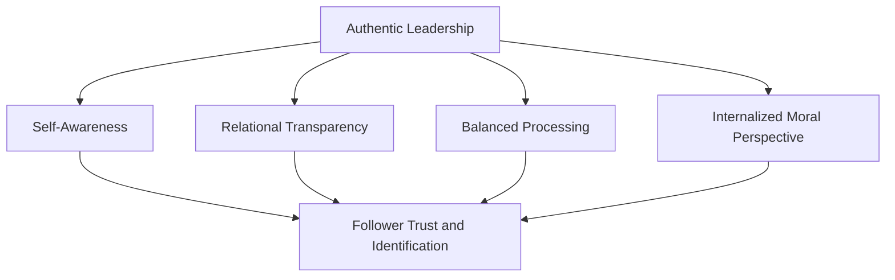
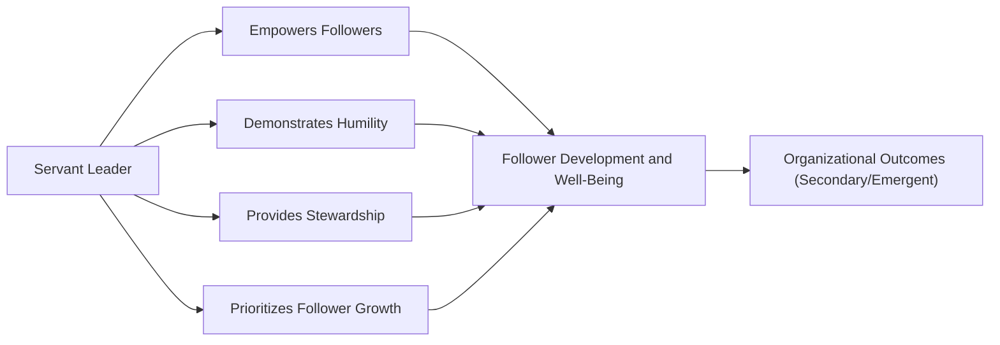

## Authentic and Servant Leadership

### Overview

Authentic leadership and servant leadership belong to a broader family of values-based, follower-centered leadership theories that emerged largely in response to corporate scandals (e.g., Enron) and growing academic interest in the ethical dimensions of leadership that trait, behavioral, and contingency theories had largely bypassed. Both theories share a rejection of leadership as purely a means to organizational performance, instead treating follower well-being, ethical integrity, and moral development as ends in themselves — outcomes that happen to also produce strong organizational performance as a byproduct rather than the primary aim.

While related, the two theories differ in emphasis: **authentic leadership** centers on the leader's internal self-knowledge and consistency between values and action; **servant leadership** centers on the leader's orientation toward serving followers' growth and needs before organizational or personal interests.

### Authentic Leadership

#### Theoretical Foundation

Authentic leadership theory, formalized primarily by Bruce Avolio, William Gardner, and colleagues in the early 2000s, is grounded in positive organizational scholarship and positive psychology. The central premise: leaders who possess deep self-awareness and act in accordance with their true values, thoughts, and emotions will foster greater trust, engagement, and ethical behavior in followers, largely through a process of social contagion and role modeling.

#### Four Components (Walumbwa et al., 2008)

1. **Self-Awareness** — the leader demonstrates understanding of their own strengths, weaknesses, values, and the impact they have on others, gained through reflection and openness to feedback
2. **Relational Transparency** — the leader presents their authentic self to others (as opposed to a fabricated or distorted self), openly sharing information and feelings appropriate to the context, minimizing displays of inappropriate emotion
3. **Balanced Processing** — the leader objectively analyzes relevant data before decision-making, actively soliciting opposing viewpoints and avoiding favoritism toward information that merely confirms pre-existing beliefs
4. **Internalized Moral Perspective** — the leader's behavior is guided by internal moral standards and values rather than external pressures (from peers, the organization, or society), resulting in decisions and behavior consistent with those internalized values even under pressure

**Key Points**

- Authentic leadership theory positions self-awareness as developmentally foundational — the other three components are difficult to sustain without it
- The theory explicitly distinguishes authenticity from mere charisma or vision-casting: a leader can be highly authentic while being introverted or low-charisma, since authenticity is about consistency between internal state and external behavior, not persuasive skill
- Positive psychological capital (hope, optimism, resilience, self-efficacy — often abbreviated PsyCap) is frequently studied as both an antecedent and outcome of authentic leadership

**Example**: A department head who, during a budget cut announcement, openly acknowledges her own uncertainty about the road ahead rather than projecting false confidence (relational transparency), actively seeks input from staff who disagree with the proposed cuts before finalizing decisions (balanced processing), and ultimately makes a call consistent with previously stated values around protecting frontline positions over management roles (internalized moral perspective) is exhibiting authentic leadership behavior.

#### Development and the ALDT Model

The **Authentic Leadership Development Theory (ALDT)** proposes that authentic leadership develops over a leader's lifespan through the interaction of:

- **Leader life events** ("trigger events" — critical experiences that prompt self-reflection)
- **Positive psychological capital**
- **Positive organizational context** (climate of trust, inclusiveness, and support)
- **Self-regulation processes** (internalized regulation, balanced processing, transparent relations, authentic behavior)

[Inference] This developmental framing implies authentic leadership is not a fixed trait but can, in principle, be cultivated through structured reflection and feedback interventions — though the specific mechanisms and durability of such interventions remain less rigorously established than the descriptive model itself.

### Servant Leadership

#### Theoretical Foundation

Servant leadership originates with Robert K. Greenleaf's 1970 essay "The Servant as Leader," predating most modern leadership theories discussed academically. Greenleaf's foundational premise inverts the traditional power hierarchy: the servant leader is *servant first* — leadership emerges from a natural desire to serve, and formal authority becomes secondary to and legitimized by that service orientation.

Greenleaf's own test for servant leadership: **"Do those served grow as persons? Do they, while being served, become healthier, wiser, freer, more autonomous, more likely themselves to become servants?"**

#### Key Characteristics (Spears' Ten Principles)

Larry Spears, building on Greenleaf's work, identified ten characteristics commonly associated with servant leaders:

| Characteristic | Description |
| --- | --- |
| Listening | Deep, receptive listening to understand follower needs and group will |
| Empathy | Effort to understand and empathize with others' perspectives |
| Healing | Helping followers overcome emotional hurt or personal struggles |
| Awareness | General self-awareness and awareness of broader organizational/ethical issues |
| Persuasion | Relying on persuasion rather than positional authority to influence |
| Conceptualization | Ability to think beyond day-to-day operational realities toward long-term vision |
| Foresight | Ability to anticipate likely outcomes of a situation |
| Stewardship | Holding organizational resources in trust for the broader good |
| Commitment to growth of people | Deep commitment to the personal, professional, and spiritual growth of followers |
| Building community | Fostering a sense of community within the organization |

#### Van Dierendonck's Consolidated Model

More recent empirical work (Van Dierendonck, 2011) consolidates servant leadership behaviors into a more parsimonious set of dimensions for measurement purposes: empowerment, humility, standing back, authenticity, forgiveness, courage, accountability, and stewardship — with **empowerment** and **humility** emerging as particularly central and empirically robust dimensions.

**Example**: A senior engineer promoted to team lead who continues to pair-program with junior developers to help them grow (commitment to growth), openly credits team members by name in leadership meetings rather than absorbing credit personally (humility), and makes resourcing decisions based on what best serves the team's long-term capability rather than short-term optics to upper management (stewardship) is demonstrating servant leadership.

### Comparative Analysis: Authentic vs. Servant Leadership

| Dimension | Authentic Leadership | Servant Leadership |
| --- | --- | --- |
| Primary focus | Leader's self-knowledge and consistency | Leader's orientation toward serving followers |
| Origin | Positive psychology / positive organizational scholarship | Practitioner essay (Greenleaf), later formalized academically |
| Core question | "Is the leader being true to themselves?" | "Is the leader prioritizing followers' growth and needs?" |
| Primary outcome pathway | Trust via consistency and transparency | Trust via demonstrated care and empowerment |
| Risk if absent | Perceived inauthenticity, cynicism | Perceived self-interest, exploitation |

[Inference] Because both constructs emphasize ethics, humility, and follower welfare, they show substantial conceptual and empirical overlap in factor-analytic studies, and some researchers have questioned whether they represent genuinely distinct constructs or overlapping facets of a broader "ethical/values-based leadership" domain — this remains an active area of theoretical debate rather than a settled distinction.

### Empirical Outcomes

Meta-analyses generally find both authentic and servant leadership positively associated with:

- Follower job satisfaction and engagement
- Organizational citizenship behavior (OCB)
- Trust in leader and psychological safety
- Follower well-being and reduced burnout
- Team performance and organizational commitment

**Key Points**

- Servant leadership shows particularly strong associations with follower well-being and OCB, consistent with its explicit other-orientation
- Authentic leadership shows particularly strong associations with follower trust and reduced cynicism, consistent with its emphasis on transparency
- [Unverified] Comparative effect-size differences between the two constructs on hard performance outcomes (e.g., financial results) are less consistently documented than their effects on attitudinal and well-being outcomes, partly due to measurement and common-method variance issues common across values-based leadership research

### Criticisms and Limitations

- **Construct overlap**: significant theoretical and empirical overlap with transformational leadership, ethical leadership, and each other, raising discriminant validity concerns across the values-based leadership literature broadly
- **Measurement challenges**: self-report measures of "authenticity" face an inherent paradox — asking a leader to self-rate authenticity assumes accurate self-knowledge, which is itself one of the constructs being measured
- **Cultural and contextual boundary conditions**: [Unverified] servant leadership's emphasis on humility and follower-first orientation may be received differently across high power-distance cultures, where overt displays of leader humility could be interpreted as weakness rather than virtue, though empirical cross-cultural comparisons remain limited
- **Practical tension in servant leadership**: balancing genuine service orientation against the organizational need for directive decision-making in crisis situations is under-theorized — critics note the model offers less guidance for high-stakes, time-pressured decisions than contingency-based theories
- **Potential for performative authenticity**: [Speculation] as authentic leadership becomes a trained competency in corporate leadership programs, there is a risk of leaders adopting the *appearance* of transparency and vulnerability as an instrumental technique rather than as a genuine internal state, which would undermine the theory's core premise if it occurred at scale

### Practical Application in Organizations

- **Leadership development programs**: authentic leadership development often incorporates structured reflection exercises (leadership narratives, 360-degree feedback, mentoring) to build self-awareness as a foundational capability
- **Healthcare and nonprofit sectors**: servant leadership is disproportionately emphasized in mission-driven organizations (healthcare, education, nonprofits) where follower intrinsic motivation and ethical culture are especially load-bearing for organizational outcomes
- **Psychological safety initiatives**: both frameworks are frequently cited in organizational efforts to build psychological safety, since relational transparency (authentic leadership) and empathetic listening (servant leadership) directly support follower willingness to voice concerns or admit mistakes
- **Succession planning in values-driven organizations**: some organizations explicitly screen for servant/authentic leadership competencies in succession pipelines, particularly where organizational culture is treated as a strategic asset

**Related Topics**

- Transformational and Transactional Leadership
- Ethical Leadership and Moral Reasoning in Organizations
- Psychological Safety (Edmondson)
- Positive Organizational Scholarship and Psychological Capital (PsyCap)
- Leader-Member Exchange Theory
- Organizational Trust and Trust Repair
- Charismatic Leadership Theory