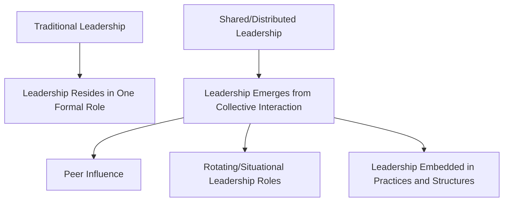
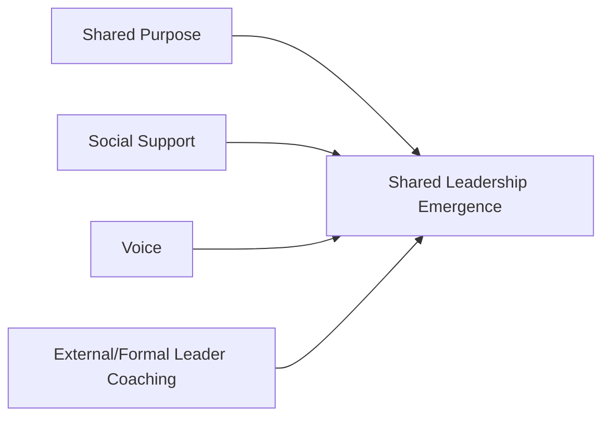

## Shared and Distributed Leadership

### Overview

Shared and distributed leadership represent a significant departure from the leader-centric assumption embedded in virtually every theory discussed thus far (trait, behavioral, contingency, transformational, LMX, authentic, servant). Where those frameworks locate leadership *within a single formal role occupant*, shared and distributed leadership theories treat leadership as an **emergent property of the collective** — a social process that can be enacted by multiple members of a team or organization simultaneously, dynamically, and often without formal authority.

This reflects a broader theoretical shift often described as moving from an **"entitative" view of leadership** (leadership resides in a person) toward a **"relational" or "processual" view** (leadership is a process that occurs *between* people, distributed across a network).

### Theoretical Foundations

#### Shared Leadership (Pearce & Conger)

Craig Pearce and Jay Conger (2003) define shared leadership as a dynamic, interactive influence process among individuals in groups, in which the objective is to lead one another to the achievement of group or organizational goals. Critically, this influence process involves **peer** or **lateral** influence, not solely downward influence from a designated leader.

#### Distributed Leadership (Gronn, Spillane)

Peter Gronn and James Spillane, working primarily in educational leadership research, developed **distributed leadership** as a lens focused less on individual leaders' distributed cognition and more on leadership *practice* as it is stretched across organizational members, situations, and artifacts (tools, routines, structures). Spillane's framing emphasizes that leadership practice emerges from the interactions among leaders, followers, and their situation — not from any one person's actions in isolation.

**Key Points**

- Shared leadership research originated primarily in management and organizational behavior, with emphasis on team-level influence dynamics
- Distributed leadership research originated primarily in educational administration, with emphasis on how leadership practice is stretched across roles, structures, and artifacts within an institution
- Both reject the assumption that leadership capacity is a fixed property held exclusively by formally designated leaders

### Forms of Distributed Leadership (Gronn's Typology)

Gronn distinguishes between forms of distribution based on the degree of conjoint agency involved:

1. **Spontaneous Collaboration** — individuals pool their expertise and effort in an ad hoc, unplanned way in response to a specific situation or problem, without formal coordination structures
2. **Intuitive Working Relations** — a stable pattern of collaborative leadership develops over time between individuals who have worked together closely, often marked by high trust and complementary skill sets that produce a kind of leadership "duo" or "trio" effect
3. **Institutionalized Practices** — leadership distribution becomes formalized into organizational structures, roles, and routines (e.g., standing committees, rotating chairs, formally designated co-leadership arrangements)

**Example**: A hospital emergency department during a mass-casualty event may exhibit *spontaneous collaboration* as staff self-organize around triage without waiting for explicit top-down direction. A surgical team that has worked together for years may develop *intuitive working relations*, anticipating each other's needs without verbal coordination. A hospital that formally designates co-medical-directors with defined complementary domains exhibits *institutionalized* distributed leadership.

### Antecedents of Shared Leadership Emergence

Research (notably Carson, Tesluk, and Marrone, 2007) identifies internal team environment conditions that predict shared leadership emergence:

- **Shared purpose** — team members hold a common understanding of and commitment to team objectives
- **Social support** — team members provide emotional and psychological support to one another
- **Voice** — team members feel genuinely able to express their opinions and ideas without fear of retribution

External coaching (from a formal or external leader) has also been found to positively predict shared leadership emergence, suggesting a paradox: formal leaders play an important *enabling* role in fostering shared leadership, rather than shared leadership emerging purely in the absence of formal leadership.

[Inference] This paradox implies that shared leadership is not simply "leadership by committee" resulting from the absence of a formal leader, but rather requires deliberate structural and relational conditions — often actively cultivated by a formal leader who is willing to distribute influence — making the formal leader's role in shared-leadership team design arguably more demanding, not less, than in traditional hierarchical models.

### Mechanisms of Influence

Shared leadership can manifest through multiple simultaneous influence sources within a team:

- **Vertical leadership** — influence from a formally appointed leader (still present and relevant even in shared leadership contexts)
- **Horizontal/lateral leadership** — influence exercised by peers on one another, based on situational expertise, credibility, or relational trust rather than positional authority

A commonly cited model conceptualizes team leadership influence as a network, where centrality in the influence network (rather than formal title) predicts an individual's practical leadership impact at any given moment.

### Distinguishing Shared/Distributed Leadership from Related Concepts

| Concept | Distinguishing Feature |
| --- | --- |
| Shared/Distributed Leadership | Leadership function is enacted by multiple team members dynamically, based on situational expertise |
| Delegation | A formal leader explicitly assigns specific authority/tasks to a subordinate; authority still flows top-down |
| Empowerment | A formal leader grants followers autonomy and decision rights over their own work; does not necessarily involve followers influencing peers or the broader team's direction |
| Self-Managed Teams | A structural design choice removing a formal leader role entirely; shared leadership can occur with or without a formal leader present |
| Co-Leadership | Two (or a small fixed number of) individuals formally and explicitly share top leadership authority; a narrower, more formalized case of institutionalized distributed leadership |

**Key Points**

- Shared/distributed leadership is *not* synonymous with the absence of formal leadership structures — many high-performing shared-leadership teams retain a formal leader who plays a coordinating, boundary-spanning, or coaching role
- Self-managed teams create structural conditions favorable to shared leadership emergence but do not guarantee it — a self-managed team can still default to informal, unplanned hierarchy

### Empirical Outcomes

Meta-analytic evidence (Wang, Waldman, and Zhang, 2014, among others) generally finds shared leadership positively associated with:

- Team performance (with effect sizes often exceeding those found for vertical/traditional leadership alone in some meta-analyses)
- Team cohesion and trust
- Team creativity and innovation, particularly in knowledge-intensive or complex task contexts
- Team member satisfaction

**Key Points**

- Shared leadership's performance benefits appear particularly pronounced in **complex, interdependent, and creative tasks** where no single team member possesses complete relevant expertise
- Benefits are less pronounced (or potentially neutral/negative) in highly routine, low-interdependence tasks where coordination costs of distributed influence may outweigh benefits
- [Unverified] Direct head-to-head comparative effect sizes between shared leadership and vertical/transformational leadership vary considerably by study context and measurement approach, making broad claims of one being definitively "more effective" than the other premature outside specific task-contingent conditions

### Criticisms and Limitations

- **Coordination costs**: distributing leadership influence across multiple team members can increase decision-making time and create ambiguity about accountability, particularly under time pressure
- **Accountability diffusion**: when leadership functions are distributed, assigning clear responsibility for outcomes (positive or negative) becomes more difficult, potentially creating free-rider dynamics or diffusion of responsibility
- **Measurement complexity**: unlike vertical leadership (which can be rated by followers about a single target), measuring "how shared" leadership is within a team requires network-based or aggregated measurement approaches that are methodologically more complex and less standardized
- **Boundary conditions underspecified**: the theory does not fully specify *which* team compositions, task types, or organizational cultures are prerequisite for shared leadership to succeed versus fail, leaving practical implementation guidance somewhat underdeveloped relative to the strength of its performance claims
- **Power and status dynamics**: [Inference] shared leadership models may understate the degree to which pre-existing status hierarchies (seniority, demographic characteristics, formal titles) continue to shape *whose* influence attempts are accepted by the team, potentially reproducing rather than flattening informal hierarchy even when a team nominally operates under a shared-leadership structure

### Practical Application in Organizations

- **Agile and cross-functional software teams**: shared leadership concepts underlie practices like rotating scrum facilitation, where situational expertise (not fixed title) determines who leads a given decision or discussion
- **Top management team research**: shared leadership has been studied at the executive level, examining how C-suite influence is distributed across a top management team rather than concentrated solely in the CEO
- **Healthcare interdisciplinary teams**: distributed leadership is widely studied and applied in clinical settings where situational authority appropriately shifts among physicians, nurses, and specialists depending on the clinical context
- **Educational institutions**: distributed leadership frameworks (Spillane's original domain) inform school leadership models where instructional leadership is intentionally spread across principals, department heads, and lead teachers rather than concentrated solely in the principal's office
- **Organizational design implications**: organizations seeking to foster shared leadership must design for its antecedents deliberately — psychological safety practices, team charters emphasizing shared purpose, and formal leader training in coaching (rather than directive) behaviors

**Related Topics**

- Leader-Member Exchange Theory
- Self-Managed and Autonomous Work Teams
- Team Psychological Safety (Edmondson)
- Transformational and Transactional Leadership
- Social Network Analysis in Organizational Behavior
- Contingency and Situational Leadership Models
- Organizational Design and Structural Empowerment