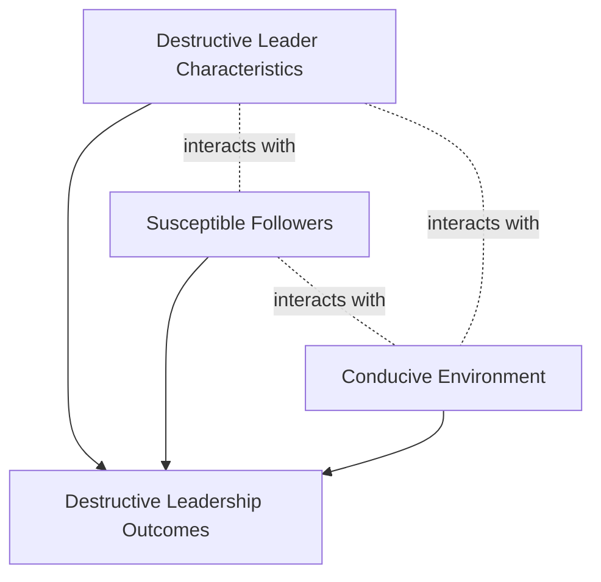
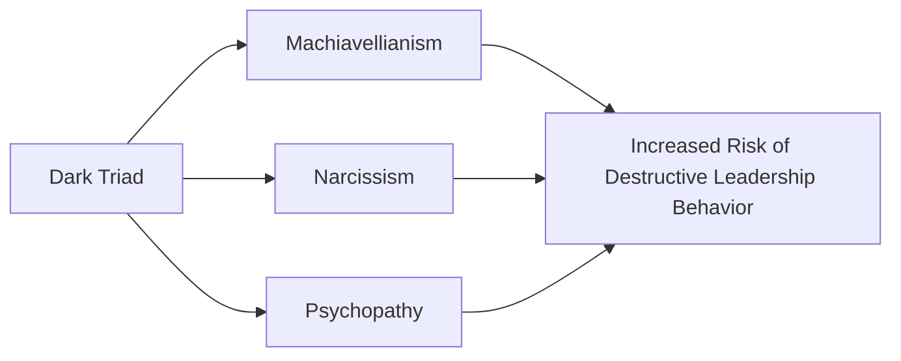

## Destructive and Toxic Leadership

### Overview

Destructive and toxic leadership represent the "dark side" of leadership studies — a body of research that emerged largely as a corrective to the field's historical overemphasis on positive, effective leadership models. Where transformational, authentic, and servant leadership theories ask "what makes leadership effective and beneficial," destructive leadership research asks "what leader behaviors systematically harm followers, organizations, or both, and under what conditions do such leaders persist or even thrive?"

A foundational insight distinguishing this literature from simple "bad management" is that destructive leadership is not merely the *absence* of positive leadership qualities — it is often actively harmful, and critically, it requires the participation of susceptible followers and conducive environments to take hold and persist.

### The Toxic Triangle Model (Padilla, Hogan, and Kaiser, 2007)

The most influential integrative framework in this domain argues that destructive leadership outcomes result from the **interaction of three elements**, not from destructive leaders acting alone:

1. **Destructive Leaders** — individuals possessing personality characteristics such as charisma (used manipulatively), narcissism, need for power, and a personalized (self-serving) rather than socialized power orientation
2. **Susceptible Followers** — followers who either *conform* out of unmet needs (need for safety, security, or belonging) and low self-esteem, or *actively collude* due to shared ambition, similar worldviews, or personal gain
3. **Conducive Environments** — organizational conditions such as instability, perceived threat, cultural values that emphasize high power distance or collectivism without adequate checks, absence of institutional checks and balances, and ineffective governance structures

**Key Points**

- The Toxic Triangle explicitly reframes destructive leadership as a *systemic* phenomenon rather than purely an individual pathology — removing a destructive leader without addressing follower susceptibility or environmental conditions may simply create an opening for a similar dynamic to recur
- This model directly parallels the "Fraud Triangle" concept in forensic accounting (pressure, opportunity, rationalization), sharing the underlying logic that harmful organizational outcomes typically require converging conditions rather than a single bad actor
- [Inference] Because all three legs of the triangle must be present for sustained destructive leadership to flourish, interventions focused solely on leader selection (screening out toxic individuals) without addressing follower dynamics or governance structures are likely to be only partially effective

### Defining Destructive Leadership (Einarsen, Aasland, and Skogstad, 2007)

A widely cited operational definition frames destructive leadership as *"the systematic and repeated behavior by a leader, supervisor, or manager that violates the legitimate interest of the organization by undermining and/or sabotaging the organization's goals, tasks, resources, and effectiveness and/or the motivation, well-being, or job satisfaction of subordinates."*

This definition deliberately identifies **two potential victims**: the organization itself and its subordinates — and critically, a leader can be destructive toward one target while appearing constructive toward the other (see the destructive leadership behavior model below).

#### The Destructive Leadership Behavior Model

Einarsen and colleagues propose a 2x2 typology crossing two dimensions: pro-subordinate vs. anti-subordinate behavior, and pro-organization vs. anti-organization behavior.

|  | Anti-Organization | Pro-Organization |
| --- | --- | --- |
| **Anti-Subordinate** | Tyrannical Leadership | Derailed Leadership |
| **Pro-Subordinate** | Supportive-Disloyal Leadership | Constructive Leadership |

- **Tyrannical Leadership**: harms both subordinates and organizational interests simultaneously (e.g., abusive, self-serving behavior that also damages organizational goals)
- **Derailed Leadership**: harms subordinates while nominally serving organizational goals (e.g., an abrasive, bullying manager who nonetheless hits performance targets, making the behavior harder to sanction)
- **Supportive-Disloyal Leadership**: harms organizational interests while benefiting subordinates directly (e.g., a leader who allows time theft, covers for poor performance, or misappropriates resources to benefit their in-group at the organization's expense)
- **Constructive Leadership**: the reference category — benefits both subordinates and organization

**Example**: A regional sales director who consistently exceeds revenue targets (pro-organization) while publicly humiliating underperforming staff, taking credit for subordinates' work, and creating a climate of fear (anti-subordinate) exemplifies **derailed leadership** — a pattern often protected from consequences precisely because of its measurable organizational results.

### Specific Constructs Within the Dark Leadership Literature

#### Abusive Supervision (Tepper, 2000)

Defined as *"subordinates' perceptions of the extent to which supervisors engage in the sustained display of hostile verbal and nonverbal behaviors, excluding physical contact."* This is the most extensively researched destructive leadership construct in organizational behavior.

- Behaviors include public ridicule, taking credit for subordinates' successes, blame-shifting, explosive outbursts, and the "silent treatment"
- Distinguished from workplace bullying by its explicit focus on the *supervisor-subordinate* power relationship and its behavioral (rather than intent-based) definition
- Meta-analytic evidence robustly links abusive supervision to reduced job satisfaction, increased turnover intention, reduced organizational citizenship behavior, increased counterproductive work behavior, and follower psychological distress

#### Narcissistic Leadership

Leaders high in narcissism exhibit grandiosity, entitlement, need for admiration, and a lack of empathy. Research distinguishes:

- **Constructive narcissism**: in limited doses, narcissistic confidence and vision-casting can support charismatic, decisive leadership, particularly in ambiguous or crisis situations requiring bold action
- **Destructive narcissism**: at higher levels, narcissistic leaders tend toward exploitation of followers, resistance to feedback, excessive risk-taking to maintain a grandiose self-image, and eventual organizational harm once initial charismatic appeal wears off

[Inference] This dual-edged quality helps explain why narcissistic individuals are often *initially* perceived as highly effective, charismatic leaders during selection processes (e.g., interviews, early tenure), even though longitudinal research often finds their leadership effectiveness deteriorates over time as follower exposure to exploitative behaviors accumulates — a pattern sometimes referred to as the "narcissism paradox" in leadership emergence research.

#### Laissez-Faire Leadership Reconsidered

While technically a form of "non-leadership" in Bass's Full Range Leadership Model, laissez-faire leadership is increasingly analyzed within the destructive leadership literature as a passive form of destructive leadership — the systematic avoidance of decision-making, feedback, and follower support constitutes a form of neglect with measurable negative consequences (role ambiguity, conflict, stress) even absent any active hostile behavior.

#### Machiavellianism and the Dark Triad

Destructive leadership research frequently draws on the broader **Dark Triad** personality framework:

1. **Machiavellianism** — manipulative, strategic, cynical view of others as means to an end
2. **Narcissism** — grandiosity, entitlement, need for admiration
3. **Psychopathy** — lack of empathy/remorse, impulsivity, superficial charm

[Unverified] While Dark Triad traits are consistently correlated with destructive leadership behaviors across studies, the degree to which these traits predict destructive outcomes independent of organizational context (versus being amplified or suppressed by conducive/inhibiting environments) remains an active empirical question, consistent with the Toxic Triangle's emphasis on environmental moderation.

### Susceptible Followers: Two Pathways

Padilla, Hogan, and Kaiser identify two distinct follower profiles that enable destructive leadership:

1. **Conformers** — followers who comply out of unmet basic psychological needs (safety, security, belonging, self-esteem), fear of the leader, or low self-concept clarity; they go along with destructive leadership because resisting feels personally risky or because they seek the leader's approval
2. **Colluders** — followers who actively participate in and benefit from destructive leadership due to ambition, shared worldview with the leader, or perceived personal gain from association with the leader's power

**Key Points**

- Distinguishing conformers from colluders matters practically: interventions for conformers might focus on psychological safety and whistleblower protections, while interventions for colluders may require more direct accountability and governance mechanisms
- [Inference] Organizational cultures with weak psychological safety are likely to convert what might otherwise be resistant or dissenting followers into conformers, since the personal cost of dissent (retaliation, ostracism) rises when institutional protections are absent

### Conducive Environmental Conditions

Research identifies several environmental factors that increase organizational vulnerability to destructive leadership:

- **Instability** — periods of organizational crisis, restructuring, or uncertainty increase follower anxiety and openness to strong, decisive (even if destructive) leadership
- **Perceived threat** — external competitive or existential threats can suppress internal dissent in favor of unity behind a leader
- **Absence of checks and balances** — weak governance, concentrated decision-making authority, and lack of independent oversight mechanisms remove structural barriers to leader misconduct
- **Cultural values** — high power-distance cultures may inhibit follower willingness to challenge leader behavior; strong in-group collectivism can suppress reporting of leader misconduct to protect group cohesion or reputation

### Consequences of Destructive Leadership

| Level | Consequences |
| --- | --- |
| Individual (Follower) | Increased stress, anxiety, depression, reduced self-esteem, burnout, reduced job satisfaction |
| Team | Reduced psychological safety, increased interpersonal conflict, reduced cohesion, "trickle-down" abusive behavior (followers may replicate abusive supervision toward their own subordinates) |
| Organizational | Increased turnover and absenteeism, reduced organizational citizenship behavior, increased counterproductive work behavior, reputational damage, legal/regulatory exposure |

[Inference] The "trickle-down" effect of abusive supervision — where abused subordinates are more likely to become abusive supervisors themselves — suggests destructive leadership can propagate through organizational hierarchies over time even after an originally destructive leader departs, unless deliberately interrupted through intervention or culture change.

### Distinguishing Destructive Leadership from Related Constructs

| Concept | Distinguishing Feature |
| --- | --- |
| Destructive Leadership | Systematic, repeated leader behavior harming organization and/or subordinates |
| Workplace Bullying | Broader construct not limited to leader-subordinate relationships; can occur among peers |
| Toxic Workplace Culture | Organizational-level phenomenon; may exist independent of any single destructive leader, though destructive leaders often help create it |
| Poor Management/Incompetence | Lack of skill or capability; not necessarily intentional or systematically harmful |
| Ethical Leadership Failure (isolated incident) | A single lapse in judgment; destructive leadership requires a *sustained, repeated* pattern |

### Practical Application in Organizations

- **Leadership selection and assessment**: incorporating Dark Triad screening tools and structured behavioral interviews focused on past treatment of subordinates (not just past performance results) to reduce selection of destructive leaders, while recognizing that charismatic self-presentation in interviews can mask destructive tendencies
- **Governance and accountability structures**: establishing 360-degree feedback mechanisms, anonymous reporting channels, and independent oversight (e.g., ombudspersons, ethics hotlines) to counter the "conducive environment" leg of the Toxic Triangle
- **Follower resilience and psychological safety programs**: training and cultural initiatives that reduce follower susceptibility by building self-efficacy, providing whistleblower protection, and normalizing upward dissent
- **Exit and remediation protocols**: organizations must address all three legs of the Toxic Triangle when removing a destructive leader — replacing the individual alone, without addressing enabling followers or environmental conditions, risks recurrence of similar dynamics under new leadership
- **Performance management redesign**: decoupling promotion and reward decisions purely from short-term output metrics (which can mask derailed leadership) toward metrics that also capture subordinate well-being, retention, and engagement

**Related Topics**

- Transformational and Transactional Leadership
- Authentic and Servant Leadership
- Workplace Bullying and Incivility
- Organizational Justice and Ethical Climate
- Psychological Safety (Edmondson)
- Power and Influence Tactics in Organizations
- Whistleblowing and Organizational Dissent