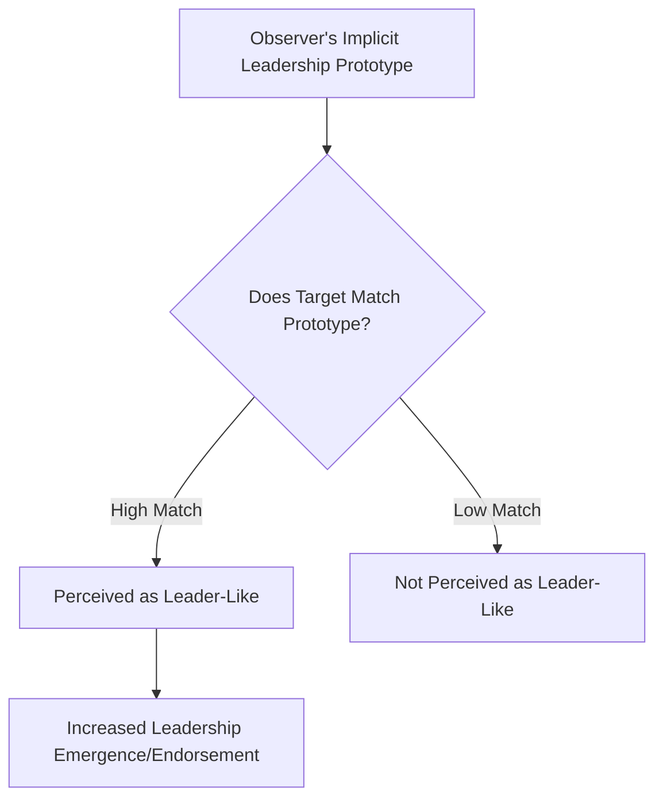
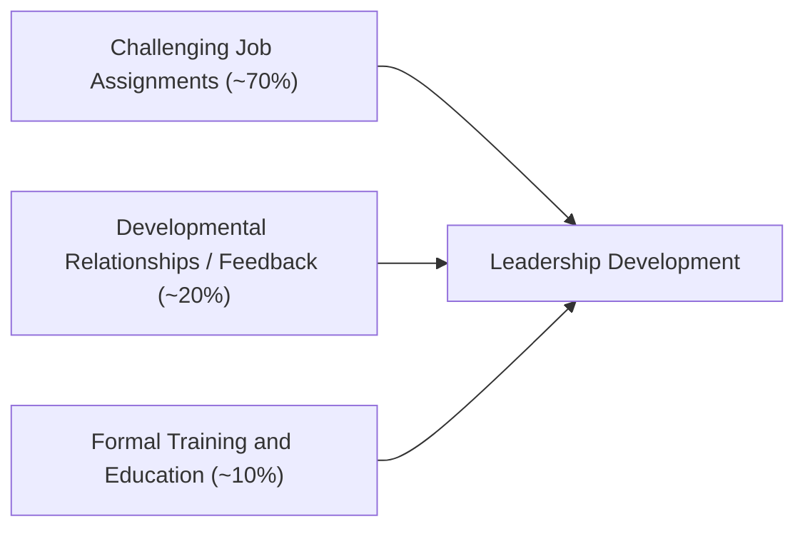
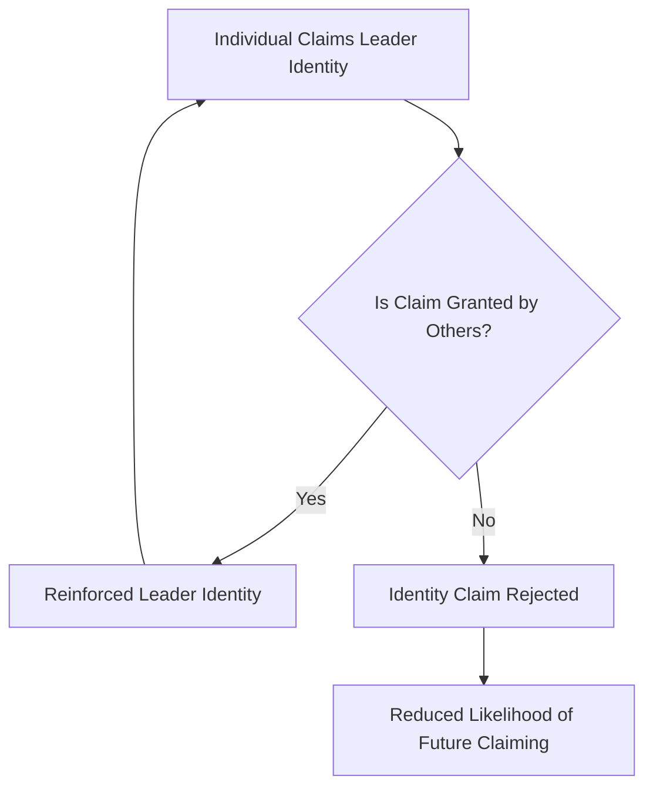

## Leadership Emergence and Development

### Overview

Leadership emergence and leadership development represent two related but analytically distinct questions within organizational psychology. **Leadership emergence** addresses why certain individuals come to be perceived as leaders by others in initially leaderless or ambiguous group contexts — independent of whether that individual is ultimately an *effective* leader. **Leadership development** addresses how leadership capacity is cultivated over time in individuals who may already hold or be preparing for formal leadership roles. Emergence research asks "who becomes seen as a leader, and why?" Development research asks "how do people become more capable leaders?"

These two streams intersect substantially: many models of leadership development assume that early emergence experiences (being informally recognized as a leader) shape subsequent leader identity and skill acquisition, creating a self-reinforcing developmental trajectory sometimes called the "rich get richer" dynamic in leadership research.

### Leadership Emergence

#### Trait-Based Predictors

Despite the broader field's move away from pure trait theory for predicting leadership *effectiveness*, trait approaches retain substantial predictive power specifically for leadership *emergence* — i.e., who gets perceived and selected as a leader in a group, regardless of subsequent performance.

Meta-analytic evidence (notably Judge, Bono, Ilies, and Gerhardt, 2002, examining the Big Five and leadership) identifies consistent predictors:

| Trait | Association with Emergence |
| --- | --- |
| Extraversion | Strongest and most consistent predictor |
| Conscientiousness | Positive predictor |
| Openness to Experience | Positive predictor |
| Emotional Stability (low Neuroticism) | Positive predictor |
| Agreeableness | Weakest/inconsistent predictor |
| General Cognitive Ability (intelligence) | Positive predictor, particularly in complex/ambiguous tasks |
| Self-Monitoring | Positive predictor (high self-monitors adapt behavior to social cues, aiding perceived leader fit) |

**Key Points**

- Extraversion's dominance as a predictor is partly attributed to its behavioral correlates — extraverted individuals talk more in group settings, and talkativeness itself is a robust, well-documented predictor of emergent leadership perception, independent of the actual quality of the contributions made
- [Inference] This creates a documented distortion risk: because emergence is partly driven by sheer participation rate rather than idea quality, groups may systematically elevate confident, talkative members to informal leadership roles even when quieter members possess more relevant expertise — a phenomenon with direct implications for equitable leadership pipeline design

#### Implicit Leadership Theories (ILTs) and Leader Categorization

Robert Lord's **Leader Categorization Theory** proposes that individuals hold cognitive prototypes of what a "leader" looks like, developed through socialization and cultural exposure. When a group member's behavior or appearance matches an observer's leader prototype, that person is more readily perceived and endorsed as a leader — independent of demonstrated competence.

**Key Points**

- ILTs are shaped by culture, prior experience with leaders, and prevailing societal stereotypes, meaning prototypes vary systematically across cultural contexts (a documented focus of the GLOBE cross-cultural leadership research program)
- This theory has significant implications for understanding demographic disparities in leadership emergence and advancement: if prevailing cultural leader prototypes are implicitly gendered, racialized, or otherwise narrow, individuals who do not match the prototype face a structural disadvantage in being recognized as leaders regardless of actual capability — a mechanism frequently cited in research on barriers facing women and underrepresented groups in leadership advancement (related to, though distinct from, the "glass cliff" and "think manager, think male" literatures)

#### Behavioral and Social Predictors of Emergence

- **Task contribution behavior**: early, competent task-relevant contributions in group settings strongly predict subsequent leadership emergence
- **Social network centrality**: individuals occupying central positions in informal communication networks are more likely to emerge as leaders, since network position provides both information access and increased visibility
- **Physical and vocal characteristics**: [Unverified] some studies have found associations between height, vocal pitch (particularly lower pitch in some cultural contexts), and perceived leadership potential, though the practical and ethical implications of these findings remain contested, and effect sizes are generally modest relative to behavioral predictors

### Leadership Development

#### Core Conceptual Distinction: Leader Development vs. Leadership Development

A foundational distinction in this literature (Day, 2000):

- **Leader development** focuses on building *intrapersonal* competence in an individual — self-awareness, self-regulation, self-motivation, and technical/conceptual skills that reside within the person
- **Leadership development** focuses on building *interpersonal and relational* capacity across a social system — social awareness, relationship-building capability, and the networked processes through which leadership is exercised across multiple individuals

[Inference] This distinction implies that leadership development interventions focused solely on individual skill-building (e.g., sending a manager to a course on decision-making) may be necessary but insufficient if they do not also address the relational and network context in which that manager's leadership must actually operate.

#### Key Developmental Mechanisms

1. **Developmental Experiences / Job Assignments** — research (notably the Center for Creative Leadership's "70-20-10" framework) suggests the majority of leadership development occurs through on-the-job challenging experiences (commonly estimated at roughly 70%), with social learning and feedback from others (roughly 20%), and formal training/coursework (roughly 10%) contributing the remainder. [Unverified] The specific percentages in the 70-20-10 model are based on retrospective self-report survey data from a limited executive sample rather than controlled experimental validation, and should be treated as a heuristic guideline rather than a precisely measured ratio.
2. **Developmental Relationships** — mentoring, coaching, and sponsorship relationships that provide feedback, psychosocial support, and career guidance. Distinguished as:
   - *Mentoring*: broader relationship focused on holistic career and psychosocial development
   - *Coaching*: typically more structured, often short-term, and focused on specific skill or performance goals
   - *Sponsorship*: an influential figure actively advocates for and creates opportunities for the developing individual, going beyond advice-giving to active advocacy
3. **Feedback-Intensive Programs** — 360-degree feedback processes, assessment centers, and structured self-reflection exercises designed to build the self-awareness foundational to leader development (echoing authentic leadership theory's emphasis on self-awareness as a developmental cornerstone)
4. **Formal Training and Education** — structured coursework, workshops, and executive education programs; generally considered to contribute the smallest but still meaningful share of overall development relative to experiential and relational mechanisms

#### Leader Identity Development

A more recent theoretical strand (Day and colleagues; DeRue and Ashford, 2010) frames leadership development as fundamentally a process of **identity construction**. Individuals develop a leader identity through:

- **Claiming** — asserting a leader identity through words or actions (e.g., volunteering to lead a project)
- **Granting** — others acknowledging and reinforcing that claimed identity (e.g., a group deferring to that person's direction)

This claiming-granting exchange operates as an iterative social process: successful claims that are granted reinforce the individual's internalized leader identity and increase the likelihood of future claiming behavior, creating a developmental feedback loop.

**Example**: A junior analyst who proposes and volunteers to lead a cross-functional process-improvement initiative is *claiming* a leader identity. If colleagues and management support the initiative and defer to her coordination decisions, that claim is *granted*, reinforcing her self-concept as a leader and increasing the likelihood she will claim similar roles in the future. If the initiative is dismissed or her authority is repeatedly undermined, the claim is not granted, potentially discouraging future claiming attempts.

#### Developmental Readiness

Not all developmental experiences produce equivalent growth; **developmental readiness** (Avolio and Hannah, 2008) — the extent to which an individual possesses the motivation, self-awareness, and cognitive/emotional capacity to learn from a given developmental experience — moderates development outcomes. This implies leadership development is not purely a function of exposure to the right experiences, but also depends on individual-level readiness factors including:

- **Learning goal orientation** — motivation to develop competence versus merely demonstrate existing competence
- **Self-complexity and self-awareness** — capacity to integrate new self-relevant information without being overwhelmed
- **Metacognitive ability** — capacity to reflect on and regulate one's own learning process

### Comparative Framing: Emergence vs. Development

| Dimension | Leadership Emergence | Leadership Development |
| --- | --- | --- |
| Core question | Who is perceived/selected as a leader? | How does leadership capacity grow over time? |
| Primary drivers | Traits, prototype-matching, behavior, network position | Experience, relationships, feedback, identity construction |
| Time horizon | Often relatively immediate (within a single group interaction or early tenure) | Longitudinal, career-spanning |
| Risk if unaddressed | Talented but non-prototypical individuals overlooked | Formally appointed leaders plateau without deliberate growth mechanisms |

### Criticisms and Limitations

- **Emergence-effectiveness gap**: a substantial body of research documents only a modest correlation between traits/behaviors that predict emergence and those that predict actual leadership *effectiveness* — the people who get selected as leaders are not necessarily the people who perform best in the role, creating a persistent selection validity problem in organizations
- **ROI measurement challenges**: leadership development program effectiveness is notoriously difficult to evaluate rigorously; most organizational evaluations rely on reaction-level feedback (satisfaction with training) rather than longitudinal behavioral or performance-based outcome measures
- **Overreliance on high-potential identification**: many organizational leadership pipelines invest disproportionately in individuals identified early as "high potential," which risks a self-fulfilling prophecy dynamic (identified individuals receive more developmental opportunities, subsequently perform better, appearing to validate the initial selection) while under-investing in late-blooming or non-prototypical talent
- **Cultural and demographic bias risk**: because both emergence (via ILTs) and development (via sponsorship access) are influenced by matching implicit prototypes and pre-existing network access, both processes risk perpetuating structural advantages for already-advantaged demographic groups absent deliberate organizational intervention

### Practical Application in Organizations

- **Succession planning and high-potential programs**: organizations should explicitly separate assessment of emergence indicators (confidence, visibility, prototype fit) from assessment of demonstrated effectiveness indicators (actual results, follower outcomes) to avoid conflating the two in promotion decisions
- **Structured stretch assignments**: deliberately designing challenging job rotations, task force leadership opportunities, and cross-functional projects to generate the experiential ~70% of development, rather than relying primarily on formal training investment
- **Sponsorship program design**: given the claiming-granting dynamic, organizations can formally structure sponsorship programs to ensure high-potential but low-visibility employees (who may lack organic access to informal sponsors) receive deliberate advocacy and opportunity access
- **Bias-aware promotion criteria**: given ILT-driven prototype effects, structured, criteria-based promotion panels (rather than purely informal manager nomination) can reduce the risk that non-prototypical but highly capable candidates are systematically overlooked
- **Feedback infrastructure**: institutionalizing regular 360-degree feedback and coaching relationships supports the self-awareness foundation that both leader identity development and readiness-based learning depend on

**Related Topics**

- Authentic and Servant Leadership
- Leader-Member Exchange Theory
- Shared and Distributed Leadership
- Implicit Bias and Diversity in Leadership Advancement
- Succession Planning and Talent Management
- Self-Efficacy and Social Cognitive Theory (Bandura)
- Mentoring, Coaching, and Sponsorship in Career Development