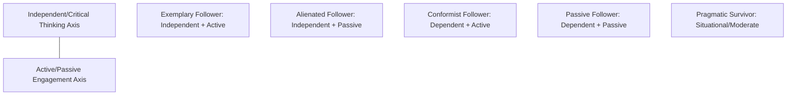
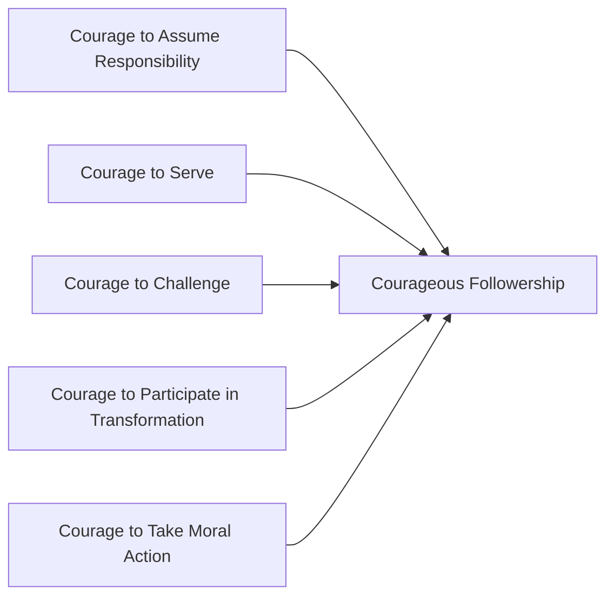

## Followership

### Overview

Followership theory represents a deliberate reorientation of leadership studies away from an exclusively leader-centric lens toward recognizing followers as active, consequential participants in the leadership process rather than passive recipients of leader influence. Robert Kelley's foundational 1988 Harvard Business Review article, "In Praise of Followers," is widely credited with launching serious academic attention to this domain, arguing that organizational success depends substantially on follower behavior and that most individuals spend far more of their careers as followers than as leaders — making follower effectiveness at least as organizationally consequential as leader effectiveness, yet historically far less studied.

The core theoretical claim uniting followership research: **leadership is fundamentally a co-produced, relational process** — leader behavior alone cannot fully explain organizational outcomes without accounting for how followers interpret, enact, resist, or shape that leadership in practice.

### Kelley's Followership Styles Model

Robert Kelley proposed that followers can be characterized along two independent behavioral dimensions:

1. **Independent, Critical Thinking vs. Dependent, Uncritical Thinking** — the degree to which a follower thinks for themselves, offers constructive criticism, and exercises independent judgment, versus accepting the leader's ideas and decisions without question
2. **Active vs. Passive Engagement** — the degree to which a follower takes initiative, is actively involved, and demonstrates energy in participation, versus requiring constant direction and supervision

Crossing these dimensions produces five followership styles:

| Style | Critical Thinking | Engagement | Characteristics |
| --- | --- | --- | --- |
| Exemplary (Star) Follower | Independent | Active | Self-managing, offers constructive challenge, highly engaged and takes initiative |
| Alienated Follower | Independent | Passive | Capable of critical, independent thought but disengaged, cynical, or withholding effort |
| Conformist (Yes-Person) | Dependent | Active | Highly engaged and hardworking, but uncritically accepts leader direction without challenge |
| Passive Follower | Dependent | Passive | Requires constant direction; low initiative and low critical engagement |
| Pragmatic Survivor | Moderate | Moderate | Situationally adapts style depending on which approach best serves self-preservation; "fence-sitter" |

**Key Points**

- Kelley's model is explicitly normative in favoring the "exemplary" or "star" follower style, which he associated with the greatest positive contribution to organizational effectiveness
- The **alienated follower** category is theoretically important: this profile represents wasted organizational capability — individuals with genuine critical capacity who have disengaged, often due to prior negative experiences (unheeded feedback, unaddressed grievances) rather than inherent low capability
- [Inference] Because engagement level is behaviorally distinct from critical-thinking capacity, organizations risk misdiagnosing alienated followers as simply "difficult" or "negative" rather than recognizing disengagement as a potentially reversible response to specific organizational conditions (e.g., leader dismissiveness, lack of psychological safety)

**Example**: An engineer who identifies a flaw in a proposed system architecture, raises the concern directly and constructively to leadership, and continues to actively contribute solutions even after the initial concern is not immediately acted upon exemplifies the *exemplary follower* style. A colleague who shares the same private reservations about the architecture but says nothing in meetings and quietly does the minimum required exemplifies the *alienated follower* style — critical capacity exists but is withheld.

### Chaleff's Courageous Follower Model

Ira Chaleff's model (1995) shifts emphasis toward the *ethical and relational courage* required of followers, particularly in relation to holding leaders accountable. Chaleff identifies five dimensions of courageous followership:

1. **Courage to Assume Responsibility** — taking ownership for one's own and the organization's success rather than assuming responsibility rests solely with the leader
2. **Courage to Serve** — actively supporting the leader in accomplishing organizational goals
3. **Courage to Challenge** — being willing to question or object to leader behavior or decisions that are problematic, unethical, or counterproductive
4. **Courage to Participate in Transformation** — supporting necessary organizational change, including change in the leader's own behavior
5. **Courage to Take Moral Action** — being willing to take a moral stand, including, in extreme cases, appealing to a higher authority or ultimately leaving the situation if serious ethical violations are not addressed

**Key Points**

- Chaleff's model directly connects followership to the destructive leadership literature: courageous followership (specifically the "courage to challenge") functions as a structural counterweight to the "susceptible follower" dynamics described in the Toxic Triangle model, where conforming or colluding followers enable destructive leader behavior
- The model reframes follower loyalty not as unconditional obedience but as loyalty to shared purpose and organizational/ethical standards, which may at times require *opposing* the leader's specific decisions

### Followership Role Theory and Social Construction

More recent theoretical work (notably Uhl-Bien, Riggio, Lowe, and Carsten, 2014) reframes followership through two complementary lenses:

1. **Role-Based Followership** — treats "follower" as a formal or informal position/role within a hierarchical structure, with associated behaviors and expectations tied to that position, largely independent of the specific individual occupying it
2. **Constructionist Followership** — treats leadership and followership as *socially constructed* through interaction; an individual is not inherently a "leader" or "follower" but comes to occupy that identity through a relational process of claiming and granting (directly paralleling DeRue and Ashford's leader identity construction model)

This constructionist view implies followership is not a fixed trait or permanent role but a dynamic, situational identity — the same individual may enact follower behavior in one interaction and leader behavior in another, sometimes within the same meeting.

[Inference] The constructionist framing suggests that rigid organizational role labels ("this is a leader position," "this is a follower position") may understate the fluid, moment-to-moment nature of actual influence processes within teams, particularly in flatter or matrixed organizational structures where formal hierarchy and situational influence frequently diverge.

### Follower Attribution and Implicit Followership Theories (IFTs)

Paralleling Implicit Leadership Theories, researchers (notably Sy, 2010) have proposed **Implicit Followership Theories** — cognitive schemas that leaders hold about what "good" and "bad" followers look like. Leaders' IFTs shape how they interpret and respond to follower behavior, independent of the follower's actual performance.

- Leaders with more positive/generous IFTs about followers in general tend to build higher-quality LMX relationships and provide more developmental opportunities
- Leaders with more negative or cynical IFTs may interpret ambiguous follower behavior less charitably, potentially creating self-fulfilling prophecy dynamics resembling those documented in Pygmalion effect research

### Reversing the Lens: Follower-Centric Perspectives on Leadership Outcomes

A key contribution of followership research is methodological and conceptual: it argues that many outcomes traditionally attributed entirely to "leadership" (team performance, organizational culture, ethical climate) are more accurately understood as **co-produced** outcomes arising from the interaction of leader behavior and follower response, rather than leader behavior alone.

| Traditional (Leader-Centric) Framing | Followership-Informed Reframing |
| --- | --- |
| "The leader created a toxic culture" | "The leader's behavior, combined with follower conformity/collusion, sustained a toxic culture" |
| "The leader's vision drove team performance" | "The leader's vision, actively interpreted and enacted by engaged followers, drove team performance" |
| "The leader failed to get buy-in" | "The relational exchange between leader and followers failed to produce buy-in" |

### Criticisms and Limitations

- **Terminological stigma**: the term "follower" carries connotations of passivity or subordination in everyday usage that can undercut the field's own argument that followership is an active, consequential role — some researchers have proposed alternative terminology (e.g., "co-producers of leadership") to address this framing problem
- **Measurement and construct validity challenges**: Kelley's followership styles, while intuitively appealing and pedagogically popular, have received less rigorous large-scale psychometric validation compared to major leadership constructs (e.g., transformational leadership's MLQ)
- **Overlap with existing constructs**: some critics argue followership dimensions (e.g., "active engagement") substantially overlap with existing organizational behavior constructs like proactive personality, organizational citizenship behavior, and job engagement, raising discriminant validity questions
- **Limited integration with mainstream leadership theory**: despite decades of followership scholarship, most organizational leadership development programs, executive education curricula, and popular leadership literature remain predominantly leader-centric, with followership content often treated as a secondary or supplementary topic rather than integrated as a co-equal analytical lens
- **Underspecification of when challenge is appropriate**: Chaleff's "courage to challenge" is normatively appealing but offers limited operational guidance on how followers should calibrate challenge intensity against organizational and personal risk in specific high-stakes situations

### Practical Application in Organizations

- **Leadership development curricula**: incorporating explicit followership training (recognizing one's own default followership style, building critical-thinking engagement) alongside traditional leader-skill training, particularly since most employees spend the majority of their careers in follower roles even while occasionally occupying leadership positions
- **Psychological safety and dissent channels**: given Chaleff's "courage to challenge" and the destructive leadership literature's emphasis on conforming/colluding followers, organizations can structurally support upward challenge through protected feedback channels, skip-level meetings, and anonymous reporting mechanisms
- **Talent identification**: recognizing "alienated followers" (high capability, low engagement) as a distinct organizational talent pool warranting re-engagement efforts rather than simple performance management or termination
- **360-degree and upward feedback systems**: operationalizing the constructionist view of leadership by systematically incorporating follower perspectives into leadership assessment, rather than evaluating leader effectiveness solely through top-down or peer-level metrics
- **Succession and high-potential programs**: using exemplary followership behaviors (independent critical thinking combined with active engagement) as a screening criterion for future leadership potential, consistent with the claiming-granting model of leader identity development

**Related Topics**

- Leadership Emergence and Development
- Leader-Member Exchange Theory
- Destructive and Toxic Leadership
- Shared and Distributed Leadership
- Psychological Safety (Edmondson)
- Organizational Citizenship Behavior (OCB)
- Power and Influence Tactics in Organizations