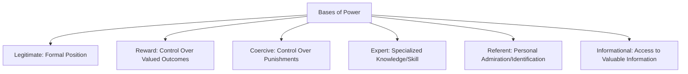
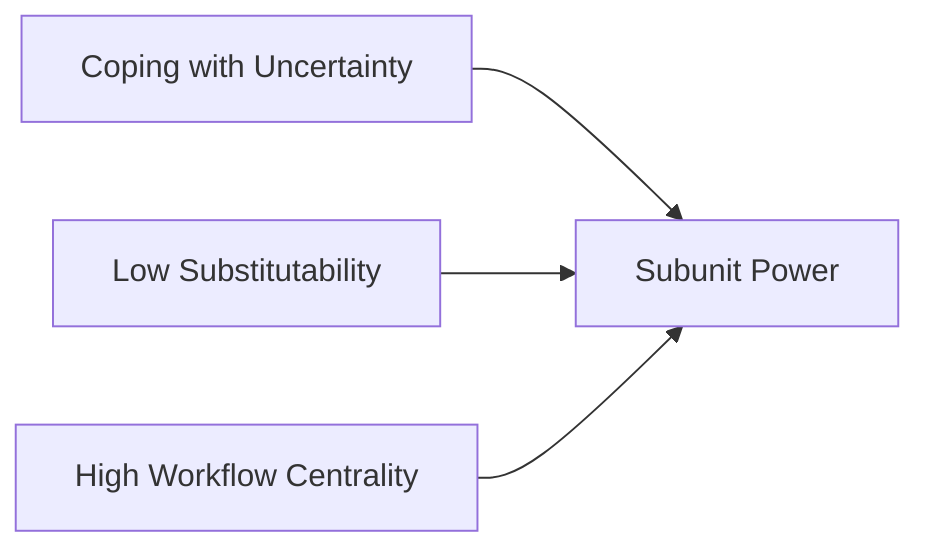

## Bases and Sources of Power

### Overview

Power in organizational psychology is defined as the **capacity** of one party to influence the behavior, attitudes, or outcomes of another, whether or not that capacity is actually exercised. This distinguishes power from *influence* (the actual exercise of that capacity) and from *authority* (formally legitimated power sanctioned by organizational or societal structures). Understanding the distinct bases from which power derives is foundational to analyzing organizational politics, leadership effectiveness, conflict, and compliance dynamics.

The most influential and enduring framework in this domain is French and Raven's (1959) taxonomy of social power bases, later extended by Raven to include a sixth base.

### French and Raven's Bases of Power

#### The Five (Later Six) Original Bases

1. **Legitimate Power** — derives from a formal position or role within a recognized structure; followers comply because they accept the position holder's *right* to direct their behavior (e.g., a manager's authority over direct reports, grounded in organizational hierarchy)
2. **Reward Power** — derives from the ability to provide valued outcomes (raises, promotions, desirable assignments, praise) to others; compliance is motivated by the expectation of receiving these rewards
3. **Coercive Power** — derives from the ability to administer punishments or withhold desired outcomes (termination, demotion, undesirable assignments, formal discipline); compliance is motivated by fear of these consequences
4. **Expert Power** — derives from possessing specialized knowledge, skill, or expertise that others need or value; compliance is based on respect for and reliance on that expertise, independent of formal position
5. **Referent Power** — derives from being liked, admired, or respected as a person; others comply or are influenced because they identify with, wish to be associated with, or seek approval from the power-holder
6. **Informational Power** *(added later by Raven, 1965)* — derives from possessing or controlling access to valuable information; distinguished from expert power in that it rests on the specific content or logic of information conveyed in a given instance, rather than a general perception of the source's overall expertise or competence

**Key Points**

- Legitimate, reward, and coercive power are collectively often described as **positional power** (or "hard" power bases) — they are attached to a formal role and typically diminish or disappear when the individual leaves that role
- Expert and referent power are collectively often described as **personal power** (or "soft" power bases) — they travel with the individual regardless of formal position and often persist or even transfer to new roles
- Informational power occupies a middle ground: it can be positional (a manager's access to confidential data by virtue of role) or personal (an individual who has independently cultivated a valuable information network)

**Example**: A newly appointed VP possesses legitimate power the moment the appointment is announced, along with reward and coercive power tied to the role's formal authority over compensation and discipline decisions. However, if subordinates do not yet respect the VP's technical competence, expert power must be earned over time through demonstrated performance, and referent power must be earned through relationship-building — illustrating that positional and personal power bases develop on different timelines even within the same individual.

### Distinguishing Compliance Mechanisms by Power Base

Different power bases produce qualitatively different follower responses, following a widely cited framework distinguishing three levels of behavioral response to influence attempts:

| Response Type | Description | Most Associated Power Bases |
| --- | --- | --- |
| **Compliance** | Surface-level behavioral conformity without internal attitude change; follower does what is asked but only while monitored or incentivized | Coercive, Reward |
| **Identification** | Follower adopts the requested behavior/attitude because they admire or wish to maintain a relationship with the power-holder | Referent |
| **Internalization** | Follower genuinely adopts the underlying value or belief because it aligns with their own value system, and will maintain the behavior independent of surveillance or continued relationship with the power-holder | Expert, Informational, (and Legitimate power exercised through persuasion) |

[Inference] This distinction has significant practical implications: because coercive and reward power tend to produce mere compliance rather than internalization, their behavioral effects are typically less durable and more dependent on continuous monitoring than the effects of expert or referent power, which is a key reason organizational behavior research generally finds coercive power the least effective base for sustained influence, despite its immediate compliance-generating capacity.

### Empirical Findings on Relative Effectiveness

Meta-analytic and field research (extensively reviewed by Yukl and others) generally finds a consistent pattern across the power bases:

- **Expert power** and **referent power** are most consistently associated with positive outcomes: follower satisfaction, commitment, performance, and organizational citizenship behavior
- **Legitimate power** shows generally positive but weaker and more context-dependent effects
- **Reward power** shows mixed effects — effective for short-term compliance but can undermine intrinsic motivation if overused (consistent with broader motivation research on the potential crowding-out effects of extrinsic incentives)
- **Coercive power** is the most consistently negatively associated base — associated with resentment, reduced trust, reduced organizational citizenship behavior, and in some studies increased counterproductive work behavior or turnover intention

**Key Points**

- These findings collectively support a practical principle sometimes summarized as "personal power bases outperform positional power bases" for sustained organizational effectiveness, though [Unverified] effect sizes and relative rankings vary somewhat by study context, industry, and cultural setting, and some research finds legitimate power's effectiveness is highly contingent on whether it is perceived as fairly and appropriately exercised

### Structural and Situational Sources of Power (Beyond French and Raven)

While French and Raven's taxonomy addresses interpersonal power bases, organizational psychology also recognizes structural sources of power that are less about individual traits or relationships and more about position within organizational systems.

#### Strategic Contingencies Theory (Hickson et al., 1971)

This model argues that subunits (departments, teams) within an organization derive power based on:

1. **Coping with Uncertainty** — subunits that manage critical sources of uncertainty for the organization gain power (e.g., a legal department gains power during periods of high regulatory risk)
2. **Substitutability** — power increases when a subunit's function cannot easily be performed by other subunits or outsourced
3. **Centrality** — power increases with the degree to which a subunit's work is interconnected with and consequential for other parts of the organizational workflow

#### Resource Dependence Theory (Pfeffer and Salancik, 1978)

At the organizational level, power derives from controlling resources that other parties depend on. Applied intra-organizationally, individuals or departments that control access to scarce, valued, and non-substitutable resources (budget, headcount, critical information systems, external relationships) accumulate structural power independent of formal hierarchical position.

**Key Points**

- Strategic contingencies and resource dependence perspectives explain why power in organizations does not always map cleanly onto the formal organizational chart — a mid-level IT security specialist may hold substantial structural power during a cybersecurity crisis despite modest formal rank, because they are coping with acute organizational uncertainty
- [Inference] These structural frameworks imply that power dynamics are dynamic and context-dependent rather than fixed: a subunit's power can rise or fall significantly as organizational priorities, external threats, and resource scarcity shift over time, without any change in the formal organizational structure itself

### Network-Based Power

Complementing structural theories, social network research frames power as a function of an individual's position within informal organizational networks:

- **Centrality** — individuals occupying central network positions (many connections, or positioned as key information brokers) accrue informational and relational power
- **Structural holes** (Burt, 1992) — individuals who bridge otherwise disconnected parts of a network gain power by controlling information flow between groups, occupying a broker position that others depend on for cross-group coordination

[Inference] Network-based power helps explain why individuals without significant formal authority or even strong technical expertise can nonetheless exercise substantial organizational influence, since network brokerage position is a power source largely independent of the French and Raven interpersonal bases.

### Dependence and the Relational Nature of Power

A foundational theoretical point across all power frameworks: power is inherently **relational and situational**, not a fixed personal attribute. Emerson's (1962) power-dependence theory formalizes this: Party A's power over Party B is a direct function of Party B's dependence on A, which is itself a function of how much B values what A controls and how many alternative sources B has for obtaining it.

$$Power_{A \text{ over } B} = Dependence_{B \text{ on } A}$$

**Key Points**

- This relational framing explains why the same individual can hold substantial power in one relationship or context and minimal power in another — power is not portable across all relationships in the same way a personality trait would be
- It also explains classic power-balancing strategies: a dependent party can reduce another's power over them by finding alternative resource sources, reducing the value they place on the controlled resource, or increasing the power-holder's dependence on them in return (a strategy sometimes termed "counter-power" or reciprocal dependence)

### Criticisms and Limitations

- **Overlap and ambiguity between bases**: empirical measurement of French and Raven's bases (notably via the widely used but critiqued Hinkin and Schriesheim, 1989 power scales) has consistently struggled to cleanly separate legitimate, expert, and informational power in factor-analytic studies, suggesting the theoretical distinctions may be sharper than what followers actually perceive and report
- **Static framing risk**: while the original taxonomy is often taught as a fixed typology, most contemporary scholars emphasize that power bases are dynamic, can be combined, and shift based on situational factors — a risk of oversimplification exists when the model is applied too rigidly
- **Underspecification of power's dark-side interactions**: French and Raven's framework is largely descriptive and value-neutral regarding *how* power is used; it does not by itself predict destructive leadership outcomes, which require the additional theoretical machinery of frameworks like the Toxic Triangle to explain when and why power bases are exercised destructively
- **Cultural variability**: [Unverified] the relative effectiveness and cultural acceptability of different power bases (e.g., reliance on legitimate/positional power versus referent power) likely varies across high versus low power-distance cultures, though systematic cross-cultural comparative research directly testing the French and Raven taxonomy remains more limited than research on other leadership constructs

### Practical Application in Organizations

- **Leadership development**: training programs increasingly emphasize building personal power bases (expert and referent power) as a complement to positional authority, since personal power bases show more consistent positive outcomes and are portable across roles and career transitions
- **Organizational design and succession planning**: applying strategic contingencies and resource dependence theory allows organizations to anticipate which roles or functions will accrue informal power during specific business conditions (e.g., data privacy expertise during regulatory change), informing proactive talent and compensation decisions
- **Change management**: change agents lacking strong legitimate power (e.g., external consultants, cross-functional project leads) often rely disproportionately on expert and referent power to drive adoption, since they typically lack coercive or reward power over the populations they are trying to influence
- **Conflict resolution and negotiation**: understanding the relational, dependence-based nature of power (Emerson) informs negotiation strategy, since altering the balance of dependence (e.g., developing alternative suppliers, diversifying stakeholder relationships) can shift practical power balance independent of formal authority changes
- **DEI and pay equity initiatives**: recognizing that informal, personal power bases (referent, expert) may be distributed unevenly across demographic groups due to network access and implicit bias (paralleling implicit leadership theory dynamics) can inform more equitable identification of high-potential talent who may lack visible positional power

**Related Topics**

- Organizational Politics and Political Behavior
- Influence Tactics and Persuasion Strategies
- Destructive and Toxic Leadership
- Social Network Analysis in Organizational Behavior
- Resource Dependence Theory
- Conflict Management and Negotiation
- Leader-Member Exchange Theory