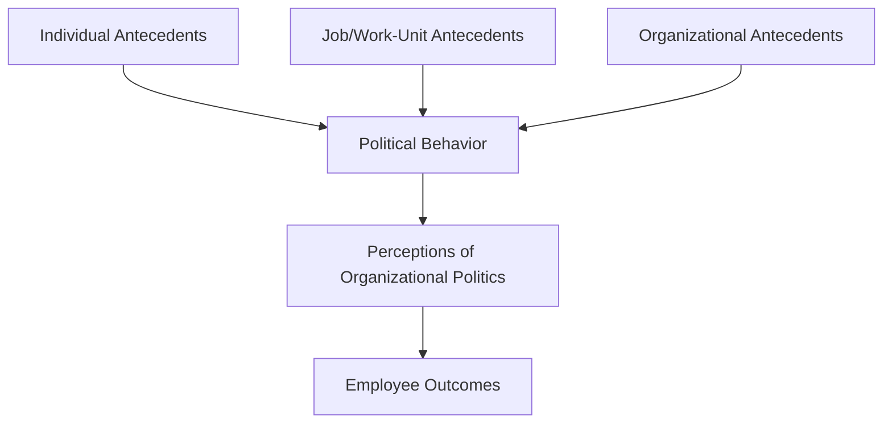
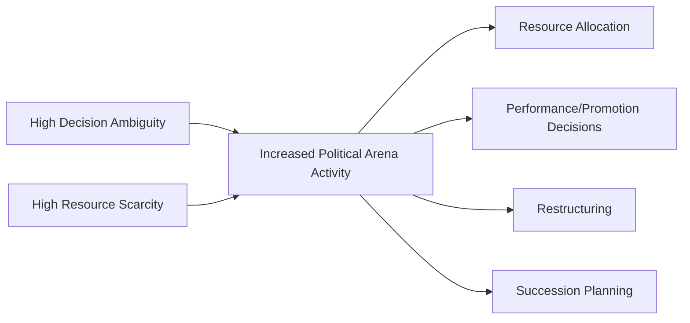

## Organizational Politics

### Overview

Organizational politics refers to informal, often self-interested behaviors enacted to acquire, develop, or use power and other resources to obtain desired outcomes when there is uncertainty or disagreement about choices. Unlike formal organizational structures and processes that operate through sanctioned authority and established rules, political behavior operates through informal influence tactics that are not officially sanctioned by the organization and are typically activated in the absence of clear formal guidance.

A foundational conceptual point in this literature: organizational politics is not inherently negative or dysfunctional. While popular usage of "office politics" carries pejorative connotations, organizational psychology treats politics as a **naturally occurring feature of organizational life** — since organizations inherently involve the allocation of scarce resources, differing interests, and ambiguous decision criteria, political behavior is a predictable response to these conditions rather than necessarily an indicator of organizational dysfunction.

### Defining Organizational Politics

Mintzberg (1985) offers a formative definition: political behavior involves influence attempts using techniques that are **illegitimate** (not officially sanctioned by formal authority, expertise, or ideology), **self-serving**, and often enacted **covertly**, at least at some level, to promote or protect the actor's own interests. Later scholars (notably Ferris and colleagues) have broadened this to a more neutral, descriptive framing that does not presuppose self-serving intent as a defining criterion, since some political behavior can advance both individual and organizational interests simultaneously.

#### Distinguishing Political Behavior from Related Constructs

| Concept | Distinguishing Feature |
| --- | --- |
| Organizational Politics | Informal influence behavior, not officially sanctioned, activated under ambiguity |
| Formal Authority/Legitimate Power | Officially sanctioned influence tied to organizational role |
| Influence Tactics | The specific behavioral techniques used (some political, some not) |
| Organizational Citizenship Behavior (OCB) | Discretionary behavior benefiting the organization, generally without self-interested framing |
| Impression Management | A subset of political behavior specifically focused on shaping others' perceptions of oneself |

### Antecedents of Political Behavior: The Three-Level Model

Research (notably Ferris and colleagues' influential integrative model) identifies antecedents of political behavior at three levels:

1. **Individual-Level Antecedents**
   - High self-monitoring (ability and willingness to adapt behavior to social context)
   - Internal locus of control (belief that outcomes are within one's own control, motivating proactive influence attempts)
   - Machiavellianism and need for power
   - Political skill (discussed in depth below)
2. **Job/Work-Unit-Level Antecedents**
   - Role ambiguity — unclear job expectations create space for political maneuvering to define one's own role advantageously
   - Autonomy — greater job autonomy provides more latitude for discretionary, self-directed political behavior
   - Variety and visibility of tasks
3. **Organizational-Level Antecedents**
   - Resource scarcity — competition over limited budgets, headcount, or promotional opportunities intensifies political behavior
   - Decision-making ambiguity — unclear, informal, or inconsistently applied decision criteria increase the perceived value of political maneuvering relative to straightforward merit-based advancement
   - Organizational change and restructuring — periods of uncertainty about role security and reporting structures increase political activity
   - Democratic decision-making processes — paradoxically, participative structures can increase political behavior by creating more forums in which competing interests must be actively negotiated

**Key Points**

- Resource scarcity and decision-making ambiguity are consistently identified as the strongest organizational-level predictors of political behavior intensity, since political influence tactics become comparatively more valuable when formal, rule-based allocation mechanisms are weak or absent
- [Inference] This implies political behavior functions partly as an adaptive response to genuine organizational ambiguity rather than purely a function of individual personality — even low-Machiavellianism employees may increase political behavior in highly ambiguous, resource-constrained environments, suggesting situational and dispositional explanations are complementary rather than competing

### Political Skill

**Political skill** (Ferris et al., 2005) is defined as the ability to effectively understand others at work and to use that knowledge to influence others in ways that enhance one's personal and/or organizational objectives. Unlike Machiavellianism (a personality trait associated with manipulative, self-serving intent), political skill is conceptualized as a **learnable interpersonal competency** that can be exercised toward either self-serving or organizationally beneficial ends.

#### Four Dimensions of Political Skill

1. **Social Astuteness** — keen understanding of social interactions and accurate interpretation of others' behavior and motivations
2. **Interpersonal Influence** — a subtle, adaptable, and convincing personal style with a strong but unassuming effect on others
3. **Networking Ability** — skill at developing and leveraging diverse networks of contacts and building alliances/coalitions
4. **Apparent Sincerity** — ability to appear genuine, honest, and sincere in influence attempts, which increases the effectiveness of the other three dimensions

**Key Points**

- Political skill research generally finds it positively associated with job performance, career success, and even reduced experienced work stress, distinguishing it clearly from Machiavellianism, which shows more mixed and often negative associations with long-term organizational outcomes
- [Inference] The distinction between political skill and Machiavellianism implies that organizations should not treat "political" employees monolithically — high political skill combined with low Machiavellianism (genuine social competence used for constructive influence) is a different profile with different likely outcomes than high political skill combined with high Machiavellianism (social competence used instrumentally and self-servingly)

### Perceptions of Organizational Politics (POPs)

A major stream of research focuses not on actual political behavior but on employees' **subjective perceptions** of how political their work environment is — since perceived politics, independent of objectively measured behavior, has been shown to drive significant employee attitudinal and behavioral responses.

#### Consequences of High Perceived Politics

Meta-analytic evidence (Miller, Rutherford, and Kolodinsky, 2008; Chang, Rosen, and Levy, 2009, among others) consistently links high perceived organizational politics with:

| Outcome | Direction of Association |
| --- | --- |
| Job satisfaction | Negative |
| Organizational commitment | Negative |
| Job stress and strain | Positive (increased) |
| Turnover intention | Positive (increased) |
| Organizational citizenship behavior | Negative |
| Counterproductive work behavior | Positive (increased) |
| Task performance | Negative (generally, though moderated by factors below) |

**Key Points**

- These negative associations are remarkably consistent across studies and industries, making perceived organizational politics one of the more robust "stressor" constructs in the organizational behavior literature
- [Unverified] Some studies find the negative effects of perceived politics on performance are attenuated (though rarely eliminated) among employees high in political skill, since politically skilled employees may be better equipped to navigate and even benefit from political environments rather than simply being victimized by them — though this moderation effect is not uniformly replicated across all studies

#### Moderators of the Politics-Outcomes Relationship

- **Political skill** — as noted, may buffer negative effects
- **Understanding/predictability** — employees who feel they understand the "rules" of political behavior in their environment (even if they don't approve of them) experience less stress than those who find political behavior unpredictable
- **Control** — employees with greater perceived control over political processes affecting them experience less negative strain

### Influence Tactics Taxonomy (Kipnis, Schmidt, and Wilkinson; Yukl and colleagues)

A closely related research stream catalogs the specific behavioral tactics employees use to influence others, whether framed as political or simply as general workplace influence:

| Tactic | Description |
| --- | --- |
| Rational Persuasion | Using logical arguments and factual evidence to demonstrate a proposal's merit |
| Inspirational Appeals | Appealing to values, ideals, or emotions to generate enthusiasm |
| Consultation | Seeking participation in planning an activity or change to increase buy-in |
| Ingratiation | Using flattery, favors, or friendliness to put the target in a good mood before making a request |
| Personal Appeals | Appealing to feelings of loyalty and friendship |
| Exchange | Offering a reciprocal favor or benefit in return for compliance |
| Coalition Tactics | Enlisting the support of others to persuade the target |
| Legitimating Tactics | Establishing the legitimacy of a request by referencing authority, rules, or policies |
| Pressure | Using demands, threats, or persistent reminders |
| Upward Appeals | Seeking support from higher authority to add weight to a request |

**Key Points**

- Rational persuasion, inspirational appeals, and consultation are generally classified as "soft" tactics and are most consistently associated with positive outcomes (commitment rather than mere compliance)
- Pressure and legitimating tactics are generally classified as "hard" tactics and are more likely to produce mere compliance or resistance, particularly when used with peers or subordinates rather than in contexts where the target already accepts the influencer's authority
- Ingratiation occupies a distinct and interesting position: research finds it can be effective but carries reputational risk if perceived as insincere or manipulative, directly connecting to the "apparent sincerity" dimension of political skill

### Impression Management as Political Behavior

**Impression management** — deliberate efforts to control how others perceive oneself — is a specific and extensively studied category of political behavior in organizational contexts. Common tactics include:

- **Self-promotion** — highlighting one's own accomplishments and abilities
- **Ingratiation** — as above, using flattery or favor-doing to increase likability
- **Exemplification** — displaying dedication and hard work, sometimes performatively (e.g., staying visibly late)
- **Supplication** — displaying weakness or need for help to elicit sympathy or lowered performance expectations
- **Intimidation** — displaying anger or the potential for retaliation to induce compliance through fear

[Inference] Impression management tactics vary substantially in effectiveness and risk depending on target and context — self-promotion and exemplification are generally viewed more favorably by supervisors evaluating performance than intimidation or excessive ingratiation, which risk being perceived as manipulative if detected, though the line between effective self-presentation and perceived manipulation is often subjectively drawn by the observer rather than objectively defined by the behavior itself.

### Zones of Organizational Politics: The Political Arena Framework

Organizational political activity tends to concentrate around specific high-stakes decision arenas where formal rules are least determinative:

- **Resource allocation decisions** (budget, headcount, capital investment)
- **Performance appraisal and promotion decisions**, particularly where evaluation criteria involve subjective judgment
- **Organizational restructuring and reorganization**
- **Interdepartmental boundary and jurisdiction disputes**
- **Succession and executive selection processes**

### Criticisms and Limitations

- **Definitional inconsistency**: the field has not fully converged on whether "organizational politics" inherently implies self-serving or illegitimate intent (Mintzberg's framing) or should be treated as a value-neutral descriptive category of informal influence (Ferris's broader framing), complicating cross-study comparison and theory-building
- **Overreliance on self-report and perceptual measures**: because political behavior is by definition often covert, most research relies on employee *perceptions* of politics rather than directly observed behavior, raising concerns about whether findings reflect actual organizational conditions or individual dispositional tendencies to perceive environments as political (e.g., negative affectivity as a potential confound)
- **Causality ambiguity**: cross-sectional designs dominate this literature, making it difficult to establish whether perceived politics causes negative attitudes or whether employees already experiencing job dissatisfaction (for other reasons) are more likely to perceive and report their environment as political
- **Underspecification of positive political behavior**: despite theoretical acknowledgment that political behavior can serve constructive, even organizationally beneficial purposes (e.g., building coalitions to advance a beneficial but unpopular change initiative), empirical research disproportionately emphasizes and measures the negative, dysfunctional forms of political behavior, creating a literature that may understate politics' potential functional value

### Practical Application in Organizations

- **Reducing dysfunctional politics through structural clarity**: since role ambiguity and unclear decision criteria are strong antecedents of political behavior, organizations can reduce dysfunctional political activity by clarifying performance evaluation criteria, promotion pathways, and resource allocation processes
- **Political skill development in leadership training**: given the distinction between political skill and Machiavellianism, leadership development programs increasingly incorporate political skill-building (social astuteness, networking, influence) as a legitimate professional competency rather than treating "political" behavior as uniformly suspect
- **Managing perceptions, not just reality**: because perceived politics drives outcomes largely independent of objectively measured political behavior, transparent communication about decision-making processes (even when outcomes are unfavorable to a given employee) can reduce the negative attitudinal and behavioral consequences associated with high perceived politics
- **Change management**: recognizing that organizational restructuring reliably increases political activity, change management practitioners often proactively engage stakeholder coalitions and increase communication transparency during transitions to reduce uncertainty-driven political maneuvering
- **Performance appraisal system design**: since appraisal and promotion decisions are consistently identified as high-politics arenas, structured, criteria-based, and multi-rater evaluation systems can reduce (though rarely eliminate) the scope for purely political influence over these outcomes

**Related Topics**

- Bases and Sources of Power
- Influence Tactics and Persuasion Strategies
- Destructive and Toxic Leadership
- Organizational Justice (Distributive, Procedural, Interactional)
- Impression Management and Self-Presentation Theory
- Conflict Management and Negotiation
- Organizational Change Management